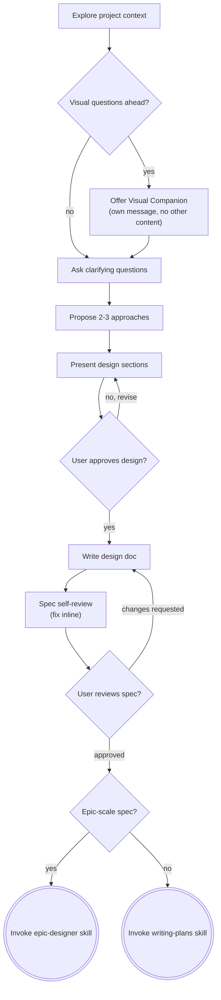

# Brainstorming Ideas Into Designs

Help turn ideas into fully formed designs and specs through natural collaborative dialogue.

Start by understanding the current project context, then ask questions one at a time to refine the idea. Once you understand what you're building, present the design and get user approval.

<HARD-GATE>
Do NOT invoke any implementation skill, write any code, scaffold any project, or take any implementation action until you have presented a design and the user has approved it. This applies to EVERY project regardless of perceived simplicity.
</HARD-GATE>

## Anti-Pattern: "This Is Too Simple To Need A Design"

Every project goes through this process. A todo list, a single-function utility, a config change — all of them. "Simple" projects are where unexamined assumptions cause the most wasted work. The design can be short (a few sentences for truly simple projects), but you MUST present it and get approval.

## Checklist

You MUST create a task for each of these items and complete them in order:

1. **Explore project context** — check files, docs, recent commits
2. **Offer visual companion** (if topic will involve visual questions) — this is its own message, not combined with a clarifying question. See the Visual Companion section below.
3. **Ask clarifying questions** — one at a time, understand purpose/constraints/success criteria
4. **Propose 2-3 approaches** — with trade-offs and your recommendation
5. **Present design** — in sections scaled to their complexity, get user approval after each section
6. **Write design doc** — save to `docs/superpowers/specs/YYYY-MM-DD-<topic>-design.md` and commit (relocated into `.devtool/epic/<epic_name>/` later if routed to epic-designer — see Routing After Approval)
7. **Spec self-review** — quick inline check for placeholders, contradictions, ambiguity, scope (see below)
8. **User reviews written spec** — ask user to review the spec file before proceeding
9. **Route to the next skill** — if the spec is epic-scale, invoke epic-designer with the spec path; otherwise invoke writing-plans (see Routing After Approval below)

## Process Flow

**The terminal state is invoking either epic-designer or writing-plans — never both, and never any other implementation skill.** Do NOT invoke frontend-design, mcp-builder, or any other implementation skill directly from brainstorming.

### Routing After Approval

Once the spec is approved (and has passed self-review), decide which skill picks it up next:

- **Invoke `epic-designer`** when the approved spec describes epic-scale work: multiple independent components/services, a design that will need Kanban task breakdown and architecture/use-case/sequence diagrams, or the user explicitly called it an "epic" or large feature. Before invoking, relocate the spec file from `docs/superpowers/specs/` into `.devtool/epic/<epic_name>/<same-filename>` (creating the directory if `epic-designer` hasn't run for this epic yet), fix any relative links inside the moved file, then pass that new path as input — this keeps the spec, the HLD, and the task files for one epic all in the same directory instead of split across `docs/` and `.devtool/`.
- **Invoke `writing-plans`** (as before) for everything else — a single-component feature, bugfix, or small enough scope that one implementation plan covers it without a separate HLD.

When in doubt, ask the user which they want rather than guessing.

If brainstorming decomposed the original request into multiple sub-project specs, route **each spec independently** — do not merge multiple specs into a single epic-designer invocation. Each spec keeps its own spec → design → implementation lineage.

## The Brainstorming Mindset

To ensure this is a true creative collaboration and not just a rigid interrogation, you MUST adopt the following mindset during the session:
- **No Early Judgment:** Never immediately reject a user's idea as "bad practice". Postpone judgment, accept the idea, and analyze its trade-offs constructively.
- **The "Yes, and..." Principle:** Build on the user's suggestions. Instead of just replacing their idea with yours, find ways to combine and refine them (e.g., "That's a great approach, AND we could make it even better by...").
- **Encourage Wild Ideas:** When proposing your 2-3 approaches, do not just offer standard, safe boilerplate solutions. Always include at least one creative, unconventional, or "out-of-the-box" alternative to spark new perspectives.
- **Reverse Brainstorming:** Use negative/reverse thinking to uncover hidden flaws. Ask yourself or the user: "How could this design fail catastrophically?", "What is the worst possible way to implement this?", or "How could a malicious user exploit this?". Use these counter-weights to bulletproof the final design.

## The Process

**Understanding the idea:**

- Check out the current project state first (files, docs, recent commits)
- Before asking detailed questions, assess scope: if the request describes multiple independent subsystems (e.g., "build a platform with chat, file storage, billing, and analytics"), flag this immediately. Don't spend questions refining details of a project that needs to be decomposed first.
- If the project is too large for a single spec, help the user **group features into Core Epics/Themes** (e.g., Identity, Payment Gateway, Core Wallet) instead of randomly splitting them. Ask: what are the independent pieces, how do they relate, and what order should they be built? Then brainstorm the first sub-project through the normal design flow. Each sub-project gets its own spec → plan → implementation cycle.
- For appropriately-scoped projects, ask questions one at a time to refine the idea
- Prefer multiple choice questions when possible, but open-ended is fine too
- Only one question per message - if a topic needs more exploration, break it into multiple questions
- Apply the **5W1H** framework to shape clarifying questions. Focus on understanding (purpose, constraints, success criteria):
  - **Who:** Who is the end user? Who will use or be affected by this?
  - **Why:** Why is this feature needed? What core pain point does it solve?
  - **What:** What is the expected final outcome? What are the technical or business constraints?
  - **Where/When:** Where does this live in the system? In what state is it triggered?
  - **How:** What are the acceptance criteria? How will we know if it is successful?

**Exploring approaches:**

- Propose 2-3 different approaches with trade-offs
- Present options conversationally with your recommendation and reasoning
- Lead with your recommended option and explain why

**Presenting the design:**

- Once you believe you understand what you're building, present the design
- Scale each section to its complexity: a few sentences if straightforward, up to 200-300 words if nuanced
- Ask after each section whether it looks right so far
- Cover: architecture, components, data flow, error handling, testing
- **Dependency Mapping:** Explicitly list any assumptions, risks, and cross-feature/cross-team dependencies (e.g., "Does this feature block another one? Does it rely on a third-party API being ready?").
- Be ready to go back and clarify if something doesn't make sense

**Design for isolation and clarity:**

- Break the system into smaller units that each have one clear purpose, communicate through well-defined interfaces, and can be understood and tested independently
- For each unit, you should be able to answer: what does it do, how do you use it, and what does it depend on?
- Can someone understand what a unit does without reading its internals? Can you change the internals without breaking consumers? If not, the boundaries need work.
- Smaller, well-bounded units are also easier for you to work with - you reason better about code you can hold in context at once, and your edits are more reliable when files are focused. When a file grows large, that's often a signal that it's doing too much.

**Working in existing codebases:**

- Explore the current structure before proposing changes. Follow existing patterns.
- Where existing code has problems that affect the work (e.g., a file that's grown too large, unclear boundaries, tangled responsibilities), include targeted improvements as part of the design - the way a good developer improves code they're working in.
- Don't propose unrelated refactoring. Stay focused on what serves the current goal.

## After the Design

**Documentation:**

- Write the validated design (spec) to `docs/superpowers/specs/YYYY-MM-DD-<topic>-design.md`
  - (User preferences for spec location override this default)
  - If this spec is later routed to `epic-designer` (see Routing After Approval), it does not stay here — it gets relocated into the epic's own directory so every doc for that epic lives in one place.
- Use elements-of-style:writing-clearly-and-concisely skill if available
- Commit the design document to git (if `auto_commit` is enabled):
  - Read `.agent/config.yml` — check `auto_commit` setting
  - If `auto_commit: true` (default when absent): `git add <path> && git commit -m "docs: add <topic> design spec"`
  - If `auto_commit: false`: skip commit and staging entirely. Print: "Skipping commit (auto_commit: false in .agent/config.yml). File is ready for manual commit."

**Spec Self-Review:**
After writing the spec document, look at it with fresh eyes:

1. **Placeholder scan:** Any "TBD", "TODO", incomplete sections, or vague requirements? Fix them.
2. **Internal consistency:** Do any sections contradict each other? Does the architecture match the feature descriptions?
3. **Scope check:** Is this focused enough for a single implementation plan, or does it need decomposition?
4. **Ambiguity check:** Could any requirement be interpreted two different ways? If so, pick one and make it explicit.
5. **Take a Step Back (Helicopter View):** Review the entire system holistically. Are the component boundaries logical? Do any features belong in a different epic or module? Shuffle them now before implementation begins.

Fix any issues inline. No need to re-review — just fix and move on.

**User Review Gate:**
After the spec review loop passes, ask the user to review the written spec before proceeding:

> "Spec written and committed to `<path>`. Please review it and let me know if you want to make any changes before we start writing out the implementation plan."

Wait for the user's response. If they request changes, make them and re-run the spec review loop. Only proceed once the user approves.

**Implementation:**

- Apply the Routing After Approval rule above to pick the next skill: `epic-designer` (pass the spec's file path) for epic-scale specs, or `writing-plans` for everything else.
- Do NOT invoke any other skill — these two are the only valid next steps.

## Key Principles

- **One question at a time** - Don't overwhelm with multiple questions
- **Multiple choice preferred** - Easier to answer than open-ended when possible
- **YAGNI ruthlessly** - Remove unnecessary features from all designs
- **Explore alternatives** - Always propose 2-3 approaches before settling
- **Incremental validation** - Present design, get approval before moving on
- **Be flexible** - Go back and clarify when something doesn't make sense

## Visual Companion

A browser-based companion for showing mockups, diagrams, and visual options during brainstorming. Available as a tool — not a mode. Accepting the companion means it's available for questions that benefit from visual treatment; it does NOT mean every question goes through the browser.

**Offering the companion:** When you anticipate that upcoming questions will involve visual content (mockups, layouts, diagrams), offer it once for consent:
> "Some of what we're working on might be easier to explain if I can show it to you in a web browser. I can put together mockups, diagrams, comparisons, and other visuals as we go. This feature is still new and can be token-intensive. Want to try it? (Requires opening a local URL)"

**This offer MUST be its own message.** Do not combine it with clarifying questions, context summaries, or any other content. The message should contain ONLY the offer above and nothing else. Wait for the user's response before continuing. If they decline, proceed with text-only brainstorming.

**Per-question decision:** Even after the user accepts, decide FOR EACH QUESTION whether to use the browser or the terminal. The test: **would the user understand this better by seeing it than reading it?**

- **Use the browser** for content that IS visual — mockups, wireframes, layout comparisons, architecture diagrams, side-by-side visual designs
- **Use the terminal** for content that is text — requirements questions, conceptual choices, tradeoff lists, A/B/C/D text options, scope decisions

A question about a UI topic is not automatically a visual question. "What does personality mean in this context?" is a conceptual question — use the terminal. "Which wizard layout works better?" is a visual question — use the browser.

If they agree to the companion, read the detailed guide before proceeding:
`skills/brainstorming/visual-companion.md`
