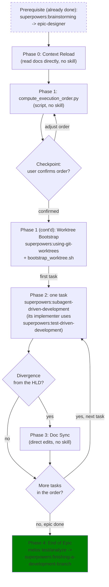

# Epic Implementation

## Overview

Runs an already-approved epic's Kanban tasks end-to-end: reload the epic's own docs for context, compute a dependency-safe execution order, bootstrap one worktree that can actually build this project, then drive each task sequentially through `superpowers:subagent-driven-development` with exactly one commit per task.

**Core principle:** One worktree, one task at a time, one commit per task, docs stay truthful.

**Announce at start:** "I'm using the epic-implementation skill to implement the `<epic_slug>` epic."

**Full rationale:** [2026-08-26-epic-implementation-design.md](../../../docs/superpowers/specs/2026-08-26-epic-implementation-design.md)

## Two Placeholders, Not One

This skill uses two distinct placeholders, and **they are usually different strings** — do not substitute one for the other:

| Placeholder | What it is | Where it appears | Worked example |
|-------------|-----------|------------------|----------------|
| `<epic_dir>` | The epic's directory name on disk | `.devtool/epic/<epic_dir>/<epic_dir>.en.md`, the worktree directory name | `logging_refactor` (underscores) |
| `<epic_slug>` | The epic's frontmatter `epic:` value | The calculator's CLI arg, matching `epic:` in `task_*.md`, the `epic/<epic_slug>` branch name, the `[EPIC_NAME]` commit prefix | `logging-refactor` (hyphens) |

This repo's real epic is the concrete case: the directory is `.devtool/epic/logging_refactor/` while every task file's frontmatter says `epic: "logging-refactor"`. Read both values off disk at the start — never derive one from the other by guessing the separator.

## When to Use

- The epic has a `.devtool/epic/<epic_dir>/<epic_dir>.en.md` HLD and one or more `.devtool/features/task_*.md` files with `epic: "<epic_slug>"` in frontmatter, and a human has already approved that design.
- You are about to implement more than one task from that epic in this session.

**Don't use when:** the epic/tasks don't exist yet (use `superpowers:brainstorming` then `epic-designer` first), or you're implementing a single one-off task with no epic context (just use `superpowers:subagent-driven-development` directly).

## Process

This diagram shows which skill runs at each phase and in what order — it stops at `superpowers:subagent-driven-development`'s own boundary rather than redrawing its internal implementer/reviewer/fix-loop mechanics, which live in that skill's own diagram.



### Phase 0 — Context Reload (once, not per task)

Read, in full:
- `.devtool/epic/<epic_dir>/<epic_dir>.en.md` (the canonical HLD — never `.vi.md` for decisions, that's a synced translation).
- Every `.devtool/features/task_*.md` whose frontmatter `epic:` matches `<epic_slug>`.
- Any spec file(s) linked from the HLD's Meta Data section.

This is an autonomous read-and-internalize pass, not a re-run of the interactive `superpowers:brainstorming` skill — the design is already approved; there is nothing left to ask the user about the architecture itself.

### Phase 1 — Execution Plan

1. Run (note: the argument is the **slug**, not the directory name):
   ```bash
   python3 .agent/skills/epic-implementation/resources/scripts/compute_execution_order.py <epic_slug>
   ```
   Check the scan summary line it prints first (`Scanned N task_*.md files; M matched epic ...; K had no parseable frontmatter or a different epic.`). If `M` is smaller than the number of tasks you read in Phase 0, a task file has broken frontmatter or the wrong `epic:` value — fix that before going any further, or the epic will silently run short a task.
2. Read the "Manual review advised" section of the output (if any) and cross-check it against what you read in Phase 0 — a task's own prose may recommend a later placement than its strict dependency layer allows (this happened for `logging-refactor`'s Task 7: graph-eligible right after Task 2, but its own file recommends doing it after Tasks 1-4). Adjust the flattened order by hand if the prose note should win.
3. **Checkpoint:** present the final order (with any manual adjustment explained) to the user and get confirmation before creating any worktree or dispatching any subagent.

#### Phase 1 (continued) — Worktree Bootstrap, once the order is confirmed

These are Phase 1's closing steps, not a separate phase — they run after the step 3 checkpoint and before any Phase 2 subagent.

4. Create one worktree for the whole epic, following `superpowers:using-git-worktrees`. That skill's own command is `git worktree add "$path" -b "$BRANCH_NAME"` **with no base ref**, which branches from whatever HEAD you happen to be on. Do not use it bare here — spell the base ref out explicitly:
   ```bash
   git worktree add .worktrees/<epic_dir> -b epic/<epic_slug> develop
   ```
   The trailing `develop` is **not optional**. Omit it and, if you are currently on some other branch, the epic worktree silently branches from the wrong place and every task's commit lands on top of unrelated work.
5. Bootstrap the worktree so it can actually build:
   ```bash
   .agent/skills/epic-implementation/resources/scripts/bootstrap_worktree.sh <worktree_path>
   ```
   This can be run from any checkout of the repo — it resolves the main checkout via git's shared common dir, so being inside the new worktree (where `superpowers:using-git-worktrees` leaves you) is fine. It copies `secureFiles/` in, places platform config via `copy_secure_configurations`, and runs `melos bootstrap`. It does **not** run `pod install` — this project uses Swift Package Manager, not CocoaPods. It exits non-zero if `copy_secure_configurations` reported any missing file, rather than claiming success for a worktree that cannot build.
6. **Verify the bootstrap actually worked** before dispatching any subagent — the script's own success message is necessary, not sufficient:
   ```bash
   ls <worktree_path>/android/app/src/dev/google-services.json   # placed by copy_secure_configurations
   ls <worktree_path>/.dart_tool/package_config.json             # written by melos bootstrap
   ```
   Check `.dart_tool/package_config.json` at the **worktree root only**. This repo uses Dart pub workspaces, so only the root gets a `package_config.json` — `packages/core/.dart_tool/package_config.json` legitimately does not exist and is the wrong thing to check.
7. Do not copy or symlink `.dart_tool/`, `/build/`, `ios/Flutter/ephemeral/Packages/`, or any `android/**/.cxx/` directory from another checkout into this worktree — these embed the source checkout's absolute paths and will silently corrupt the build from a different path.

### Phase 2 — Sequential Task Execution

For each task in the confirmed order, follow `superpowers:subagent-driven-development` almost exactly. **This differs from the base skill in two ways: (a) the task's Kanban `status` is kept live on disk (uncommitted) as it moves through `in-progress` and `review` while work is ongoing, so the dashboard reflects real progress instead of jumping straight from `todo` to `done`; (b) the implementer does not commit — you make exactly one commit yourself, after both reviews pass, staging the code and the task file's final status together.** Everything else is the base skill unchanged. The board's real columns are `backlog | todo | in-progress | review | done` — there is no `blocked` column, so a stalled task simply stays at `in-progress` while you resolve it out of band (chat with your human partner, the ledger), rather than moving to a status the board doesn't have.

1. **(Difference a)** Before dispatching, edit — **do not commit** — that task's frontmatter in `.devtool/features/task_<n>.md` to `status: "in-progress"`. This is a live, uncommitted change purely for the Kanban dashboard (most markdown-Kanban plugins, including this one, read the file straight off disk); it gets overwritten by later status edits and finally by `status: "done"` in step 4, so none of these intermediate edits ever produce a commit of their own. 

   **CRITICAL DUAL-PERSONA DISPATCH**: When dispatching the implementer subagent, you MUST include the following Dual-Persona instructions along with the task text:
   
   > You are a dual-agent system: First, an Expert QA (Red Team). Second, a Principal Mobile Engineer (TDD Master).
   > Your task is to write strictly TDD Unit Tests for this feature, but you MUST follow these phases sequentially:
   > 
   > # PHASE 1: BDD SCENARIOS (The QA Persona)
   > Before writing any code, identify all possible scenarios using Gherkin syntax (Given - When - Then). 
   > You MUST exhaustively apply Boundary Value Analysis & Equivalence Partitioning to include:
   > - Happy paths (Normal data flow).
   > - Edge cases (Null inputs, empty arrays, malformed JSON, boundary numbers).
   > - State Transitions (Valid and Invalid state changes for BLoC/MVI).
   > - Async/Race conditions (e.g., User rapidly triggers the action 3 times -> only the last response should be processed).
   > - Network & Storage failures (Timeouts, 500 errors, Corrupted local DB).
   > 
   > After defining the scenarios, you MUST perform a self-review: cross-check these scenarios against the use cases and sequence diagrams defined in the epic's documents. Ensure no requirements are missed before proceeding to Phase 2.
   > 
   > Output this phase in a markdown block titled "### BDD SCENARIOS".
   > 
   > # PHASE 2: TDD IMPLEMENTATION (The Dev Persona)
   > Translate EVERY scenario from Phase 1 into executable Unit Tests.
   > Constraints:
   > 1. Target language/framework: Flutter/Dart (or Android/Kotlin if specified).
   > 2. Use Mocking to simulate API responses with artificial Delays to test Race Conditions.
   > 3. Verify that Streams/Subscriptions are properly closed/cancelled.
   > 4. Test the Behavior/State emissions exactly in order, not just the final result.
   > 5. DO NOT WRITE THE ACTUAL IMPLEMENTATION CODE YET. Write ONLY the Tests and the necessary Interfaces/Mocks.
   > 
   > # PHASE 3: RED-GREEN-REFACTOR (Strict Rule)
   > Ensure the tests are designed to FAIL first (RED). You must explain exactly why they will fail if Race Conditions (like the switchMap/cancellation flaw) are not handled in the upcoming implementation. Only after confirming the RED phase, you can write the minimal implementation code to pass them (GREEN).
   
   The subagent will then follow `superpowers:test-driven-development`, self-review, but must **not** commit yet.
2. **(Difference a, continued)** Once the implementer reports `DONE` (or `DONE_WITH_CONCERNS`), edit the frontmatter to `status: "review"` before dispatching the spec-compliance reviewer, then the code-quality reviewer, same as the base skill.
3. If a review finds issues, the fix loop begins: edit the frontmatter back to `status: "in-progress"` while the implementer applies fixes, then back to `status: "review"` before each re-review. Repeat for as many rounds as the fix loop takes — every transition is uncommitted, same as step 1.

   If the implementer instead reports `BLOCKED`/`NEEDS_CONTEXT`, leave `status` at `in-progress` — there is no board column for this. Handle the blocker per `superpowers:subagent-driven-development`'s own guidance (more context, a more capable model, breaking the task down, or a ruling), and only move status forward once you actually resume productive work.
4. Only once both reviews pass, update that task's frontmatter: `status: "done"`, `completedAt: "<ISO-8601 now>"`. Do this **before** committing — `.devtool/features/task_*.md` is tracked, so updating it after the commit would leave the tree dirty and force a second commit.
5. **(Difference b)** Make exactly one commit, staging both the code changes and the updated task file together:
   ```bash
   git status                                    # check nothing unrelated is pending
   git add -A                                    # code changes + .devtool/features/task_<n>.md
   git commit -m "[EPIC_NAME] <task_title>"
   ```
   `EPIC_NAME` is `<epic_slug>` upper-cased, hyphens kept (e.g. `LOGGING-REFACTOR`). `<task_title>` is the task's `# Task N: <Title>` heading with the `Task N:` prefix stripped. Confirm `git status` is clean afterwards — anything left over means the "one commit per task" rule is already broken.
6. If the implementer or a reviewer flags that the implementation diverged from the HLD, go to Phase 3 before starting the next task.

### Phase 3 — Doc Sync on Divergence

Only when Phase 2 step 6 flags divergence:
1. Update the epic's Mermaid diagrams in **both** `.devtool/epic/<epic_dir>/<epic_dir>.en.md` and `.vi.md` — never let one drift from the other.
2. Update the affected task file(s)' own prose if it was inaccurate.
3. Commit separately:
   ```bash
   git commit -m "[EPIC_NAME] docs: sync HLD after <task_title>"
   ```
   This keeps the task's code commit exactly one commit even when divergence is found.

### Phase 4 — End of Epic

1. Once every task is `done`, run the full test suite and analyzer once more on the epic worktree:
   ```bash
   melos run test
   melos run analyze
   ```
2. Use `superpowers:finishing-a-development-branch` on the epic branch (base = `develop`). Never merge to `develop` outside of that skill's flow.

## Quick Reference

| Step | Tool |
|------|------|
| Compute execution order | `resources/scripts/compute_execution_order.py <epic_slug>` |
| Create the epic worktree | `superpowers:using-git-worktrees` + `git worktree add .worktrees/<epic_dir> -b epic/<epic_slug> develop` |
| Bootstrap the worktree | `resources/scripts/bootstrap_worktree.sh <worktree_path>` |
| Run each task | `superpowers:subagent-driven-development` |
| Per-task TDD | `superpowers:test-driven-development` |
| End-of-epic verification | `melos run test` + `melos run analyze` |
| Finish the epic branch | `superpowers:finishing-a-development-branch` |

## Common Mistakes

**Confusing `<epic_dir>` with `<epic_slug>`** — passing the directory name (`logging_refactor`) to the calculator makes it find zero tasks; passing the slug (`logging-refactor`) as a path makes the HLD read fail. See "Two Placeholders, Not One" above.

**Creating the epic worktree without an explicit base ref** — `superpowers:using-git-worktrees` branches from current HEAD. Always pass `develop` explicitly.

**Trusting the computed layer blindly** — a task's own prose can carry softer notes the parser deliberately does not treat as hard blockers (currently lines containing "Recommended" or "New dependency"). Always read the "Manual review advised" output before confirming the order.

**Committing before updating the task file's frontmatter** — `.devtool/features/task_*.md` is tracked, so this leaves the tree dirty and forces either a second commit or a leak into the next task's commit. Update the frontmatter first, then commit both together.

**Copying build caches to "speed up" a new worktree** — `.dart_tool/`, `/build/`, `ios/Flutter/ephemeral/Packages/`, and native `.cxx/` directories hard-code the source checkout's absolute path; copying them corrupts the build in a different worktree path. Let them regenerate — the dependency-level caches (`~/.pub-cache`, `~/.gradle/caches`, Swift Package Manager's cache) are already global and make regeneration fast.

**Running `pod install`** — this project migrated to Swift Package Manager; there is no `Podfile` tracked in git.

**Folding a doc-sync into the task's code commit** — keep them separate so `git log` always shows a clean one-commit-per-task history, with doc-sync commits clearly labeled as such.

**Leaving `status` at `todo` while a task is actually running** — the dashboard should show `in-progress` the moment you dispatch the implementer and `review` the moment reviewers are dispatched, cycling between the two through any fix rounds, all updated live on disk with no commit of their own; only the final `done` flip rides along with the task's single commit. The board's real columns are `backlog | todo | in-progress | review | done` — do not invent a `blocked` or `in-review` value that isn't one of these five; a stalled task just stays at `in-progress`.

## Red Flags

**Never:**
- Create a worktree per task or dispatch concurrent implementation subagents (rejected in the spec — file/merge conflicts).
- Skip the Phase 1 confirmation checkpoint before touching git.
- Merge to `develop` without going through `superpowers:finishing-a-development-branch`.
- Treat a soft note ("Recommended...", "New dependency...") as equivalent to "Blocked by..." without telling the user you're overriding the computed order.
- Ignore a non-zero `bootstrap_worktree.sh` exit, or a calculator `matched` count lower than the number of tasks you read in Phase 0. (A non-zero `skipped` count is normal — other epics' task files live in the same directory.)

## Integration

**Required workflow skills:**
- **superpowers:using-git-worktrees** — creates the epic worktree (pass `develop` as the explicit base ref).
- **superpowers:subagent-driven-development** — runs each task.
- **superpowers:test-driven-development** — used by each task's implementer subagent.
- **superpowers:finishing-a-development-branch** — completes the epic branch.
- **copy_secure_configurations** — invoked by `bootstrap_worktree.sh`.

**Optional prerequisite:**
- **check_secure_files** — documents what the gitignored `secureFiles/` directory must contain. Only needed if the main checkout's `secureFiles/` is missing or incomplete, which `bootstrap_worktree.sh` will tell you about explicitly.
