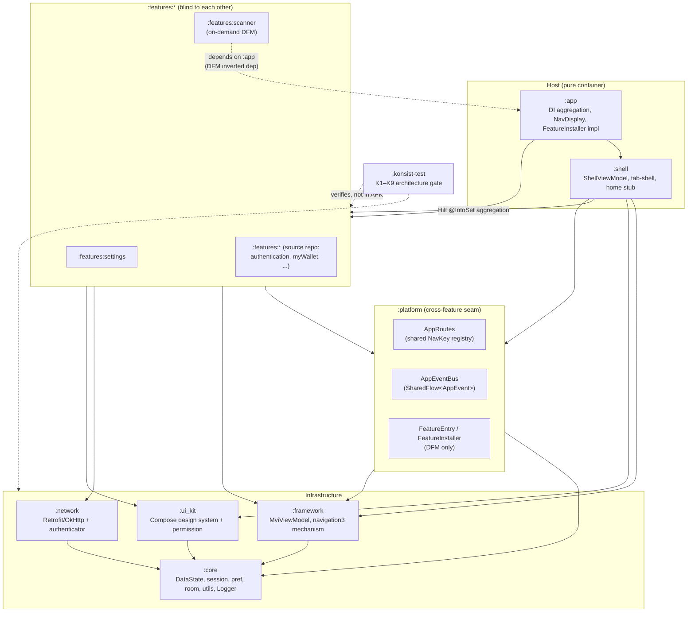
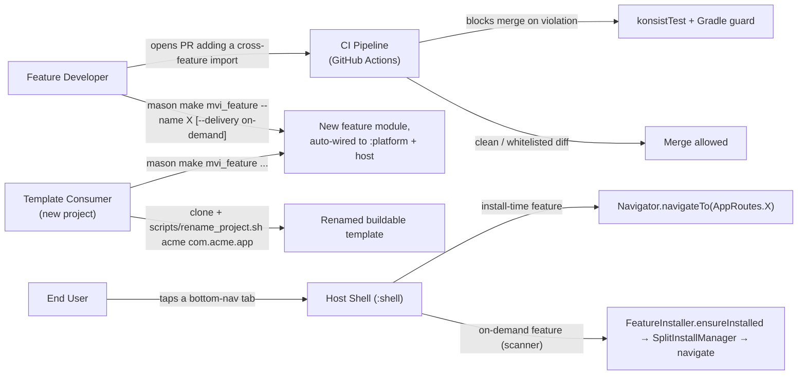
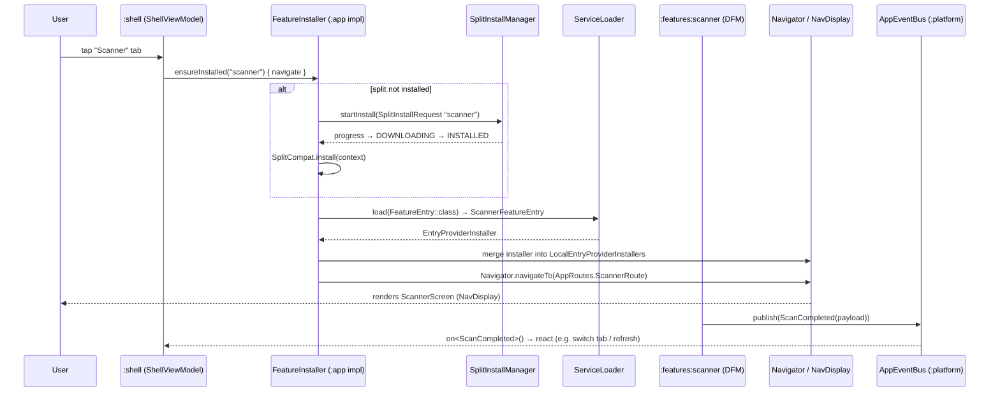

# Epic: Android Super App Template

## Table of Contents
1. [Meta Data](#1-meta-data)
2. [Background](#2-background-bối-cảnh)
3. [Goals & Non-Goals](#3-goals--non-goals)
4. [Architecture & Technical Design](#4-architecture--technical-design)
   1. [High-Level Architecture](#41-high-level-architecture)
   2. [Use Cases](#42-use-cases)
   3. [Sequence Diagram — primary flow (Scanner on-demand)](#43-sequence-diagram--primary-flow-scanner-on-demand)
   4. [Cross-feature communication channels](#44-cross-feature-communication-channels)
5. [Rollout Strategy & Mitigation](#5-rollout-strategy--mitigation)
6. [Kanban Tasks Breakdown](#6-kanban-tasks-breakdown)

## 1. Meta Data
- **Epic Name**: `android_super_app_template`
- **Status**: Queued (backlog) — behind `template_android`, `template_flutter`, `template_ios` (those epics have `todo` tasks in `.devtool/features/`). Flip tasks `backlog → todo` once those epics' tasks are all `done`, or by explicit human decision if they are dormant.
- **Target Release**: Ships on branch `epic/android-super-app-template` (git worktree of this repo); integration to `develop` decided per-phase.
- **Source Spec**: [2026-09-02-android-super-app-template-design.md](2026-09-02-android-super-app-template-design.md)
- **Parallel/related epics**: `super_app_governance` (Flutter, in `bloc_digital_wallet` — the governance framework this epic ports back to native Android), `template_flutter` / `template_android` / `template_ios` (the Flutter-template epics — separate work; this epic only *reads* them for reference).

## 2. Background (Bối cảnh)

`android_digital_wallet` is a mature Feature-First Clean Architecture + MVI Android app: `buildSrc` convention plugins (Hilt / Compose / detekt / spotless), 8 feature Gradle modules, navigation3-based host navigation. It has three structural problems measured against the 4-pillar / 8-criterion **Super App Governance** framework already applied to the Flutter sibling `bloc_digital_wallet`:

1. **God-module.** `libraries/framework` mixes MVI base classes, networking (Retrofit/OkHttp/interceptors), Room, prefs, session, platform helpers, navigation and utils in one module — every feature pulls the whole thing.
2. **No container boundary.** `:app` depends on all 8 features + `libraries/*`; `features/home` depends directly on 5 other feature modules (Shell logic misplaced inside a feature — the exact violation the Flutter epic found in its own `home` package).
3. **No enforcement.** No CI at all; nothing prevents a new cross-feature `import` or a `data/**` leak. Governance relies on reviewer discipline.

This epic ports the Flutter governance work back to native Android — where the framework's original Android-flavored mechanisms (Dynamic Feature Modules, Hilt scoped components) are literally available — then extracts a clone-and-rename **native Android template** with 3 features (`home` stub / `scanner` / `settings`), matching the Flutter template's feature set.

## 3. Goals & Non-Goals

### Goals
- **G1 — Preserve architecture.** Clean Architecture + MVI + Feature-First exactly as the Flutter `docs/architecture/ARCHITECTURE.md`: `Presentation → Domain ← Data`, pure-Kotlin domain (no `android.*`), Unidirectional Data Flow, single `onAction()` entry point, the `*Action/*State/*Event/*ViewModel/*UseCase/*Screen/*Repository` naming set.
- **G2 — Split the god-module** into 5 infra modules mirroring the Flutter `packages/`: `:core` ← `:framework` / `:network`, `:ui_kit`, `:platform`. Every module (features included) depends only on these, never on another feature.
- **G3 — Pure container Host.** `:app` + `:shell` only aggregate DI, build the `NavDisplay` (navigation3, unchanged) and the tab-shell. No feature business logic. `features/home` is dissolved: tab-shell code → `:shell`, the rest → a stub page.
- **G4 — Centralized cross-feature comms, features blind to each other.** `:platform` holds `AppRoutes` (shared `NavKey` registry) + `AppEventBus` (`SharedFlow<AppEvent>`). Features contribute navigation via Hilt `@IntoSet EntryProviderInstaller`. No feature-to-feature `import`.
- **G5 — State isolation.** Each feature keeps its own `MviViewModel` (moved to `:framework`). DI stays a flat Hilt `SingletonComponent` + an export discipline: `..features..data..` classes are `internal`; only `domain/**` + `presentation/**` are `public`.
- **G6 — Enforcement by structure, not discipline.** (a) **Konsist** (`:konsist-test`, JUnit) checks layer / boundary / naming / export (rules K1–K9); (b) a Gradle guard in `commons.android-feature` fails the sync if a feature declares another feature as a dependency; (c) **GitHub Actions** runs the whole set. `konsist_boundary_whitelist.txt` shrinks each phase.
- **G7 — New feature = one Mason command.** Auto-wires into `settings.gradle.kts` + `:app`/`:shell` (Hilt `@IntoSet`) + `:platform` (if the route is cross-feature); never touches another feature. `mvi_feature` gains a `delivery` var (`install-time` | `on-demand`). Legacy bricks kept.
- **G8 — Extract the native template.** Keep infra + `:shell` + 3 features `home` (stub) / `scanner` / `settings`. Delete `authentication` / `myWallet` / `transactions` / `trends` / `splash` + `domain/authenticator` + wallet-specific assets. `scripts/rename_project.sh` is the single post-clone entrypoint.
- **G9 — Sandbox development.** Every feature builds/tests standalone (`:features:x:testDebugUnitTest` with no `:app`). A per-feature UI runner is a known, out-of-scope gap (matches Flutter criterion 4.1).
- **G10 — DFM-ready + one on-demand pilot.** The cross-feature contract is designed so any feature converts to a `com.android.dynamic-feature` **without changing the host nav mechanism** — only the entry-resolution path changes. Phase 3 converts **`scanner`** to an on-demand Dynamic Feature Module as the template's worked example (`FeatureEntry` + `ServiceLoader` + `SplitInstallManager`); `home`/`settings` stay install-time. This is the one place criterion 1.2 ("runtime-loaded mini-app") is genuinely met on Android.

### Non-Goals
- **Every feature as a Dynamic Feature Module.** Only `scanner` is converted, as an example. No forced DFM across `:features:*`.
- **Hilt scoped / hierarchical components.** DI stays one flat `SingletonComponent`; Dependency Inversion via `internal`/export discipline + interfaces in `:core`.
- **Formal contract-versioning** (semver of `:platform`'s public API). A single Gradle build already fails compilation for every dependent on a breaking change — enough for criterion 4.2.
- **Replacing the navigation3 mechanism.** `Navigator` / `NestedNavigator` (per-tab nested backstacks) / Hilt `@IntoSet EntryProviderInstaller` / `NavDisplay` are kept as-is. Only cross-feature `NavKey`s relocate to `:platform`.
- **Changing digital-wallet business logic** in the source repo — only cut when extracting the template.
- **Removing legacy Mason bricks** (`mvi_feature` / `mvi_subfeature` / `remove_feature` / `remove_subfeature`) — kept, hooks updated.
- **iOS / KMP.**

## 4. Architecture & Technical Design

### 4.1 High-Level Architecture

**Invariants (Konsist-verified):** every solid arrow points down toward `:core`; no feature points at another feature; only `:app`/`:shell` aggregate multiple features; the dashed `F_SCAN → :app` edge is the DFM-mandated inverted dependency, exempted by rule K8 via `android.dynamicFeatures`.

### 4.2 Use Cases

### 4.3 Sequence Diagram — primary flow (Scanner on-demand)

For an **install-time** feature the flow collapses to `Shell → Navigator.navigateTo(AppRoutes.X) → NavDisplay` — the feature's `EntryProviderInstaller` is already in the Hilt `Set` at startup; no `SplitInstallManager`/`ServiceLoader` step.

### 4.4 Cross-feature communication channels

| Channel | Location | Shape | Enforcement |
|---|---|---|---|
| `AppRoutes` (`NavKey` registry) | `:platform` | `@Serializable data object XxxRoute : NavKey`; navigate via `Navigator` / `NestedNavigator` | none needed — a `NavKey` leaks no implementation |
| `AppEventBus` | `:platform` | `MutableSharedFlow<AppEvent>` broadcast; `publish(e)` / `on<T>()` | none needed |
| `EntryProviderInstaller` (Hilt `@IntoSet`) | mechanism in `:framework`, contributed per feature | feature `@Provides @IntoSet EntryProviderInstaller`; host consumes `Set` into `NavDisplay` | host never imports the feature |
| `FeatureEntry` + `ServiceLoader` | `:platform` interface, impl in DFM feature | runtime-loaded `EntryProviderInstaller` after `SplitCompat.install()` | **DFM only** — install-time features use Hilt multibinding |
| Direct composition | `:app`, `:shell` | Hilt aggregation + `NavDisplay` + tab-shell | Konsist K6 — Host-only privilege |

No request/response channel between two features (matches Flutter). A typed result from another feature's business logic → Dependency Inversion: interface in `:core`, implemented by the other feature.

Lifecycle event vocabulary (minimal, mirrors the Flutter proposal): `ShellTabVisibilityChanged(tabIndex, isVisible)` (published by `:shell`, closes the existing `// TODO: notify tab`), `AppLifecycleChanged(state)` (published by an `AppLifecycleObserver` at the Application root), `UserLoggedOut` (published by `:network`'s 401 interceptor).

## 5. Rollout Strategy & Mitigation

**Migration approach A — incremental, sequential.** All work on git worktree `.worktrees/android_super_app_template`, branch `epic/android-super-app-template`. **The app must build and run at every phase boundary.**

| Phase | Outcome | Reversibility |
|---|---|---|
| **Phase 0 — Foundation** (Tasks 1–4) | `:platform` created (empty seam), `:konsist-test` with rules seeded + full `konsist_boundary_whitelist.txt` (`home→{myWallet,transactions,scanner,trends,settings}`), Gradle guard in *warn* mode, GitHub Actions green on the *current* structure, Mason hooks updated (unused, staged). **No behavior change.** | Delete the new modules/workflow; nothing else touched. |
| **Phase 1 — Split god-module** (Tasks 5–9) | `libraries/framework` → `:core` + `:framework` + `:network`; `libraries/{components,jetframework}` → `:ui_kit`; `domain/authenticator` folded into `:network`. All consumers rewired. Konsist K2/K7 enabled. `docs/architecture/ARCHITECTURE.md` (Android edition) written. `./gradlew assembleDebug` green, app behaves identically. | Each module extraction is its own PR; revert the PR. |
| **Phase 2 — Shell + pilot** (Tasks 10–11) | `:shell` extracted from `features/home`; `:app` thinned; `features/home` module deleted (→ stub). Cross-feature `NavKey`s moved to `:platform.AppRoutes`. `settings` pilot proves `AppRoutes` nav + `AppEventBus` end-to-end. Gradle guard → *fail*; Konsist K4/K6/K9 enabled. Whitelist ≤ 1 entry. | Whitelist re-add is the rollback lever; `:shell` extraction is one PR. |
| **Phase 3 — Cleanup + template + DFM + validation** (Tasks 12–16) | Remaining cross-imports migrated → whitelist empty, K1 *fail*. Domain stripped → 3-feature template. `scanner` → on-demand Dynamic Feature Module. `scripts/rename_project.sh` + docs/agent genericization. CI adds `bundleDebug`. End-to-end acceptance test green. | Template extraction happens on the worktree only; source `develop` unaffected until a deliberate merge. |

**Mitigation levers:** the Konsist whitelist is the phase-by-phase rollback mechanism (re-add an entry without touching the gate). Konsist starts in baseline mode and tightens rule-by-rule. The DFM+Hilt split-boundary risk is contained to `scanner` alone via the `FeatureEntry`/`ServiceLoader` path; every install-time feature keeps plain Hilt multibinding. CI without secrets in Phase 0 (no Firebase/signing) de-risks first-time GitHub Actions setup.

## 6. Kanban Tasks Breakdown

### Phase 0 — Foundation
- [Task 1: Create `:platform` module](../../features/task_1_platform_module.md)
- [Task 2: `:konsist-test` gate + Gradle feature guard](../../features/task_2_konsist_gate.md)
- [Task 3: GitHub Actions CI pipeline](../../features/task_3_github_actions_ci.md)
- [Task 4: Update Mason bricks for the new wiring](../../features/task_4_mason_brick_wiring.md)

### Phase 1 — Split the god-module
- [Task 5: Extract `:core`](../../features/task_5_extract_core_module.md)
- [Task 6: Extract `:network` (+ fold `domain/authenticator`)](../../features/task_6_extract_network_module.md)
- [Task 7: Extract `:framework` (MVI + navigation3 mechanism)](../../features/task_7_extract_framework_module.md)
- [Task 8: Merge `components` + `jetframework` → `:ui_kit`](../../features/task_8_merge_ui_kit_module.md)
- [Task 9: Rewire consumers + enable Konsist layer rules + Android `ARCHITECTURE.md`](../../features/task_9_rewire_and_architecture_doc.md)

### Phase 2 — Shell + pilot
- [Task 10: Extract `:shell`, thin `:app`, dissolve `features/home`](../../features/task_10_extract_shell_thin_app.md)
- [Task 11: Relocate cross-feature `NavKey`s + `settings` pilot + enable strict gate](../../features/task_11_platform_routes_settings_pilot.md)

### Phase 3 — Cleanup + template + DFM + validation
- [Task 12: Migrate remaining feature cross-imports → empty whitelist](../../features/task_12_migrate_remaining_features.md)
- [Task 13: Strip digital-wallet domain → 3-feature template](../../features/task_13_strip_domain_to_template.md)
- [Task 14: Convert `scanner` → on-demand Dynamic Feature Module](../../features/task_14_scanner_dynamic_feature.md)
- [Task 15: `rename_project.sh` + docs/agent genericization](../../features/task_15_rename_script_and_docs.md)
- [Task 16: CI `bundleDebug` + end-to-end acceptance validation](../../features/task_16_e2e_acceptance_validation.md)
