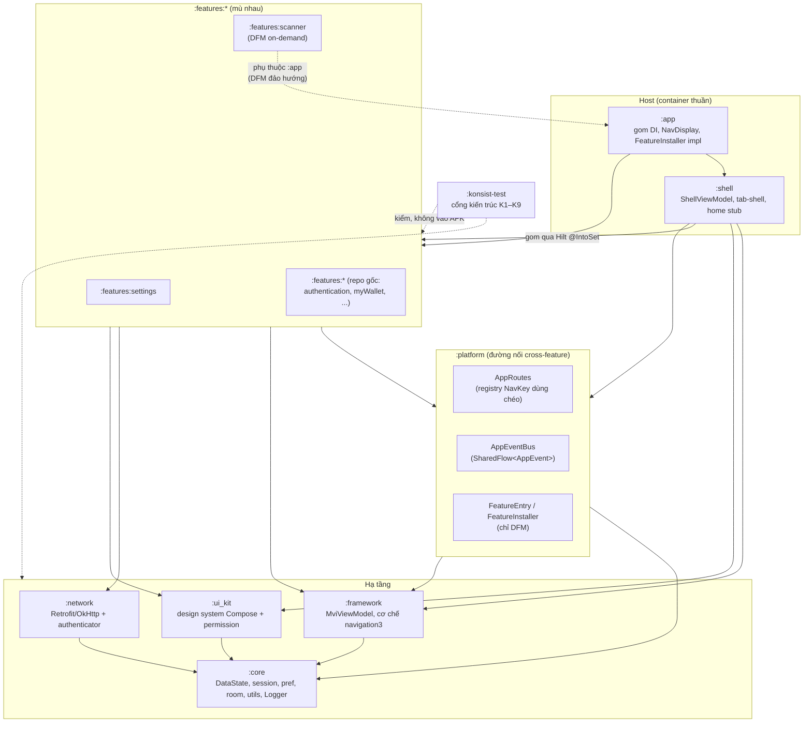
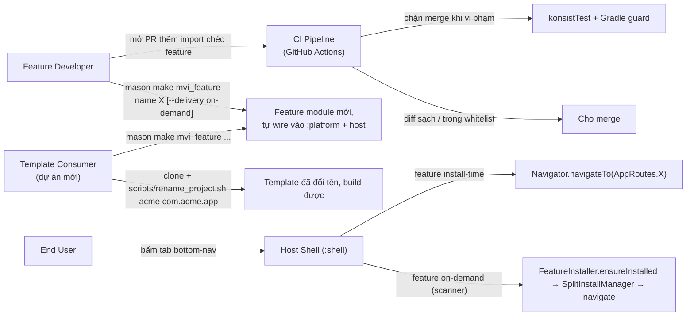
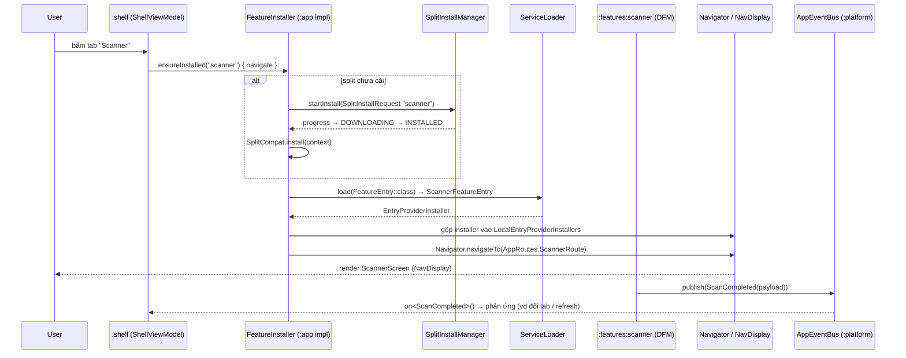

# Epic: Android Super App Template

## Mục lục
1. [Meta Data](#1-meta-data)
2. [Bối cảnh](#2-bối-cảnh)
3. [Mục tiêu & Không làm gì](#3-mục-tiêu--không-làm-gì)
4. [Kiến trúc & Thiết kế kỹ thuật](#4-kiến-trúc--thiết-kế-kỹ-thuật)
   1. [Kiến trúc tổng thể](#41-kiến-trúc-tổng-thể)
   2. [Use Cases](#42-use-cases)
   3. [Sequence Diagram — luồng chính (Scanner on-demand)](#43-sequence-diagram--luồng-chính-scanner-on-demand)
   4. [Các kênh giao tiếp cross-feature](#44-các-kênh-giao-tiếp-cross-feature)
5. [Chiến lược triển khai & Giảm thiểu rủi ro](#5-chiến-lược-triển-khai--giảm-thiểu-rủi-ro)
6. [Phân rã task Kanban](#6-phân-rã-task-kanban)

## 1. Meta Data
- **Epic Name**: `android_super_app_template`
- **Trạng thái**: Queued (backlog) — xếp sau `template_android`, `template_flutter`, `template_ios` (các epic đó còn task `todo` trong `.devtool/features/`). Chuyển task `backlog → todo` khi các epic kia hoàn tất, hoặc theo quyết định của người phụ trách nếu chúng đang dừng.
- **Target Release**: Chạy trên branch `epic/android-super-app-template` (git worktree của repo này); merge vào `develop` quyết định theo từng phase.
- **Spec gốc**: [2026-09-02-android-super-app-template-design.md](2026-09-02-android-super-app-template-design.md)
- **Epic song song/liên quan**: `super_app_governance` (Flutter, trong `bloc_digital_wallet` — khung governance mà epic này port ngược về native Android), `template_flutter` / `template_android` / `template_ios` (các epic template Flutter — việc riêng; epic này chỉ *đọc* để tham chiếu).

## 2. Bối cảnh

`android_digital_wallet` là app Android trưởng thành theo Feature-First Clean Architecture + MVI: convention plugin `buildSrc` (Hilt / Compose / detekt / spotless), 8 feature Gradle module, navigation host dựa trên navigation3. So với khung **Super App Governance** 4 trụ / 8 tiêu chí đã áp cho repo Flutter anh em `bloc_digital_wallet`, nó có 3 vấn đề cấu trúc:

1. **God-module.** `libraries/framework` trộn MVI base, networking (Retrofit/OkHttp/interceptor), Room, pref, session, platform helper, navigation, utils trong một module — mọi feature kéo nguyên khối.
2. **Không có ranh giới container.** `:app` phụ thuộc cả 8 feature + `libraries/*`; `features/home` phụ thuộc thẳng 5 feature khác (logic Shell nhét nhầm vào feature — đúng lỗi epic Flutter tìm thấy trong package `home` của nó).
3. **Không enforce.** Không có CI; không gì chặn `import` chéo feature mới hay rò rỉ `data/**`. Governance dựa vào tự giác của reviewer.

Epic này port phần governance Flutter về native Android — nơi các cơ chế "hơi hướng Android" của khung gốc (Dynamic Feature Module, Hilt scoped component) có thật — rồi trích một **template native Android** clone-và-đổi-tên với 3 feature (`home` stub / `scanner` / `settings`), khớp bộ feature của template Flutter.

## 3. Mục tiêu & Không làm gì

### Mục tiêu
- **G1 — Giữ nguyên kiến trúc.** Clean Architecture + MVI + Feature-First đúng như `docs/architecture/ARCHITECTURE.md` Flutter: `Presentation → Domain ← Data`, domain thuần Kotlin (cấm `android.*`), Unidirectional Data Flow, single entry point `onAction()`, bộ naming `*Action/*State/*Event/*ViewModel/*UseCase/*Screen/*Repository`.
- **G2 — Tách god-module** thành 5 module hạ tầng khớp `packages/` Flutter: `:core` ← `:framework` / `:network`, `:ui_kit`, `:platform`. Mọi module (kể cả feature) chỉ phụ thuộc các module này, không phụ thuộc feature khác.
- **G3 — Host là container thuần.** `:app` + `:shell` chỉ gom DI, dựng `NavDisplay` (navigation3, giữ nguyên) và tab-shell. Không chứa business logic feature. `features/home` bị giải thể: code tab-shell → `:shell`, phần còn lại → stub page.
- **G4 — Giao tiếp cross-feature tập trung, feature "mù" nhau.** `:platform` chứa `AppRoutes` (registry `NavKey` dùng chéo) + `AppEventBus` (`SharedFlow<AppEvent>`). Feature đóng góp navigation qua Hilt `@IntoSet EntryProviderInstaller`. Không `import` chéo feature.
- **G5 — State isolation.** Mỗi feature giữ `MviViewModel` riêng (dời sang `:framework`). DI giữ Hilt `SingletonComponent` phẳng + kỷ luật export: class trong `..features..data..` là `internal`; chỉ `domain/**` + `presentation/**` được `public`.
- **G6 — Enforce bằng cấu trúc, không dựa tự giác.** (a) **Konsist** (`:konsist-test`, JUnit) kiểm layer / boundary / naming / export (rule K1–K9); (b) guard Gradle trong `commons.android-feature` fail sync nếu feature khai báo phụ thuộc feature khác; (c) **GitHub Actions** chạy cả bộ. `konsist_boundary_whitelist.txt` thu dần mỗi phase.
- **G7 — Feature mới = 1 lệnh Mason.** Tự wire vào `settings.gradle.kts` + `:app`/`:shell` (Hilt `@IntoSet`) + `:platform` (nếu route dùng chéo); không đụng feature khác. `mvi_feature` thêm biến `delivery` (`install-time` | `on-demand`). Giữ brick cũ.
- **G8 — Trích template native.** Giữ hạ tầng + `:shell` + 3 feature `home` (stub) / `scanner` / `settings`. Xoá `authentication` / `myWallet` / `transactions` / `trends` / `splash` + `domain/authenticator` + asset đặc thù ví. `scripts/rename_project.sh` là cửa vào duy nhất sau clone.
- **G9 — Sandbox development.** Mỗi feature build/test độc lập (`:features:x:testDebugUnitTest` không cần `:app`). Runner UI độc lập từng feature là gap đã biết, ngoài phạm vi (giống Flutter criterion 4.1).
- **G10 — DFM-ready + 1 pilot on-demand.** Hợp đồng cross-feature được thiết kế để feature bất kỳ chuyển sang `com.android.dynamic-feature` **không đổi cơ chế nav của host** — chỉ đổi đường resolve entry. Phase 3 chuyển **`scanner`** thành Dynamic Feature Module tải theo yêu cầu làm ví dụ mẫu (`FeatureEntry` + `ServiceLoader` + `SplitInstallManager`); `home`/`settings` giữ install-time. Đây là nơi duy nhất tiêu chí 1.2 ("mini-app tải runtime") đạt được thật trên Android.

### Không làm gì
- **Mọi feature là Dynamic Feature Module.** Chỉ `scanner` được chuyển, làm mẫu. Không ép DFM lên `:features:*`.
- **Hilt scoped / hierarchical component.** DI giữ 1 `SingletonComponent` phẳng; Dependency Inversion bằng kỷ luật `internal`/export + interface ở `:core`.
- **Contract-versioning formal** (semver API public của `:platform`). Một Gradle build đã fail compile mọi module phụ thuộc khi có breaking change — đủ cho tiêu chí 4.2.
- **Thay cơ chế navigation3.** `Navigator` / `NestedNavigator` (nested backstack theo tab) / Hilt `@IntoSet EntryProviderInstaller` / `NavDisplay` giữ nguyên. Chỉ dời `NavKey` dùng chéo lên `:platform`.
- **Đổi business logic digital-wallet** ở repo gốc — chỉ cắt khi trích template.
- **Xoá brick Mason cũ** (`mvi_feature` / `mvi_subfeature` / `remove_feature` / `remove_subfeature`) — giữ, chỉ sửa hook.
- **iOS / KMP.**

## 4. Kiến trúc & Thiết kế kỹ thuật

### 4.1 Kiến trúc tổng thể

**Bất biến (Konsist kiểm):** mọi mũi tên đặc đổ về `:core`; không feature nào trỏ sang feature khác; chỉ `:app`/`:shell` gom nhiều feature; cạnh nét đứt `F_SCAN → :app` là phụ thuộc đảo ngược DFM bắt buộc, được rule K8 miễn qua `android.dynamicFeatures`.

### 4.2 Use Cases

### 4.3 Sequence Diagram — luồng chính (Scanner on-demand)

Với feature **install-time**, luồng rút còn `Shell → Navigator.navigateTo(AppRoutes.X) → NavDisplay` — `EntryProviderInstaller` của feature đã nằm trong Hilt `Set` từ lúc khởi động; không có bước `SplitInstallManager`/`ServiceLoader`.

### 4.4 Các kênh giao tiếp cross-feature

| Kênh | Ở đâu | Hình dạng | Enforce |
|---|---|---|---|
| `AppRoutes` (registry `NavKey`) | `:platform` | `@Serializable data object XxxRoute : NavKey`; điều hướng qua `Navigator` / `NestedNavigator` | không cần — `NavKey` không lộ implementation |
| `AppEventBus` | `:platform` | `MutableSharedFlow<AppEvent>` broadcast; `publish(e)` / `on<T>()` | không cần |
| `EntryProviderInstaller` (Hilt `@IntoSet`) | cơ chế ở `:framework`, mỗi feature đóng góp | feature `@Provides @IntoSet EntryProviderInstaller`; host tiêu thụ `Set` vào `NavDisplay` | host không bao giờ import feature |
| `FeatureEntry` + `ServiceLoader` | interface ở `:platform`, impl trong feature DFM | `EntryProviderInstaller` nạp lúc runtime sau `SplitCompat.install()` | **chỉ DFM** — feature install-time dùng Hilt multibinding |
| Direct composition | `:app`, `:shell` | gom Hilt + `NavDisplay` + tab-shell | Konsist K6 — đặc quyền chỉ Host |

Không có kênh request/response giữa 2 feature (giống Flutter). Cần kết quả typed từ business logic feature khác → Dependency Inversion: interface ở `:core`, feature kia implement.

Từ vựng lifecycle event (tối thiểu, mirror bộ Flutter): `ShellTabVisibilityChanged(tabIndex, isVisible)` (`:shell` publish, đóng `// TODO: notify tab` hiện có), `AppLifecycleChanged(state)` (một `AppLifecycleObserver` ở gốc Application publish), `UserLoggedOut` (interceptor 401 của `:network` publish).

## 5. Chiến lược triển khai & Giảm thiểu rủi ro

**Hướng migration A — incremental, tuần tự.** Toàn bộ làm trên git worktree `.worktrees/android_super_app_template`, branch `epic/android-super-app-template`. **App phải build & chạy được ở mọi ranh giới phase.**

| Phase | Kết quả | Khả năng đảo ngược |
|---|---|---|
| **Phase 0 — Nền móng** (Task 1–4) | `:platform` (đường nối rỗng), `:konsist-test` + rule + `konsist_boundary_whitelist.txt` đầy (`home→{myWallet,transactions,scanner,trends,settings}`), guard Gradle chế độ *warn*, GitHub Actions xanh trên cấu trúc *hiện tại*, hook Mason cập nhật (chưa dùng, chuẩn bị). **Không đổi hành vi.** | Xoá module/workflow mới; không đụng gì khác. |
| **Phase 1 — Tách god-module** (Task 5–9) | `libraries/framework` → `:core` + `:framework` + `:network`; `libraries/{components,jetframework}` → `:ui_kit`; `domain/authenticator` gộp vào `:network`. Rewire mọi consumer. Bật Konsist K2/K7. Viết `docs/architecture/ARCHITECTURE.md` (bản Android). `./gradlew assembleDebug` xanh, app chạy y hệt. | Mỗi lần tách module là 1 PR; revert PR. |
| **Phase 2 — Shell + pilot** (Task 10–11) | `:shell` bóc từ `features/home`; `:app` mỏng lại; xoá module `features/home` (→ stub). `NavKey` dùng chéo dời lên `:platform.AppRoutes`. Pilot `settings` chứng minh nav qua `AppRoutes` + `AppEventBus` end-to-end. Guard Gradle → *fail*; bật Konsist K4/K6/K9. Whitelist ≤ 1 dòng. | Thêm lại dòng whitelist là đòn bẩy rollback; bóc `:shell` là 1 PR. |
| **Phase 3 — Dọn + template + DFM + kiểm thử** (Task 12–16) | Migrate cross-import còn lại → whitelist rỗng, K1 *fail*. Cắt domain → template 3 feature. `scanner` → Dynamic Feature Module on-demand. `scripts/rename_project.sh` + generic hoá docs/agent. CI thêm `bundleDebug`. Test nghiệm thu end-to-end xanh. | Trích template chỉ trên worktree; `develop` gốc không bị ảnh hưởng cho tới khi merge có chủ đích. |

**Đòn bẩy giảm rủi ro:** whitelist Konsist là cơ chế rollback theo từng phase (thêm lại dòng, không đụng script gate). Konsist khởi động ở baseline rồi siết từng rule. Rủi ro DFM+Hilt xuyên split được gói gọn trong `scanner` qua đường `FeatureEntry`/`ServiceLoader`; mọi feature install-time giữ Hilt multibinding thường. CI không secret ở Phase 0 (không Firebase/signing) giảm rủi ro setup GitHub Actions lần đầu.

## 6. Phân rã task Kanban

### Phase 0 — Nền móng
- [Task 1: Tạo module `:platform`](../../features/task_1_platform_module.md)
- [Task 2: Cổng `:konsist-test` + Gradle feature guard](../../features/task_2_konsist_gate.md)
- [Task 3: CI pipeline GitHub Actions](../../features/task_3_github_actions_ci.md)
- [Task 4: Cập nhật Mason brick cho wiring mới](../../features/task_4_mason_brick_wiring.md)

### Phase 1 — Tách god-module
- [Task 5: Bóc `:core`](../../features/task_5_extract_core_module.md)
- [Task 6: Bóc `:network` (+ gộp `domain/authenticator`)](../../features/task_6_extract_network_module.md)
- [Task 7: Bóc `:framework` (MVI + cơ chế navigation3)](../../features/task_7_extract_framework_module.md)
- [Task 8: Gộp `components` + `jetframework` → `:ui_kit`](../../features/task_8_merge_ui_kit_module.md)
- [Task 9: Rewire consumer + bật Konsist layer rules + `ARCHITECTURE.md` Android](../../features/task_9_rewire_and_architecture_doc.md)

### Phase 2 — Shell + pilot
- [Task 10: Bóc `:shell`, làm mỏng `:app`, giải thể `features/home`](../../features/task_10_extract_shell_thin_app.md)
- [Task 11: Dời `NavKey` dùng chéo + pilot `settings` + bật gate nghiêm](../../features/task_11_platform_routes_settings_pilot.md)

### Phase 3 — Dọn + template + DFM + kiểm thử
- [Task 12: Migrate cross-import feature còn lại → whitelist rỗng](../../features/task_12_migrate_remaining_features.md)
- [Task 13: Cắt domain digital-wallet → template 3 feature](../../features/task_13_strip_domain_to_template.md)
- [Task 14: Chuyển `scanner` → Dynamic Feature Module on-demand](../../features/task_14_scanner_dynamic_feature.md)
- [Task 15: `rename_project.sh` + generic hoá docs/agent](../../features/task_15_rename_script_and_docs.md)
- [Task 16: CI `bundleDebug` + kiểm thử nghiệm thu end-to-end](../../features/task_16_e2e_acceptance_validation.md)
