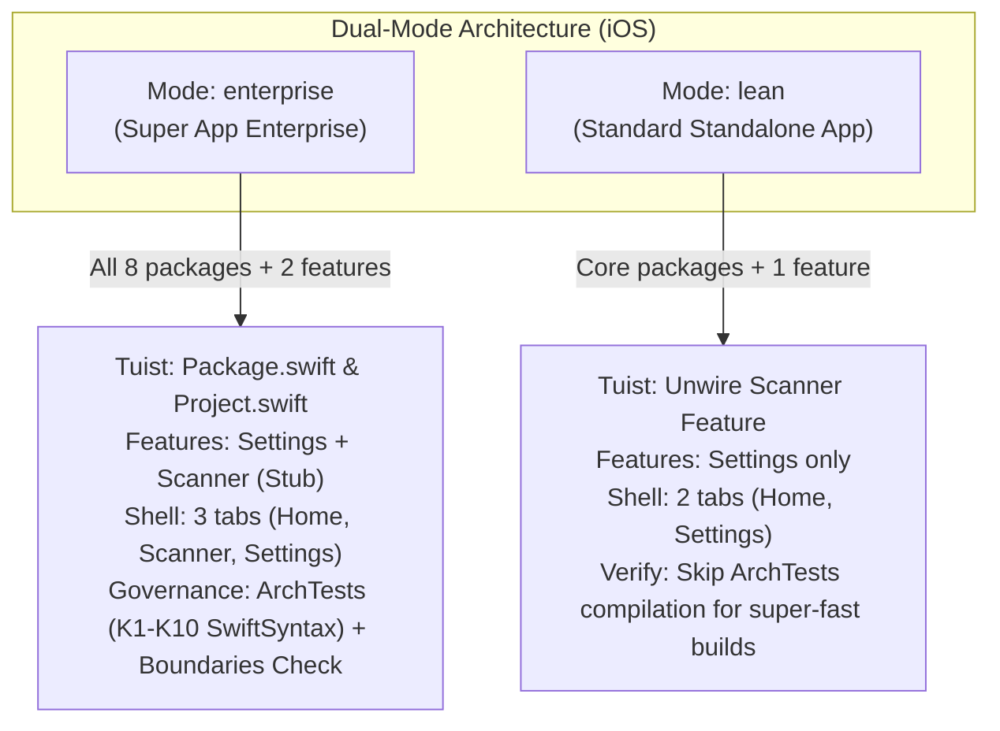

# Dual-Mode iOS Native Template (Enterprise vs Lean Mode) — Design Spec

## 1. Metadata
- **Epic / Feature**: `dual_mode_template_configuration`
- **Date**: 2026-09-14
- **Status**: Draft — In Spec Review
- **Target Repository**: `ios_digital_wallet` (`/Users/danhdueexoictif/AllProjects/digital_wallet/ios_digital_wallet`)
- **Reference Android Implementation**: `android_digital_wallet` (`/Users/danhdueexoictif/AllProjects/digital_wallet/android_digital_wallet`)
  - Spec: `.devtool/epic/tri_mode_and_flutter_plugin_devbed/2026-09-11-tri-mode-template-and-flutter-plugin-devbed-design.md`
  - Scripts: `scripts/configure_mode.sh`, `scripts/rename_project.sh`

---

## 2. Context & Problem Statement

### 2.1 Current State of the iOS Super App Template
The iOS template (`ios_digital_wallet`) is governed by an enterprise-grade multi-package architecture:
- Modularized via local Swift Package Manager (SPM) packages wired through **Tuist 4** (`Tuist/Package.swift`, `Project.swift`, `Workspace.swift`).
- Base infrastructure packages: `Packages/Core`, `Packages/Framework`, `Packages/Network`, `Packages/AppUIKit`, `Packages/Platform`, `Packages/Shell`.
- Feature modules: `Features/Settings` (reference Clean Architecture + MVI feature) and `Features/Scanner` (stub feature to prove multi-feature governance, deep linking, and cross-feature routing).
- AST-based architecture gate (**`ArchTests`**): SwiftSyntax rules K1–K10 enforcing Clean Architecture layers, Domain purity, feature package boundaries, and URL scheme deep link reachability.
- Feature-blind 3-tab container in `Packages/Shell` (`ShellView.swift`) hosting Tab 0: Home Stub, Tab 1: Scanner Stub, Tab 2: Settings.

### 2.2 Pain Points for Standalone Applications & MVPs
1. **Compilation and Verification Overhead:**
   Compiling `swift-syntax` for `ArchTests` (K1–K10) during project self-verification takes significant time and machine resources. For early-stage startups, prototypes, or single-purpose apps, this overhead delays iteration speed.
2. **Unnecessary Feature Stubs:**
   `Features/Scanner` is an illustrative stub. Standalone applications must manually unlink and delete `Scanner` across `Tuist/Package.swift`, `Project.swift`, `AppComposition.swift`, and `ShellView.swift`.
3. **Tab Layout Rigidity:**
   The default 3-tab layout assumes multiple mini-apps/features. A lean application typically needs only 1 or 2 tabs (e.g., Home + Settings) or a simple hierarchical flow.
4. **Lack of Automated Mode Configuration:**
   Unlike the Android template where `configure_mode.sh` and `rename_project.sh --mode` allow 1-command mode switching, the iOS template currently only supports identity renaming.

---

## 3. Architecture & Dual-Mode Matrix

The template is upgraded to support two distinct operational modes:



### 3.1 Technical Comparison Matrix

| Criteria | Mode: `enterprise` (Super App) | Mode: `lean` (Standard Standalone App / MVP) |
| :--- | :--- | :--- |
| **Target Audience** | Enterprise multi-team super apps, mini-app ecosystems | Independent standalone apps, startups, MVPs |
| **SPM Packages & Features** | `Core`, `Framework`, `Network`, `AppUIKit`, `Platform`, `Shell`, `Settings`, **`Scanner`** | `Core`, `Framework`, `Network`, `AppUIKit`, `Platform`, `Shell`, `Settings` (**`Scanner` disabled**) |
| **`Tuist/Package.swift`** | `.package(path: "../Features/Scanner")` active | `.package(path: "../Features/Scanner")` commented out |
| **`Project.swift`** | `.external(name: "Scanner")` active | `.external(name: "Scanner")` commented out |
| **`AppComposition.swift`** | `import Scanner` + `scannerProvider` registered | `Scanner` imports and provider registration commented out |
| **Shell Tabs** | **3 Tabs** (Tab 0: Home, Tab 1: Scanner, Tab 2: Settings) | **2 Tabs** (Tab 0: Home, Tab 1: Settings) |
| **ShellConfig** | `ShellConfig(tabCount: 3, initialTab: 2)` | `ShellConfig(tabCount: 2, initialTab: 1)` |
| **Governance Verification** | Runs `swift test --package-path ArchTests` (K1–K10) + `check_module_boundaries.sh` | **Skips `ArchTests`** in the fast verification loop |
| **Physical `--prune`** | Retains all files | Physically deletes `Features/Scanner/` |

---

## 4. Detailed Component Design

### 4.1 Marker Regions
To enable deterministic, idempotent string patching by shell scripts without relying on AST parsers or breaking formatting, the codebase utilizes marker comments:

1. **`Tuist/Package.swift`**:
   ```swift
   // tuist:packages:begin
   .package(url: "https://github.com/hmlongco/Factory.git", exact: "2.4.3"),
   .package(path: "../Features/Scanner"),
   .package(path: "../Features/Settings"),
   ...
   // tuist:packages:end
   ```
2. **`Project.swift`**:
   ```swift
   // tuist:app-deps:begin
   .external(name: "AppUIKit"),
   ...
   .external(name: "Scanner"),
   .external(name: "Settings"),
   .external(name: "Shell"),
   // tuist:app-deps:end
   ```
3. **`App/Sources/Composition/AppComposition.swift`**:
   ```swift
   // app:feature-imports:begin
   import Scanner
   import Settings
   // app:feature-imports:end
   ...
   // app:route-providers:begin
   let scannerProvider = ScannerRouteProvider { ScannerViewModel() }
   router.register(scannerProvider)
   providers.append(scannerProvider)

   let settingsProvider = SettingsRouteProvider { SettingsViewModel() }
   router.register(settingsProvider)
   providers.append(settingsProvider)
   // app:route-providers:end
   ```
4. **`Packages/Shell/Sources/Shell/ShellView.swift`**:
   Surround the Scanner tab item with dedicated markers:
   ```swift
   TabView(selection: tabSelection) {
       tabStack(index: 0) { HomeStubView() }
           .tabItem { ... }
           .tag(0)

       // shell:scanner-tab:begin
       tabStack(index: 1) { router.destination(for: AppRoutes.ScannerRoot()) }
           .tabItem {
               Label(t.shell.tab.scanner, systemImage: "qrcode.viewfinder")
           }
           .tag(1)
       // shell:scanner-tab:end

       tabStack(index: 2) { router.destination(for: AppRoutes.SettingsRoot()) }
           .tabItem {
               Label(t.shell.tab.settings, systemImage: "gearshape")
           }
           .tag(2)
   }
   ```
   *Note on Tab Indexing in Lean Mode*: When the Scanner tab is commented out, `Settings` can either retain `tag(2)` with `tabCount: 3` (unused index 1) or be adjusted to `tag(1)` with `tabCount: 2`. For a truly clean 2-tab Lean layout:
   In Lean mode:
   - Scanner tab is commented out.
   - Settings tab index is adjusted to `index: 1` and `.tag(1)`.
   - `AppComposition.swift` configures `ShellConfig(tabCount: 2, initialTab: 1)`.
   In Enterprise mode:
   - Scanner tab is active at `index: 1` and `.tag(1)`.
   - Settings tab is at `index: 2` and `.tag(2)`.
   - `AppComposition.swift` configures `ShellConfig(tabCount: 3, initialTab: 2)`.

5. **`App/Sources/Composition/DeepLinkComposition.swift` (`ShellTabResolver`)**:
   ```swift
   struct ShellTabResolver: TabResolver {
       func placement(for route: any AppRoute) -> Platform.TabPlacement? {
           switch route {
           // app:tab-resolver-scanner:begin
           case is AppRoutes.ScannerRoot:
               Platform.TabPlacement(tab: 1, isTabRoot: true)
           // app:tab-resolver-scanner:end
           case is AppRoutes.SettingsRoot:
               Platform.TabPlacement(tab: settingsTabIndex, isTabRoot: true)
           default:
               nil
           }
       }
   }
   ```
   *Note*: In `DeepLinkComposition.swift`, if `ScannerRoot` is matched when Scanner is disabled, it returns `nil` so no deep link route resolves to a missing tab.

---

## 5. Script Specifications

### 5.1 `scripts/configure_mode.sh`
**Purpose**: The dedicated mode configuration utility.

**Usage**:
```bash
scripts/configure_mode.sh <enterprise|lean> [--prune] [--force] [--root-dir=<path>]
```

**Implementation Details**:
- **Option Parsing**: Validates mode (`enterprise` or `lean`). Flags: `--prune` (physically remove unused feature files), `--force` (allow prune on dirty git tree), `--root-dir` (custom repo root for testing).
- **Patch Functions**:
  - `comment_line <pattern> <file>` and `uncomment_line <pattern> <file>` using safe in-place perl/sed.
  - Ensures comments use `// ` and preserve leading indentations.
- **Mode Execution Flow**:
  - `enterprise`:
    1. Uncomment Scanner in `Tuist/Package.swift`.
    2. Uncomment Scanner in `Project.swift`.
    3. Uncomment Scanner in `AppComposition.swift` (both imports and route providers).
    4. Restore 3-tab layout in `ShellView.swift`, `ShellTabResolver`, and `AppComposition.swift` (`tabCount: 3, initialTab: 2`).
    5. Run `tuist install && tuist generate --no-open`.
  - `lean`:
    1. Comment Scanner in `Tuist/Package.swift`.
    2. Comment Scanner in `Project.swift`.
    3. Comment Scanner in `AppComposition.swift`.
    4. Set 2-tab layout in `ShellView.swift`, `ShellTabResolver`, and `AppComposition.swift` (`tabCount: 2, initialTab: 1`).
    5. Run `tuist install && tuist generate --no-open`.
- **Prune Handling**:
  - If `--prune` is passed:
    - Verify `git status --porcelain`. If dirty and `--force` not supplied, abort with error.
    - If `lean`: delete `Features/Scanner/`.
    - If `enterprise`: no-op (enterprise retains all features).

### 5.2 `scripts/rename_project.sh` Integration
**Updated Usage**:
```bash
scripts/rename_project.sh <NewAppName> <new.bundle.id> [--mode <enterprise|lean>] [--force] [--dry-run]
```

**Execution Pipeline**:
1. **Pre-flight & Arguments**:
   - Parse `--mode <enterprise|lean>`, default to `enterprise`.
2. **Rename Phase**:
   - Executes existing rewrites (App name, bundle ID, URL scheme, Keychain service sentinel).
   - Renames entry point `iOSDigitalWalletApp.swift` to `${NEW_NAME}App.swift`.
3. **Configure Mode Phase**:
   - In dry-run: prints `WOULD CONFIGURE MODE: scripts/configure_mode.sh ${MODE}`.
   - Otherwise: calls `scripts/configure_mode.sh "${MODE}"`.
4. **Self-Verify Phase**:
   - Re-generates project: `tuist install && tuist generate --no-open`.
   - Builds scheme: `xcodebuild build -workspace "${NEW_NAME}.xcworkspace" -scheme "$NEW_NAME" -destination 'generic/platform=iOS Simulator' CODE_SIGNING_ALLOWED=NO`.
   - **Mode-Differentiated Verification**:
     - `enterprise`:
       - Run ArchTests: `swift test --package-path ArchTests`
       - Run Boundaries: `scripts/check_module_boundaries.sh`
     - `lean`:
       - Skip `ArchTests` (avoiding `swift-syntax` compilation overhead).

---

## 6. Verification Plan & Testing Matrix

| ID | Test Scenario | Command / Action | Pass Criteria |
|:---:|---|---|---|
| **V1** | **Default Enterprise Mode** | `./scripts/configure_mode.sh enterprise` | `Tuist/Package.swift` and `Project.swift` wire `Scanner`. `tuist generate` passes. `xcodebuild build` and `swift test --package-path ArchTests` pass 100%. |
| **V2** | **Switch to Lean Mode** | `./scripts/configure_mode.sh lean` | `Scanner` commented in manifests and `AppComposition`. `ShellView` renders 2 tabs. `tuist generate` and `xcodebuild build` pass. |
| **V3** | **Idempotent Round-trip** | `enterprise` $\rightarrow$ `lean` $\rightarrow$ `enterprise` | No syntax corruption in manifests or Swift sources. Tree builds cleanly in both states. |
| **V4** | **Rename with `--mode lean`** | `./scripts/rename_project.sh AcmeApp com.acme.app --mode lean` | Renames project, applies Lean mode, generates workspace, and builds `AcmeApp` successfully without ArchTests delay. |
| **V5** | **Prune Operation** | `./scripts/configure_mode.sh lean --prune --force` | `Features/Scanner` deleted from disk. Project generates and builds without missing dependency errors. |
| **V6** | **Guard against Dirty Tree Prune** | Modify a file, then `./scripts/configure_mode.sh lean --prune` | Script aborts immediately with a clear error without deleting files. |

---

## 7. Next Step Routing
This design specifies an Epic-scale workflow covering:
1. Shell scripting automation (`configure_mode.sh` and `rename_project.sh`).
2. Marker region standardization across Tuist manifests and Shell/Composition Swift files.
3. Verification pipelines differentiating Enterprise governance vs Lean rapid-build requirements.

Following user review and approval of this specification, this work routes to **Stage 2 (`epic-designer`)** of the `epic-lifecycle`.
