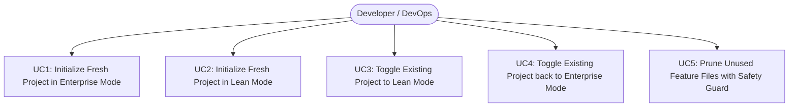
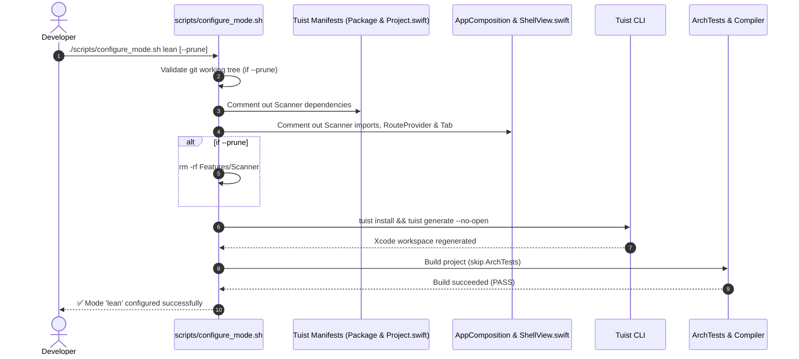

# Epic: Dual-Mode iOS Native Template (Enterprise vs Lean Mode)

## 1. Meta Data
- **Epic**: `template_modes`
- **Status**: Planning (Ready for Task Confirmation)
- **Target Release**: v1.1.0
- **Platform**: `iOS Native`
- **Source Spec**: [2026-09-14-dual-mode-template-configuration-design.md](2026-09-14-dual-mode-template-configuration-design.md)
- **Reference Android Epic**: `/Users/danhdueexoictif/AllProjects/digital_wallet/android_digital_wallet/.devtool/epic/tri_mode_and_flutter_plugin_devbed`

---

## 2. Background
The current iOS Native Template (`ios_digital_wallet`) ships as a fully governed, multi-package Super App architecture with:
- Strict local Swift Package Manager (SPM) modularization managed via Tuist.
- Two feature modules: `Features/Settings` (reference Clean Architecture + MVI implementation) and `Features/Scanner` (stub feature demonstrating multi-feature governance and cross-feature routing).
- Comprehensive AST architecture gate (`ArchTests` with SwiftSyntax rules K1–K10) verifying Domain purity, layer boundaries, and URL scheme deep link reachability.
- A 3-tab layout hosted inside `Packages/Shell` (`ShellView.swift`).

While this structure is optimal for large teams building a distributed Super App, standalone applications, prototypes, startups, and MVPs suffer from excessive overhead:
- Compiling `swift-syntax` for `ArchTests` delays verification loops.
- Removing stub features like `Scanner` requires manual code surgery across manifests and composition roots.
- The 3-tab shell layout requires manual editing to fit simple 1-tab or 2-tab applications.

To solve this, the template introduces automated **Dual-Mode** configuration: **Enterprise Super App Mode** and **Lean Standalone App Mode**.

---

## 3. Goals & Non-Goals

### Goals
- Provide `scripts/configure_mode.sh` to transition cleanly and idempotently between `enterprise` and `lean` modes.
- Support `--prune` in `scripts/configure_mode.sh` to physically delete unneeded feature files (`Features/Scanner`) with git safety checks.
- Add `--mode <enterprise|lean>` (default: `enterprise`) to `scripts/rename_project.sh`.
- Differentiate self-verification: `enterprise` runs full governance (`ArchTests` K1–K10 + module boundaries), while `lean` skips `ArchTests` compilation for sub-minute builds.
- Standardize marker comments across Tuist manifests, `AppComposition.swift`, and `ShellView.swift`.

### Non-Goals
- Collapsing infrastructure packages (`Core`, `Framework`, `Network`, `AppUIKit`, `Platform`) into a single monolithic package. Clean Architecture boundaries remain intact.
- Building an iOS Flutter Plugin Devbed (Mode 3 / `plugin`), which is deferred to a future dedicated epic.
- Modifying Mason bricks `ios_mvi_feature` or `ios_remove_feature` internals beyond keeping them compatible with the marker conventions.

---

## 4. Architecture & Technical Design

### 4.1 High-Level Architecture
```mermaid
graph TD
    subgraph Tooling["Configuration & Automation Scripts"]
        CFG["scripts/configure_mode.sh<br/>(enterprise | lean)"]
        REN["scripts/rename_project.sh<br/>(--mode enterprise | lean)"]
        REN -->|delegates to| CFG
    end

    subgraph Manifests["Tuist & SPM Manifests"]
        PKG["Tuist/Package.swift<br/>// tuist:packages:begin/end"]
        PRJ["Project.swift<br/>// tuist:app-deps:begin/end"]
    end

    subgraph AppHost["Host Composition & Shell"]
        APP["App/Sources/Composition/AppComposition.swift<br/>// app:feature-imports & route-providers"]
        SHELL["Packages/Shell/Sources/Shell/ShellView.swift<br/>// shell:scanner-tab:begin/end"]
        RESOLVER["App/Sources/Composition/DeepLinkComposition.swift<br/>(ShellTabResolver)"]
    end

    subgraph Governance["Quality & Architecture Gates"]
        ARCH["ArchTests (K1-K10 SwiftSyntax)"]
        BOUND["scripts/check_module_boundaries.sh"]
    end

    CFG -->|patches| PKG
    CFG -->|patches| PRJ
    CFG -->|patches| APP
    CFG -->|patches| SHELL
    CFG -->|patches| RESOLVER
    CFG -->|triggers| TUIST["tuist install && tuist generate"]

    M_ENT{"Mode == enterprise?"}
    CFG --> M_ENT
    M_ENT -->|Yes| ARCH
    M_ENT -->|Yes| BOUND
    M_ENT -->|No (lean)| FAST["Fast xcodebuild build (Skip ArchTests)"]
```

### 4.2 Use Cases


### 4.3 Sequence Diagram: Mode Configuration Flow


---

## 5. Comprehensive BDD Test Scenarios
Refer to [bdd_scenarios.md](bdd_scenarios.md) for the complete, canonical suite of Gherkin scenarios.

Summary of key scenarios:
- **Scenario 1**: Switching to Lean mode unwires Scanner from Tuist manifests, AppComposition, and ShellView.
- **Scenario 2**: Switching back to Enterprise mode restores Scanner and 3-tab layout.
- **Scenario 3**: Lean mode verification skips `ArchTests` execution while Enterprise mode enforces it.
- **Scenario 4**: `--prune` deletes `Features/Scanner/` when the git working tree is clean.
- **Scenario 5**: `--prune` fails and protects the workspace when the git working tree is dirty without `--force`.
- **Scenario 6**: `rename_project.sh` correctly parses `--mode lean` and configures the project accordingly.

---

## 6. Rollout Strategy & Mitigation

1. **Phased Integration**:
   - First add marker regions to Swift and Tuist files without altering existing behavior (Enterprise mode remains default).
   - Implement `scripts/configure_mode.sh` and test round-trip transitions.
   - Integrate `--mode` into `scripts/rename_project.sh`.
2. **Mitigation & Rollback**:
   - Every file modification by scripts is idempotent and bracketed with regex guards.
   - If a script aborts, `git checkout -- .` completely restores the working tree because scripts enforce clean git state.

---

## 7. Kanban Tasks Breakdown

- [Task 1: Standardize Marker Regions in ShellView & AppComposition](task_1_standardize_marker_regions.md)
- [Task 2: Implement `scripts/configure_mode.sh` Script](task_2_configure_mode_script.md)
- [Task 3: Integrate `--mode` Flag into `scripts/rename_project.sh`](task_3_rename_project_mode_integration.md)
- [Task 4: Acceptance Verification & Documentation (Tier C)](task_4_acceptance_verification_and_docs.md)
