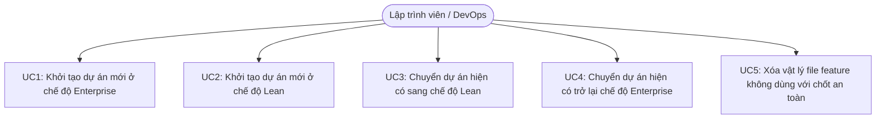
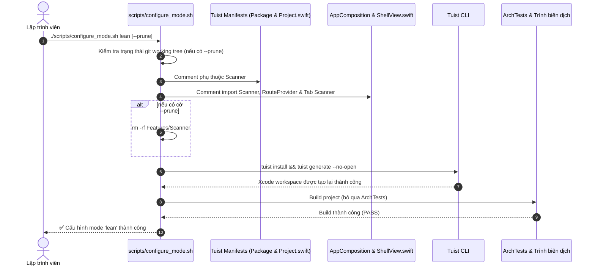

# Epic: Hệ thống Dual-Mode Template iOS Native (Enterprise vs Lean Mode)

## 1. Meta Data
- **Epic**: `template_modes`
- **Trạng thái**: Planning (Sẵn sàng xác nhận danh sách Tasks)
- **Phiên bản mục tiêu**: v1.1.0
- **Nền tảng**: `iOS Native`
- **Tài liệu Spec nguồn**: [2026-09-14-dual-mode-template-configuration-design.md](2026-09-14-dual-mode-template-configuration-design.md)
- **Epic tham chiếu Android**: `/Users/danhdueexoictif/AllProjects/digital_wallet/android_digital_wallet/.devtool/epic/tri_mode_and_flutter_plugin_devbed`

---

## 2. Bối cảnh (Background)
Template iOS Native hiện tại (`ios_digital_wallet`) được thiết kế theo chuẩn Super App doanh nghiệp với mức độ quản trị cao nhất:
- Phân rã đa package cục bộ qua Swift Package Manager (SPM) và quản lý tập trung bằng **Tuist**.
- Hai feature modules: `Features/Settings` (tính năng tham chiếu chuẩn Clean Architecture + MVI) và `Features/Scanner` (tính năng stub chứng minh khả năng quản trị multi-feature và điều hướng cross-feature).
- Cổng kiểm soát kiến trúc AST (**`ArchTests`** với rules K1–K10 của SwiftSyntax) kiểm tra tính độc lập của Domain, ranh giới các layer và khả năng tiếp cận của URL scheme deep link.
- Giao diện 3 tab được đóng gói trong `Packages/Shell` (`ShellView.swift`).

Mặc dù cấu trúc này tối ưu cho các dự án Super App quy mô lớn, các ứng dụng độc lập (standalone apps), bản thử nghiệm (prototypes), startup và MVP lại gặp phải các rào cản:
- Thời gian biên dịch `swift-syntax` cho `ArchTests` làm chậm chu kỳ verify và phát triển nhanh.
- Việc gỡ bỏ các feature mẫu như `Scanner` đòi hỏi chỉnh sửa thủ công nhiều file manifest và composition.
- Giao diện 3 tab mặc định không phù hợp với các ứng dụng đơn giản chỉ cần 1 hoặc 2 tab.

Để giải quyết vấn đề này, template được nâng cấp cơ chế **Dual-Mode** tự động: **Chế độ Enterprise Super App** và **Chế độ Lean Standalone App**.

---

## 3. Mục tiêu & Giới hạn (Goals & Non-Goals)

### Mục tiêu (Goals)
- Xây dựng script `scripts/configure_mode.sh` để chuyển đổi mượt mà, hai chiều và idempotent giữa chế độ `enterprise` và `lean`.
- Hỗ trợ cờ `--prune` trong `scripts/configure_mode.sh` để xóa vật lý các file feature không dùng (`Features/Scanner`) kèm cơ chế kiểm tra an toàn git.
- Bổ sung tham số `--mode <enterprise|lean>` (mặc định: `enterprise`) vào `scripts/rename_project.sh`.
- Phân hóa quy trình self-verification: `enterprise` chạy đầy đủ kiểm soát kiến trúc (`ArchTests` K1–K10 + ranh giới module), trong khi `lean` bỏ qua bước biên dịch `ArchTests` để đạt tốc độ build dưới 1 phút.
- Chuẩn hóa các marker comment trên manifests của Tuist, `AppComposition.swift`, và `ShellView.swift`.

### Giới hạn (Non-Goals)
- Không gộp các package hạ tầng (`Core`, `Framework`, `Network`, `AppUIKit`, `Platform`) thành một monolithic package. Cấu trúc Clean Architecture vẫn được giữ nguyên vẹn.
- Không xây dựng iOS Flutter Plugin Devbed (Mode 3 / `plugin`), hạng mục này sẽ được thực hiện trong một epic chuyên biệt sau.
- Không thay đổi logic cốt lõi bên trong các Mason bricks `ios_mvi_feature` hay `ios_remove_feature` ngoài việc duy trì tính tương thích với các marker region.

---

## 4. Kiến trúc & Thiết kế Kỹ thuật

### 4.1 Kiến trúc Tổng thể (High-Level Architecture)
```mermaid
graph TD
    subgraph Tooling["Scripts Tự động hóa & Cấu hình"]
        CFG["scripts/configure_mode.sh<br/>(enterprise | lean)"]
        REN["scripts/rename_project.sh<br/>(--mode enterprise | lean)"]
        REN -->|ủy quyền gọi| CFG
    end

    subgraph Manifests["Tuist & SPM Manifests"]
        PKG["Tuist/Package.swift<br/>// tuist:packages:begin/end"]
        PRJ["Project.swift<br/>// tuist:app-deps:begin/end"]
    end

    subgraph AppHost["Host Composition & Shell"]
        APP["App/Sources/Composition/AppComposition.swift<br/>// app:feature-imports & route-providers"]
        SHELL["Packages/Shell/Sources/Shell/ShellView.swift<br/>// shell:scanner-tab:begin/end"]
        RESOLVER["App/Sources/Composition/DeepLinkComposition.swift<br/>(ShellTabResolver)"]
    end

    subgraph Governance["Kiểm soát Kiến trúc & Chất lượng"]
        ARCH["ArchTests (K1-K10 SwiftSyntax)"]
        BOUND["scripts/check_module_boundaries.sh"]
    end

    CFG -->|patch nội dung| PKG
    CFG -->|patch nội dung| PRJ
    CFG -->|patch nội dung| APP
    CFG -->|patch nội dung| SHELL
    CFG -->|patch nội dung| RESOLVER
    CFG -->|kích hoạt| TUIST["tuist install && tuist generate"]

    M_ENT{"Mode == enterprise?"}
    CFG --> M_ENT
    M_ENT -->|Đúng| ARCH
    M_ENT -->|Đúng| BOUND
    M_ENT -->|Không (lean)| FAST["Fast xcodebuild build (Bỏ qua ArchTests)"]
```

### 4.2 Trường hợp Sử dụng (Use Cases)


### 4.3 Biểu đồ Trình tự: Luồng Cấu hình Chế độ (Sequence Diagram)


---

## 5. Kịch bản Kiểm thử BDD Toàn diện
Vui lòng tham khảo file [bdd_scenarios.md](bdd_scenarios.md) để xem đầy đủ bộ kịch bản Gherkin chuẩn mực.

Tóm tắt các kịch bản chính:
- **Kịch bản 1**: Chuyển sang chế độ Lean gỡ kết nối Scanner khỏi Tuist manifests, AppComposition, và ShellView.
- **Kịch bản 2**: Chuyển trở lại chế độ Enterprise khôi phục đầy đủ Scanner và giao diện 3 tab.
- **Kịch bản 3**: Xác minh chế độ Lean bỏ qua việc chạy `ArchTests`, trong khi chế độ Enterprise bắt buộc chạy.
- **Kịch bản 4**: Cờ `--prune` xóa thư mục `Features/Scanner/` khi git working tree sạch sẽ.
- **Kịch bản 5**: Cờ `--prune` từ chối thực thi và bảo vệ workspace khi git working tree có thay đổi chưa commit mà không có cờ `--force`.
- **Kịch bản 6**: Lệnh `rename_project.sh` nhận diện chính xác cờ `--mode lean` và cấu hình dự án chuẩn xác.

---

## 6. Chiến lược Triển khai & Giảm thiểu Rủi ro (Rollout Strategy)

1. **Triển khai từng bước**:
   - Bước đầu chuẩn hóa các marker region trên các file Swift và Tuist mà không làm thay đổi hành vi hiện tại (Enterprise mode vẫn là mặc định).
   - Xây dựng `scripts/configure_mode.sh` và kiểm thử chuyển đổi hai chiều.
   - Tích hợp cờ `--mode` vào `scripts/rename_project.sh`.
2. **Khắc phục & Rollback**:
   - Mọi thay đổi nội dung file qua script đều có tính chất idempotent và được bọc trong các regex an toàn.
   - Nếu script bị gián đoạn, lệnh `git checkout -- .` sẽ khôi phục 100% trạng thái ban đầu vì script yêu cầu working tree phải sạch trước khi chạy.

---

## 7. Phân rã Danh sách Công việc (Kanban Tasks Breakdown)

- [Task 1: Chuẩn hóa Marker Regions trong ShellView & AppComposition](task_1_standardize_marker_regions.md)
- [Task 2: Xây dựng Script `scripts/configure_mode.sh`](task_2_configure_mode_script.md)
- [Task 3: Tích hợp Cờ `--mode` vào `scripts/rename_project.sh`](task_3_rename_project_mode_integration.md)
- [Task 4: Kiểm thử Nghiệm thu & Hoàn thiện Tài liệu (Tier C)](task_4_acceptance_verification_and_docs.md)
