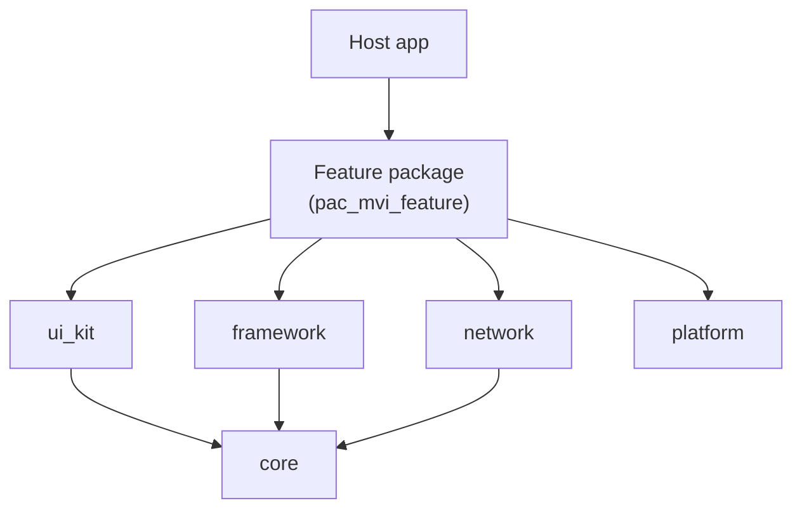
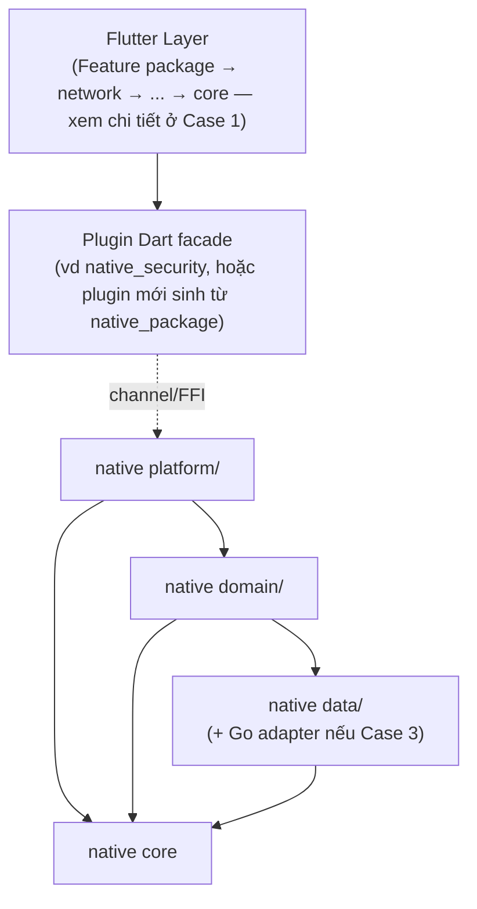
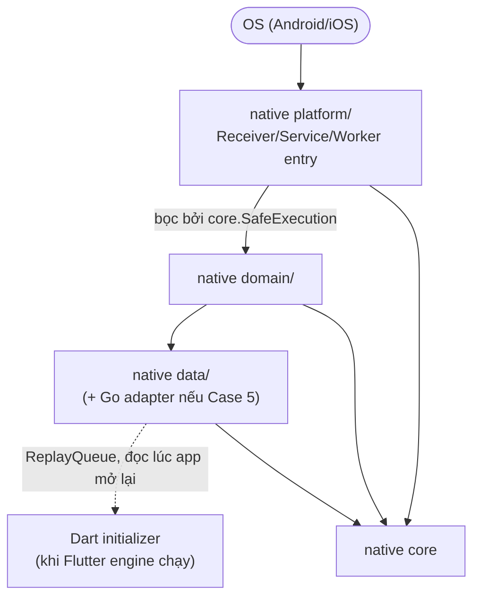
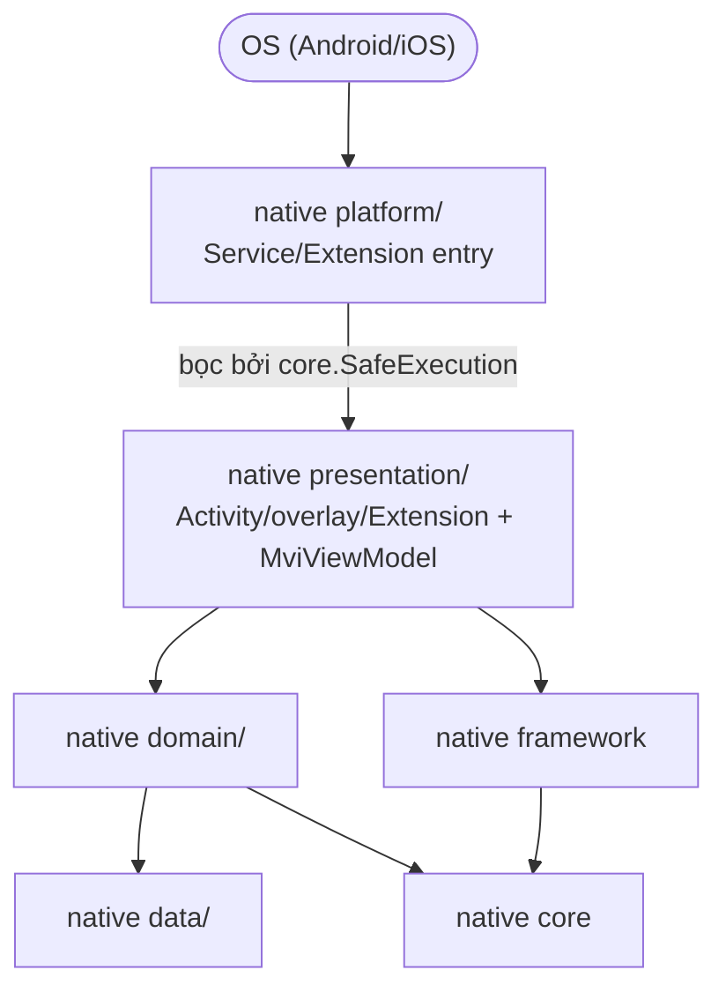
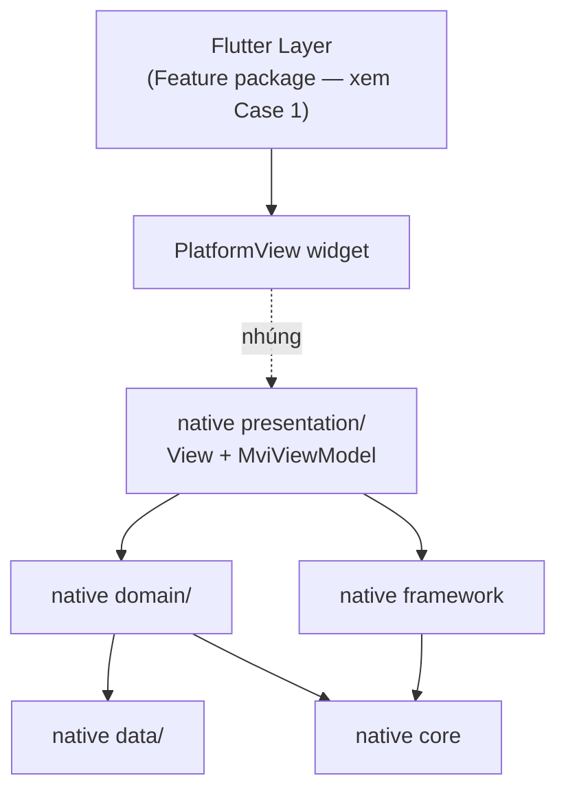

# Epic: Flutter Super App Template

**Ngày**: 2026-08-29
**Trạng thái**: Draft — chờ review
**Nguồn tham chiếu**:
- `.devtool/epic/super_app_governance/super_app_governance.en.md` (kiến trúc Flutter hiện tại)
- `/Users/danhdue/AllProjects/digital_wallet/android_digital_wallet` (kiến trúc + tooling native Android tham chiếu)

## 1. Mục tiêu

Biến `bloc_digital_wallet` thành nguồn để trích xuất ra một **template Flutter** dùng lại được cho các
dự án sau: clone repo template → chạy 1 script đổi tên → code luôn, không phải dọn dẹp thủ công.

Template phải "chuẩn chỉnh" ở **cả 3 mặt**: Flutter/Dart (đã có kiến trúc Clean Architecture + MVI +
super-app governance), **và** Android/iOS native — hiện native mới chỉ có 2 plugin package
(`native_security`, `logger_native_bridge`) không theo quy ước layer nào, không lint/format. Mục tiêu
là native cũng có quy ước layer + tooling + brick sinh code, để "về sau chỉ cần thêm module/package",
và để một thành viên mới không có cách nào viết lệch kiến trúc (khung ép sẵn, không dựa vào tự giác).

## 2. Nguyên tắc bao trùm

- **Plugin package phải framework-agnostic.** `native_security`, `logger_native_bridge`, và các brick
  plugin mới không được ép Hilt/Compose — nếu ép, mọi app Flutter dùng lại template sẽ buộc phải là
  app Hilt mới nhúng được plugin, phá tính "plugin dùng ở bất kỳ project Flutter nào". Plugin dùng DI
  thủ công (constructor injection).
- **Hilt + Compose/SwiftUI + MVI-ViewModel chỉ áp cho nơi thực sự có màn hình native** (module feature
  trong `android/features/*`, `ios/Features/*`) — không gượng ép vào code headless (queue, store, plugin
  registration) chỉ vì "cho chuẩn".
- Không đụng vào domain nghiệp vụ digital wallet trong lần dọn này — phần đó bị loại bỏ hoàn toàn khỏi
  template (xem Phase 1).
- Không sửa gì trong `android_digital_wallet` — chỉ đọc để port/tham chiếu.

## 3. Phase 0 — Kiến trúc & tooling Native (làm trước)

### 3.1 Vì sao `buildSrc` của app áp được cho plugin package

Cơ chế nạp plugin Flutter (`dev.flutter.flutter-plugin-loader`, chạy trong `android/settings.gradle.kts`
của app) đọc `.flutter-plugins-dependencies` và `include(":<plugin>")` cho từng plugin, trỏ `projectDir`
về thư mục `android/` của package đó — nghĩa là tại thời điểm build, **mọi plugin package trở thành
subproject của cùng 1 root Gradle build với app**, không phải composite build tách biệt. Do đó, precompiled
script plugin khai báo trong `android/buildSrc` của app (vd `id("codeanalyzetools.spotless")`) áp dụng
trực tiếp được cho `build.gradle` của `native_security`, `logger_native_bridge` mà không cần kỹ thuật
`includeBuild` phức tạp. Đây là điểm mấu chốt khiến phương án "port buildSrc vào app, dùng chung cho cả
plugin" khả thi.

### 3.2 Cấu trúc Android mới

```
android/
  buildSrc/
    build.gradle.kts                         <- kotlin-dsl, đăng ký convention plugin
    src/main/kotlin/
      Versions.kt / Deps.kt / AppConfig.kt   <- version catalog dùng chung (port, cắt phần đặc thù wallet)
      commons/
        android-library.gradle.kts          <- Hilt + Compose + KSP — dùng cho MODULE FEATURE NATIVE THẬT
        android-feature.gradle.kts
        dagger-hilt.gradle.kts
      codeanalyzetools/
        quality.gradle.kts
        spotless.gradle.kts                  <- DÙNG CHUNG: app module lẫn plugin module
        detekt-check.gradle.kts              <- DÙNG CHUNG
        copyright.kt                         <- license header, đổi placeholder tên project
        config/detekt/detekt.yml, baseline.xml
        config/ktlint/.editorconfig
  framework/                                  <- module Gradle MỚI: port MviViewModel/MvvmViewModel/ViewState
  app/                                         <- Runner mặc định, Flutter tự quản, không đổi
```

Quy ước áp dụng:

| Loại module | Convention plugin áp dụng | DI | UI |
|---|---|---|---|
| Plugin package (`native_security`, `logger_native_bridge`, brick `native_ffi_package`/`native_pigeon_package`) | `codeanalyzetools.spotless` + `codeanalyzetools.detekt-check` **only** | Constructor injection thủ công | Không |
| Module feature native (brick `native_feature_module`, khi thật sự cần màn hình native) | `commons.android-feature` (bao gồm Hilt + Compose + KSP + quality) | Hilt | Compose, `MviViewModel` |

### 3.3 Refactor 2 plugin package hiện tại

Tổ chức lại theo layer, tên thư mục giống hệt giữa Kotlin và Swift để dễ đối chiếu:

```
android/src/main/kotlin/.../{package}/
  platform/   <- *Plugin.kt (đăng ký FlutterPlugin), Messages.g.kt (sinh từ Pigeon), method-channel handler
  domain/     <- logic thuần: NativeLogAppender (policy), NativeLogEntry (model)
  data/       <- adapter lưu trữ: NativeLogQueue, NativeAppenderToggleStore (bọc SharedPreferences/UserDefaults)
```

Mapping cụ thể (lập khi viết task, không đoán ở đây) cho từng file hiện có trong
`packages/native_security/{android,ios}` và `packages/logger_native_bridge/{android,ios}`. Sau khi dọn
xong: xoá `kotlin_version`/AGP hard-code trong 2 `build.gradle`, dùng `Versions.kt` chung; chạy
`detekt`/`spotless` lần đầu, sửa hết vi phạm để có baseline sạch.

### 3.4 Bricks mason mới cho native

1. **`native_ffi_package`** — sinh skeleton plugin FFI (theo mẫu `native_security`): `android/ios/lib` +
   `platform/domain/data` rỗng, `build.gradle` áp sẵn 2 convention plugin quality, `.podspec` trỏ sẵn
   SwiftLint/SwiftFormat. Hook `post_gen.dart` **chỉ** đăng ký `workspace:`/`dependencies:` trong
   `pubspec.yaml` root — không đụng router/DI/translation (native package không có UI Dart).
2. **`native_pigeon_package`** — như trên nhưng theo mẫu `logger_native_bridge` (có `pigeons/` schema,
   sinh `Messages.g.kt`/`Messages.g.swift`).
3. **`native_feature_module`** — sinh module `android/features/{{name}}` (Compose + Hilt ViewModel kế
   thừa `MviViewModel`) và `ios/Features/{{name}}` (SwiftUI View + ViewModel kế thừa bản Swift của
   `MviViewModel`) — dùng khi một package thật sự cần màn hình native (vd Platform View phức tạp).

### 3.5 iOS — thiết kế mới (không có reference sẵn)

Dịch 1:1 khái niệm từ `MviViewModel.kt`/`MvvmViewModel.kt`/`ViewState.kt` sang Swift + Combine:

| Kotlin (Coroutines/Flow) | Swift (Combine) |
|---|---|
| `uiState: StateFlow<STATE>` | `@Published var uiState: STATE` trên `ObservableObject` |
| `viewState: StateFlow<ViewState<STATE>>` | `@Published var viewState: ViewState<STATE>` (enum `.loading/.error/.content`) |
| `event` (buffered `Channel`, 1 collector) | `PassthroughSubject<EVENT, Never>` riêng — *lưu ý*: Combine không có channel single-collector thật, quy ước tài liệu hoá "chỉ 1 View subscribe" |
| `sharedEvent` (`SharedFlow`, nhiều collector) | `PassthroughSubject<EVENT, Never>` (multicast tự nhiên của Combine) |
| `dispatch(action)` → `onAction` | `func dispatch(_ action: ACTION)` → gọi `onAction(_:)` (override point) |
| `reduce { copy(...) }` | `func reduce(_ transform: (inout STATE) -> Void)` |
| `startLoading()` / `handleError()` | cùng tên, override được, cập nhật `viewState` |

Base class: `class MviViewModel<STATE, ACTION, EVENT>: MvvmViewModel, ObservableObject`.

**Quyết định 2026-08-29 (deployment target + cơ chế state)**: **Combine/`ObservableObject`, min target
iOS 13** — không dùng `@Observable` (cần iOS 17+) và không dùng `swift-perception` (backport SPM-only của
Point-Free). Lý do:
- `vchat_shield` — ví dụ thực chiến gần nhất cho native iOS trong hệ sinh thái này — target iOS 16, đã
  chứng minh Combine đủ dùng ở mức floor đó; không có lý do ép floor cao hơn precedent thực tế.
- Combine (`Publisher`/`Subject`) là mô hình **reactive-stream**, khớp cấu trúc với Kotlin Flow
  (`StateFlow`≈`CurrentValueSubject`, `Channel`/`SharedFlow`≈`PassthroughSubject`) — đúng mục tiêu ban đầu
  của bảng dịch 1:1 ở trên. `@Observable`/`swift-perception` là mô hình theo dõi property (kiểu snapshot
  của Compose khi tiêu thụ Flow ở tầng UI), không có khái niệm Publisher/operator — khớp tầng render hơn
  là tầng hợp đồng ViewModel, và tầng render fine-grained không mang lại lợi ích thực tế cho các package
  `has_ui=true` ở đây (thường chỉ 1 màn hình/overlay đơn giản, không phải cây UI phức tạp).
- `event`/`sharedEvent` bắt buộc dùng Combine dù chọn cơ chế state nào — chọn Combine cho cả state lẫn
  event giữ 1 mô hình duy nhất, không trộn 2 tư duy trong cùng 1 class.
- Tránh thêm dependency ngoài (swift-perception) vào đúng tầng nền tảng (`ios/framework`), đi ngược
  nguyên tắc "hạ tầng native nhẹ, trung lập" đã áp dụng nhất quán cho cả 2 nền tảng (không ép Hilt vào
  plugin Android cũng vì lý do tương tự).

Tooling: **SwiftFormat** + **SwiftLint**, config dùng chung tại `ios/quality/.swiftformat` +
`ios/quality/.swiftlint.yml`; mỗi plugin/feature trỏ vào qua `--config` path. Run Script Phase gọi 2 tool
này gắn vào `Package.swift`/target build (xem mục 3.5.1 — không còn gắn vào `.podspec` vì đã bỏ CocoaPods).

### 3.5.1 Đóng gói: SPM-only, không dual-support CocoaPods (quyết định 2026-08-29)

`native_security`, `logger_native_bridge`, và brick `native_ios_package` (mục 3.4) sẽ **chỉ dùng Swift
Package Manager** (`Package.swift`), **xoá hẳn `.podspec`** — không giữ song song 2 kiểu đóng gói như
khuyến nghị "coexist" mặc định của Flutter cho tác giả plugin công khai. Khả thi vì:
- `.fvmrc` của repo pin **Flutter 3.41.1** — đủ xa mốc Flutter bắt đầu hỗ trợ SPM cho plugin (~3.24) để
  tin cậy được, không phải bản preview mới toanh.
- CocoaPods trở thành registry **read-only từ 2/12/2026** — chỉ còn ~3 tháng kể từ ngày viết doc này, nên
  ưu tiên SPM ngay từ đầu cho 2 plugin thay vì để dành.
- Đây là quyết định trong tầm kiểm soát của epic — 2 plugin do chính template sở hữu.

**Giới hạn cần hiểu rõ, tránh ngộ nhận**: việc này **không đảm bảo toàn bộ app hết CocoaPods**.
`ios/Podfile` ở gốc app **vẫn giữ nguyên, không xoá** — Flutter gộp mọi plugin dependency (kể cả gián
tiếp, qua các package bên thứ 3 trong `ui_kit`/`network`/`settings` như `flutter_svg`, `cached_network_image`,
`google_sign_in`...) vào cùng 1 Podfile nếu **bất kỳ** dependency nào trong cây phụ thuộc chưa hỗ trợ SPM
— việc đó thuộc hệ sinh thái pub bên ngoài, ngoài tầm kiểm soát của epic này. Phạm vi đúng của quyết định
này là: "2 plugin của template không còn phát hành qua CocoaPods", không phải "app không còn CocoaPods".

### 3.6 OS-integrated & third-party-native (Go) packages — *(Phase 3, chưa thiết kế chi tiết)*

**Nguồn**: `/Users/danhdue/Downloads/vchat_shield` — plugin call/SMS-scam detection thật, dùng làm ví dụ
"không nên làm theo". Khác về bản chất với `native_security`/`logger_native_bridge`: nó tự đăng ký các
component hệ điều hành **sống độc lập với Flutter** — Android: `BroadcastReceiver`
(`VShieldPhoneStateReceiver`, `VShieldSmsReceiver`), `Service` (`VShieldCallScreeningService`,
`CallerInfoOverlayService` — có cả overlay window), `WorkManager` (`ScamDatabaseSyncWorker`); iOS:
`CallDirectoryHandler` (Call Directory Extension). Các entry-point này do **OS gọi trực tiếp**, có thể
chạy cả khi Flutter engine chưa khởi tạo — khác hẳn plugin "passive" (chỉ chạy khi Dart gọi qua channel).
Trong `vchat_shield`, logic nghiệp vụ (phân loại spam, parse response...) bị viết thẳng trong
`onReceive`/`onScreenCall`/`doWork`, nên 1 exception ở đó crash luôn **toàn bộ process host app**, không
dừng ở "lỗi plugin" — đây là nguyên nhân được nêu ra ("code ẩu sinh crash vào host app").

**Yêu cầu bắt buộc khi thiết kế brick cho loại plugin này (chưa làm ngay, ghi lại để Phase 3)**:
- Mọi entry-point do OS gọi (`onReceive`, `onScreenCall`, `doWork`, `CXCallDirectoryProvider` callback...)
  phải có crash-boundary ngay đầu vào (try/catch + fallback an toàn) — không bao giờ để exception thoát
  ra ngoài các hàm này.
- Logic nghiệp vụ nằm thuần trong `domain/`, không phụ thuộc Android/iOS framework — test được độc lập,
  không cần trigger sự kiện OS thật.
- `presentation`/`platform` chỉ làm nhiệm vụ: nhận sự kiện OS → bọc an toàn (crash-boundary) → gọi domain
  → xử lý kết quả (không có nhánh nào gọi domain mà thiếu bọc).

**Native tích hợp Go (vd E2EE cho chat)** — một biến thể khác, cũng để Phase 3: bọc binding Go
(gomobile sinh `.aar` cho Android / `.xcframework` cho iOS) sau lớp `platform/`; **panic của Go phải được
recover và convert thành lỗi Kotlin/Swift ngay tại biên giới JNI/cgo đó**, không bao giờ để panic xuyên
qua lên trên.

Cả 2 việc này **không nằm trong Phase 0/1** của epic — cần một thiết kế riêng (chiến lược cô lập crash,
lifecycle WorkManager/Call Directory Extension, cầu nối Go/cgo) trước khi có brick tương ứng
(`native_os_integrated_package`, `native_go_bridge_package` — tên tạm). Ghi nhận tại đây làm input cho
epic/brainstorm kế tiếp.

### 3.7 Sơ đồ theo từng use case (không gộp chung 1 sơ đồ)

Vẽ gộp toàn bộ dependency graph vào 1 sơ đồ làm mất trọng tâm — không thấy luồng chạy thực tế của từng
tình huống. Tách thành 5 sơ đồ nhỏ, mỗi sơ đồ chỉ vẽ đúng component tham gia luồng đó, ứng với các use
case đã liệt kê ở mục 2 của `flutter_super_app_template.vi.md`.

**Case 1 — Thuần Dart, không native**



**Case 2/3 — Ô1: passive, không UI (± Go)**



*(Nội bộ Dart đã vẽ đủ ở Case 1 nên gộp chung thành "Flutter Layer" — dù Feature package hay `network` gọi
vào Plugin Dart facade thì không ảnh hưởng gì tới nửa native của use case này.)*

**Case 4/5 — Ô3: OS-triggered, không UI (± Go)**



**Case 6 — Ô4: OS-triggered, có UI**



**Case 7 — Ô2: passive, có UI**



Điểm chung, kiểm chứng lại được ở mọi sơ đồ trên: mũi tên đặc luôn đi 1 chiều về phía `core`/`native core`
(không có chiều ngược); đường nét đứt là ranh giới runtime (channel, PlatformView, ReplayQueue) chứ không
phải dependency lúc build.

**Ai gọi `core`, ai gọi `framework`?**

| Phía Dart | Gọi `core`? | Gọi `framework`? |
|---|---|---|
| `network`, `platform` | ✅ trực tiếp | ❌ |
| `ui_kit`, feature packages | ✅ trực tiếp | ✅ trực tiếp |
| Host `lib/` | ✅ gián tiếp | ✅ gián tiếp |

| Phía Native | Gọi native `core`? | Gọi native `framework`? |
|---|---|---|
| Package `has_ui=false` (`native_security`, `logger_native_bridge`, ...) | ✅ trực tiếp | ❌ |
| Package `has_ui=true` | ✅ gián tiếp qua `framework` | ✅ trực tiếp |

Quy luật chung cả 2 phía: `core` là nền bắt buộc cho **mọi** module, không ngoại lệ. `framework` chỉ là
dependency của module thật sự có UI/state cần quản lý (Bloc bên Dart, ViewModel bên native).

## 4. Phase 1 — Trích xuất template Flutter/Dart (làm sau Phase 0)

Toàn bộ mục dưới đây đã chốt qua trao đổi trước, liệt kê lại làm tài liệu chốt:

### 4.1 Package inventory

| Giữ | Bỏ |
|---|---|
| Infra: `core`, `framework`, `network`, `native_security`, `ui_kit`, `platform` (app_platform), `logger`, `logger_native_bridge` | `authentication`, `onboard`, `wallet`, `transaction`, `trends` (domain digital-wallet + coupling onboard→settings) |
| Feature: `settings` (thật) | `d3nexus_logger` (stub rỗng, không nằm trong workspace) |
| Feature: `scanner` (sinh mới, **rỗng**, từ `pac_mvi_feature`) | |

### 4.2 Host `lib/`

- `lib/shell/`: giữ 3 tab — **home** (stub page ngay trong shell, không phải package), **scanner**
  (package rỗng), **settings** (package thật). Focus mặc định = tab settings (index cuối).
- Bỏ hẳn splash tuỳ biến (`onboard`) — dùng native splash mặc định của Flutter, app mở thẳng vào Shell.
- `lib/di/injection.dart`, `lib/app_router.dart`: bỏ import/route của authentication/onboard/wallet/
  transaction/trends; giữ Shell + settings router + scanner router.
- `AuthNavigationInitializer` trong `lib/core/app_initializer/`: bỏ (không còn auth), hoặc để lại dạng
  stub có comment hướng dẫn bật lại khi project cần auth.

### 4.3 Localization & asset

- Giữ nguyên 90 locale (không cắt).
- Giữ font SF Compact Display; chỉ dọn asset/lottie/json đặc thù digital-wallet
  (`assets/jsons/test_wallets.json`, `user_object.json`, các lottie/hình liên quan ví).

### 4.4 Mason bricks (phần Dart, không tính native ở mục 3.4)

- Giữ: `pac_mvi_feature`, `pac_mvi_subfeature`, `remove_pac_feature`, `remove_pac_subfeature`.
- **Giữ nguyên, không xoá** (quyết định 2026-08-29): `mvi_feature`, `mvi_subfeature`, `sample`,
  `remove_feature`, `remove_subfeature`, `remove_sample`, `test_brick` — dù nhắm pattern `lib/features/`
  cũ (đã bị thay bởi package-per-feature) và hiện không dùng, vẫn giữ lại phòng trường hợp một dự án sau
  này không theo package-first organization và cần quay lại pattern monolith.
- **Sửa bắt buộc**: `bricks/pac_mvi_feature/hooks/post_gen.dart` hiện neo mọi chỗ chèn code vào chuỗi
  `import 'package:onboard/onboard.dart' as onboard;` (5 hàm `_update*`). Vì `onboard` bị xoá khỏi
  template, phải đổi neo sang `settings` (package feature còn lại), nếu không hook sẽ âm thầm bỏ qua
  bước tích hợp khi tạo feature mới.

### 4.5 Docs / AI-agent config

- `.agent/`: giữ, gỡ tham chiếu `bloc_digital_wallet`, reset `.agent/contexts/*` về rỗng/generic.
- `.devtool/epic/`: chỉ giữ `super_app_governance.en.md`/`.vi.md` (+ epic này) làm tài liệu kiến trúc
  gốc; xoá toàn bộ `task_*.md`, epic `logging_refactor`, `.devtool/features/`.
- `docs/`: giữ `architecture`, `mason`, `getting-started`, `development`; xoá spec/plan cũ,
  `localization_analysis.md`, `implementation_guide.md`, `ORGANIZATION_PROPOSAL.md`.
- Gom AI config: xoá `.kiro/`, `.github/copilot-instructions.md`, `.cursorrules`; giữ `.agent/` +
  `.vscode/` (+ Claude Code config nếu có). `.devcontainer/` giữ (generic, chỉ cần đổi tên).

### 4.6 CI — quyết định 2026-08-29: giữ nguyên làm mẫu

**Giữ nguyên** `.gitlab-ci.yml` hiện tại (kể cả bước copy `google-services.json`/`GoogleService-Info.plist`
từ `secureFiles` và `melos buildIPA`) làm **mẫu tham khảo** cho dự án mới tự điều chỉnh secrets/signing của
họ — không xoá/rút gọn. Chỉ thêm `native_lint`/`native_format` mới từ Phase 0 vào job hiện có.

Việc cần làm thật (không thuộc "CI cũ", mà là giữ cấu hình CI *khớp với package đã cắt*):
`scripts/module_boundary_whitelist.txt` xoá dòng `onboard→settings` (onboard không còn); mảng
`FEATURE_PACKAGES` trong `check_module_boundaries.sh` rút còn `(settings scanner)` — nếu không cập nhật,
gate sẽ kiểm tra nhầm những package đã bị xoá.

## 5. Script đổi tên (`scripts/rename_project.sh`)

Cửa vào duy nhất cho "clone về đổi package":

- Đổi tên package gốc trong `pubspec.yaml` (root + mọi package con nếu đường dẫn phụ thuộc tên),
  `melos.yaml`.
- Thay toàn bộ `import 'package:bloc_digital_wallet/...'` → package mới trong `lib/`.
- Đổi `applicationId` (Android `app/build.gradle.kts`) và bundle id (iOS `project.pbxproj`/`.xcconfig`).
- Đổi tên hiển thị app (`AppConfig`, `flutter_native_splash.yaml`, `AndroidManifest.xml` label,
  `Info.plist` `CFBundleDisplayName`).
- **Namespace Kotlin/Swift của 2 plugin package: giữ cố định `com.danhdue.*`** (quyết định 2026-08-29) —
  `rename_project.sh` **không đụng** vào `com.danhdue.native_security`/`com.danhdue.logger_native_bridge`,
  coi đây là "vendor namespace" riêng của bộ plugin gốc, độc lập với tên/org của dự án dùng template.
- Cuối script tự chạy `melos genAlls` để build lại code sinh (router/DI/theme/translations) khớp tên mới.

## 6. Trạng thái các điểm cần xác nhận (cập nhật 2026-08-29)

1. **Vị trí làm việc**: tạm thời làm trên 1 **git worktree của chính repo `bloc_digital_wallet`**
   (`.worktrees/<tên>`, xem mục 5 trong `template_flutter/template_flutter.vi.md`), **chưa** tách sang
   repo/đường dẫn độc lập. Việc tách repo riêng (nếu cần) để quyết định sau, không chặn thi công.
2. Xoá bricks Dart cũ (mục 4.4) — **giữ nguyên, không xoá** (đã chốt).
3. CI rút gọn (mục 4.6) — **giữ nguyên CI cũ làm mẫu**, không rút gọn (đã chốt).
4. iOS deployment target tối thiểu (mục 3.5) — **đã chốt**: Combine/`ObservableObject`, min target
   iOS 13. Đóng gói plugin: SPM-only, không `.podspec` (mục 3.5.1) — xem `template_ios` task 10.
5. Namespace Kotlin/Swift của plugin — **giữ cố định `com.danhdue.*`** (đã chốt, xem mục 5 ở trên).

## 7. Thứ tự triển khai đề xuất

```
Phase 0 (native, Android + iOS)
  └─ 3.1–3.2 buildSrc + framework module (Android)
  └─ 3.3 refactor native_security + logger_native_bridge vào platform/domain/data
  └─ 3.4 3 brick native mới
  └─ 3.5 MviViewModel bản Swift + tooling SwiftLint/SwiftFormat
Phase 1 (Flutter/Dart, dựa trên Phase 0 đã có brick/tooling)
  └─ 4.1–4.2 cắt package + host lib/
  └─ 4.3 asset/locale
  └─ 4.4 bricks Dart + sửa hook pac_mvi_feature
  └─ 4.5 docs/agent
  └─ 4.6 CI
  └─ 5. rename_project.sh
Phase 2 (trích xuất + kiểm thử, trên worktree của repo này)
  └─ Test thử: tạo worktree mới → rename_project.sh → mason make native_android_package /
     native_ios_package / pac_mvi_feature → melos genAlls → build thành công trên cả Android + iOS
```

Mỗi phase ở trên sẽ tách thành các file `task_N_*.md` riêng (theo đúng convention của epic
`super_app_governance`) khi bắt đầu lập kế hoạch thi công, sau khi design doc này được duyệt.
