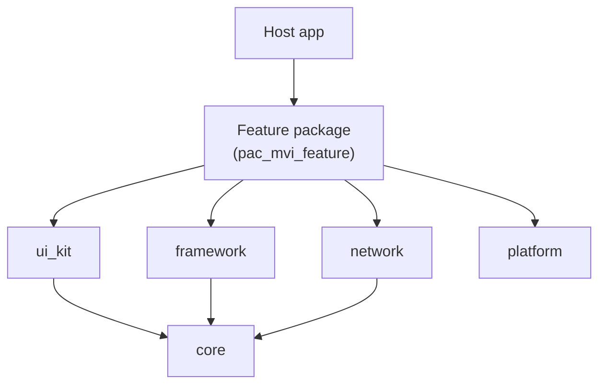
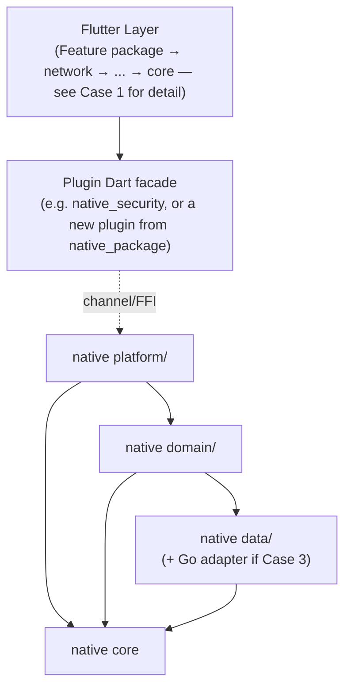
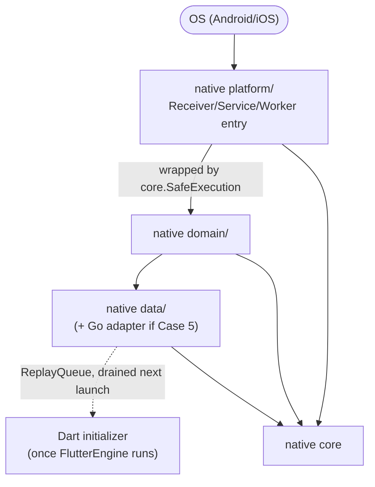
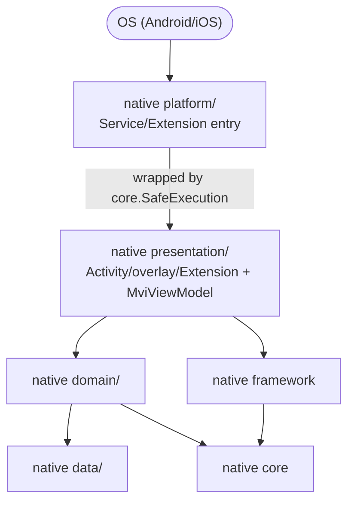
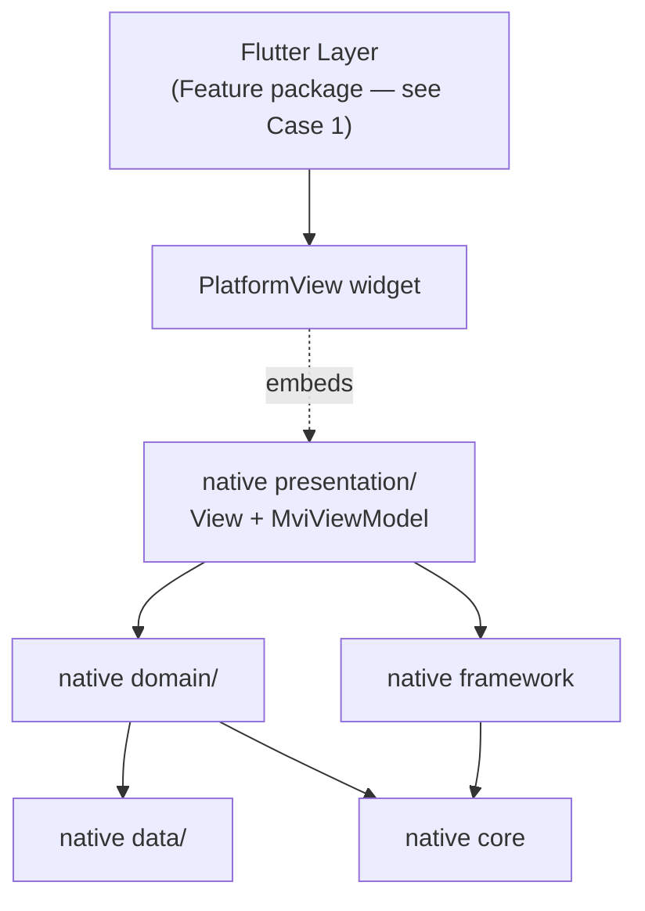

# Epic: Flutter Super App Template — Native Architecture Spec

**Status**: Draft — pending review
**Companion**: [2026-08-29-flutter-super-app-template-design.md](2026-08-29-flutter-super-app-template-design.md) (full design, Dart/Flutter trimming, task breakdown)
**References**: `android_digital_wallet` (Android MVI/buildSrc source), `vchat_shield` (native code to *not* repeat)

## 1. Goals

| # | Goal |
|---|---|
| G1 | Produce a clone-and-rename Flutter template that keeps the existing Clean Architecture + MVI + super-app governance (Dart side — detailed in the companion design doc). |
| G2 | Standardize native code (Kotlin/Android, Swift/iOS) the same way: one layering convention, one quality-tooling setup, applied to every native module by construction — not left to individual discipline. |
| G3 | Keep plugin packages DI-framework-agnostic (no forced Hilt) so any Flutter app can depend on them; reserve Hilt/Compose/SwiftUI/`MviViewModel` for code that genuinely owns a native screen. |
| G4 | Make host-app crashes from OS-triggered native code structurally hard to cause (lesson from `vchat_shield`: business logic inline in `onReceive`/`onScreenCall`/`doWork` crashed the whole host process). |
| G5 | Support a future third-party native binary (Go via gomobile/cgo, e.g. E2EE) without inventing a new architecture for it. |
| G6 | Adding new native code should require picking 2 flags, not making architecture decisions. |

## 2. Use cases that shape the architecture

Two independent axes decide the shape of any native module:
- **Trigger** — does Dart call in (*passive*), or does the OS call in independently of Flutter (*os_triggered*, e.g. `BroadcastReceiver`/`Service`/`WorkManager`/`CallDirectoryHandler` — may run with no `FlutterEngine` in the process)?
- **UI** — does this module own a native screen/overlay (*has_ui*)?

Go (or any compiled third-party native library) is **not** a third axis — it is a modifier on the `data/` (or `platform/` for direct JNI/cgo) layer of any of the 4 combinations, with one fixed rule: a Go panic must be recovered and converted to a Kotlin/Swift error at that boundary, never propagated up.

Realistic, reduced list (from the full 2×2×Go cross-product):

| # | trigger | has_ui | Go | Example |
|---|---|---|---|---|
| 1 | — | — | — | Pure Dart feature, no native code (`pac_mvi_feature`) |
| 2 | passive | no | no | `native_security`, `logger_native_bridge` |
| 3 | passive | no | yes | E2EE encrypt/decrypt while chat screen is open |
| 4 | os_triggered | no | no | Background sync worker (à la `vchat_shield`'s `ScamDatabaseSyncWorker`) |
| 5 | os_triggered | no | yes | Decrypt a push-notification preview while the app/Flutter engine isn't running |
| 6 | os_triggered | yes | no | Native overlay/call-screening UI independent of Flutter (à la `vchat_shield`) |
| 7 | passive | yes | no | Native UI embedded in the Flutter widget tree via `PlatformView` (no concrete need yet, architecture must support it) |

`passive+has_ui+Go` and `os_triggered+has_ui+Go` are valid combinations with no current concrete need — handled by combining row 6/7 with the Go modifier when they arise, no extra design required.

## 3. Solution

**Foundation, mandatory for every native module regardless of the flags above** — mirrors the Dart-side `core`/`framework` split:

- **native `core`** (always a dependency): `SafeExecution` (exception-handler wrapper, no `ViewModel`/lifecycle required — usable in `domain/`, a `Service`, a `Worker`, or a plain plugin), `DataState<T>` (Success/Error), a `Logger` contract, a `Container` convention for manual DI, `ReplayQueue` (queue-and-replay-on-next-launch, generalized from `logger_native_bridge`).
- **native `framework`** (dependency only when `has_ui=true`): `MviViewModel`/`MvvmViewModel`/`ViewState`, ported from `android_digital_wallet`, built on `core`. A Swift equivalent is designed from scratch (Combine-based `ObservableObject`, no existing iOS reference) — see companion doc §3.5.
- **`android/buildSrc`**, ported and trimmed from `android_digital_wallet/buildSrc`: a quality convention plugin (Spotless/ktlint + Detekt, one shared ruleset) applied to **every** native module including plugin packages, and a separate Hilt+Compose convention plugin applied only to modules with `has_ui=true`. This works because Flutter's plugin loader makes every plugin package a subproject of the same root Gradle build as the host app at build time, so the host's `buildSrc` plugin IDs resolve inside plugin packages too. iOS equivalent: shared `.swiftformat`/`.swiftlint.yml`.
- **One parameterized Mason brick**, `native_package(trigger, has_ui)`, instead of 3–4 separately-maintained bricks. `__brick__/` contains every possible file; `post_gen.dart` deletes what the chosen flags don't need (e.g. `has_ui=false` removes `presentation/`; `trigger=passive` removes the `Receiver`/`Service`/`Worker` template and `ReplayQueue` wiring). One source of truth avoids the 4-bricks-drift-apart failure mode.
- **Go integration**: not a brick flag (too library-specific, too rare to bake into generation). Standardized instead via a short guide + a copy-paste panic-recovery snippet (`docs/architecture/native-go-binding.md`), manually dropped into `data/` of whichever generated package needs it.

## 4. Applying it in practice

| Scenario | What to do |
|---|---|
| **Pure Flutter feature** | `mason make pac_mvi_feature`. No `android/`/`ios/` touched. |
| **Native code, no UI** | `mason make native_package` with `has_ui=false`, pick `trigger`. Get `platform/domain/data`, depending on native `core` only, manual DI via `Container`. |
| **Native code, has UI** | Same brick, `has_ui=true`. Adds `presentation/` (View + `MviViewModel`), pulls in `framework`→`core`, applies Hilt/Compose convention. `trigger=passive` embeds the view in the Flutter tree via `PlatformView`; `trigger=os_triggered` gets its own `Activity`/overlay `Window`/App Extension, independent of any `FlutterEngine`. |
| **OS-triggered (any UI)** | `trigger=os_triggered`. The generated entry-point (`onReceive`/`onScreenCall`/`doWork`) is pre-wrapped in `core.SafeExecution` — this is non-optional. Then choose how (if at all) it talks to Dart: (a) never — pure native, own storage; (b) queue results via `core.ReplayQueue`, drained by a Dart initializer next time the app opens (à la `logger_native_bridge`); (c) spin up a headless `FlutterEngine` to run an actual Dart callback (à la the `workmanager` package) — only when reusing existing Dart logic is worth the extra machinery. |
| **Needs a Go binding** | Any of the above, plus follow `docs/architecture/native-go-binding.md` in `data/`. If `trigger=os_triggered`, call Go directly from Kotlin/Swift — do not route through a headless engine just to reach Go. |

### 4.1 An existing no-UI package that later needs UI

Don't regenerate the brick from scratch (it would clobber the existing `platform/domain/data`). Split
into two, **not** one brick — only the architecturally meaningful part gets tooled; the rest stays a
manual checklist, since each package can need a different variant and baking it into a brick would be
needlessly rigid:

- **Tool** — `scripts/native_add_ui_dependency.sh <pkg> <android|ios>`: does exactly one thing — adds the
  `framework` dependency (pulling in `core`) and applies the Hilt+Compose convention plugin
  (`commons.android-feature`) to the chosen package's `build.gradle`/podspec, plus a thin Hilt
  `@Module`/`@Provides` bridging the existing manual `Container` instances into Hilt's graph. This is the
  step most likely to be forgotten or done wrong (missing convention plugin → a confusing compile error;
  a bad bridge → duplicate instances), so it's worth tooling.
- **Manual checklist** (documentation, no generated code):
  1. Create `presentation/` (View + a `MviViewModel` subclass), following another UI-bearing package as a
     template.
  2. `trigger=passive`: register a `PlatformViewFactory` in the existing `*Plugin.kt`/`.swift` + add the
     Dart-side `AndroidView`/`UiKitView` wrapper.
  3. `trigger=os_triggered`: declare the new `Activity`/overlay `Window` in `AndroidManifest.xml`; a new
     iOS App Extension target is done manually in Xcode (not safely auto-generatable from text templates).

`core.SafeExecution`/`ReplayQueue` (if `os_triggered`) are untouched — the crash-boundary and
Dart-communication strategy chosen at creation time stay valid; adding UI is additive, not a rewrite of
the trigger layer.

## 5. Diagrams per use case

One diagram per use case (not combined) — each shows only the components involved in that flow.

**Case 1 — Pure Dart, no native**

**Case 2/3 — Ô1: passive, no UI (± Go)**

*(The Dart-internal wiring is already fully drawn in Case 1, so it's collapsed into one "Flutter Layer"
box here — whether a Feature package or `network` is the one calling the plugin's Dart facade makes no
difference to the native half of this use case.)*

**Case 4/5 — Ô3: OS-triggered, no UI (± Go)**

**Case 6 — Ô4: OS-triggered, has UI**

**Case 7 — Ô2: passive, has UI**

Common to every diagram: solid arrows always flow one way, top to bottom, toward `core`/`native core` —
never the reverse. Dashed arrows are runtime boundaries (channel, `PlatformView`, `ReplayQueue`), not
build-time dependencies.
