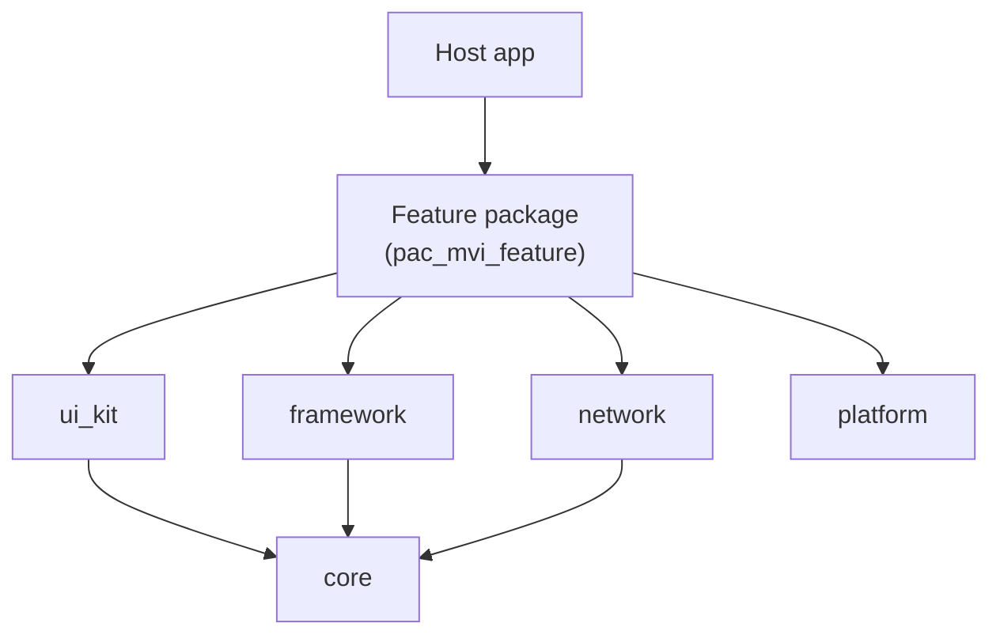
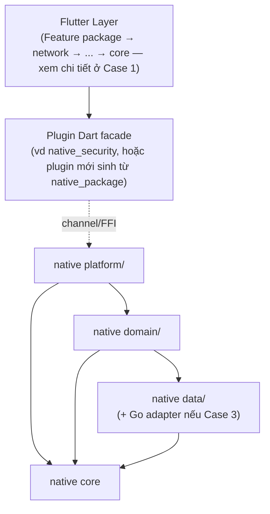
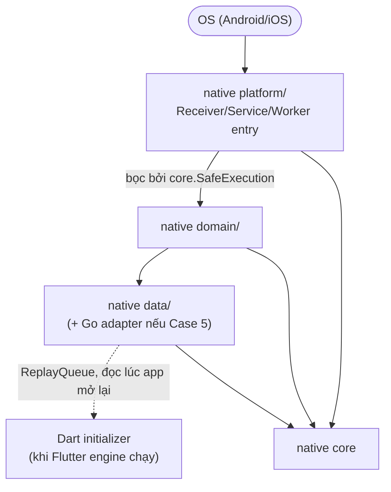
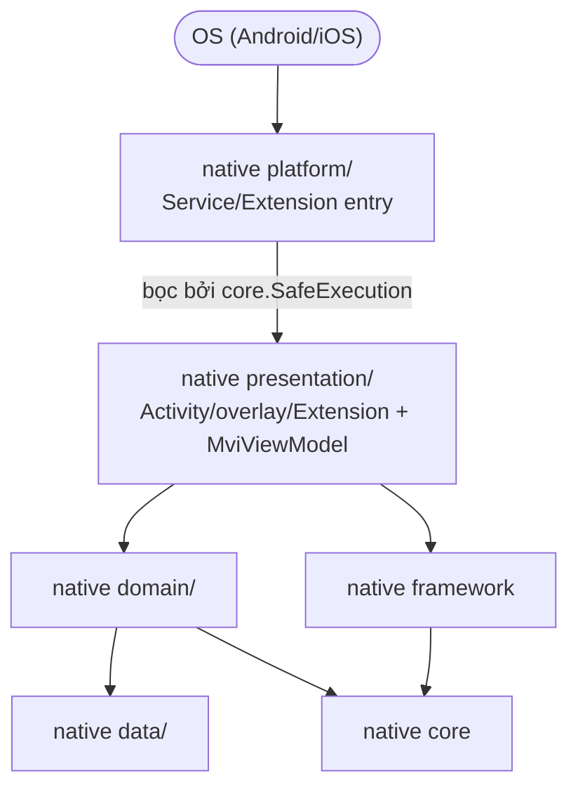
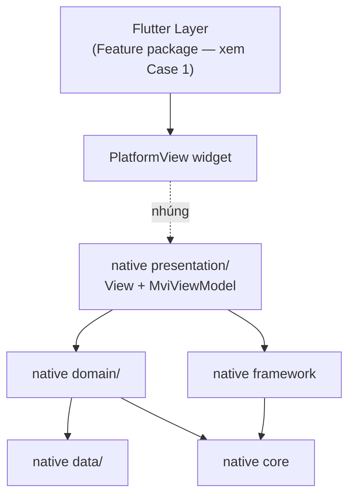

# Epic: Flutter Super App Template — Đặc tả kiến trúc Native

**Trạng thái**: Draft — chờ review
**Tài liệu liên quan**: [2026-08-29-flutter-super-app-template-design.md](2026-08-29-flutter-super-app-template-design.md) (thiết kế đầy đủ, phần cắt gọn Dart/Flutter, kế hoạch task)
**Nguồn tham chiếu**: `android_digital_wallet` (nguồn kiến trúc MVI/buildSrc Android), `vchat_shield` (native code cần *tránh lặp lại*)

## 1. Đặc tả yêu cầu (Goals)

| # | Mục tiêu |
|---|---|
| G1 | Tạo template Flutter clone-và-đổi-tên, giữ nguyên Clean Architecture + MVI + super-app governance hiện có (phần Dart — chi tiết ở design doc liên quan). |
| G2 | Chuẩn hoá code native (Kotlin/Android, Swift/iOS) theo cùng cách: 1 quy ước layer, 1 bộ tooling chất lượng, áp dụng cho mọi module native ngay từ cấu trúc — không dựa vào tự giác từng người. |
| G3 | Plugin package phải trung lập với DI framework (không ép Hilt) để dùng được ở bất kỳ app Flutter nào; Hilt/Compose/SwiftUI/`MviViewModel` chỉ dành cho code thật sự sở hữu 1 màn hình native. |
| G4 | Khiến crash host-app từ code native do OS trigger khó xảy ra bằng cấu trúc (bài học từ `vchat_shield`: logic nghiệp vụ viết thẳng trong `onReceive`/`onScreenCall`/`doWork` làm crash cả tiến trình host). |
| G5 | Hỗ trợ tích hợp thư viện native bên thứ 3 trong tương lai (Go qua gomobile/cgo, vd E2EE) mà không cần bày ra kiến trúc mới. |
| G6 | Thêm code native mới chỉ cần chọn 2 tham số (flag), không cần tự quyết định kiến trúc. |

## 2. Use case thực tế ảnh hưởng tới kiến trúc

Có 2 trục độc lập quyết định hình dạng của bất kỳ module native nào:
- **Trigger** — Dart gọi vào (*passive*), hay OS tự gọi độc lập với Flutter (*os_triggered*, vd
  `BroadcastReceiver`/`Service`/`WorkManager`/`CallDirectoryHandler` — có thể chạy khi tiến trình chưa
  có `FlutterEngine` nào)?
- **UI** — module này có sở hữu màn hình/overlay native không (*has_ui*)?

Go (hay bất kỳ thư viện native bên thứ 3 đã biên dịch) **không phải trục thứ 3** — nó là 1 modifier chèn
vào lớp `data/` (hoặc `platform/` nếu JNI/cgo gọi trực tiếp) của 1 trong 4 tổ hợp trên, kèm 1 quy tắc cố
định: panic của Go phải được recover và convert thành lỗi Kotlin/Swift ngay tại biên giới đó, không bao
giờ để lan lên trên.

Danh sách rút gọn còn các trường hợp thực tế (từ tổ hợp đầy đủ 2×2×Go):

| # | trigger | has_ui | Go | Ví dụ |
|---|---|---|---|---|
| 1 | — | — | — | Feature thuần Dart, không code native (`pac_mvi_feature`) |
| 2 | passive | không | không | `native_security`, `logger_native_bridge` |
| 3 | passive | không | có | E2EE encrypt/decrypt lúc màn hình chat đang mở |
| 4 | os_triggered | không | không | Worker đồng bộ nền (kiểu `ScamDatabaseSyncWorker` của `vchat_shield`) |
| 5 | os_triggered | không | có | Giải mã preview push-notification khi app/Flutter engine chưa chạy |
| 6 | os_triggered | có | không | Overlay/call-screening native độc lập Flutter (kiểu `vchat_shield`) |
| 7 | passive | có | không | UI native nhúng vào cây widget Flutter qua `PlatformView` (chưa có nhu cầu cụ thể, nhưng kiến trúc phải đỡ được) |

`passive+has_ui+Go` và `os_triggered+has_ui+Go` là tổ hợp hợp lệ nhưng chưa có nhu cầu cụ thể — khi phát
sinh chỉ cần ghép hàng 6/7 với modifier Go, không cần thiết kế thêm.

## 3. Lựa chọn solution

**Nền tảng bắt buộc cho mọi module native, bất kể chọn flag nào** — mirror cách Dart đã tách `core`/`framework`:

- **native `core`** (luôn là dependency): `SafeExecution` (bọc exception-handler, không cần
  `ViewModel`/lifecycle — dùng được trong `domain/`, 1 `Service`, 1 `Worker`, hay 1 plugin thường),
  `DataState<T>` (Success/Error), 1 `Logger` contract, quy ước `Container` cho DI thủ công, `ReplayQueue`
  (queue-rồi-replay-lúc-mở-app-lại, tổng quát hoá từ `logger_native_bridge`).
- **native `framework`** (chỉ là dependency khi `has_ui=true`): `MviViewModel`/`MvvmViewModel`/`ViewState`,
  port từ `android_digital_wallet`, build trên `core`. Bản Swift thiết kế mới hoàn toàn (Combine-based
  `ObservableObject`, không có reference iOS sẵn) — xem design doc liên quan mục 3.5.
- **`android/buildSrc`**, port và cắt gọn từ `android_digital_wallet/buildSrc`: 1 convention plugin chất
  lượng (Spotless/ktlint + Detekt, 1 ruleset dùng chung) áp cho **mọi** module native kể cả plugin
  package, và 1 convention plugin Hilt+Compose riêng chỉ áp cho module có `has_ui=true`. Khả thi vì cơ
  chế nạp plugin của Flutter khiến mọi plugin package trở thành subproject của cùng 1 root Gradle build
  với host app lúc build, nên plugin ID trong `buildSrc` của host phân giải được cả bên trong plugin
  package. Tương đương iOS: `.swiftformat`/`.swiftlint.yml` dùng chung.
- **1 brick Mason tham số hoá duy nhất**, `native_package(trigger, has_ui)`, thay vì 3-4 brick bảo trì
  riêng lẻ. `__brick__/` chứa mọi file có thể có; `post_gen.dart` xoá phần flag đã chọn không cần (vd
  `has_ui=false` xoá `presentation/`; `trigger=passive` xoá mẫu `Receiver`/`Service`/`Worker` và wiring
  `ReplayQueue`). 1 nguồn duy nhất tránh được lỗi "4 brick trôi lệch nhau".
- **Tích hợp Go**: không phải flag của brick (quá đặc thù từng thư viện, quá hiếm để đưa vào generation).
  Chuẩn hoá bằng 1 guide ngắn + 1 snippet panic-recovery copy-paste được
  (`docs/architecture/native-go-binding.md`), gắn thủ công vào `data/` của package đã sinh.

## 4. Cách áp dụng vào thực tế

| Tình huống | Làm gì |
|---|---|
| **Feature thuần Flutter** | `mason make pac_mvi_feature`. Không đụng `android/`/`ios/`. |
| **Code native, không UI** | `mason make native_package` với `has_ui=false`, chọn `trigger`. Có `platform/domain/data`, chỉ phụ thuộc `core` native, DI thủ công qua `Container`. |
| **Code native, có UI** | Cùng brick, `has_ui=true`. Thêm `presentation/` (View + `MviViewModel`), kéo theo `framework`→`core`, áp convention Hilt/Compose. `trigger=passive` nhúng view vào cây Flutter qua `PlatformView`; `trigger=os_triggered` có `Activity`/overlay `Window`/App Extension riêng, độc lập mọi `FlutterEngine`. |
| **OS-triggered (có UI hay không)** | `trigger=os_triggered`. Entry-point sinh ra (`onReceive`/`onScreenCall`/`doWork`) đã được bọc sẵn `core.SafeExecution` — bắt buộc, không tuỳ chọn. Sau đó chọn cách (nếu có) nói chuyện với Dart: (a) không bao giờ — thuần native, tự lưu trữ; (b) queue kết quả qua `core.ReplayQueue`, 1 initializer Dart đọc ra lúc app mở lại (kiểu `logger_native_bridge`); (c) tự khởi `FlutterEngine` headless để chạy callback Dart thật (kiểu package `workmanager`) — chỉ khi việc dùng lại logic Dart đáng để thêm cơ chế này. |
| **Cần binding Go** | Bất kỳ tình huống nào ở trên, cộng thêm làm theo `docs/architecture/native-go-binding.md` trong `data/`. Nếu `trigger=os_triggered`, gọi thẳng Go từ Kotlin/Swift — không đi vòng qua headless engine chỉ để chạm tới Go. |

### 4.1 Package đã có, lúc đầu không UI, sau này cần thêm UI

Không sinh lại brick từ đầu (sẽ đè mất `platform/domain/data` đã viết). Tách làm 2 phần, **không** gộp
chung 1 brick — chỉ công cụ hoá phần có ý nghĩa kiến trúc, phần còn lại để checklist thủ công vì mỗi
package có thể cần biến thể khác nhau, brick hoá sẽ cứng nhắc không đáng:

- **Tool** — `scripts/native_add_ui_dependency.sh <pkg> <android|ios>`: chỉ làm đúng 1 việc — thêm
  dependency `framework` (kéo theo `core`) + áp convention plugin Hilt+Compose (`commons.android-feature`)
  vào `build.gradle`/podspec của package đã chọn, và thêm 1 Hilt `@Module`/`@Provides` mỏng bắc cầu các
  instance `Container` thủ công đang có sang graph Hilt. Đây là bước dễ sai/dễ quên nhất (thiếu convention
  → lỗi biên dịch khó hiểu; bắc cầu sai → duplicate instance), nên đáng để công cụ hoá.
- **Checklist thủ công** (tài liệu, không sinh code):
  1. Tạo `presentation/` (View + ViewModel kế thừa `MviViewModel`), theo mẫu 1 package có UI khác.
  2. `trigger=passive`: đăng ký `PlatformViewFactory` trong `*Plugin.kt`/`.swift` sẵn có + thêm widget
     `AndroidView`/`UiKitView` phía Dart.
  3. `trigger=os_triggered`: khai `Activity`/overlay `Window` trong `AndroidManifest.xml`; nếu cần App
     Extension mới bên iOS thì làm thủ công trong Xcode (không tự sinh được từ template text).

`core.SafeExecution`/`ReplayQueue` (nếu `os_triggered`) giữ nguyên không đổi — crash-boundary và chiến
lược nói-chuyện-với-Dart đã chọn lúc tạo package vẫn còn hiệu lực; thêm UI là việc cộng thêm, không phải
viết lại tầng trigger.

## 5. Sơ đồ theo từng use case

Mỗi use case 1 sơ đồ riêng (không gộp chung) — chỉ vẽ đúng component tham gia luồng đó.

**Case 1 — Thuần Dart, không native**

**Case 2/3 — Ô1: passive, không UI (± Go)**

*(Nội bộ Dart đã vẽ đủ ở Case 1 nên gộp chung thành "Flutter Layer" — dù Feature package hay `network` gọi
vào Plugin Dart facade thì không ảnh hưởng gì tới nửa native của use case này.)*

**Case 4/5 — Ô3: OS-triggered, không UI (± Go)**

**Case 6 — Ô4: OS-triggered, có UI**

**Case 7 — Ô2: passive, có UI**

Điểm chung ở mọi sơ đồ: mũi tên đặc luôn đi 1 chiều từ trên xuống, về phía `core`/`native core` — không có
chiều ngược. Đường nét đứt là ranh giới runtime (channel, PlatformView, ReplayQueue), không phải dependency
lúc build.
