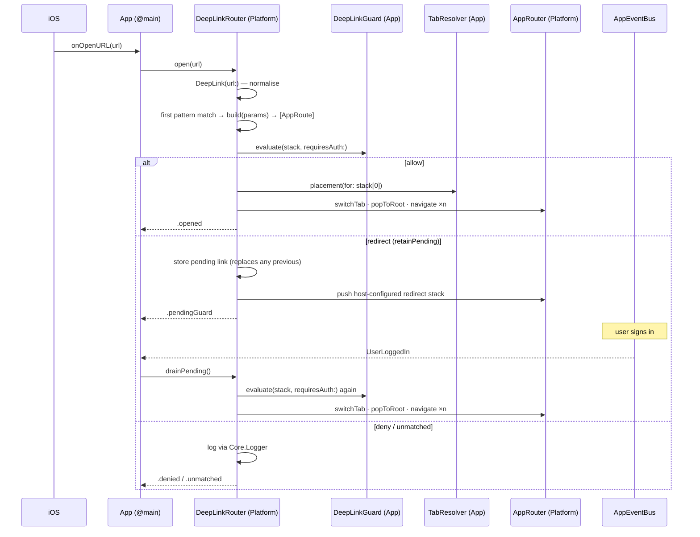

# Design Specification: iOS DeepLink Router Engine

- **Date:** 2026-09-10
- **Status:** Approved (design) — pending epic breakdown
- **Epic name:** `ios_deeplink_router`
- **Scope:** `Packages/Platform` (new DeepLink subsystem + `AnyAppRoute`), `Packages/Shell`
  (destination collapse), `App` (composition, `onOpenURL`, guard, tab resolver),
  `Features/*` (deep-link declarations), `ArchTests` (rule **K10**), Mason
  `ios_mvi_feature` brick, `scripts/rename_project.sh`, CI, docs
- **Precedent:** `super_app_governance` 4 pillars / 8 criteria;
  `.devtool/epic/ios_super_app_template/2026-09-02-ios-super-app-template-design.md` §6.1
  (deep link explicitly deferred); `docs/architecture/ARCHITECTURE.md` §VII (known gap)

---

## 1. Problem Statement & Motivation

### 1.1 The governance criteria, restated for native iOS

The Super App governance framework was authored in platform-agnostic /
Android-leaning language and later restated for Flutter. Two of its eight
criteria name mechanisms that do not exist outside Android. This section states
what each criterion means **on native iOS with a Tuist + local-SPM graph**, so
compliance can be judged against something the platform can actually deliver.

| # | Criterion (iOS wording) | Adjustment from the original |
|---|---|---|
| 1.1 | Host app is a pure container: Auth, Network interface, Local Storage only | none — already platform-agnostic |
| 1.2 | A Mini App is an **independent local SPM package** (own manifest, own tests, own build), compiled into one binary at build time | **adjusted.** iOS has no App Store-acceptable runtime code download either — `dlopen` of downloaded code is rejected, On-Demand Resources carry assets only, and App Clips are a separate product, not a module of this app. iOS therefore lands in the same place as Flutter, not Android's real Dynamic Feature Modules. The achievable equivalent is compile-time modularity with compiler-enforced boundaries |
| 2.1 | Central Router addressed by URL scheme / deep link; features never import each other | none — achievable verbatim (this spec) |
| 2.2 | Stateless Event Bridge between Host and Mini Apps | none — achievable verbatim |
| 3.1 | Local state encapsulation via isolated MVI view models | none — `MviViewModel` is the native equivalent of BLoC here |
| 3.2 | Layered DI; Host exposes interfaces, hides implementations | **adjusted.** Dagger/Hilt has no Swift binding. The equivalent this project already uses is `Factory` (service-locator container + property-wrapper resolution), the Swift analogue of `get_it` + `injectable` |
| 4.1 | Sandbox development: a feature builds and tests standalone | none |
| 4.2 | Internal API contract; CI blocks a merge that breaks it | none |

### 1.2 Compliance scorecard (as of 2026-09-10, commit `cbe833a`)

| # | Status | Evidence |
|---|---|---|
| **1.1** | **Met** | `App/Sources/Composition/AppComposition.swift` wires DI, `RouteProvider` registration and lifecycle only. `SessionManager` + `KeychainCacheStore` (auth), `APIClient` (network), `UserDefaultsCacheStore` (local storage) are all host-built. ArchTests **K6** proves `App` is the sole multi-feature aggregator |
| **1.2** | **Met** | Every feature is its own `Package.swift`; `swift build/test --package-path Features/X` works standalone; the SPM graph, **K1** and `scripts/check_module_boundaries.sh` make a feature→feature import impossible |
| **2.1** | **Half met** | A central router exists (`AppRouter` + `RouteProvider` chain + one `NavigationPath` per tab) and features are blind to each other (**K1**/**K9**). The URL-scheme / deep-link half is **entirely absent** — see §1.3 |
| **2.2** | **Half met** | `AppEventBus` is a typed, replay-0 broadcast channel — the outbound half only. The Source Spec §8 explicitly rules out a request/response channel between features, substituting Dependency Inversion through `Core` protocols. The criterion's "Host processes and **returns a result**" half is unimplemented by decision |
| **3.1** | **Met** | One `MviViewModel` per feature, no global state store; `ShellViewModel` obeys the same discipline; superseded async effects are cancelled through `launch(key:)` |
| **3.2** | **Mostly met** | Host registers implementations (`Container.shared.registerSettingsRepository(…)`), `Data` types are `internal` (**K4**), `Domain` protocols are public — Dependency Inversion holds. But the container is **flat**, not layered, and three process-wide mutable singletons exist (`AppThemeManager.shared`, `AppLocalizationManager.shared`, `AppEventBus.shared`) |
| **4.1** | **Half met** | Standalone build/test per package works and CI exercises it. There is **no standalone runnable UI** per feature — the same gap recorded as Android G9 / Flutter 4.1 |
| **4.2** | **Met at compile time, with a hole** | One build graph means a `Platform` breaking change fails compilation of every dependent; K1–K9 plus the boundary script run on every PR. **Hole:** `.github/workflows/ci.yml` falls back from `xcodebuild test` to `xcodebuild build` on *any* failure. `App/Tests/AppTests` now exists, so a failing app test still produces a green CI run |

**Totals: 3 met / 5 partial / 0 unmet.** Decomposition (pillar 1) and state
isolation (3.1) are solid. The weakness is concentrated in **2.1**, which is what
this epic addresses.

### 1.3 Why deep linking cannot be bolted on today — six blockers

| ID | Blocker | Detail |
|---|---|---|
| **D1** | No entry surface | `App/Resources/Info.plist` declares no `CFBundleURLTypes` and no associated domains; no `onOpenURL` / `scene(_:openURLContexts:)` anywhere. A repo-wide grep for deep-link identifiers returns zero hits |
| **D2** | `AppRoute` has no string representation | `public protocol AppRoute: Hashable {}` — no path, no parameters. All three shipped routes are empty structs, so there is nothing for a URL to map onto |
| **D3** | `Shell` hard-codes concrete route types | `Packages/Shell/Sources/Shell/ShellView.swift` declares exactly two destinations — `.navigationDestination(for: AppRoutes.SettingsRoot.self)` and `…ScannerRoot.self`. Any route outside that list — including every feature-private child screen a deep link needs to reach — resolves to nothing and renders blank. Adding one means editing `Shell`, which breaks feature-blindness at scale and violates the rule that scaffolding a feature never touches another module |
| **D4** | No tab affinity | `navigate(to:inTab:)` requires the caller to supply an `Int`. A deep-link handler has no way to know which tab a route belongs to, and a feature must not know its own tab index |
| **D5** | No pending queue or gating | A link arriving before the graph is ready, or targeting a screen that needs a session, is simply lost. `AppEventBus` is replay-0 and cannot serve as the buffer |
| **D6** | Cannot build a multi-level stack | Reaching a child screen requires pushing parent then child; the router only appends a single route |

A seventh observation frames the risk: **no feature currently calls
`navigate(to:)` at all** — zero call sites. Cross-feature navigation exists as an
API surface that has never executed in production code.

---

## 2. Goals & Non-Goals

### Goals

1. Move criterion **2.1** from *half met* to *met*: a Central Router addressable
   by URL, with features still blind to one another.
2. Feature-owned URL contracts — a feature declares its own patterns, testable by
   `swift test --package-path Features/X` with no app and no Tuist (reinforces
   4.1 and 1.2).
3. Centralised resolution and audit — `Platform` aggregates every declaration
   into one table; **ArchTests K10** enforces uniqueness and coverage.
4. Make `Shell` genuinely feature-blind by removing per-type
   `.navigationDestination` (fixes **D3** and the blank-screen defect).
5. Close the CI hole in 4.2 so the new Tier C tests cannot be silently swallowed.

### Non-Goals

- **Universal Links turned on for real.** Requires a live domain, an
  `apple-app-site-association` file and an Apple Developer team; a domain-neutral
  template cannot ship those. The seam and the documentation ship; the
  entitlement does not.
- **State restoration** (serialising `NavigationPath` across launches) — remains
  the separate known gap in `ARCHITECTURE.md` §VII.
- **Event Bridge request/response** (criterion 2.2) — its own epic.
- **DI re-layering / removing the global singletons** (criterion 3.2) — its own epic.
- **Standalone runnable UI per feature** (criterion 4.1) — its own epic.
- Push-notification payload parsing and QR parsing. Both become one-line
  adapters over the internal API (`deepLinkRouter.open(url:)`) and are documented
  as such, but neither is wired in this epic.

---

## 3. Architecture Constraints (Invariants)

| # | Invariant | Enforced by |
|---|---|---|
| **R1** | `Platform` never learns the concepts "authentication", "tab index", or any feature name | Code review + the two seam protocols in §4.5; `Platform`'s manifest already forbids the imports |
| **R2** | A feature owns its own URL contract and can test it with no app present | `RouteProvider.deepLinks` lives in the feature package; Tier A tests per feature |
| **R3** | Adding a route never requires editing `Shell`: no per-route `.navigationDestination`, and no route type named anywhere in `Shell` except its fixed tab-root builders | ArchTests **K6** (existing) + the single erased destination in §4.7 |
| **R4** | `App` remains the only module that knows more than one feature | ArchTests **K6** (existing) |
| **R5** | Adding a feature via Mason touches no other feature's files | Brick change in §8; marker regions unchanged |
| **R6** | No new external dependency | `Package.swift` review |
| **R7** | Every pre-existing test keeps passing, or is updated in the same task that breaks it, RED first | Testing standard §10 |

---

## 4. Component Design

All new types live in `Packages/Platform/Sources/Platform/Navigation/DeepLink/`
unless stated otherwise.

### 4.1 `DeepLink` — the normalised URL

```swift
public struct DeepLink: Equatable, Sendable {
    public let url: URL
    public let path: [String]          // normalised segments, empties removed
    public let query: [String: String]

    public init?(url: URL)             // nil when the URL cannot be normalised
}
```

Normalisation rules — each one is a named Tier A scenario because this is where
deep-link bugs classically live:

| Input shape | Rule |
|---|---|
| Custom scheme, `app://settings/language` | `URLComponents.host` is `"settings"` and the path is `/language`. The **host is prepended as the first segment** → `["settings", "language"]` |
| Universal Link, `https://example.com/settings/language` | scheme is `http`/`https` → the **host is discarded** → `["settings", "language"]` |
| Trailing / doubled slashes, `app://settings//language/` | empty segments removed |
| Case | literal segments are compared case-insensitively (both sides lowercased); parameter **values** keep their original case |
| Percent-encoding | `URLComponents.path` and `queryItems` are used, so values arrive decoded |
| Duplicate query keys | **last one wins** (`merging { _, new in new }`) — never a trap |
| Query item with no value (`?flag`) | maps to `""` |
| `init?` returns `nil` | when `URLComponents(url:resolvingAgainstBaseURL: false)` fails |

An empty normalised path (`app://`) is legal and matches the pattern `"/"`.

### 4.2 `DeepLinkPattern` / `DeepLinkParams`

```swift
public struct DeepLinkPattern: Hashable, Sendable {
    public enum Segment: Hashable, Sendable {
        case literal(String)
        case parameter(String)
    }
    public let segments: [Segment]

    public init(_ pattern: String)                       // "/settings", "/tx/:id"
    public func match(_ link: DeepLink) -> DeepLinkParams?
}

public struct DeepLinkParams: Equatable, Sendable {
    public subscript(_ key: String) -> String? { get }
}
```

- A leading `/` is optional and stripped.
- A segment beginning with `:` is a parameter; everything else is a literal.
- Matching requires an **exact segment count**. No wildcards, no globbing, no
  optional segments (YAGNI — add them when a real link needs them).
- `DeepLinkParams` merges path parameters and query items. **Path parameters
  win** on a name collision.

### 4.3 `DeepLinkRoute` — the unit a feature declares

```swift
public struct DeepLinkRoute {
    public let pattern: DeepLinkPattern
    public let requiresAuth: Bool
    public let build: @MainActor (DeepLinkParams) -> [any AppRoute]

    public init(
        _ pattern: String,
        requiresAuth: Bool = false,
        build: @escaping @MainActor (DeepLinkParams) -> [any AppRoute]
    )
}
```

`build` returns an **array** — the parent-to-child stack — which is what solves
**D6**. The closure is `@MainActor`, not `@Sendable`: this mirrors the existing
`makeViewModel: @MainActor () -> ViewModel` convention in every shipped
`RouteProvider`, and it means **`protocol AppRoute` does not have to gain a
`Sendable` conformance**. `DeepLinkRoute` is deliberately not `Sendable`; the
table is built and read exclusively on the main actor.

### 4.4 `RouteProvider` gains one requirement with a default

```swift
public protocol RouteProvider {
    func canHandle(_ route: any AppRoute) -> Bool
    @ViewBuilder func destination(for route: any AppRoute) -> AnyView
    @MainActor var deepLinks: [DeepLinkRoute] { get }
}

public extension RouteProvider {
    @MainActor var deepLinks: [DeepLinkRoute] { [] }
}
```

The default keeps all three shipped providers compiling untouched. **K10.2** is
what actually forces cross-feature routes to declare a pattern.

### 4.5 The two seams that keep `Platform` ignorant (R1)

```swift
@MainActor
public protocol DeepLinkGuard {
    func evaluate(_ stack: [any AppRoute], requiresAuth: Bool) -> GuardDecision
}

public enum GuardDecision {
    case allow
    case redirect(to: [any AppRoute], retainPending: Bool)
    case deny
}

public struct TabPlacement: Equatable, Sendable {
    public let tab: Int
    public let isTabRoot: Bool
    public init(tab: Int, isTabRoot: Bool)
}

@MainActor
public protocol TabResolver {
    /// `nil` ⇒ no opinion; the router uses the currently selected tab.
    func placement(for route: any AppRoute) -> TabPlacement?
}
```

`isTabRoot` exists because `ShellView` renders tab 1's root as
`router.destination(for: AppRoutes.ScannerRoot())` and tab 2's as
`AppRoutes.SettingsRoot()`. **These three tab-root builders are the one place
`Shell` still names a route type, and they stay** — they are a bounded,
compile-time mapping of three tabs that does not grow when routes are added,
which is what **R3** actually requires. Moving them into `ShellConfig` so `App`
supplies them (which would also let `ShellTabResolver` be derived rather than
restated — see §4.8) is a genuine improvement and a candidate follow-up epic; it
is deliberately out of scope here. Without it, opening `/settings` would `popToRoot`
(already showing Settings) and then push `SettingsRoot` again, displaying the
screen twice. When the resolved stack's **first** element is that tab's root, the
router drops it and pushes only the remainder.

`DeepLinkGuard.evaluate` is **synchronous**. This is possible because
`Core.SessionManaging.accessToken` is a synchronous, `NSLock`-guarded read; the
host's guard needs no `await`, so `open(_:)` stays synchronous and testable
without expectations.

### 4.6 `DeepLinkRouter` — the engine

```swift
@MainActor
public final class DeepLinkRouter {
    public init(
        router: AppRouter,
        guard: (any DeepLinkGuard)? = nil,
        tabResolver: (any TabResolver)? = nil,
        logger: (any Core.Logger)? = nil
    )

    /// Loads `provider.deepLinks` into the resolution table, in registration order.
    public func register(_ provider: any RouteProvider)

    @discardableResult
    public func open(_ url: URL) -> DeepLinkOutcome

    /// Re-attempts the single stored pending link. Called by the host when the
    /// guard's answer may have changed (e.g. on `UserLoggedIn`).
    public func drainPending()
}

public enum DeepLinkOutcome: Equatable {
    case opened
    case pendingGuard
    case denied
    case unmatched
}
```

**Resolution order** is registration order, first match wins — the same
chain-of-responsibility contract `AppRouter.destination(for:)` already uses. K10.1
makes ordering irrelevant by forbidding duplicate patterns; the rule is stated
anyway so behaviour is defined if the rule is ever baselined.

**Pending storage** holds exactly **one** link, not a queue: the semantics of a
deep link are "go here now", so a newer link supersedes an older one. There is no
TTL (YAGNI). The pending link is cleared when it is successfully opened, denied,
or replaced.

**Redirect re-entrancy guard.** A guard that returns `.redirect` for the
redirect target itself would loop forever. The router therefore evaluates a
redirect target **once**; if that evaluation is not `.allow`, the outcome is
`.denied` and the event is logged. The invariant "a redirect target must be
reachable without auth" is documented for guard authors.

**Navigation algorithm for `.allow`:**

```swift
var stack = resolvedStack
let placement = tabResolver?.placement(for: stack[0])
let tab = placement?.tab ?? router.selectedTab
if placement?.isTabRoot == true { stack.removeFirst() }

router.switchTab(tab)
router.popToRoot(inTab: tab)
for route in stack { router.navigate(to: route, inTab: tab) }
```

### 4.7 `AnyAppRoute` and the `Shell` destination collapse (fixes D3)

This is the one structurally breaking change in the epic.

`SwiftUI.navigationDestination(for:)` matches on the **concrete** type of the
value in the `NavigationPath`. That is why `ShellView` must enumerate types
today, why any route outside those two renders blank, and why an arbitrary
deep-link target cannot be reached.

```swift
// Packages/Platform/Sources/Platform/Navigation/AnyAppRoute.swift
public struct AnyAppRoute: Hashable {
    public let wrapped: any AppRoute

    public init(_ route: any AppRoute) { wrapped = route }

    public static func == (lhs: Self, rhs: Self) -> Bool {
        AnyHashable(lhs.wrapped) == AnyHashable(rhs.wrapped)
    }

    public func hash(into hasher: inout Hasher) {
        AnyHashable(wrapped).hash(into: &hasher)
    }
}
```

`AppRouter.navigate(to:inTab:)` boxes before appending:
`tabPaths[index].append(AnyAppRoute(route))`.

`ShellView.tabStack` then collapses N destinations into one:

```swift
NavigationStack(path: pathBinding(for: index)) {
    root()
        .navigationDestination(for: AnyAppRoute.self) { boxed in
            router.destination(for: boxed.wrapped)
        }
}
```

After this, adding any route — cross-feature or feature-private — requires no
edit to `Shell` (R3, R5).

*Fallback if `AnyHashable(any AppRoute)` does not compile under Swift 6 strict
concurrency:* store `AnyHashable` in the path directly and recover the route via
`base as? any AppRoute`. Behaviourally identical; decided in the first task by
compiling, not by argument.

### 4.8 Host wiring (`App/`)

New `App/Sources/Composition/DeepLinkComposition.swift`:

- Builds the `DeepLinkRouter` over the existing `AppRouter`.
- Installs `SessionDeepLinkGuard(session:redirectTo:)` — reads
  `SessionManaging.accessToken`; returns `.allow` when `requiresAuth` is `false`
  or a token exists. Otherwise it returns
  `.redirect(to: redirectTo, retainPending: true)` when a redirect stack was
  configured, and `.deny` when it was not. **The template passes an empty
  `redirectTo`**: it ships no authentication feature (`Features/` holds only
  `Scanner` and `Settings`), and inventing one would violate the standing rule
  that the template carries no product domain. A consuming project supplies its
  own login route in one line. This is the same wired-but-unexercised posture
  `AppComposition` already documents for `sessionManager` and `apiClient`.
- Installs `ShellTabResolver` — the only place the shell's tab layout is
  restated: `ScannerRoot → TabPlacement(tab: 1, isTabRoot: true)`,
  `SettingsRoot → TabPlacement(tab: 2, isTabRoot: true)`, everything else `nil`.
- Registers every `RouteProvider` on the deep-link router inside the existing
  `// app:route-providers:begin/end` marker region loop.
- Subscribes to `UserLoggedIn` on the `AppEventBus` and calls `drainPending()`.

`iOSDigitalWalletApp.swift` gains one modifier:

```swift
RootView(composition: composition)
    .onOpenURL { composition.deepLinkRouter.open($0) }
    .onChange(of: scenePhase) { … }   // unchanged
```

The router does **not** validate scheme or host: iOS only delivers URLs for
schemes and associated domains the app has registered, so a second check would be
redundant and would break Universal Links for consumers who enable them.

### 4.9 `UserLoggedIn` — completing the replay loop

`Platform/Events/AppEvent.swift` gains:

```swift
public struct UserLoggedIn: AppEvent, Equatable {
    public init() {}
}
```

This is the symmetric counterpart of the existing `UserLoggedOut` (published by
the host when `Network` surfaces a 401 through `Core.AuthEventSink`), and it is
exactly the shape criterion 2.2 describes: the Mini App emits an event, the Host
reacts.

The host subscribes to it and calls `drainPending()`. **No shipped feature
publishes it** — the template has no authentication feature and will not grow one
here. `UserLoggedIn` is infrastructure with a documented publisher contract, in
the same category as `sessionManager` and `apiClient`, which `AppComposition`
already builds for a feature that does not yet exist. `DEEPLINK.md` states the
one-line obligation: publish `UserLoggedIn` when your sign-in succeeds, and the
pending deep link replays itself.

### 4.10 The URL scheme, and keeping `rename_project.sh` honest

`App/Resources/Info.plist` gains:

```xml
<key>CFBundleURLTypes</key>
<array>
  <dict>
    <key>CFBundleURLName</key>    <string>$(PRODUCT_BUNDLE_IDENTIFIER)</string>
    <key>CFBundleURLSchemes</key> <array><string>$(DEEPLINK_SCHEME)</string></array>
  </dict>
</array>
```

`DEEPLINK_SCHEME` is declared once, as a base build setting on the app target in
`Tuist/ProjectDescriptionHelpers/Module.swift` — the file the project rules
already designate as the single home for such values. Default:
`iosdigitalwallet`.

`scripts/rename_project.sh` gains a lowercase-scheme substitution
(`iosdigitalwallet` → `lowercased(NewAppName)`) editing `Module.swift` and the
docs, and must stay idempotent. The existing name/bundle substitutions do not
cover it because the scheme is lowercase and would not match `iOSDigitalWallet`.

**Associated domains stay out.** `DEEPLINK.md` documents the three steps a
consuming project takes to enable Universal Links (entitlement, AASA file,
`onContinueUserActivity` forwarding into the same `open(_:)`), and the design
requires no code change to support them.

### 4.11 Template deep-link map

`Features/` holds exactly two packages — `Scanner` (stub) and `Settings` (the
real reference feature). The map is drawn from those and nothing else.

| Pattern | Stack | `requiresAuth` | Demonstrates |
|---|---|---|---|
| `/settings` | `[SettingsRoot]` | `false` | tab switch onto a tab root — first element dropped, no duplicated screen |
| `/scanner` | `[ScannerRoot]` | `false` | the second tab root |
| `/scanner/result/:code` | `[ScannerRoot, ScannerResultRoute(code:)]` | `false` | multi-level stack construction **and** a path parameter |

`ScannerResultRoute` + `ScannerResultView` are new and are scaffolded with the
existing brick — `mason make ios_mvi_subfeature --feature Scanner --name Result` —
which doubles as a regression check that the brick still produces working output.
A scanner showing the payload it just scanned is generic enough to keep the
template domain-neutral. This route is also the concrete proof of **D3**: today it
cannot be reached at all, because `ShellView` has no destination for it.

**No shipped route sets `requiresAuth: true`.** The template has no
authentication feature, so gating a link would either deny the template's own
demo link on a fresh clone or require inventing product domain. The flag's
behaviour — redirect, pending storage, replay, deny — is covered instead by Tier
A with a fake guard and Tier C with a test-injected guard, and `DEEPLINK.md`
carries the consumer-side pattern.

`DEEPLINK.md` also records one asymmetry consumers must decide for themselves:
the guard runs on deep-link entry only. Tapping a tab is never gated; that seam
is `ShellViewModel`, not this subsystem.

---

## 5. Data Flow



---

## 6. Error Handling

Governing principle: **junk URLs from outside the app are ordinary input.**
Nothing crashes, nothing shows an alert, and the app never changes state on a
failed link. Every failure is logged through `Core.Logger` and reported through
the return value, so the host — not `Platform` — decides whether to react.

| Condition | Outcome | Side effect |
|---|---|---|
| `DeepLink(url:)` returns `nil` | `.unmatched` | log |
| No pattern matches | `.unmatched` | log |
| `build` returns an empty array | `.unmatched` | log |
| Guard returns `.deny` | `.denied` | log; pending cleared |
| Guard returns `.redirect` | `.pendingGuard` | pending stored if `retainPending`; redirect stack pushed |
| Redirect target itself not `.allow` | `.denied` | log; pending cleared (re-entrancy guard) |
| `tabResolver` returns `nil` | proceeds | uses `router.selectedTab` |
| `placement.tab` out of range | falls back to `router.selectedTab` | `AppRouter` silently no-ops on a bad index, so proceeding with it would navigate nowhere while still returning `.opened` — a false success the host cannot diagnose. Falling back keeps `.opened` honest; the bad placement is logged |
| `drainPending()` with nothing stored | no-op | none |

There is **no fallback to Home** on an unmatched link. Losing the user's current
screen because a malformed link arrived is worse than ignoring the link.

---

## 7. Governance — ArchTests **K10**

New `ArchTests/Tests/ArchTests/DeepLinkRulesTests.swift`, using the existing
`SyntaxScanner` (swift-syntax AST, not regex) and honouring `baseline.txt`.

| Rule | Assertion | Rationale |
|---|---|---|
| **K10.1** | No two `DeepLinkRoute` declarations across the repo share a pattern string | A duplicate makes resolution order-dependent and silently shadows a feature |
| **K10.2** | Every route type declared in `Platform/Navigation/AppRoutes.swift` appears in at least one `DeepLinkRoute.build` body | A route promoted for cross-feature use is, by definition, an entry point; entry points must be addressable |
| **K10.3** | Pattern segments are well-formed: literal `^[a-z0-9-]+$`, parameter `^:[a-z][a-zA-Z0-9]*$` | URL paths are lowercase-kebab by web convention; parameter names are `camelCase` to match the repo's key convention |

K10.2 is the strict one and is intentional: this repo's stated philosophy is
*enforce structurally, do not rely on discipline*. A cross-feature route that
cannot be deep-linked is a router entry that only compiled code can reach — the
precise asymmetry criterion 2.1 exists to prevent. The escape hatch, if a real
case ever needs it, is the existing `baseline.txt` ledger.

---

## 8. Mason Brick Changes

`bricks/ios_mvi_feature/__brick__/…/{{name.pascalCase()}}RouteProvider.swift`
gains a generated `deepLinks` property:

```swift
public var deepLinks: [DeepLinkRoute] {
    [DeepLinkRoute("/{{name.snakeCase()}}") { _ in [{{name.pascalCase()}}Root()] }]
}
```

The generated feature therefore satisfies K10 the moment it is scaffolded, and
the brick's printed checklist gains one line: *"register the provider on
`deepLinkRouter` (automatic inside the marker region) and add a
`TabPlacement` if the feature owns a tab."* No other feature's files are touched
(R5). `ios_remove_feature` needs no change — it removes the whole package.

---

## 9. CI Hardening (closes the 4.2 hole)

`.github/workflows/ci.yml`, job `app`: delete the
`xcodebuild test → xcodebuild build` fallback. The fallback was written in Phase 0
when no test target existed; `App/Tests/AppTests` has existed since Task 12, so
today the fallback converts a red test into a green run. `xcodebuild test` becomes
the sole command and its failure fails the job.

This is scoped into this epic rather than deferred because the Tier C acceptance
tests in §10 are otherwise unenforceable.

---

## 10. Testing & Acceptance Standard

Graded against the repo's three-tier standard (`ARCHITECTURE.md` §VI, Source Spec
§9A). Tier A is RED-before-GREEN with boundary-value and equivalence-partition
scenarios.

### Tier A — `Packages/Platform/Tests/PlatformTests`

| Suite | Scenarios |
|---|---|
| `DeepLinkTests` | custom scheme host-as-segment · https host discarded · trailing slash · doubled slash · empty path (`app://`) · percent-encoded segment · percent-encoded query value · duplicate query key (last wins) · valueless query item → `""` · unicode segment · malformed URL → `nil` |
| `DeepLinkPatternTests` | literal match · parameter capture · leading slash optional · segment count too few · too many · case-insensitive literal · parameter value case preserved · path parameter beats query parameter of the same name · root pattern `"/"` |
| `DeepLinkRouterTests` | first-match-wins · unmatched → `.unmatched` · empty build → `.unmatched` · guard `.allow` → correct tab, `popToRoot`, push order · `isTabRoot` drops the first element · `placement` `nil` → current tab · guard `.redirect` stores pending and pushes redirect · `drainPending` replays to the right stack · a second link replaces the pending one · `drainPending` with empty store is a no-op · redirect target that is not `.allow` → `.denied` (no loop) · `.deny` clears pending |
| `AnyAppRouteTests` | two distinct types with identical stored values are **not** equal · same type, same value → equal and equal hashes · round-trips `wrapped` |

### Tier A — per feature (`Features/*/Tests`)

Each feature asserts its own `deepLinks`: pattern matches the expected URLs, the
built stack has the expected shape and order, `requiresAuth` is as declared. These
run under `swift test --package-path Features/X` with no app and no Tuist, which
is the criterion-4.1 property this epic must not regress.

### Tier B — tooling

- `ArchTests` K10.1 / K10.2 / K10.3, each RED-first by injecting a violation into
  a fixture, then GREEN.
- `rename_project.sh`: a verification-scenario table covering scheme rewrite,
  idempotent re-run, and rejection of an invalid app name.

### Tier C — `App/Tests/AppTests/DeepLinkFlowTests`

Executed through a real `AppComposition` on a simulator:

1. `app://settings` → tab 2 selected, path depth 0 (tab root not duplicated).
2. `app://scanner/result/ABC123` → tab 1 selected, path depth 1 (root dropped),
   the result screen rendered with `ABC123`.
3. With a guard injected by the test that denies without a session and redirects
   to `[SettingsRoot]`: `app://scanner/result/ABC123` → `.pendingGuard`, tab 2
   shown.
4. …then publish `UserLoggedIn` → `drainPending()` → tab 1, result screen for
   `ABC123`, pending store empty.
5. `app://nope` → `.unmatched`, router state byte-for-byte unchanged.
6. Regression for the D3 defect: `router.navigate(to: ScannerResultRoute(code:))`
   renders the result screen rather than blank — the case that is impossible
   before this epic.

### Existing tests that must be updated in the same task that breaks them (R7)

`Packages/Platform/Tests/PlatformTests/AppRouterTests.swift`,
`Packages/Shell/Tests/ShellTests/FeatureBlindRenderTests.swift`,
`App/Tests/AppTests/NavigationFlowTests.swift` — all observe `NavigationPath`
contents or destination wiring and are affected by the `AnyAppRoute` boxing.

---

## 11. Documentation Deliverables

- **New** `docs/architecture/DEEPLINK.md` — the URL grammar, how a feature
  declares `deepLinks`, guard and tab-resolver contracts, the pending/replay
  rule, the tab-gating asymmetry, K10, and the three steps to enable Universal
  Links.
- `docs/architecture/ARCHITECTURE.md` — remove the "Deep-link / state
  restoration" gap row (§VII), keeping state restoration as its own row; add K10
  to the governance table; document `AnyAppRoute` in the navigation section.
- `README.md` — one line under "Add a feature" about the generated `deepLinks`.
- `AGENTS.md` / `PROJECT_RULES.md` — one rule: a cross-feature route must declare
  a deep-link pattern.

---

## 12. Assumptions · Risks · Dependencies

### Assumptions

- `AppComposition` is constructed in `@main`'s `init()`, so every `RouteProvider`
  is registered before SwiftUI can deliver an `onOpenURL`. The pending store is
  therefore a guard-state mechanism, not a cold-start race fix.
- `SessionManaging.accessToken` remains synchronous. If it ever becomes `async`,
  `DeepLinkGuard.evaluate` and `open(_:)` must go `async` with it.
- iOS 16 is the floor; `NavigationStack` + `navigationDestination` are available.

### Risks

| # | Risk | Severity | Mitigation |
|---|---|---|---|
| 1 | `AnyAppRoute` changes the element type inside `NavigationPath`, breaking three existing test suites | Medium | Isolated first task, RED-first, all three suites updated together |
| 2 | `AnyHashable(any AppRoute)` relies on implicit existential opening under Swift 6 strict concurrency | Low | Settled by compiling in task 1; documented fallback in §4.7 |
| 3 | The guard's redirect + replay path is never exercised by shipped feature code, only by tests | Medium | Tier A (fake guard) and Tier C (test-injected guard) cover every branch; `DEEPLINK.md` carries the consumer pattern. Accepting this is strictly better than inventing an authentication feature the template rules forbid |
| 4 | Scheme lives in `Info.plist`; `rename_project.sh` must rewrite it and stay idempotent | Low | Single source of truth in `Module.swift`; Tier B scenario |
| 5 | K10.2 could block a legitimate cross-feature route that genuinely should not be addressable | Low | `baseline.txt` ledger already exists for exactly this |
| 6 | `ScannerResultRoute` adds a screen to a feature that is deliberately a stub | Low | Scaffolded by the existing `ios_mvi_subfeature` brick, no hand-written boilerplate; it is the only way to demonstrate multi-level stacks and path parameters against the shipped feature set |

### Dependencies

- No new external package (R6). Everything is `Foundation` + `SwiftUI` + existing
  `Core` / `Platform` types.
- Assumes the current `develop` tree: `Features/` contains `Scanner` and
  `Settings` only. An `Authentication` feature was present in the working tree
  earlier on 2026-09-10 and has since been removed; this design deliberately does
  not depend on it returning.

---

## 13. Acceptance Criteria

1. `xcrun simctl openurl booted app://settings` switches to the Settings tab with
   no duplicated root; `app://scanner/result/ABC123` opens the result screen for
   `ABC123` with a working back button to the Scanner root.
2. With a guard that requires a session, a gated link stores a pending entry,
   redirects, and — on `UserLoggedIn` — navigates to the original target with no
   further user input.
3. Adding a route requires **zero** edits to `Packages/Shell`.
4. `swift test --package-path Features/<X>` passes for every feature, exercising
   that feature's own deep links, with no app target present.
5. `swift test --package-path ArchTests` fails when a duplicate pattern, an
   unaddressable `AppRoutes` member, or a malformed pattern is injected.
6. CI fails on a failing app test (no build fallback).
7. `./scripts/rename_project.sh MyApp com.my.app` rewrites the scheme, and a
   second run is a clean no-op.
8. Criterion 2.1 is met; `ARCHITECTURE.md` §VII no longer lists deep linking as a
   gap.

---

## 14. Rollout (suggested phases for `epic-designer`)

| Phase | Content | Ships green |
|---|---|---|
| **P1** | `AnyAppRoute` + `AppRouter` boxing + `ShellView` destination collapse + update three existing suites. Fixes D3 on its own | yes |
| **P2** | `DeepLink`, `DeepLinkPattern`, `DeepLinkParams`, `DeepLinkRoute`, `RouteProvider.deepLinks` default, Tier A suites. No behaviour wired yet | yes |
| **P3** | `DeepLinkGuard`, `TabResolver`, `DeepLinkRouter` + pending/replay, Tier A router suite | yes |
| **P4** | Host wiring: `DeepLinkComposition`, `onOpenURL`, `Info.plist` + `Module.swift` scheme, `UserLoggedIn` + `drainPending` subscription, the `Scanner` `Result` subfeature, feature `deepLinks` declarations, Tier C suite | yes |
| **P5** | Governance & tooling: ArchTests K10, Mason brick, `rename_project.sh`, CI fallback removal, docs | yes |

Every phase builds and runs — no intermediate broken state.

---

## 15. Self-Review

- **Placeholders:** none. Every type has a signature; every rule has an
  assertion; every risk has a mitigation.
- **Internal consistency:** the `TabPlacement.isTabRoot` field and the
  `/settings` template mapping agree (§4.5, §4.6, §4.11, §13.1). The
  `@MainActor`-not-`@Sendable` decision in §4.3 is consistently reflected in
  §4.4–4.6 and removes risk item "AppRoute must become Sendable" entirely.
- **Scope:** epic-scale — a new `Platform` subsystem, a breaking `Shell` change, a
  new ArchTests rule, brick, script, CI and docs. Correctly routed to
  `epic-designer` rather than a single implementation plan. Criteria 2.2, 3.2 and
  4.1 are explicitly excluded and remain separate epics.
- **Ambiguity:** two originally-ambiguous points are now pinned — duplicate query
  keys resolve last-wins, and path parameters beat query parameters of the same
  name.
- **Revised mid-authoring against a changed tree.** A first draft used an
  `Authentication` feature that was present in the working tree and was removed
  during this session. Sections 1.3 (D3 evidence), 4.8 (guard), 4.9
  (`UserLoggedIn`), 4.11 (route map), 10 (Tier C), 12 (risks, dependencies), 13
  (acceptance) and 14 (P4) were rewritten against the actual `develop` tree —
  `Features/{Scanner, Settings}` — and no section now names a module that does
  not exist. The design is deliberately independent of that feature returning.
- **Helicopter view:** the boundaries hold. `Platform` owns mechanism and knows
  no domain concept; features own their URL contracts; `App` owns policy (guard,
  tab layout); `Shell` ends the epic knowing strictly less than it does today,
  which is the correct direction for a feature-blind container.
