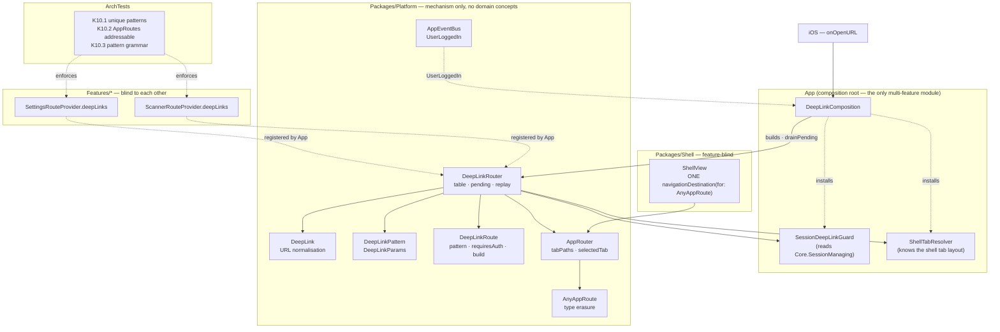
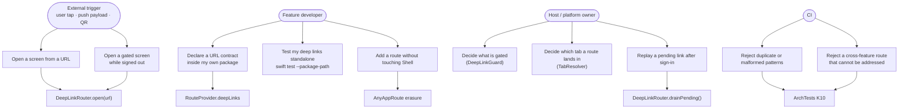
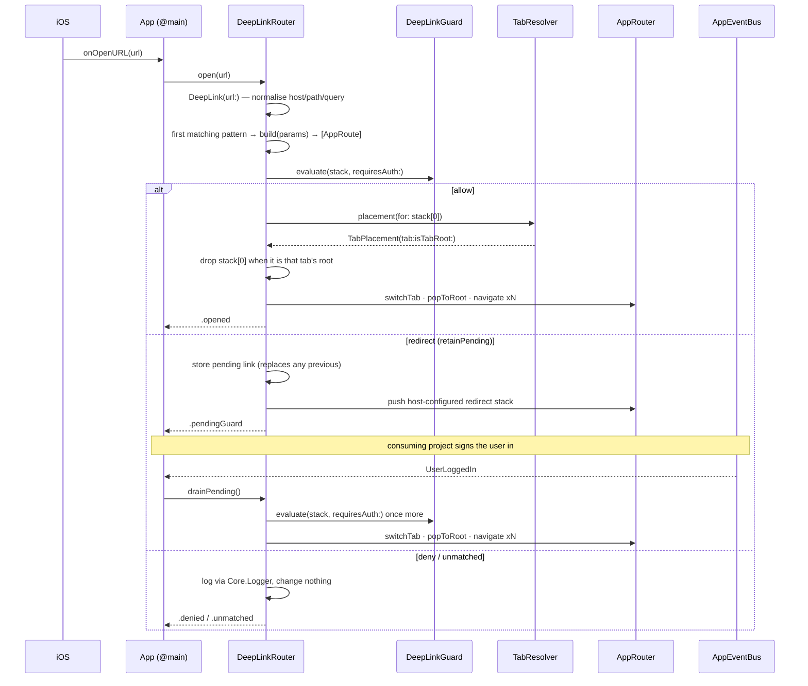

# Epic: iOS DeepLink Router Engine

## 1. Meta Data

| Field | Value |
|---|---|
| **Epic name** | `ios_deeplink_router` |
| **Status** | In progress — 1 of 14 tasks done (design approved 2026-09-10) |
| **Target Release** | iOS Super App Template — next template revision |
| **Source Spec** | [2026-09-10-ios-deeplink-router-design.md](2026-09-10-ios-deeplink-router-design.md) |
| **Precedent** | `super_app_governance` 4 pillars / 8 criteria; `ios_super_app_template` §6.1 (deep link explicitly deferred) |
| **Branch** | `epic/ios_deeplink_router` (worktree `.worktrees/ios_deeplink_router`, based on `epic/ios-deeplink-router`) |

---

## 2. Background

The iOS Super App Template was assessed against the Super App governance
framework's four pillars / eight criteria on 2026-09-10 (commit `cbe833a`):
**3 criteria met, 5 partial, 0 unmet**. Decomposition (pillar 1) and state
isolation (3.1) are solid. The concentrated weakness is **criterion 2.1 —
DeepLink Router Engine**, which is only half met.

The central-router half exists: `AppRouter` owns one `NavigationPath` per tab, a
`RouteProvider` chain resolves routes to views, and ArchTests **K1** / **K9**
keep features blind to one another. The **URL half does not exist at all** — a
repo-wide search for deep-link identifiers returns zero hits. This was a
deliberate deferral: the source spec for the template
(`ios_super_app_template` §6.1) recorded "deep link / state restoration:
architecture ready, not built", and `docs/architecture/ARCHITECTURE.md` §VII
still lists it as a known gap.

Six concrete blockers prevent bolting it on:

| ID | Blocker |
|---|---|
| **D1** | No entry surface — no `CFBundleURLTypes`, no associated domains, no `onOpenURL` |
| **D2** | `AppRoute` has no string representation; all shipped routes are empty structs |
| **D3** | `ShellView` hard-codes `.navigationDestination` per concrete type; anything outside those two types renders blank, and adding one means editing `Shell` |
| **D4** | No tab affinity — `navigate(to:inTab:)` demands an `Int` no caller can know |
| **D5** | No pending queue or gating; `AppEventBus` is replay-0 and cannot buffer |
| **D6** | No multi-level stack construction — the router appends one route |

A seventh observation frames the risk: **no feature calls `navigate(to:)` at
all** — cross-feature navigation is an API surface that has never executed.

---

## 3. Goals & Non-Goals

### Goals

1. Move criterion **2.1** from *half met* to *met*: a Central Router addressable
   by URL, with features still blind to one another.
2. **Feature-owned URL contracts** — a feature declares its own patterns inside
   its own package, testable by `swift test --package-path Features/X` with no
   app and no Tuist (reinforces criteria 4.1 and 1.2).
3. **Centralised resolution and audit** — `Platform` aggregates every
   declaration into one table; new ArchTests rule **K10** enforces pattern
   uniqueness, addressability of cross-feature routes, and pattern grammar.
4. Make `Shell` genuinely feature-blind by erasing route types at the
   `NavigationPath` boundary, removing every per-type `.navigationDestination`
   (fixes **D3**).
5. Close the CI hole in criterion 4.2 so the new acceptance tests cannot be
   silently swallowed by a green build.

### Non-Goals

- **Universal Links turned on for real.** Requires a live domain, an
  `apple-app-site-association` file and an Apple Developer team, none of which a
  domain-neutral template can ship. The seam and the documentation ship; the
  entitlement does not.
- **State restoration** (serialising `NavigationPath` across launches) — remains
  its own gap in `ARCHITECTURE.md` §VII.
- **Event Bridge request/response** (criterion 2.2) — its own epic.
- **DI re-layering / removing global singletons** (criterion 3.2) — its own epic.
- **Standalone runnable UI per feature** (criterion 4.1) — its own epic.
- **No authentication feature.** The template ships `Scanner` and `Settings`
  only; inventing an auth feature to demonstrate the guard would violate the
  standing "no product domain in the template" rule.
- Push-notification and QR payload parsing — one-line adapters over
  `open(url:)`, documented but not wired.
- No new external dependency.

---

## 4. Architecture & Technical Design

### 4.1 High-Level Architecture

### 4.2 Use Cases

### 4.3 Sequence — primary flow with gating and replay

### 4.4 Key design decisions

| Decision | Rationale |
|---|---|
| Features declare `deepLinks` on their own `RouteProvider`; `Platform` aggregates | Feature autonomy (R2) plus one place to audit. Mirrors the existing `canHandle` chain-of-responsibility |
| `DeepLinkRoute.build` returns `[any AppRoute]` | Multi-level stack construction (**D6**) — back from a deep-linked child lands on its parent, not outside the app |
| `build` is `@MainActor`, not `@Sendable` | Mirrors the existing `makeViewModel: @MainActor () -> ViewModel` convention and means `protocol AppRoute` needs no `Sendable` conformance |
| `DeepLinkGuard.evaluate` is synchronous | `Core.SessionManaging.accessToken` is a synchronous `NSLock`-guarded read, so `open(_:)` stays synchronous and testable without expectations |
| `TabPlacement` carries `isTabRoot` | `ShellView` renders tab roots via `router.destination(for: AppRoutes.…Root())`. Without this flag, `/settings` would `popToRoot` then push `SettingsRoot` again, showing the screen twice |
| Pending store holds exactly one link, no TTL | A deep link means "go here now"; a newer link supersedes an older one |
| Redirect target is evaluated once | A guard that redirects its own redirect target would loop forever; a non-`.allow` result becomes `.denied` |
| `AnyAppRoute` boxing at the `NavigationPath` boundary | `navigationDestination(for:)` matches concrete types; erasure collapses N destinations to one so adding a route never edits `Shell` (**D3**, R3, R5). `Shell` still names route types in its three fixed tab-root builders — a bounded mapping that does not grow with routes; see spec §4.5 |
| Unmatched links change nothing — no fallback to Home | Losing the user's current screen because a malformed link arrived is worse than ignoring the link |

---

## 5. Rollout Strategy & Mitigation

Five phases; **every phase builds, tests green, and ships on its own.** There is
no intermediate broken state, matching the template's standing "app builds and
runs at every step" principle.

| Phase | Tasks | Value if work stops here |
|---|---|---|
| **P1** | 1 | `Shell` stops naming route types; **D3** fixed; any feature-private route becomes reachable |
| **P2** | 2, 3, 4 | URL parsing and the declaration seam exist and are fully tested; nothing is wired, nothing can regress |
| **P3** | 5 | The engine works and is unit-tested end to end against a fake guard and fake resolver |
| **P4** | 6, 7, 8, 9 | Deep links work in the real app on a simulator |
| **P5** | 10, 11, 12, 13, 14 | Governance, scaffolding, rename script, CI and docs catch up so the mechanism cannot rot |

### Mitigation

| Risk | Severity | Mitigation |
|---|---|---|
| `AnyAppRoute` changes the element type in `NavigationPath`, breaking `AppRouterTests`, `FeatureBlindRenderTests`, `NavigationFlowTests` | Medium | Isolated in Task 1, RED-first, all three suites updated in the same task. Rollback is a single-commit revert |
| `AnyHashable(any AppRoute)` may not compile under Swift 6 strict concurrency | Low | Settled by compiling in Task 1. Documented fallback: store `AnyHashable` directly and recover via `base as? any AppRoute` |
| The guard's redirect + replay path is exercised only by tests, never by shipped feature code | Medium | Tier A (fake guard) and Tier C (test-injected guard) cover every branch; `DEEPLINK.md` carries the consumer pattern. Better than inventing an auth feature the template rules forbid |
| K10.2 could block a legitimate cross-feature route that should not be addressable | Low | The existing `ArchTests/baseline.txt` ledger already exists for exactly this |
| Removing the CI test→build fallback could turn CI red on an unrelated pre-existing failure | Low | Task 13 runs the suite first and fixes or reports before removing the fallback |

---

## 6. Kanban Tasks Breakdown

| # | Task | Phase |
|---|---|---|
| 1 | [AnyAppRoute erasure & Shell destination collapse](../../features/task_1_any_app_route_erasure.md) | P1 |
| 2 | [DeepLink URL normalisation](../../features/task_2_deeplink_url_normalisation.md) | P2 |
| 3 | [DeepLinkPattern & DeepLinkParams matching](../../features/task_3_deeplink_pattern_matching.md) | P2 |
| 4 | [DeepLinkRoute & RouteProvider.deepLinks seam](../../features/task_4_deeplink_route_provider_seam.md) | P2 |
| 5 | [DeepLinkRouter engine, guard/tab seams, pending replay](../../features/task_5_deeplink_router_engine.md) | P3 |
| 6 | [Scanner Result subfeature via Mason brick](../../features/task_6_scanner_result_subfeature.md) | P4 |
| 7 | [Feature deep-link declarations & standalone tests](../../features/task_7_feature_deeplink_declarations.md) | P4 |
| 8 | [Host wiring: composition, onOpenURL, URL scheme, UserLoggedIn](../../features/task_8_host_deeplink_wiring.md) | P4 |
| 9 | [Tier C end-to-end acceptance suite](../../features/task_9_tier_c_acceptance_suite.md) | P4 |
| 10 | [ArchTests K10 governance rules](../../features/task_10_archtests_k10.md) | P5 |
| 11 | [Mason ios_mvi_feature brick deepLinks scaffold](../../features/task_11_mason_brick_deeplinks.md) | P5 |
| 12 | [rename_project.sh URL-scheme rewrite](../../features/task_12_rename_script_scheme.md) | P5 |
| 13 | [CI: remove the xcodebuild test→build fallback](../../features/task_13_ci_test_fallback_removal.md) | P5 |
| 14 | [Documentation: DEEPLINK.md and updates](../../features/task_14_deeplink_docs.md) | P5 |
