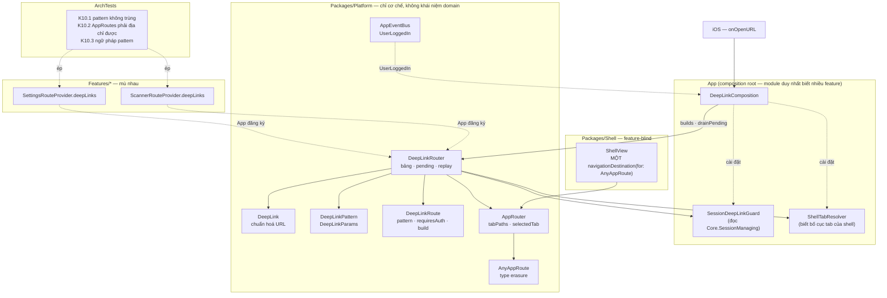
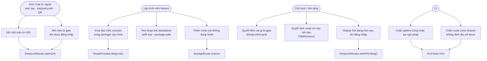
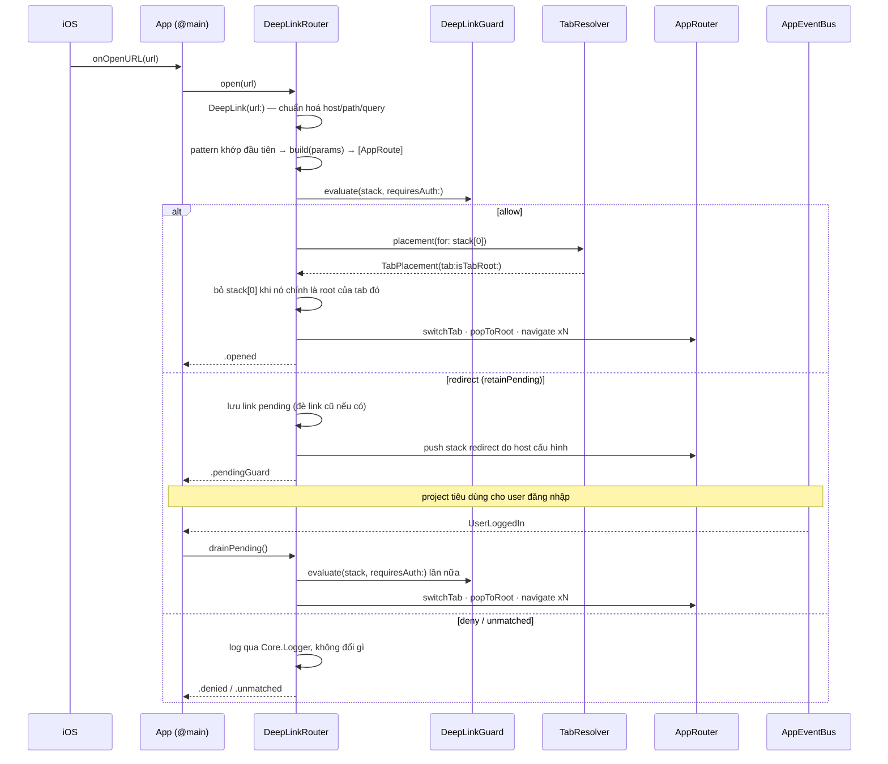

# Epic: iOS DeepLink Router Engine

## 1. Meta Data

| Trường | Giá trị |
|---|---|
| **Epic name** | `ios_deeplink_router` |
| **Trạng thái** | Đang thi công — xong 1/14 task (design đã duyệt 2026-09-10) |
| **Target Release** | iOS Super App Template — bản template kế tiếp |
| **Source Spec** | [2026-09-10-ios-deeplink-router-design.md](2026-09-10-ios-deeplink-router-design.md) |
| **Tài liệu nền** | `super_app_governance` 4 trụ / 8 tiêu chí; `ios_super_app_template` §6.1 (deep link bị hoãn có chủ ý) |
| **Branch** | `epic/ios_deeplink_router` (worktree `.worktrees/ios_deeplink_router`, base từ `epic/ios-deeplink-router`) |

---

## 2. Bối cảnh

Template iOS Super App được chấm lại theo khung governance 4 trụ / 8 tiêu chí
ngày 2026-09-10 (commit `cbe833a`): **3 tiêu chí đạt, 5 nửa đạt, 0 không đạt**.
Phần phân rã kiến trúc (trụ 1) và cô lập trạng thái (3.1) đã vững. Điểm yếu tập
trung ở **tiêu chí 2.1 — DeepLink Router Engine**, hiện chỉ đạt một nửa.

Nửa "central router" đã có: `AppRouter` giữ một `NavigationPath` cho mỗi tab,
chuỗi `RouteProvider` resolve route ra view, ArchTests **K1** / **K9** giữ cho
các feature mù nhau. **Nửa "URL" thì bằng 0** — grep toàn repo các từ khoá
deep link không ra kết quả nào. Đây là quyết định hoãn có chủ ý: spec gốc của
template (`ios_super_app_template` §6.1) ghi "deep link / state restoration:
kiến trúc sẵn sàng, không làm", và `docs/architecture/ARCHITECTURE.md` §VII vẫn
liệt kê đây là known gap.

Sáu điểm chặn cụ thể khiến không thể cắm thêm vào:

| ID | Điểm chặn |
|---|---|
| **D1** | Không có bề mặt vào — không `CFBundleURLTypes`, không associated domains, không `onOpenURL` |
| **D2** | `AppRoute` không có biểu diễn chuỗi; mọi route đang ship đều là struct rỗng |
| **D3** | `ShellView` hard-code `.navigationDestination` theo từng concrete type; route nằm ngoài hai type đó render ra màn trắng, và thêm một cái là phải sửa `Shell` |
| **D4** | Không có tab affinity — `navigate(to:inTab:)` đòi một `Int` mà không caller nào biết được |
| **D5** | Không có hàng đợi pending hay cơ chế gate; `AppEventBus` replay-0 nên không dùng làm buffer được |
| **D6** | Không dựng được stack nhiều tầng — router chỉ append một route |

Quan sát thứ bảy cho thấy mức rủi ro: **chưa feature nào gọi `navigate(to:)`** —
điều hướng cross-feature mới là bề mặt API, chưa từng chạy thật.

---

## 3. Mục tiêu & Ngoài phạm vi

### Mục tiêu

1. Đưa tiêu chí **2.1** từ *nửa đạt* lên *đạt*: Central Router định địa chỉ được
   bằng URL, các feature vẫn mù nhau.
2. **Feature sở hữu URL contract của chính nó** — feature khai báo pattern ngay
   trong package của nó, test được bằng `swift test --package-path Features/X`
   không cần app, không cần Tuist (củng cố tiêu chí 4.1 và 1.2).
3. **Resolve và audit tập trung** — `Platform` gom mọi khai báo vào một bảng;
   rule ArchTests mới **K10** ép pattern không trùng, route cross-feature phải
   định địa chỉ được, và pattern đúng ngữ pháp.
4. Làm `Shell` thật sự feature-blind bằng cách erase kiểu route tại biên
   `NavigationPath`, xoá mọi `.navigationDestination` theo type (gỡ **D3**).
5. Bịt lỗ hổng CI ở tiêu chí 4.2 để các test nghiệm thu mới không bị build xanh
   nuốt mất.

### Ngoài phạm vi

- **Bật Universal Links thật.** Cần domain thật, file `apple-app-site-association`
  và Apple Developer team — một template trung lập domain không ship được. Seam
  và tài liệu thì có; entitlement thì không.
- **State restoration** (serialize `NavigationPath` qua các lần chạy) — vẫn là
  gap riêng trong `ARCHITECTURE.md` §VII.
- **Event Bridge request/response** (tiêu chí 2.2) — epic riêng.
- **Tái tầng DI / bỏ singleton toàn cục** (tiêu chí 3.2) — epic riêng.
- **Runner UI standalone mỗi feature** (tiêu chí 4.1) — epic riêng.
- **Không thêm feature authentication.** Template chỉ ship `Scanner` và
  `Settings`; bịa ra một feature auth để demo guard sẽ vi phạm luật "template
  không mang product domain".
- Parse payload push notification và QR — chỉ là adapter một dòng gọi
  `open(url:)`, có tài liệu nhưng không wire.
- Không thêm dependency ngoài nào.

---

## 4. Kiến trúc & Thiết kế kỹ thuật

### 4.1 Kiến trúc tổng thể

### 4.2 Use Cases

### 4.3 Sequence — luồng chính có gate và replay

### 4.4 Quyết định thiết kế chính

| Quyết định | Lý do |
|---|---|
| Feature khai `deepLinks` trên `RouteProvider` của chính nó; `Platform` gom lại | Feature tự trị (R2) cộng một chỗ để audit. Đúng pattern chuỗi `canHandle` đã có |
| `DeepLinkRoute.build` trả `[any AppRoute]` | Dựng stack nhiều tầng (**D6**) — back từ màn con deep-link về đúng màn cha, không văng ra ngoài app |
| `build` là `@MainActor`, không phải `@Sendable` | Đúng quy ước `makeViewModel: @MainActor () -> ViewModel` đã có, và nhờ vậy `protocol AppRoute` không phải thêm `Sendable` |
| `DeepLinkGuard.evaluate` đồng bộ | `Core.SessionManaging.accessToken` là read đồng bộ có `NSLock`, nên `open(_:)` giữ đồng bộ và test không cần expectation |
| `TabPlacement` mang cờ `isTabRoot` | `ShellView` render tab root bằng `router.destination(for: AppRoutes.…Root())`. Không có cờ này thì `/settings` sẽ `popToRoot` rồi push `SettingsRoot` lần nữa, hiện màn hai lần |
| Pending giữ đúng một link, không TTL | Deep link nghĩa là "đi tới đó ngay"; link mới đè link cũ |
| Đích redirect chỉ được evaluate một lần | Guard redirect chính đích redirect sẽ loop vô hạn; kết quả khác `.allow` thành `.denied` |
| Bọc `AnyAppRoute` tại biên `NavigationPath` | `navigationDestination(for:)` khớp theo concrete type; erasure gom N destination về một nên thêm route không bao giờ phải sửa `Shell` (**D3**, R3, R5). `Shell` vẫn gọi tên route ở ba tab-root builder cố định — một ánh xạ có biên, không phình ra khi thêm route; xem spec §4.5 |
| Link không khớp thì không đổi gì — không fallback về Home | Mất màn đang xem của user chỉ vì một link rác còn tệ hơn là bỏ qua link |

---

## 5. Chiến lược triển khai & Giảm thiểu rủi ro

Năm phase; **mỗi phase đều build được, test xanh, và ship độc lập được.** Không
có trạng thái hỏng giữa chừng, đúng nguyên tắc "app build & chạy được ở MỌI
bước" của template.

| Phase | Task | Giá trị nếu dừng ở đây |
|---|---|---|
| **P1** | 1 | `Shell` hết gọi tên kiểu route; gỡ **D3**; mọi route feature-private trở nên với tới được |
| **P2** | 2, 3, 4 | Parse URL và seam khai báo đã có, test đầy đủ; chưa wire gì nên không thể regress |
| **P3** | 5 | Engine chạy và được unit test trọn vẹn với guard/resolver giả |
| **P4** | 6, 7, 8, 9 | Deep link chạy thật trong app trên simulator |
| **P5** | 10, 11, 12, 13, 14 | Governance, scaffolding, script rename, CI và docs bắt kịp để cơ chế không mục |

### Giảm thiểu rủi ro

| Rủi ro | Mức | Cách xử lý |
|---|---|---|
| `AnyAppRoute` đổi kiểu phần tử trong `NavigationPath`, làm hỏng `AppRouterTests`, `FeatureBlindRenderTests`, `NavigationFlowTests` | Trung bình | Cô lập trong Task 1, RED trước, cả ba suite sửa cùng task. Rollback là revert đúng một commit |
| `AnyHashable(any AppRoute)` có thể không compile dưới Swift 6 strict concurrency | Thấp | Chốt bằng cách compile ở Task 1. Phương án dự phòng đã ghi: lưu thẳng `AnyHashable`, lấy lại qua `base as? any AppRoute` |
| Nhánh redirect + replay của guard chỉ được test chạm tới, không có feature ship nào chạy | Trung bình | Tier A (guard giả) và Tier C (guard inject lúc test) phủ mọi nhánh; `DEEPLINK.md` mang pattern cho bên tiêu dùng. Tốt hơn là bịa ra feature auth mà luật template cấm |
| K10.2 có thể chặn một route cross-feature chính đáng nhưng không nên địa chỉ được | Thấp | Sổ `ArchTests/baseline.txt` đã có sẵn đúng cho việc này |
| Bỏ fallback test→build của CI có thể làm CI đỏ vì một lỗi có sẵn không liên quan | Thấp | Task 13 chạy suite trước, sửa hoặc báo cáo rồi mới bỏ fallback |

---

## 6. Phân rã Kanban Tasks

| # | Task | Phase |
|---|---|---|
| 1 | [AnyAppRoute erasure & Shell destination collapse](../../features/task_1_any_app_route_erasure.md) | P1 |
| 2 | [DeepLink URL normalisation](../../features/task_2_deeplink_url_normalisation.md) | P2 |
| 3 | [DeepLinkPattern & DeepLinkParams matching](../../features/task_3_deeplink_pattern_matching.md) | P2 |
| 4 | [DeepLinkRoute & RouteProvider.deepLinks seam](../../features/task_4_deeplink_route_provider_seam.md) | P2 |
| 5 | [DeepLinkRouter engine, guard/tab seams, pending replay](../../features/task_5_deeplink_router_engine.md) | P3 |
| 6 | [Scanner Result subfeature via Mason brick](../../features/task_6_scanner_result_subfeature.md) | P4 |
| 7 | [Feature deep-link declarations & standalone tests](../../features/task_7_feature_deeplink_declarations.md) | P4 |
| 8 | [Host wiring: composition, onOpenURL, URL scheme, UserLoggedIn](../../features/task_8_host_deeplink_wiring.md) | P4 |
| 9 | [Tier C end-to-end acceptance suite](../../features/task_9_tier_c_acceptance_suite.md) | P4 |
| 10 | [ArchTests K10 governance rules](../../features/task_10_archtests_k10.md) | P5 |
| 11 | [Mason ios_mvi_feature brick deepLinks scaffold](../../features/task_11_mason_brick_deeplinks.md) | P5 |
| 12 | [rename_project.sh URL-scheme rewrite](../../features/task_12_rename_script_scheme.md) | P5 |
| 13 | [CI: remove the xcodebuild test→build fallback](../../features/task_13_ci_test_fallback_removal.md) | P5 |
| 14 | [Documentation: DEEPLINK.md and updates](../../features/task_14_deeplink_docs.md) | P5 |
