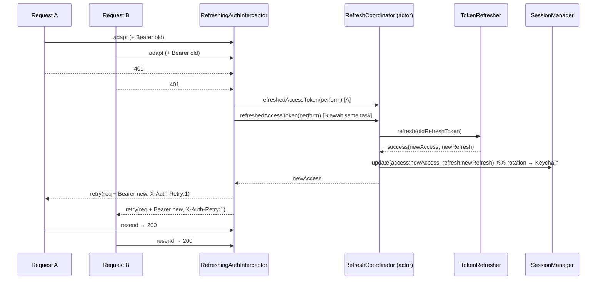

# Design Specification: iOS Networking Module — Refresh-Token Subsystem & Per-Feature Patterns

- **Date:** 2026-09-04
- **Status:** Approved
- **Scope:** Infrastructure (`Core`, `Network`), composition root (`App`), Mason `ios_mvi_feature` brick, architecture docs
- **Precedent:** Flutter `bloc_digital_wallet` — `docs/architecture/NETWORKING.md` + `docs/system-design/refresh_token.md`

---

## 1. Problem Statement & Motivation

The Flutter template ships a full networking story in two documents:

- **`NETWORKING.md`** — infrastructure (`network` package) vs implementation (feature modules); the dependency rule that the infra package never knows about features; decentralised per-feature `{Feature}Uri`; per-feature `{Feature}NetworkModule` DI with an explicit `baseUrl`.
- **`refresh_token.md`** — concurrency-safe refresh (mutex + queue + retry), infinite-loop guard (refresh-endpoint whitelist, `is_retry` flag), Refresh Token Rotation (persist the new refresh token), secure storage (Keychain), a public-endpoint whitelist (no `Authorization` on login/register), and a three-case force-logout strategy — all wired through a Dependency-Inversion `TokenRefresher` interface so the core layer never imports a feature.

The iOS template (`Packages/Network` + `Packages/Core`) currently has the infrastructure basics — `APIClient` / `URLSessionAPIClient`, `APIRequest`, `Environment` / `AppEnvironment`, `NetworkError → Core.AppError`, an observe-only `RequestInterceptor` (`adapt` + `didReceive`), `AuthTokenInterceptor`, `LoggingInterceptor`, `MockAPIClient` — but **no token-refresh flow at all**: a `401` calls `Core.AuthEventSink.onUnauthorized()` exactly once and throws `NetworkError.unauthorized`. Nothing retries, refreshes, rotates, persists a refresh token, or distinguishes the logout causes.

### Core Goals

1. Bring the iOS networking module to the same level of detail as Flutter's, **without adding external dependencies** (no Moya / Alamofire — the `ARCHITECTURE.md` invariant "Networking = URLSession + APIClient protocol + interceptors — No Alamofire" stands) and **without `Network` importing `Platform` or any feature** (ArchTests K7 stays green).
2. Add a concurrency-safe, single-flight refresh-token subsystem: DIP `TokenRefresher` seam in `Core`, an `actor` coordinator, a refresh-capable interceptor, rotation, Keychain persistence, public-endpoint whitelist, infinite-loop guard, and a three-case force-logout strategy.
3. Upgrade the interceptor model so an interceptor can **retry / short-circuit** a request (Dio-equivalent), by **adding** a hook — not rewriting the protocol. Every existing interceptor and every existing test must keep compiling and passing unchanged.
4. Document the decentralised per-feature `{Feature}Uri` + `{Feature}Endpoints` + `{Feature}NetworkModule` pattern, and teach the Mason `ios_mvi_feature --has_network` brick to scaffold it.
5. Ship two iOS docs mirroring Flutter: `docs/architecture/NETWORKING.md` and `docs/architecture/REFRESH_TOKEN.md`.

### Non-Goals

- **No `Auth` / `Authentication` feature package.** The template is domain-neutral. The default `TokenRefresher` is a no-op that always fails (forcing logout); a real adapter is the consumer's job, documented as a pattern.
- **No mandatory response envelope.** `BaseResponseObject<T>` ships as an *optional* utility; `send()` still returns `T` directly.
- No offline replay queue changes (`Core.ReplayQueue` is untouched).
- No change to `Environment` / `AppEnvironment` beyond what per-feature base URLs need (feature endpoints carry their own path; the placeholder host stays).

---

## 2. Architecture Constraints (Invariants)

| # | Invariant | Enforced by |
|---|---|---|
| I1 | `Network → Core` only. `Network` never imports `Platform` or a feature. | ArchTests K7, `scripts/check_module_boundaries.sh`, compiler |
| I2 | No external networking dependency (no Alamofire / Moya). | `ARCHITECTURE.md`, code review |
| I3 | `Core` is pure Swift — no `SwiftUI` / `UIKit` / `Combine`. `TokenRefresher` / `SessionManaging` are `Sendable`, class-bound where shared by reference. | ArchTests K7, Swift 6 strict concurrency |
| I4 | A `401` is surfaced to the composition root through `Core.AuthEventSink` — `Network` does not know it becomes a `UserLoggedOut` event. | Existing design (Source Spec Changelog #8) |
| I5 | Backward compatibility: existing `RequestInterceptor` conformances, `AuthTokenInterceptor`, `LoggingInterceptor`, `SessionManager` call-sites, and all `CoreTests` / `NetworkTests` compile and pass unchanged. | CI, `swift test` per package |

---

## 3. Component Design

### 3.1 `Core` — DIP seam + session extension

#### `Core/Auth/TokenRefresher.swift` (NEW)

```swift
/// Dependency-inversion seam for token refresh. `Network` depends on this
/// abstraction; the concrete adapter lives in the consumer's auth feature and is
/// wired at the composition root. `Sendable` — invoked off the main actor.
public protocol TokenRefresher: Sendable {
    func refresh(refreshToken: String) async -> TokenRefreshResult
}

public enum TokenRefreshResult: Sendable {
    /// New access token, plus a rotated refresh token when the server issued one.
    case success(accessToken: String, refreshToken: String?)
    case failure(TokenRefreshFailure)
}

public enum TokenRefreshFailure: Sendable, Equatable {
    /// The refresh token is expired / revoked (refresh endpoint returned 401/403).
    /// → force logout.
    case invalidGrant
    /// A transport / 5xx failure. The refresh may succeed later — do NOT logout;
    /// the triggering request fails with its original error.
    case transient
}

/// Default seam implementation. Always fails with `.invalidGrant`, so an app that
/// has not wired a real `TokenRefresher` force-logs-out on the first `401`
/// instead of silently spinning. Replace at the composition root.
public struct NoTokenRefresher: TokenRefresher {
    public init() {}
    public func refresh(refreshToken _: String) async -> TokenRefreshResult {
        .failure(.invalidGrant)
    }
}
```

#### `Core/Auth/AuthEventSink.swift` (EDIT — additive)

```swift
public enum LogoutReason: Sendable, Equatable {
    case unauthorized            // plain 401, no refresh attempted (back-compat default)
    case refreshFailed           // refresh endpoint rejected the refresh token
    case retryStillUnauthorized  // retried once with a fresh token, still 401
    case missingRefreshToken     // 401 but no refresh token on device
}

public protocol AuthEventSink: AnyObject, Sendable {
    func onUnauthorized(reason: LogoutReason)
}

public extension AuthEventSink {
    /// Back-compat overload — existing call-sites keep working.
    func onUnauthorized() { onUnauthorized(reason: .unauthorized) }
}
```

Existing conformances (`BusAuthEventSink`) implement `onUnauthorized(reason:)`; the parameterless call in `URLSessionAPIClient` keeps compiling via the extension. `BusAuthEventSink` maps `reason` onto `UserLoggedOut` (a field is added to that Platform event for diagnostics; not part of this spec's `Core`/`Network` surface).

#### `Core/Session/SessionManager.swift` (EDIT)

```swift
public protocol SessionManaging: AnyObject, Sendable {
    var accessToken: String? { get }
    var refreshToken: String? { get }
    func update(accessToken: String?, refreshToken: String?)
    func clear()
}
```

- `SessionManager` gains an **optional** `SecureCacheStore` dependency (from `Core/Cache`). When present, `update(...)` writes both tokens as JSON-encoded Keychain items and `init` reloads them; `clear()` removes both. When absent, behaviour is today's pure in-memory `NSLock` store — existing `SessionManagerTests` pass unchanged.
- **Rotation**: `update(accessToken:refreshToken:)` overwrites the stored refresh token whenever `refreshToken != nil`. Passing `refreshToken: nil` on a routine access-token update leaves the stored refresh token intact (explicit `clear()` is the only way to drop it).
- Back-compat: keep a `update(accessToken:)` convenience = `update(accessToken:refreshToken:nil)`.

Keys: `"core.session.access"`, `"core.session.refresh"` in the injected `SecureCacheStore`.

### 3.2 `Network` — refresh + retry machinery

#### `Network/Interceptor/RetryDecision.swift` (NEW)

```swift
public enum RetryReason: Sendable {
    case unauthorized(HTTPURLResponse)   // non-2xx 401 came back
    case transport(Error)                // request failed before a response
}

public enum RetryDecision: Sendable {
    case doNotRetry
    case retry(URLRequest)               // resend this (already re-adapted) request
}
```

#### `Network/Interceptor/RequestInterceptor.swift` (EDIT — additive, default impl)

```swift
public protocol RequestInterceptor: Sendable {
    func adapt(_ request: URLRequest) async -> URLRequest
    func didReceive(_ response: HTTPURLResponse)
    /// Decide whether to resend `request` after `reason`. Called in registration
    /// order; the first `.retry` wins and the client resends exactly once.
    func retry(_ request: URLRequest, dueTo reason: RetryReason) async -> RetryDecision
}

public extension RequestInterceptor {
    func retry(_: URLRequest, dueTo _: RetryReason) async -> RetryDecision { .doNotRetry }
}
```

`AuthTokenInterceptor` and `LoggingInterceptor` get the default `.doNotRetry` for free — no edits, no test changes.

#### `Network/Interceptor/RefreshCoordinator.swift` (NEW)

```swift
/// Guarantees exactly one in-flight refresh. The first caller starts the task;
/// concurrent callers await the same one. An `actor` for data-race safety.
public actor RefreshCoordinator {
    private var inFlight: Task<String, Error>?

    /// Returns a fresh access token. `perform` is the actual refresh call
    /// (supplied by `RefreshingAuthInterceptor`, closing over `TokenRefresher` +
    /// `SessionManaging`). Throws `RefreshError` on failure.
    public func refreshedAccessToken(
        perform: @Sendable @escaping () async throws -> String
    ) async throws -> String {
        if let inFlight { return try await inFlight.value }
        let task = Task { try await perform() }
        inFlight = task
        defer { inFlight = nil }        // runs in actor isolation → next 401 wave starts a new refresh
        return try await task.value
    }
}

public enum RefreshError: Error, Equatable {
    case invalidGrant
    case missingRefreshToken
    case transient
}
```

#### `Network/Interceptor/RefreshingAuthInterceptor.swift` (NEW)

Replaces `AuthTokenInterceptor`'s role at the composition root when a `TokenRefresher` is available. `AuthTokenInterceptor` stays in the package for header-only use.

- **`adapt(_:)`** — attach `Authorization: Bearer <accessToken>` **unless**:
  - the resolved request's `authRequirement == .none` (carried via a header marker `X-Auth-Requirement: none` that `APIRequest.urlRequest(for:)` sets and this interceptor reads then strips), or
  - the request URL path matches the configured `RefreshTokenEndpoint`.
- **`retry(_:dueTo: .unauthorized(resp))`**:
  1. If request is the refresh endpoint → `.doNotRetry`, `authEventSink.onUnauthorized(reason: .refreshFailed)`, `session.clear()`. *(Case 2 — misconfiguration guard: refresh normally goes through `makeBareAPIClient()`, which has no `RefreshingAuthInterceptor`; this branch only fires if a consumer wrongly routed refresh through the authed client.)*
  2. If request already carries the retry marker (`X-Auth-Retry: 1`) → `.doNotRetry`, `onUnauthorized(reason: .retryStillUnauthorized)`, `session.clear()`. *(Case 1)*
  3. If `session.refreshToken == nil` → `.doNotRetry`, `onUnauthorized(reason: .missingRefreshToken)`, `session.clear()`. *(Case 3)*
  4. Otherwise `await coordinator.refreshedAccessToken { ... }`:
     - success → `session.update(accessToken: new, refreshToken: rotated)`, rebuild the request with the new bearer + `X-Auth-Retry: 1`, return `.retry(rebuilt)`.
     - `RefreshError.invalidGrant` → `.doNotRetry`, `onUnauthorized(reason: .refreshFailed)`, `session.clear()`. *(Case 2)*
     - `RefreshError.transient` → `.doNotRetry`, **no logout, no clear** — the triggering request fails with `NetworkError.unauthorized` (original error preserved).
- **`retry(_:dueTo: .transport)`** → `.doNotRetry` (out of scope; a future network-reachability interceptor could use it).
- `didReceive` — unused (no-op).

The `perform` closure passed to the coordinator:

```swift
{ [session, refresher] in
    guard let rt = session.refreshToken else { throw RefreshError.missingRefreshToken }
    switch await refresher.refresh(refreshToken: rt) {
    case let .success(access, refresh):
        session.update(accessToken: access, refreshToken: refresh)
        return access
    case .failure(.invalidGrant): throw RefreshError.invalidGrant
    case .failure(.transient):     throw RefreshError.transient
    }
}
```

#### `Network/Endpoint/RefreshTokenEndpoint.swift` (NEW)

```swift
/// Identifies the refresh path so the interceptor / coordinator can (a) skip
/// bearer injection for it and (b) treat a 401 from it as a dead session rather
/// than a refresh trigger. No URL is hard-coded — the composition root supplies
/// the path that its `TokenRefresher` adapter actually calls.
public struct RefreshTokenEndpoint: Sendable {
    public let pathSuffix: String   // e.g. "auth/refresh"
    public init(pathSuffix: String) { self.pathSuffix = pathSuffix }
    public func matches(_ url: URL) -> Bool { url.path.hasSuffix(pathSuffix) }
}
```

#### `Network/APIRequest.swift` (EDIT)

- New field `authRequirement: AuthRequirement = .required` (`enum AuthRequirement: Sendable { case required, none }`).
- `urlRequest(for:)`: when `authRequirement == .none`, set header `X-Auth-Requirement: none` (consumed + stripped by `RefreshingAuthInterceptor`; harmless if no such interceptor is installed — documented, and the interceptor always strips it before the request goes out).
- Internal-only awareness of the retry marker header name (shared constant with the interceptor).
- Existing initializer stays source-compatible (new parameter is defaulted, appended last).

#### `Network/APIClient.swift` (`URLSessionAPIClient.send`) (EDIT)

Current flow: adapt → perform → `didReceive` → `validate` → decode. New flow adds one bounded retry:

```
adapt(request) via all interceptors
loop (max 2 iterations):
    (data, response) = perform(request)      // URLError → NetworkError/CancellationError as today
    http = response as HTTPURLResponse       // else NetworkError.invalidResponse
    for i in interceptors: i.didReceive(http)
    if validate(http) succeeds: break        // 2xx
    if not first iteration: break             // already retried once → fall through to throw
    reason = (http.status == 401) ? .unauthorized(http) : nil
    if reason == nil: break
    for i in interceptors:
        switch await i.retry(request, dueTo: reason):
        case .retry(let newRequest): request = newRequest; continue outer loop
        case .doNotRetry: keep asking next interceptor
    break                                     // nobody retried
validate(http) → throws the right NetworkError (401 → .unauthorized; the sink
                 was already notified by the interceptor in the no-retry paths)
decode as today
```

- `validate`'s existing "notify `AuthEventSink` on 401" behaviour is **removed** — that responsibility moves entirely to `RefreshingAuthInterceptor` (the only place that knows *why* the 401 is terminal). For an app with **no** refresh interceptor installed, a 401 still throws `NetworkError.unauthorized`; to keep the "sink notified on bare 401" guarantee those apps rely on, `AuthTokenInterceptor` gains a minimal `retry` override: on `.unauthorized` it calls `authEventSink?.onUnauthorized(reason: .unauthorized)` once and returns `.doNotRetry`. `AuthTokenInterceptor` therefore takes an optional `AuthEventSink` (defaulted `nil`) — additive, existing construction sites unaffected.
- `Task.checkCancellation()` is checked before each `perform` and after; a cancellation while awaiting `coordinator` propagates as `CancellationError` (not swallowed, not mapped to `.unauthorized`).

#### `Network/Response/BaseResponseObject.swift` (NEW — optional utility)

```swift
/// Optional envelope mirroring the Flutter `BaseResponseObject<T>`. NOT used by
/// `send()` automatically — a feature that wants it decodes
/// `send() as BaseResponseObject<Foo>` and reads `.data`.
public struct BaseResponseObject<T: Decodable & Sendable>: Decodable, Sendable {
    public let data: T?
    public let message: String?
    public let status: Int?
}
```

### 3.3 `App` — composition root

#### `App/Sources/Composition/NetworkComposition.swift` (EDIT)

- `makeAPIClient(...)` gains parameters: `tokenRefresher: any TokenRefresher = NoTokenRefresher()`, `session manager: any SessionManaging`, `refreshEndpoint: RefreshTokenEndpoint`.
- Interceptor list becomes `[RefreshingAuthInterceptor(session:, refresher:, coordinator: RefreshCoordinator(), authEventSink: BusAuthEventSink(...), refreshEndpoint:), LoggingInterceptor(logger:)]`.
- **`makeBareAPIClient(...)`** (NEW) — an `APIClient` with **only** `LoggingInterceptor` (no `RefreshingAuthInterceptor`). The consumer's `TokenRefresher` adapter MUST call the refresh endpoint through this client, or a 401 from refresh re-enters the refresh path → infinite recursion. Documented loudly.
- `BusAuthEventSink.onUnauthorized(reason:)` publishes `UserLoggedOut(reason:)`.

#### `App/Sources/Composition/AppComposition.swift` (EDIT)

- Build `KeychainCacheStore(service: "com.iosdigitalwallet.session")` and pass it to `SessionManager` and (indirectly) the network composition.
- The template wires `NoTokenRefresher()` — so the sample app force-logs-out on a real 401, which is the correct honest default for a domain-neutral template.

### 3.4 Mason `ios_mvi_feature --has_network` brick (EDIT)

When `has_network == true`, the brick additionally scaffolds under `Features/<Name>/Sources/<Name>/Data/Remote/`:

| File | Contents |
|---|---|
| `<Name>Uri.swift` | `enum <Name>Uri { static let resource = "<name>" ; static let byId = "/{id}" }` — decentralised path constants, feature-owned. No global `AppUri`. |
| `<Name>Endpoints.swift` | `enum <Name>Endpoints { static func list() -> APIRequest ; static func detail(id:) -> APIRequest }` — `APIRequest` factories built from `<Name>Uri`. |
| `<Name>NetworkModule.swift` | `enum <Name>NetworkModule { static func makeRemoteDataSource(client: any APIClient) -> <Name>RemoteDataSource }` — composition helper; the app injects the shared `APIClient`. |

`post_gen.dart` hook: no Tuist marker changes beyond today's (the `Network` dependency line is already added when `has_network`). Docs checklist line added: "implement `<Name>RemoteDataSource` against `<Name>Endpoints`; the app already injects `APIClient`."

### 3.5 Documentation

| File | Mirrors | Content |
|---|---|---|
| `docs/architecture/NETWORKING.md` (NEW) | Flutter `NETWORKING.md` | Core philosophy (infra vs feature), the dependency rule, the architecture diagram (mermaid) adapted to SPM packages, decentralised `<Name>Uri` + `<Name>Endpoints`, per-feature `<Name>NetworkModule` with the shared `APIClient`, why there is no global `AppUri`. |
| `docs/architecture/REFRESH_TOKEN.md` (NEW) | Flutter `refresh_token.md` | The four problems (race condition, infinite loop, rotation, storage) + solutions as built here; the strategy table; Mobile vs Backend split; the three force-logout cases mapped to `LogoutReason`; the public-endpoint whitelist (`authRequirement: .none`); the DIP `TokenRefresher` wiring with `makeBareAPIClient()`; a sequence diagram of the single-flight flow. |
| `docs/architecture/ARCHITECTURE.md` (EDIT) | — | Update the `Network` row (add refresh subsystem, `TokenRefresher` seam, `SessionManager` Keychain persistence); the "No Alamofire" line is reaffirmed, not changed. |

---

## 4. Data Flow — single-flight refresh



### Force-logout decision table

| Case | Detection | Action |
|---|---|---|
| 1 — Persistent failure | `401` **and** request carries `X-Auth-Retry: 1` | `session.clear()`; `onUnauthorized(.retryStillUnauthorized)`; request throws `.unauthorized` |
| 2 — Dead session | `TokenRefresher` returns `.failure(.invalidGrant)`, **or** the refresh-endpoint request itself returns `401/403` | `session.clear()`; `onUnauthorized(.refreshFailed)`; request throws `.unauthorized` |
| 3 — Missing token | `401` **and** `session.refreshToken == nil` | `session.clear()`; `onUnauthorized(.missingRefreshToken)`; request throws `.unauthorized` |
| — Transient | `TokenRefresher` returns `.failure(.transient)` | **no logout, no clear**; request throws `.unauthorized`; a later request can refresh successfully |

### Loop / whitelist guards

- **Never refresh** when: the request targets `RefreshTokenEndpoint`; the request carries `X-Auth-Retry: 1`; `session.refreshToken == nil`.
- **Never attach `Authorization`** when: `authRequirement == .none` (login / register / forgot-password); the request targets `RefreshTokenEndpoint`.
- **Never call refresh through the authed client** — the adapter uses `makeBareAPIClient()`.

---

## 5. Error Handling

| Situation | Surfaced as |
|---|---|
| Refresh succeeds, retry succeeds | normal decoded `T` |
| Any of the 3 logout cases | `NetworkError.unauthorized` (→ `AppError(code: "unauthorized")`), sink already notified with the specific `LogoutReason` |
| `TokenRefresher.transient` | `NetworkError.unauthorized`, **no** sink notification, session intact |
| Task cancelled while awaiting refresh | `CancellationError` (propagated, not mapped) |
| Refresh-endpoint request has a transport error | treated as `.transient` |
| No `RefreshingAuthInterceptor` installed (e.g. `AuthTokenInterceptor` only) | bare `401` → `NetworkError.unauthorized`; `AuthTokenInterceptor.retry` notifies the sink once with `.unauthorized` |

---

## 6. Testing Strategy (Spec §9A — Tier A behavioral)

Each BDD scenario maps 1:1 to a test; RED is demonstrated before GREEN.

### `Packages/Core/Tests/CoreTests/`

- `TokenRefresherTests` — `NoTokenRefresher` always returns `.failure(.invalidGrant)`.
- `SessionManagerTests` (EDIT) — with a fake `SecureCacheStore`: `update` persists both tokens; a fresh `SessionManager` over the same store reloads them; `clear()` removes both; `update(accessToken:refreshToken:nil)` keeps the stored refresh token (rotation semantics); **without** a store, behaviour is identical to today (existing cases unchanged).

### `Packages/Network/Tests/NetworkTests/`

- `RefreshCoordinatorTests` — N concurrent `refreshedAccessToken` calls invoke `perform` exactly once and all observe the same token; the in-flight task is cleared afterwards so a later call refreshes again; a throwing `perform` propagates to all awaiters.
- `RefreshingAuthInterceptorTests`
  - happy path: `401` → refresh → `.retry` with new bearer + `X-Auth-Retry: 1`; resend → 200.
  - rotation: `.success(_, rotated)` → `SessionManager.refreshToken == rotated`.
  - Case 1: retried request `401` again → `.doNotRetry`, `onUnauthorized(.retryStillUnauthorized)`, `session.clear()`, no second `refresh` call.
  - Case 2a: `refresher` → `.failure(.invalidGrant)` → `.doNotRetry`, `onUnauthorized(.refreshFailed)`, `clear()`.
  - Case 2b: request to the refresh endpoint returns `401` → same as 2a, refresh never called.
  - Case 3: `session.refreshToken == nil` at `401` → `onUnauthorized(.missingRefreshToken)`, refresh never called.
  - Transient: `refresher` → `.failure(.transient)` → `.doNotRetry`, **no** `onUnauthorized`, session intact.
  - whitelist: `authRequirement == .none` → no `Authorization` header even when `session.accessToken != nil`; `X-Auth-Requirement` header is stripped before send.
  - refresh-endpoint requests never get a bearer.
- `APIClientRetryTests` — `send` resends exactly once on `.retry`; never more than once; a non-401 non-2xx is not retried; `didReceive` fires for every physical response.
- `APIRequestBuildTests` (EDIT) — `authRequirement == .none` ⇒ outgoing request has the marker header; `.required` ⇒ none.
- `InterceptorOrderTests` (EDIT) — adding the `retry` hook does not change `adapt` / `didReceive` ordering.
- `UnauthorizedTests` (EDIT) — with `AuthTokenInterceptor` + sink and no refresher, a bare `401` still notifies the sink once and throws `.unauthorized`.
- `CancellationTests` (EDIT) — cancelling during the refresh await throws `CancellationError`.
- `BaseResponseObjectTests` (NEW) — decodes a populated envelope; tolerates missing `message` / `status`; `data == nil` when absent.

### `App/Tests/AppTests/`

- `AppCompositionTests` (EDIT) — the composed client's interceptor list contains `RefreshingAuthInterceptor` then `LoggingInterceptor`; `makeBareAPIClient()` contains neither a `RefreshingAuthInterceptor` nor an `AuthTokenInterceptor`; `SessionManager` is constructed with the Keychain store.

### Mason

- Generate a throwaway `--has_network` feature in CI (existing brick test harness) and assert `<Name>Uri.swift`, `<Name>Endpoints.swift`, `<Name>NetworkModule.swift` exist, compile, and that SwiftLint / SwiftFormat pass.

### Architecture gate

- `ArchTests` K7 stays green (`Network` imports only `Core`); `scripts/check_module_boundaries.sh` clean.

---

## 7. Implementation Order (one commit per group, prefix `[IOS_SUPER_APP_TEMPLATE]`)

Each step ends with, from the repo root: `swiftlint --strict --config quality/.swiftlint.yml`, `swiftformat --config quality/.swiftformat . --lint`, `swift test` for every touched package, and `ArchTests`.

1. **Core — refresh seam.** `TokenRefresher` + `TokenRefreshResult` + `TokenRefreshFailure` + `NoTokenRefresher`; `LogoutReason` + `AuthEventSink.onUnauthorized(reason:)` (+ back-compat extension). Tests: `TokenRefresherTests`, `AuthEventSink` back-compat.
2. **Core — session persistence.** `SessionManaging.refreshToken` / `update(accessToken:refreshToken:)`; optional `SecureCacheStore` injection + reload + rotation semantics. Tests: `SessionManagerTests` (edited).
3. **Network — retry hook.** `RetryReason` / `RetryDecision`; `RequestInterceptor.retry` with default extension; `APIRequest.authRequirement` + marker header; `URLSessionAPIClient.send` bounded-retry loop; move the 401→sink notification out of `validate` and into `AuthTokenInterceptor.retry`. Tests: `APIClientRetryTests`, `APIRequestBuildTests` (edited), `InterceptorOrderTests` (edited), `UnauthorizedTests` (edited).
4. **Network — refresh machinery.** `RefreshCoordinator` (actor); `RefreshTokenEndpoint`; `RefreshingAuthInterceptor`. Tests: `RefreshCoordinatorTests`, `RefreshingAuthInterceptorTests`, `CancellationTests` (edited).
5. **Network — optional envelope.** `BaseResponseObject<T>`. Tests: `BaseResponseObjectTests`.
6. **App — wiring.** `NetworkComposition` (refresher + session + `makeBareAPIClient`); `AppComposition` (Keychain store, `NoTokenRefresher`); `BusAuthEventSink` reason mapping. Tests: `AppCompositionTests` (edited).
7. **Mason — brick.** `ios_mvi_feature` `--has_network` scaffolds `<Name>Uri` / `<Name>Endpoints` / `<Name>NetworkModule` + hook checklist line. Brick generation test.
8. **Docs.** `docs/architecture/NETWORKING.md`, `docs/architecture/REFRESH_TOKEN.md`, `ARCHITECTURE.md` Network-row update.

---

## 8. Assumptions, Risks & Dependencies

| Item | Notes |
|---|---|
| **Assumption** | Backend follows the Flutter precedent: refresh endpoint returns `{ access, refresh }` (rotation on), rejects a dead refresh token with `401/403`. The `TokenRefresher` adapter (consumer-owned) absorbs any shape difference — `Core` / `Network` only see `TokenRefreshResult`. |
| **Assumption** | The marker-header approach (`X-Auth-Requirement`, `X-Auth-Retry`) is acceptable as an in-process signalling channel; both headers are consumed and stripped by `RefreshingAuthInterceptor` before the request leaves the process. If a stricter "no internal headers ever" stance is wanted, these move to `URLRequest` associated properties — a mechanical change isolated to `APIRequest` + the interceptor. |
| **Risk** | Removing the 401→sink notification from `URLSessionAPIClient.validate` is a behavioural change for any code that installs neither `RefreshingAuthInterceptor` nor `AuthTokenInterceptor`. Mitigation: step 3's `UnauthorizedTests` edit pins the `AuthTokenInterceptor` path; the template always installs one of the two. |
| **Risk** | `RefreshCoordinator` `defer { inFlight = nil }` must run inside the actor's isolation so a second wave of 401s starts a *new* refresh rather than awaiting a completed task. Covered by `RefreshCoordinatorTests` "later call refreshes again". |
| **Risk** | Infinite recursion if a consumer wires their `TokenRefresher` adapter to the authed client. Mitigation: `makeBareAPIClient()` + a prominent warning in `REFRESH_TOKEN.md`; `AppCompositionTests` asserts the bare client has no auth interceptor. |
| **Dependency** | `Core/Cache/SecureCacheStore` + `KeychainCacheStore` already exist and are tested — reused as-is. |
| **Dependency** | Mason brick edits build on the just-completed "restructure features" brick work (`Features/<Name>`, no `Feature` suffix). |
| **Cross-feature** | None. No feature package is created or modified. The `Platform` `UserLoggedOut` event gains an optional `reason` field (additive, defaulted). |

---

## 9. Open Questions

None blocking. Deferred, documented as such:

- A real `TokenRefresher` adapter + sample `Auth` feature is explicitly out of scope; `REFRESH_TOKEN.md` shows the pattern with a copy-pasteable adapter sketch.
- Reachability-driven retry (`RetryReason.transport`) is scaffolded (the enum case exists) but no interceptor acts on it yet.
