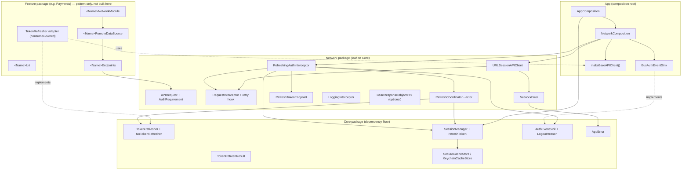
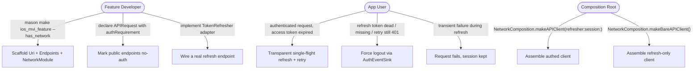
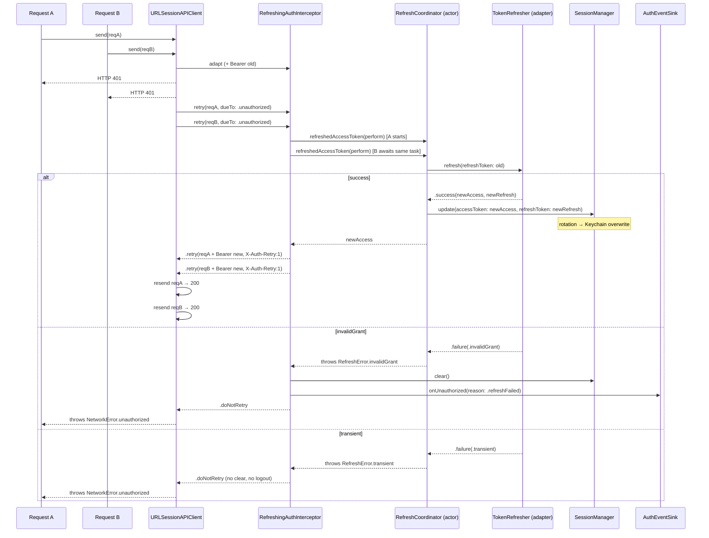

# Epic: iOS Networking Module — Refresh-Token Subsystem & Per-Feature Patterns

## 1. Meta Data

| Field | Value |
|---|---|
| **Epic name** | `ios_networking_module` |
| **Status** | Ready for implementation (design approved 2026-09-04) |
| **Target Release** | iOS Super App Template — next template revision |
| **Source Spec** | [2026-09-04-ios-networking-module-design.md](2026-09-04-ios-networking-module-design.md) |
| **Precedent** | Flutter `bloc_digital_wallet` — `docs/architecture/NETWORKING.md` + `docs/system-design/refresh_token.md` |
| **Branch** | `epic/ios-super-app-template` (worktree `.worktrees/ios_super_app_template`) |

---

## 2. Background

The Flutter template ships a complete networking story in two documents: infrastructure-vs-feature separation with decentralised per-feature URIs and DI (`NETWORKING.md`), and a concurrency-safe refresh-token mechanism — single-flight refresh, infinite-loop guard, token rotation, Keychain storage, public-endpoint whitelist, three-case force-logout, all wired through a Dependency-Inversion `TokenRefresher` interface (`refresh_token.md`).

The iOS template already has the infrastructure basics (`APIClient` / `URLSessionAPIClient`, `APIRequest`, `Environment`, `NetworkError → Core.AppError`, an observe-only `RequestInterceptor`, `AuthTokenInterceptor`, `LoggingInterceptor`, `MockAPIClient`) but **no token-refresh flow at all**: a `401` calls `Core.AuthEventSink.onUnauthorized()` once and throws. Nothing retries, refreshes, rotates, persists a refresh token, or distinguishes logout causes.

This epic raises the iOS networking module to Flutter's level of detail **without external dependencies** (the `ARCHITECTURE.md` "No Alamofire" invariant stands — no Moya/Alamofire) and **without `Network` importing `Platform` or any feature** (ArchTests K7 stays green).

---

## 3. Goals & Non-Goals

### Goals

1. A concurrency-safe, single-flight refresh-token subsystem: DIP `TokenRefresher` seam in `Core`, an `actor` coordinator, a refresh-capable interceptor, rotation, Keychain persistence, public-endpoint whitelist, infinite-loop guard, three-case force-logout.
2. Upgrade the interceptor model so an interceptor can **retry / short-circuit** a request — by **adding** a `retry` hook, not rewriting the protocol. Every existing interceptor and test keeps compiling and passing unchanged.
3. Extend `Core.SessionManager` to hold a refresh token and (optionally) persist both tokens in the Keychain, with rotation semantics.
4. Document and scaffold the decentralised per-feature pattern: `<Name>Uri` + `<Name>Endpoints` + `<Name>NetworkModule`, generated by `mason make ios_mvi_feature --has_network`.
5. Ship two iOS docs mirroring Flutter: `docs/architecture/NETWORKING.md` and `docs/architecture/REFRESH_TOKEN.md`; update the `Network` row in `ARCHITECTURE.md`.

### Non-Goals

- **No `Auth` / `Authentication` feature package.** The template is domain-neutral. The default `TokenRefresher` is `NoTokenRefresher` (always fails → force logout). A real adapter is the consumer's job, shown as a copy-pasteable pattern in the docs.
- **No mandatory response envelope.** `BaseResponseObject<T>` ships as an optional utility; `send()` still returns `T`.
- No changes to `Core.ReplayQueue`, no offline replay work.
- No reachability-driven retry (the `RetryReason.transport` case is scaffolded but unused).
- No external networking library. No rewrite of the `RequestInterceptor` protocol.

---

## 4. Architecture & Technical Design

### 4.1 High-Level Architecture

### 4.2 Use Cases

### 4.3 Sequence Diagram — single-flight refresh (primary flow)

### 4.4 Key Decisions (from the approved spec — not to be re-litigated)

| Decision | Rationale |
|---|---|
| Extend `URLSession` `APIClient`, no Moya/Alamofire | `ARCHITECTURE.md` invariant; `Network` stays a leaf on `Core` (K7); zero external deps; URLSession + async/await is the current iOS direction |
| `retry` hook added to `RequestInterceptor` with a default `.doNotRetry` extension | Additive — existing conformances and tests untouched |
| `RefreshCoordinator` is an `actor` holding one `Task<String, Error>?` | Data-race-safe single-flight; concurrent 401s await the same refresh |
| Refresh token in `SessionManager` + optional `SecureCacheStore` | One place owns the session; rotation = overwrite; no-store path keeps today's in-memory behaviour and tests |
| `TokenRefresher` DIP seam in `Core`, default `NoTokenRefresher` | `Network` never imports a feature; domain-neutral template force-logs-out honestly until a real adapter is wired |
| Marker headers `X-Auth-Requirement`, `X-Auth-Retry`, consumed + stripped by the interceptor | In-process signalling; isolated to `APIRequest` + `RefreshingAuthInterceptor`; swappable for `URLRequest` associated properties if a stricter stance is wanted |
| `makeBareAPIClient()` for the refresh call | Prevents infinite recursion (refresh 401 re-entering the refresh path) |
| `BaseResponseObject<T>` optional, not wired into `send()` | Template imposes no backend response shape |

---

## 5. Rollout Strategy & Mitigation

- **Phased, one commit per task**, in dependency order (see §6). Each task ends with the repo-root quality gate: `swiftlint --strict --config quality/.swiftlint.yml`, `swiftformat --config quality/.swiftformat . --lint`, `swift test` for every touched package, and `ArchTests`.
- **No feature flag needed** — every change is additive or behind a defaulted parameter. An app that does not pass a `TokenRefresher` gets `NoTokenRefresher` and the pre-epic behaviour (401 → logout), only now routed through `RefreshingAuthInterceptor` / `AuthTokenInterceptor.retry` instead of `URLSessionAPIClient.validate`.
- **Behavioural-change watch**: removing the 401→sink notification from `URLSessionAPIClient.validate` is pinned by an edited `UnauthorizedTests` (the `AuthTokenInterceptor` path still notifies once); the template always installs one of the two auth interceptors.
- **Rollback**: each task is a single revertible commit. Reverting the App-wiring task (Task 6) restores the pre-epic client assembly while leaving the new `Core` / `Network` types in place (dormant, still tested).
- **Anti-recursion**: `AppCompositionTests` asserts the bare client carries no auth interceptor; `REFRESH_TOKEN.md` warns prominently.

---

## 6. Kanban Tasks Breakdown

| # | Task | Scope | Blocked by |
|---|---|---|---|
| 1 | [Core — TokenRefresher DIP seam + LogoutReason](../../features/task_1_core_token_refresher_seam.md) | `TokenRefresher`/`TokenRefreshResult`/`TokenRefreshFailure`/`NoTokenRefresher`; `LogoutReason` + `AuthEventSink.onUnauthorized(reason:)` back-compat | — |
| 2 | [Core — SessionManager refresh token + Keychain persistence](../../features/task_2_core_session_refresh_persistence.md) | `SessionManaging.refreshToken`, `update(accessToken:refreshToken:)`, optional `SecureCacheStore` injection + reload + rotation | — |
| 3 | [Network — retry hook + AuthRequirement + bounded retry in send](../../features/task_3_network_retry_hook.md) | `RetryReason`/`RetryDecision`; `RequestInterceptor.retry` default ext; `APIRequest.authRequirement` + marker header; `send` retry-once loop; move 401→sink into `AuthTokenInterceptor.retry` | — |
| 4 | [Network — RefreshCoordinator + RefreshTokenEndpoint + RefreshingAuthInterceptor](../../features/task_4_network_refresh_machinery.md) | `RefreshCoordinator` (actor), `RefreshTokenEndpoint`, `RefreshingAuthInterceptor` (single-flight, 3-case logout, whitelist, loop guard) | 1, 2, 3 |
| 5 | [Network — optional BaseResponseObject&lt;T&gt;](../../features/task_5_network_base_response_object.md) | Optional `Decodable` envelope utility; not wired into `send()` | — |
| 6 | [App — NetworkComposition wiring + makeBareAPIClient + Keychain](../../features/task_6_app_network_composition_wiring.md) | `NetworkComposition` refresher/session params + `makeBareAPIClient()`; `AppComposition` Keychain store + `NoTokenRefresher`; `BusAuthEventSink` reason mapping | 4 |
| 7 | [Mason — ios_mvi_feature --has_network scaffolds Uri/Endpoints/NetworkModule](../../features/task_7_mason_has_network_scaffold.md) | Brick templates + hook: `<Name>Uri`, `<Name>Endpoints`, `<Name>NetworkModule`; generation test in CI | 3 |
| 8 | [Docs — NETWORKING.md + REFRESH_TOKEN.md + ARCHITECTURE.md update](../../features/task_8_docs_networking_refresh_token.md) | Two new iOS architecture docs mirroring Flutter; `Network` row update in `ARCHITECTURE.md` | 6, 7 |

**Testing tiers**: Tasks 1–6 are Tier A behavioral (BDD → 1:1 TDD, RED before GREEN). Task 7 is TDD-adapted (brick generation + compile + lint assertion). Task 8 is TDD-adapted (documentation — verification is link/diagram/consistency review).
