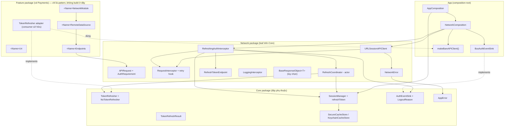
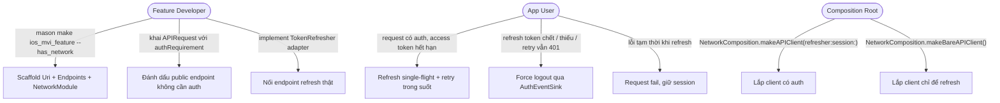
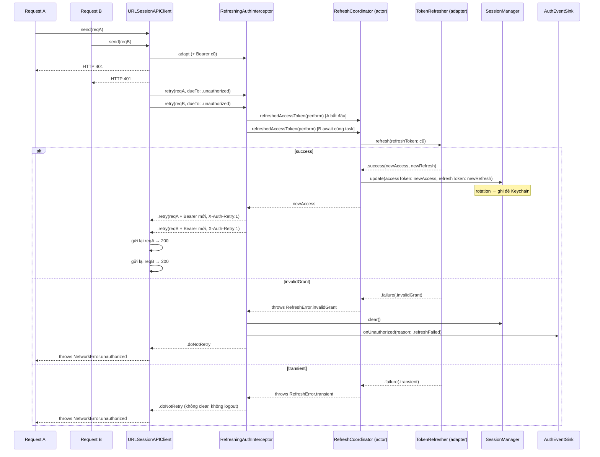

# Epic: iOS Networking Module — Hệ thống Refresh-Token & Pattern theo Feature

## 1. Meta Data

| Trường | Giá trị |
|---|---|
| **Tên epic** | `ios_networking_module` |
| **Trạng thái** | Sẵn sàng triển khai (thiết kế đã duyệt 2026-09-04) |
| **Target Release** | iOS Super App Template — bản template kế tiếp |
| **Source Spec** | [2026-09-04-ios-networking-module-design.md](2026-09-04-ios-networking-module-design.md) |
| **Tiền lệ** | Flutter `bloc_digital_wallet` — `docs/architecture/NETWORKING.md` + `docs/system-design/refresh_token.md` |
| **Branch** | `epic/ios-super-app-template` (worktree `.worktrees/ios_super_app_template`) |

---

## 2. Bối cảnh

Template Flutter cung cấp câu chuyện networking đầy đủ trong hai tài liệu: tách hạ tầng khỏi feature với URI phi tập trung theo từng feature và DI (`NETWORKING.md`), và cơ chế refresh-token an toàn với concurrency — single-flight refresh, chống vòng lặp vô hạn, xoay vòng token, lưu Keychain, whitelist public endpoint, ba case force-logout, tất cả nối qua interface Dependency-Inversion `TokenRefresher` (`refresh_token.md`).

Template iOS đã có phần hạ tầng cơ bản (`APIClient` / `URLSessionAPIClient`, `APIRequest`, `Environment`, `NetworkError → Core.AppError`, `RequestInterceptor` chỉ quan sát, `AuthTokenInterceptor`, `LoggingInterceptor`, `MockAPIClient`) nhưng **hoàn toàn chưa có luồng refresh-token**: gặp `401` chỉ gọi `Core.AuthEventSink.onUnauthorized()` một lần rồi throw. Không có retry, refresh, rotation, lưu refresh token, hay phân biệt nguyên nhân logout.

Epic này nâng module networking iOS lên đúng mức chi tiết của Flutter **không thêm dependency ngoài** (giữ nguyên invariant "No Alamofire" trong `ARCHITECTURE.md` — không Moya/Alamofire) và **không để `Network` import `Platform` hay bất kỳ feature nào** (ArchTests K7 vẫn xanh).

---

## 3. Mục tiêu & Ngoài phạm vi

### Mục tiêu

1. Hệ thống refresh-token single-flight, an toàn concurrency: seam DIP `TokenRefresher` ở `Core`, một `actor` điều phối, interceptor có khả năng refresh, rotation, lưu Keychain, whitelist public endpoint, chống vòng lặp vô hạn, ba case force-logout.
2. Nâng mô hình interceptor để interceptor có thể **retry / short-circuit** một request — bằng cách **thêm** hook `retry`, không viết lại protocol. Mọi interceptor và test hiện có vẫn compile và pass nguyên vẹn.
3. Mở rộng `Core.SessionManager` để giữ refresh token và (tùy chọn) persist cả hai token trong Keychain, với ngữ nghĩa rotation.
4. Tài liệu hoá và scaffold pattern phi tập trung theo feature: `<Name>Uri` + `<Name>Endpoints` + `<Name>NetworkModule`, sinh bởi `mason make ios_mvi_feature --has_network`.
5. Xuất bản hai tài liệu iOS mirror Flutter: `docs/architecture/NETWORKING.md` và `docs/architecture/REFRESH_TOKEN.md`; cập nhật dòng `Network` trong `ARCHITECTURE.md`.

### Ngoài phạm vi

- **Không tạo package `Auth` / `Authentication`.** Template domain-neutral. `TokenRefresher` mặc định là `NoTokenRefresher` (luôn fail → force logout). Adapter thật là việc của consumer, trình bày dưới dạng pattern copy-paste được trong docs.
- **Không bắt buộc response envelope.** `BaseResponseObject<T>` xuất bản như tiện ích tùy chọn; `send()` vẫn trả `T`.
- Không đụng `Core.ReplayQueue`, không làm offline replay.
- Không retry theo reachability (case `RetryReason.transport` được scaffold nhưng chưa dùng).
- Không thêm thư viện networking ngoài. Không viết lại protocol `RequestInterceptor`.

---

## 4. Kiến trúc & Thiết kế kỹ thuật

### 4.1 Kiến trúc tổng thể

### 4.2 Use Cases

### 4.3 Sequence Diagram — single-flight refresh (luồng chính)

### 4.4 Quyết định then chốt (từ spec đã duyệt — không bàn lại)

| Quyết định | Lý do |
|---|---|
| Mở rộng `APIClient` trên `URLSession`, không Moya/Alamofire | Invariant `ARCHITECTURE.md`; `Network` vẫn là leaf trên `Core` (K7); zero dep ngoài; URLSession + async/await là hướng iOS hiện tại |
| Thêm hook `retry` vào `RequestInterceptor` với default extension `.doNotRetry` | Additive — conformance và test hiện có không đụng |
| `RefreshCoordinator` là `actor` giữ một `Task<String, Error>?` | Single-flight an toàn data-race; các 401 đồng thời await cùng một refresh |
| Refresh token trong `SessionManager` + `SecureCacheStore` tùy chọn | Một nơi sở hữu session; rotation = ghi đè; nhánh không-store giữ hành vi in-memory và test hiện tại |
| Seam DIP `TokenRefresher` ở `Core`, default `NoTokenRefresher` | `Network` không bao giờ import feature; template domain-neutral force-logout trung thực đến khi có adapter thật |
| Header đánh dấu `X-Auth-Requirement`, `X-Auth-Retry`, được interceptor đọc + xoá | Tín hiệu nội bộ tiến trình; gói gọn trong `APIRequest` + `RefreshingAuthInterceptor`; có thể đổi sang `URLRequest` associated properties nếu muốn chặt hơn |
| `makeBareAPIClient()` cho lời gọi refresh | Chống đệ quy vô hạn (401 từ refresh lại vào luồng refresh) |
| `BaseResponseObject<T>` tùy chọn, không nối vào `send()` | Template không áp đặt shape response của backend |

---

## 5. Chiến lược Rollout & Giảm thiểu rủi ro

- **Phân đợt, một commit mỗi task**, theo thứ tự phụ thuộc (xem §6). Mỗi task kết thúc bằng quality gate từ repo root: `swiftlint --strict --config quality/.swiftlint.yml`, `swiftformat --config quality/.swiftformat . --lint`, `swift test` cho mọi package bị đụng, và `ArchTests`.
- **Không cần feature flag** — mọi thay đổi đều additive hoặc nằm sau tham số có default. App không truyền `TokenRefresher` sẽ nhận `NoTokenRefresher` và hành vi trước epic (401 → logout), chỉ khác là đi qua `RefreshingAuthInterceptor` / `AuthTokenInterceptor.retry` thay vì `URLSessionAPIClient.validate`.
- **Theo dõi thay đổi hành vi**: việc bỏ thông báo 401→sink khỏi `URLSessionAPIClient.validate` được pin bởi `UnauthorizedTests` (đã sửa) — nhánh `AuthTokenInterceptor` vẫn thông báo một lần; template luôn cài một trong hai auth interceptor.
- **Rollback**: mỗi task là một commit revert được. Revert task wiring App (Task 6) khôi phục cách lắp client trước epic mà vẫn giữ các type mới ở `Core` / `Network` (nằm im, vẫn có test).
- **Chống đệ quy**: `AppCompositionTests` khẳng định bare client không mang auth interceptor; `REFRESH_TOKEN.md` cảnh báo rõ.

---

## 6. Phân rã Kanban Tasks

| # | Task | Phạm vi | Bị chặn bởi |
|---|---|---|---|
| 1 | [Core — TokenRefresher DIP seam + LogoutReason](../../features/task_1_core_token_refresher_seam.md) | `TokenRefresher`/`TokenRefreshResult`/`TokenRefreshFailure`/`NoTokenRefresher`; `LogoutReason` + `AuthEventSink.onUnauthorized(reason:)` back-compat | — |
| 2 | [Core — SessionManager refresh token + Keychain persistence](../../features/task_2_core_session_refresh_persistence.md) | `SessionManaging.refreshToken`, `update(accessToken:refreshToken:)`, inject `SecureCacheStore` tùy chọn + reload + rotation | — |
| 3 | [Network — retry hook + AuthRequirement + bounded retry trong send](../../features/task_3_network_retry_hook.md) | `RetryReason`/`RetryDecision`; `RequestInterceptor.retry` default ext; `APIRequest.authRequirement` + marker header; vòng retry-once trong `send`; chuyển 401→sink vào `AuthTokenInterceptor.retry` | — |
| 4 | [Network — RefreshCoordinator + RefreshTokenEndpoint + RefreshingAuthInterceptor](../../features/task_4_network_refresh_machinery.md) | `RefreshCoordinator` (actor), `RefreshTokenEndpoint`, `RefreshingAuthInterceptor` (single-flight, 3-case logout, whitelist, loop guard) | 1, 2, 3 |
| 5 | [Network — BaseResponseObject&lt;T&gt; tùy chọn](../../features/task_5_network_base_response_object.md) | Tiện ích envelope `Decodable` tùy chọn; không nối vào `send()` | — |
| 6 | [App — NetworkComposition wiring + makeBareAPIClient + Keychain](../../features/task_6_app_network_composition_wiring.md) | Tham số refresher/session cho `NetworkComposition` + `makeBareAPIClient()`; `AppComposition` Keychain store + `NoTokenRefresher`; `BusAuthEventSink` map reason | 4 |
| 7 | [Mason — ios_mvi_feature --has_network scaffold Uri/Endpoints/NetworkModule](../../features/task_7_mason_has_network_scaffold.md) | Template brick + hook: `<Name>Uri`, `<Name>Endpoints`, `<Name>NetworkModule`; test sinh brick trong CI | 3 |
| 8 | [Docs — NETWORKING.md + REFRESH_TOKEN.md + cập nhật ARCHITECTURE.md](../../features/task_8_docs_networking_refresh_token.md) | Hai tài liệu kiến trúc iOS mới mirror Flutter; cập nhật dòng `Network` trong `ARCHITECTURE.md` | 6, 7 |

**Testing tier**: Task 1–6 là Tier A behavioral (BDD → TDD 1:1, RED trước GREEN). Task 7 là TDD-adapted (sinh brick + compile + assert lint). Task 8 là TDD-adapted (tài liệu — kiểm chứng bằng review link/diagram/nhất quán).
