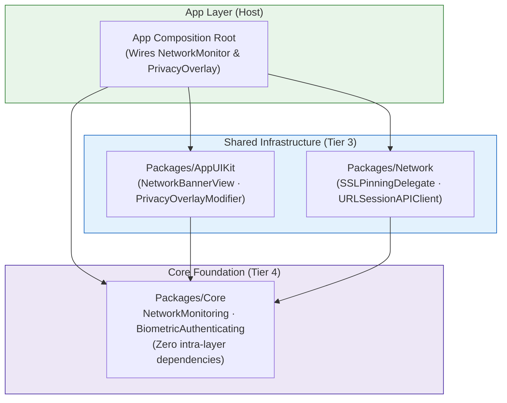

# iOS Super App Production Hardening & Foundation (Phase A Design Spec)

- **Date**: 2026-09-14
- **Topic**: iOS Production Hardening & Foundation (Phase A)
- **Status**: Draft (Under Review)
- **Author**: Antigravity Agent & Super App Architecture Team
- **Canonical Roadmap**: [`docs/PRODUCTION_ROADMAP.md`](../../PRODUCTION_ROADMAP.md)

---

## 1. Executive Summary & Goals

This specification formalizes **Phase A (Foundation & Security Hardening)** of the [iOS Production Roadmap](../../PRODUCTION_ROADMAP.md) for the `ios_digital_wallet` Super App template.

Phase A establishes four foundational pillars:
1. **Network Connectivity Monitoring & Offline Alerting**: Real-time network status detection (`NWPathMonitor`) in `Packages/Core`, surfaced through non-blocking UI in `Packages/AppUIKit`.
2. **Biometrics Authentication Manager**: Safe, hardware-backed Face ID / Touch ID authentication (`LocalAuthentication`) abstracted behind a Clean Architecture seam in `Packages/Core`.
3. **Screen & Memory Privacy Protector**: Automatic privacy protection and visual obfuscation when the application enters the iOS App Switcher or background (`ScenePhase.inactive` / `.background`) to prevent sensitive wallet data leakage.
4. **Network Security & SSL Pinning**: SPKI public-key and DER certificate pinning integrated into `Packages/Network`'s URLSession pipeline to safeguard against Man-In-The-Middle (MITM) attacks.

---

## 2. Architectural Constraints & Layer Invariants

The design strictly obeys the governed 4-tier Clean Architecture, MVI, and `ArchTests` (rules K1–K10):



1. **Domain Purity (Rule K3)**: No UI or hardware imports (`SwiftUI`, `UIKit`, `LocalAuthentication`, `Network.framework`) inside any `Sources/*/Domain/`. All hardware adapters live in `Core` or `Network` and are exposed strictly through protocols.
2. **Core Floor (Rule K7)**: `Packages/Core` depends only on Swift stdlib and Apple system frameworks (`Foundation`, `Network`, `LocalAuthentication`, `Security`). It never imports `Framework`, `Network`, `AppUIKit`, or `Platform`.
3. **AppUIKit Boundary**: `Packages/AppUIKit` depends only on `Core` — never on `Framework` or `Network`.
4. **Concurrency Model**: Full Swift 6 strict concurrency (`Sendable`, `@MainActor`, `actor`) without compiler warnings or data races.

---

## 3. Detailed Component Specifications

### 3.1 Network Connectivity Monitoring (`Packages/Core` & `Packages/AppUIKit`)

#### 3.1.1 Core Seam (`Packages/Core/Sources/Core/Network/`)
- **Protocol `NetworkMonitoring`**:
  ```swift
  import Combine
  import Foundation

  public enum NetworkStatus: Sendable, Equatable {
      case connected(isCellular: Bool)
      case disconnected
  }

  public protocol NetworkMonitoring: Sendable {
      var currentStatus: NetworkStatus { get }
      var statusPublisher: AnyPublisher<NetworkStatus, Never> { get }
      func start()
      func stop()
  }
  ```
- **Implementation `SystemNetworkMonitor`**:
  - Uses Apple's `NWPathMonitor` running on a dedicated serial background `DispatchQueue(label: "com.digitalwallet.networkmonitor")`.
  - Publishes updates via a thread-safe `CurrentValueSubject<NetworkStatus, Never>`.
  - Conforms to `@unchecked Sendable` with lock-guarded state or an `actor`.
- **Mock `MockNetworkMonitor`**:
  - Test helper that allows tests to manually simulate online, cellular, and disconnected transitions.

#### 3.1.2 UI Component (`Packages/AppUIKit/Sources/AppUIKit/Components/Network/`)
- **Component `NetworkBannerView`**:
  - Non-blocking notification banner positioned at the top of the screen (under safe area).
  - Animates smoothly with `.easeInOut` when transitioning between disconnected and connected.
  - Displays localized offline warning with an optional retry callback.

---

### 3.2 Biometrics Authentication Manager (`Packages/Core`)

#### 3.2.1 Core Seam (`Packages/Core/Sources/Core/Security/Biometrics/`)
- **Data Models**:
  ```swift
  public enum BiometricType: Sendable, Equatable {
      case none
      case touchID
      case faceID
  }

  public enum BiometricError: Error, Sendable, Equatable {
      case notAvailable
      case notEnrolled
      case lockout
      case userCancelled
      case failed
      case unknown(String)
  }
  ```
- **Protocol `BiometricAuthenticating`**:
  ```swift
  public protocol BiometricAuthenticating: Sendable {
      var biometricType: BiometricType { get }
      func canAuthenticate() -> Bool
      func authenticate(reason: String) async throws -> Bool
  }
  ```
- **Implementation `LocalAuthenticationManager`**:
  - Wraps `LAContext` using `evaluatePolicy(.deviceOwnerAuthenticationWithBiometrics, localizedReason: reason)`.
  - Automatically maps `LAError` codes to strongly-typed `BiometricError`.
  - Supports unit testing via an injectable `LAContextProtocol` abstraction.

---

### 3.3 Screen & Memory Privacy Protector (`App` & `Packages/AppUIKit`)

#### 3.3.1 Privacy View Modifier (`Packages/AppUIKit/Sources/AppUIKit/Modifiers/`)
- **Modifier `PrivacyOverlayModifier`**:
  - Observes `ScenePhase` from SwiftUI environment.
  - When phase is `.inactive` or `.background`, overlays an ultra-thin material blur view (`Material.ultraThinMaterial` / `Color.black.opacity(0.8)`) with the app logo.
  - Automatically dismisses when phase returns to `.active`.
  - Prevents iOS from writing unencrypted screen memory to disk during task switcher snapshot generation.

#### 3.3.2 Host Composition (`App/Sources/Composition/`)
- Attached at the root level in `App/Sources/RootView.swift` wrapping `ShellView`.

---

### 3.4 SSL Pinning Subsystem (`Packages/Network`)

#### 3.4.1 Security Seam (`Packages/Network/Sources/Network/Security/`)
- **Pinning Configuration**:
  ```swift
  public struct SSLPinningConfig: Sendable, Equatable {
      public let enabled: Bool
      public let pinnedHashes: [String: [String]] // host -> array of SHA256 SPKI hashes

      public init(enabled: Bool, pinnedHashes: [String: [String]]) {
          self.enabled = enabled
          self.pinnedHashes = pinnedHashes
      }

      public static let disabled = SSLPinningConfig(enabled: false, pinnedHashes: [:])
  }
  ```
- **URLSession Delegate `SSLPinningDelegate`**:
  - Conforms to `NSObject, URLSessionDelegate`.
  - Implements `urlSession(_:didReceive:completionHandler:)` for `NSURLAuthenticationMethodServerTrust`.
  - Extracts the Server Certificate Chain -> extracts Subject Public Key Info (SPKI) -> computes SHA-256 hash -> validates against `pinnedHashes`.
  - Rejects connection with `NetworkError.sslPinningFailed` if validation fails.
- **Environment Integration**:
  - Configurable per `AppEnvironment` (e.g. bypassed in `dev` / `mock`, enforced in `stg` / `prd`).

---

## 4. Test Strategy & Verification Plan

| Component | Target Package | Test File | Scenarios Covered |
|---|---|---|---|
| `NetworkMonitor` | `Packages/Core` | `Tests/CoreTests/NetworkMonitorTests.swift` | Status change emissions, start/stop lifecycle, cellular vs wifi detection |
| `BiometricAuthManager` | `Packages/Core` | `Tests/CoreTests/BiometricAuthManagerTests.swift` | Success authentication, user cancel, biometric lockout, fallback |
| `SSLPinningDelegate` | `Packages/Network` | `Tests/NetworkTests/SSLPinningDelegateTests.swift` | Valid pin handshake, untrusted cert rejection, expired cert rejection, bypass in disabled mode |
| `NetworkBannerView` | `Packages/AppUIKit` | `Tests/AppUIKitTests/NetworkBannerViewTests.swift` | Snapshot / rendering under offline vs online state |
| Architecture Gate | `ArchTests` | `swift test --package-path ArchTests` | Full AST rules K1–K10 pass without regression |

---

## 5. Work Breakdown & Execution Phases

- **Task 1**: Core Foundation — `NetworkMonitoring` & `BiometricAuthenticating` protocols, models, and system implementations in `Packages/Core` with unit tests.
- **Task 2**: AppUIKit Layer — `NetworkBannerView` and `PrivacyOverlayModifier` in `Packages/AppUIKit`.
- **Task 3**: Network Security — `SSLPinningDelegate` and pinning configuration in `Packages/Network` with unit tests.
- **Task 4**: Host Wiring & E2E Validation — Integration in `App`, verifying `ScenePhase` privacy overlay and live offline banner toggling.
- **Task 5**: Architecture & CI Gate — Run `ArchTests`, `swiftlint --strict`, `swiftformat --lint`, and update documentation references.
