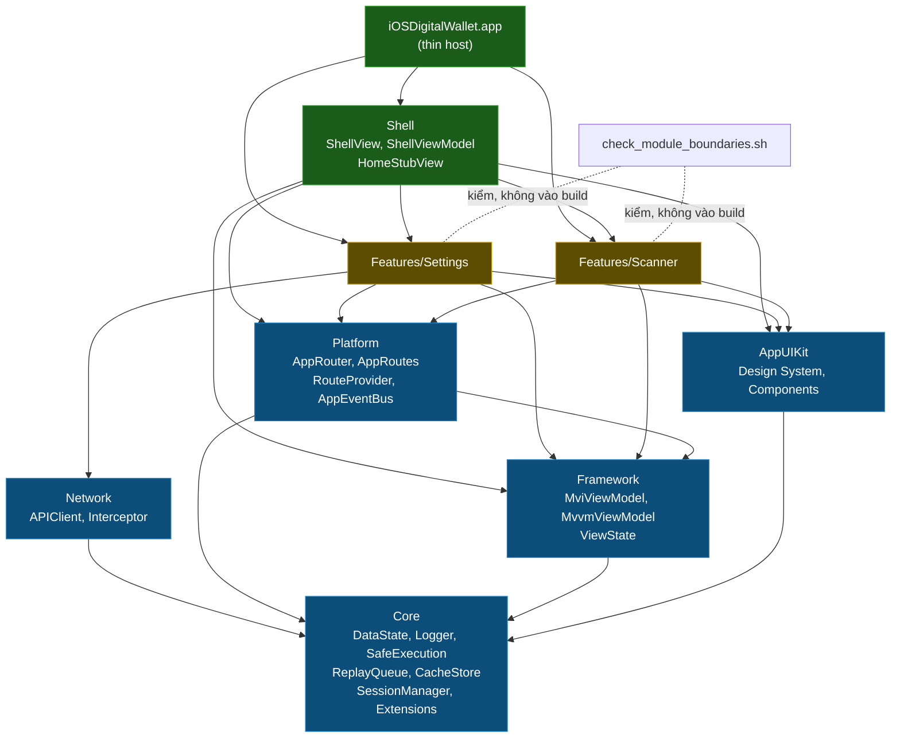

# Epic: iOS Super App Template — Chuẩn hoá kiến trúc Native iOS

**Ngày**: 2026-09-02  
**Trạng thái**: Draft — chờ review  
**Epic name (dự kiến)**: `ios_super_app_template`

## Nguồn tham chiếu

| Tài liệu | Vai trò |
|---|---|
| `.devtool/epic/flutter_super_app_template/2026-08-29-flutter-super-app-template-design.md` | **Kim chỉ nam iOS native** — quyết định Combine/ObservableObject, SPM-only, SwiftLint/SwiftFormat, MviViewModel mapping 1:1 từ Kotlin, min target iOS 13 (mục 3.5, 3.5.1). |
| `.devtool/epic/android_super_app_template/2026-09-02-android-super-app-template-design.md` | **Kim chỉ nam layer & module** — 5 module hạ tầng, Clean Architecture + MVI + Feature-First, governance 4 trụ / 8 tiêu chí. Bản iOS bám 1:1, chỉ đổi thuật ngữ nền tảng (Gradle module → SPM local package, Konsist → SwiftLint custom rule + boundary script, Hilt → Constructor Injection thủ công). |
| `bloc_digital_wallet/docs/architecture/ARCHITECTURE.md` | **Nguồn chân lý về layer**: `Presentation → Domain ← Data`, Unidirectional Data Flow, naming Action/State/Event/ViewModel/UseCase/Screen/Repository. |
| `iOSDigitalWallet` (repo này) | Hiện trạng: Xcode project mới toanh — chỉ có `iOSDigitalWalletApp.swift` + `ContentView.swift`. Không có layer, không có module, không có tooling. |

---

## 1. Mục tiêu (Goals)

| # | Mục tiêu | Bám tài liệu |
|---|---|---|
| **G1** | **Clean Architecture + MVI + Feature-First** đúng như `ARCHITECTURE.md` Flutter: `Presentation → Domain ← Data`, Domain thuần Swift (cấm `import UIKit/SwiftUI/Combine`), Unidirectional Data Flow, single entry point `dispatch()` → `onAction()`, naming `*Action/*State/*Event/*ViewModel/*UseCase/*View/*Repository`. | ARCHITECTURE.md §I–III |
| **G2** | **5 SPM local packages hạ tầng** khớp 1:1 `packages/` Flutter và `:*` Android: `Core`, `Framework`, `Network`, `AppUIKit`, `Platform`. Mọi Feature chỉ phụ thuộc các package này, không phụ thuộc Feature khác. | android_super_app_template §4.1 |
| **G3** | **Host (App + Shell) là container thuần**: DI wiring, `AppRouter` + `ShellView` + tab layout. `HomeStubView` nằm trong Shell (không phải Feature module riêng). | android_super_app_template G3 |
| **G4** | **Giao tiếp cross-feature tập trung**: `Platform` chứa `AppRouter` + `AppEventBus`. Feature đăng ký route qua `RouteProvider` protocol. Cấm `import` chéo giữa `Features/*`. | android_super_app_template G4 |
| **G5** | **State isolation**: mỗi Feature giữ `MviViewModel` riêng (từ `Framework`). Constructor Injection thủ công. Type trong `Features/*/Data/` phải `internal`. | android_super_app_template G5 |
| **G6** | **Governance ép bằng cấu trúc**: SwiftLint custom rules kiểm layer + boundary + naming; `check_module_boundaries.sh` kiểm import chéo; GitHub Actions CI. | android_super_app_template G6 |
| **G7** | **Feature mới = 1 lệnh Mason** (`mason make ios_mvi_feature --name X`), sinh đủ layer Data/Domain/Presentation + `RouteProvider`. Không đụng Feature khác. | ARCHITECTURE.md §III.3 |
| **G8** | **Template native iOS**: 5 infra packages + Shell + 3 feature (home stub / scanner / settings). `scripts/rename_project.sh` là cửa vào duy nhất sau clone. | flutter_super_app_template §4 |
| **G9** | **Sandbox development**: mỗi Feature build/test độc lập (Unit Test target không cần app). | android_super_app_template G9 |

## 2. Non-Goals

- **DI framework** (Swinject, Needle): Constructor Injection thủ công — không thêm dependency ngoài vào tầng nền tảng.
- **@Observable / swift-perception**: giữ Combine + `ObservableObject`, min target iOS 13 (đã chốt flutter_super_app_template §3.5).
- **App Extension** (Widget, Share, Watch): ngoài phạm vi. Kiến trúc sẵn sàng nhưng không làm trong epic.
- **Dynamic on-demand loading**: iOS không có cơ chế tương đương DFM Android — template là monolithic app đơn, gap đã biết.
- **CocoaPods**: SPM-only (đã chốt flutter_super_app_template §3.5.1).
- **Đổi business logic digital wallet** trong repo gốc.
- **KMP / Flutter integration**: đây là iOS Native App đơn thuần.

## 3. Nguyên tắc bao trùm

1. **App build & chạy được ở MỌI bước.** Migration chia phase nhỏ, mỗi phase là 1 PR.
2. **`ARCHITECTURE.md` Flutter là nguồn chân lý về layer.** Bản iOS chỉ ánh xạ thuật ngữ. Phase 1 viết `docs/architecture/ARCHITECTURE.md` bản iOS, cùng cấu trúc mục lục.
3. **SwiftLint + boundary script ép layer, không phải review thủ công.** Rule vi phạm = CI đỏ.
4. **`Core` là nền bắt buộc cho mọi module. `Framework` chỉ cho module có UI/state.**
5. **SPM-only**: không CocoaPods.
6. **Constructor Injection thủ công** ở mọi tầng.

---

## 4. Kiến trúc đích

### 4.1 Cấu trúc thư mục

```
iOSDigitalWallet/
├── iOSDigitalWallet.xcodeproj
├── iOSDigitalWallet/                    ← App target (thin)
│   ├── App/
│   │   └── iOSDigitalWalletApp.swift   ← @main, DI root wiring
│   ├── Shell/                           ← Container Host (không phải Feature)
│   │   ├── ShellView.swift
│   │   ├── ShellViewModel.swift         ← MviViewModel<ShellState,ShellAction,ShellEvent>
│   │   └── Tabs/
│   │       └── HomeStubView.swift
│   └── Features/
│       ├── Settings/
│       │   ├── Data/
│       │   ├── Domain/
│       │   └── Presentation/
│       └── Scanner/
│           ├── Data/
│           ├── Domain/
│           └── Presentation/
│
├── Sources/                             ← SPM local packages
│   ├── Core/
│   │   ├── Package.swift
│   │   └── Sources/Core/
│   │       ├── DataState.swift
│   │       ├── AppError.swift
│   │       ├── Logger.swift
│   │       ├── SafeExecution.swift
│   │       ├── ReplayQueue.swift
│   │       ├── Cache/CacheStore.swift
│   │       └── Session/SessionManager.swift
│   ├── Framework/
│   │   ├── Package.swift               ← depends on Core
│   │   └── Sources/Framework/
│   │       └── Base/
│   │           ├── MvvmViewModel.swift
│   │           ├── MviViewModel.swift
│   │           └── ViewState.swift
│   ├── Network/
│   │   ├── Package.swift               ← depends on Core
│   │   └── Sources/Network/
│   │       ├── APIClient.swift
│   │       ├── Interceptor/
│   │       └── Environment/
│   ├── AppUIKit/                        ← tên package tránh trùng UIKit Apple
│   │   ├── Package.swift               ← depends on Core (KHÔNG depends on Framework)
│   │   └── Sources/AppUIKit/
│   │       ├── DesignSystem/
│   │       └── Components/
│   └── Platform/
│       ├── Package.swift               ← depends on Core + Framework
│       └── Sources/Platform/
│           ├── Navigation/
│           │   ├── AppRoute.swift
│           │   ├── AppRoutes.swift
│           │   ├── RouteProvider.swift
│           │   └── AppRouter.swift
│           └── Events/
│               ├── AppEvent.swift
│               └── AppEventBus.swift
│
├── quality/
│   ├── .swiftlint.yml
│   └── .swiftformat
│
├── scripts/
│   ├── check_module_boundaries.sh
│   ├── module_boundary_whitelist.txt
│   └── rename_project.sh
│
├── bricks/
│   └── ios_mvi_feature/
│       ├── brick.yaml
│       ├── __brick__/
│       └── hooks/post_gen.dart
│
├── docs/architecture/ARCHITECTURE.md   ← viết ở Phase 1
└── .github/workflows/ci.yml
```

### 4.2 Bản đồ module (1:1 Flutter/Android)

| iOS (SPM package) | Flutter (`packages/`) | Android (`:module`) | Nội dung chính |
|---|---|---|---|
| `Core` | `core` | `:core` | `DataState`, `AppError`, `Logger`, `SafeExecution`, `ReplayQueue`, `CacheStore`, `SessionManager`, extensions |
| `Framework` | `framework` | `:framework` | `MvvmViewModel`, `MviViewModel`, `ViewState` — phụ thuộc `Core` |
| `Network` | `network` | `:network` | `APIClient`, Interceptor, Environment — phụ thuộc `Core` |
| `AppUIKit` | `ui_kit` | `:ui_kit` | Design System SwiftUI, Common Components — phụ thuộc `Core`, **KHÔNG** phụ thuộc `Framework` |
| `Platform` | `platform` | `:platform` | `AppRouter`, `AppRoutes`, `RouteProvider`, `AppEventBus`, `AppEvent` — phụ thuộc `Core` + `Framework` |

### 4.3 Sơ đồ phụ thuộc



**Bất biến:** mọi mũi tên đổ về `Core`; không Feature nào trỏ sang Feature khác; chỉ App/Shell được gom nhiều Feature; `AppUIKit` không phụ thuộc `Framework`.

### 4.4 Layer trong 1 Feature

```
Features/{Name}/
├── Data/           🔵 internal — RepositoryImpl, DataSource, DTO, Mapper
│   ├── Remote/     {Name}APIService.swift, {Name}DTO.swift
│   ├── Local/      {Name}LocalDataSource.swift
│   ├── Mapper/     {Name}Mapper.swift
│   └── Repository/ {Name}RepositoryImpl.swift (implements Domain/{Name}Repository)
│
├── Domain/         🟡 public — thuần Swift, KHÔNG import UIKit/SwiftUI/Combine
│   ├── Entity/     {Name}Entity.swift (struct, value type)
│   ├── Repository/ {Name}Repository.swift (protocol)
│   └── UseCase/    {Action}UseCase.swift
│
└── Presentation/   🟢 public — SwiftUI Views + MviViewModel
    ├── {Sub}/
    │   ├── {Sub}Action.swift
    │   ├── {Sub}State.swift
    │   ├── {Sub}Event.swift
    │   ├── {Sub}ViewModel.swift
    │   └── {Sub}View.swift
    └── {Name}RouteProvider.swift     ← implements RouteProvider
```

**Quy tắc (SwiftLint kiểm):**
- `Data/` không có `public` type
- `Domain/` không có `import SwiftUI`, `import UIKit`, `import Combine`
- `Presentation/` không import trực tiếp `Data/` layer
- Feature không import Feature khác

---

## 5. Framework module — MviViewModel

### 5.1 Mapping 1:1 với Kotlin

| Kotlin (Coroutines/Flow) | Swift (Combine) |
|---|---|
| `uiState: StateFlow<STATE>` | `@Published var uiState: STATE` |
| `viewState: StateFlow<ViewState<STATE>>` | `@Published var viewState: ViewState<STATE>` |
| `event` (Channel, 1 collector) | `PassthroughSubject<EVENT, Never>` (convention: 1 View subscribe) |
| `sharedEvent` (SharedFlow, nhiều collector) | `PassthroughSubject<EVENT, Never>` (multicast tự nhiên) |
| `dispatch(action)` → `onAction()` | `func dispatch(_ action: ACTION)` → `onAction(_:)` |
| `reduce { copy(...) }` | `func reduce(_ transform: (inout STATE) -> Void)` |
| `startLoading()` / `handleError()` | cùng tên, update `viewState` |

### 5.2 MvvmViewModel (base)

```swift
open class MvvmViewModel: ObservableObject {
    var cancellables = Set<AnyCancellable>()
    open func onClear() { cancellables.removeAll() }
    deinit { onClear() }
}
```

### 5.3 ViewState

```swift
public enum ViewState<STATE> {
    case loading
    case error(Error)
    case content(STATE)
}
```

### 5.4 MviViewModel (generic)

```swift
open class MviViewModel<STATE, ACTION, EVENT>: MvvmViewModel {
    @Published public private(set) var uiState: STATE
    @Published public private(set) var viewState: ViewState<STATE> = .loading

    // Single consumer convention
    public let eventSubject = PassthroughSubject<EVENT, Never>()
    // Multi consumer
    public let sharedEventSubject = PassthroughSubject<EVENT, Never>()

    public init(initialState: STATE) { self.uiState = initialState }

    public final func dispatch(_ action: ACTION) { onAction(action) }
    open func onAction(_ action: ACTION) {}
    public func reduce(_ transform: (inout STATE) -> Void) { transform(&uiState) }

    public func startLoading() { viewState = .loading }
    public func handleError(_ error: Error) { viewState = .error(error) }
    public func showContent() { viewState = .content(uiState) }
}
```

---

## 6. Platform module

### 6.1 Navigation

```swift
// AppRoute.swift
public protocol AppRoute: Hashable {}

// AppRoutes.swift — route dùng chéo giữa Features
public enum AppRoutes {
    public struct SettingsRoute: AppRoute {}
    public struct ScannerRoute: AppRoute {}
}

// RouteProvider.swift — tương đương EntryProviderInstaller (Android)
public protocol RouteProvider {
    func canHandle(route: AnyHashable) -> Bool
    @ViewBuilder func view(for route: AnyHashable) -> AnyView
}

// AppRouter.swift — tương đương Navigator + NestedNavigator (Android)
public final class AppRouter: ObservableObject {
    @Published public var path = NavigationPath()  // iOS 16+
    private var providers: [RouteProvider] = []

    public func register(_ provider: RouteProvider) { providers.append(provider) }
    public func navigate(to route: some AppRoute) { path.append(route) }
    public func pop() { guard !path.isEmpty else { return }; path.removeLast() }
    public func popToRoot() { path.removeLast(path.count) }
    public func view(for route: AnyHashable) -> AnyView? {
        providers.first { $0.canHandle(route: route) }?.view(for: route)
    }
}
```

**Gap NavigationPath**: `NavigationPath` yêu cầu iOS 16+. Business logic (Core, Domain) vẫn iOS 13+. Navigation layer chấp nhận iOS 16+ — ghi rõ trong ARCHITECTURE.md, phổ biến với thực tế thị trường 2025+.

### 6.2 AppEventBus

```swift
// AppEvent.swift — tương đương sealed interface AppEvent (Android)
public protocol AppEvent {}

// Lifecycle vocabulary tối thiểu — mirror bộ Android/Flutter
public struct ShellTabVisibilityChanged: AppEvent {
    public let tabIndex: Int; public let isVisible: Bool
}
public struct AppLifecycleChanged: AppEvent {
    public enum AppLifecycleState { case foreground, background, inactive }
    public let state: AppLifecycleState
}
public struct UserLoggedOut: AppEvent {}

// AppEventBus.swift — tương đương AppEventBus Android (SharedFlow<AppEvent>)
public final class AppEventBus {
    public static let shared = AppEventBus()
    private let subject = PassthroughSubject<any AppEvent, Never>()
    private init() {}

    public func publish(_ event: any AppEvent) { subject.send(event) }

    public func on<T: AppEvent>(_ type: T.Type) -> AnyPublisher<T, Never> {
        subject.compactMap { $0 as? T }.eraseToAnyPublisher()
    }
}
```

---

## 7. Core module

```swift
// DataState<T> — tương đương Either<Failure,T> (Flutter) / DataState<T> (Android)
public enum DataState<T> {
    case success(T)
    case error(AppError)
    case loading
}

// SafeExecution — bắt buộc wrap mọi OS-triggered entry point
public struct SafeExecution {
    public static func run<T>(logger: Logger? = nil, label: String = "",
                               fallback: T, _ block: () throws -> T) -> T {
        do { return try block() }
        catch {
            logger?.error("[\(label)] SafeExecution: \(error)", file: #file, function: #function, line: #line)
            return fallback
        }
    }
}

// ReplayQueue<T> — OS-triggered code lưu event, app đọc lại khi mở
public actor ReplayQueue<T: Codable> {
    private var items: [T] = []
    public init() {}
    public func enqueue(_ item: T) { items.append(item) }
    public func dequeueAll() -> [T] { defer { items.removeAll() }; return items }
}

// Logger protocol — implementation trong app/logging module
public protocol Logger {
    func debug(_ message: String, file: String, function: String, line: Int)
    func info(_ message: String, file: String, function: String, line: Int)
    func error(_ message: String, file: String, function: String, line: Int)
}

// CacheStore protocol
public protocol CacheStore {
    func get<T: Codable>(key: String) -> T?
    func set<T: Codable>(key: String, value: T)
    func remove(key: String)
    func clearAll()
}
```

---

## 8. Giao tiếp cross-feature

| Kênh | Ở đâu | Hình dạng | Enforce |
|---|---|---|---|
| **`AppRoutes`** (route registry) | `Platform` | `struct XxxRoute: AppRoute`; điều hướng: `appRouter.navigate(to: AppRoutes.SettingsRoute())` | không cần — route không lộ implementation |
| **`AppEventBus`** | `Platform` | `PassthroughSubject<any AppEvent, Never>` broadcast | không cần |
| **`RouteProvider`** protocol | cơ chế ở `Platform`, mỗi Feature implement | Feature `class SettingsRouteProvider: RouteProvider`; Shell `appRouter.register(...)` | Shell không import Feature trực tiếp |
| **Direct composition** | App, Shell | DI wiring root + `ShellView` | `check_module_boundaries.sh` — đặc quyền chỉ Host |

Không có kênh request/response giữa 2 Feature. Cần kết quả typed → Dependency Inversion: protocol ở `Core`, Feature kia implement.

**Lifecycle events tối thiểu** (mirror bộ Android): `ShellTabVisibilityChanged` (Shell publish khi tab đổi), `AppLifecycleChanged` (AppDelegate publish), `UserLoggedOut` (Network interceptor 401 publish).

---

## 9. Tooling chất lượng

### 9.1 SwiftLint (quality/.swiftlint.yml) — các custom rules chính

```yaml
custom_rules:
  no_ui_in_domain:                        # K3 equivalent
    included: ".*/Domain/.*\\.swift"
    regex: "^import (UIKit|SwiftUI|Combine)"
    message: "Domain thuần Swift — không import UIKit/SwiftUI/Combine"
    severity: error

  no_public_in_data:                      # K4 equivalent
    included: ".*/Data/.*\\.swift"
    regex: "^public (class|struct|enum|func|var|let)"
    message: "Data layer phải internal — không dùng public"
    severity: error

  viewmodel_naming:                       # K5 equivalent
    included: ".*ViewModel\\.swift"
    regex: "class \\w+ViewModel: (?!MviViewModel|MvvmViewModel)"
    message: "ViewModel phải kế thừa MviViewModel hoặc MvvmViewModel"
    severity: warning

  route_must_be_in_platform:              # K9 equivalent
    included: ".*/Features/.*Route\\.swift"
    regex: "struct \\w+Route.*AppRoute"
    message: "Route dùng chéo phải khai ở Platform/AppRoutes.swift"
    severity: warning
```

### 9.2 check_module_boundaries.sh (K1/K6 equivalent)

```bash
#!/usr/bin/env bash
# Kiểm cross-feature import: Feature không được import Feature khác
set -euo pipefail
FEATURES_DIR="iOSDigitalWallet/Features"
WHITELIST="scripts/module_boundary_whitelist.txt"
VIOLATIONS=0
FEATURES=($(ls "$FEATURES_DIR"))
for feature in "${FEATURES[@]}"; do
    for other in "${FEATURES[@]}"; do
        [[ "$feature" == "$other" ]] && continue
        if grep -rq "// import.*$other\|import $other" "$FEATURES_DIR/$feature" \
           --include="*.swift" 2>/dev/null; then
            entry="${feature}→${other}"
            if ! grep -qF "$entry" "$WHITELIST" 2>/dev/null; then
                echo "❌ VIOLATION: $feature imports $other (not whitelisted)"; VIOLATIONS=$((VIOLATIONS+1))
            fi
        fi
    done
done
[[ $VIOLATIONS -gt 0 ]] && exit 1 || echo "✅ Module boundaries clean."
```

### 9.3 GitHub Actions (.github/workflows/ci.yml)

```yaml
name: iOS CI
on:
  pull_request:
  push:
    branches: [develop, main]

jobs:
  quality:
    runs-on: macos-15
    steps:
      - uses: actions/checkout@v4
      - run: brew install swiftlint swiftformat
      - run: swiftlint --config quality/.swiftlint.yml --reporter github-actions-logging
      - run: swiftformat --config quality/.swiftformat . --lint
      - run: bash scripts/check_module_boundaries.sh

  build-and-test:
    runs-on: macos-15
    needs: quality
    steps:
      - uses: actions/checkout@v4
      - run: |
          xcodebuild -resolvePackageDependencies \
            -project iOSDigitalWallet.xcodeproj -scheme iOSDigitalWallet
      - run: |
          xcodebuild test \
            -project iOSDigitalWallet.xcodeproj \
            -scheme iOSDigitalWallet \
            -destination 'platform=iOS Simulator,name=iPhone 16,OS=latest' \
            CODE_SIGNING_ALLOWED=NO
```

---

## 10. Mason brick `ios_mvi_feature`

```yaml
# bricks/ios_mvi_feature/brick.yaml
name: ios_mvi_feature
description: "Sinh iOS Feature scaffold với đầy đủ layer Data/Domain/Presentation + RouteProvider"
vars:
  name:
    type: string
    description: "Feature name (PascalCase)"
    prompt: "Feature name?"
  has_network:
    type: boolean
    description: "Feature có gọi API không?"
    default: true
```

`post_gen.dart` xuất ra **checklist thủ công** (không tự sửa `.pbxproj` — quá dễ corrupt):
1. Thêm folder `Features/{Name}/` vào Xcode project target membership
2. Đăng ký `{Name}RouteProvider` trong `iOSDigitalWalletApp.swift`
3. Thêm route vào `AppRoutes.swift` (nếu route dùng chéo)

---

## 11. Template 3 Features

| Feature | Loại | Nội dung | Tương đương |
|---|---|---|---|
| **Home** | Stub page trong Shell | `HomeStubView.swift` — không phải Feature module riêng | Flutter: `lib/shell/tabs/home_stub_page.dart`; Android: `HomeStubPage.kt` trong `:shell` |
| **Scanner** | Feature module, stub | Đủ scaffold (Data/Domain/Presentation), không logic | Flutter: `scanner` package rỗng; Android: `features/scanner` rỗng |
| **Settings** | Feature module, thật | Settings screen thật — mẫu tham khảo | Flutter: `settings`; Android: `features/settings` |

Shell 3 tab: home (stub) / scanner (rỗng) / settings (thật). Tab mặc định = settings (index cuối) — khớp Flutter/Android.

---

## 12. Script rename_project.sh

Cửa vào duy nhất sau clone:
```bash
./scripts/rename_project.sh MyWallet com.mycompany.mywallet
```

Thực hiện:
1. Đổi tên Swift files + thư mục (`iOSDigitalWallet` → `MyWallet`)
2. Thay string trong `.swift`, `.plist`, `.pbxproj`, `Package.swift`
3. Đổi `PRODUCT_BUNDLE_IDENTIFIER` trong `.pbxproj`
4. Đổi `CFBundleDisplayName` trong `Info.plist`
5. **Không đổi** namespace SPM infra packages (`Core`, `Framework`, `Network`, `AppUIKit`, `Platform`) — coi là "vendor namespace" của template
6. Verify: `xcodebuild build` thành công

---

## 13. Giả định · Rủi ro · Phụ thuộc

### Giả định

- Min deployment target: **iOS 13** cho business logic/Core; **iOS 16** cho navigation layer (`NavigationPath`) — gap đã biết, ghi rõ trong ARCHITECTURE.md.
- Xcode project monolithic (1 `.xcodeproj`) — đủ cho template.
- Phase 0–1 dùng Xcode group + folder, Phase 1+ chuyển sang SPM local packages — giảm rủi ro setup Xcode.

### Rủi ro

| Rủi ro | Giảm thiểu |
|---|---|
| SPM local package resolution phức tạp trong Xcode | Phase 0 dùng Xcode group trước; chuyển SPM từ Phase 1 — kiểm chứng architecture trước tooling |
| SwiftLint custom rules kém mạnh hơn Konsist (không đọc AST) | `check_module_boundaries.sh` bổ trợ; bù đắp bằng PR review guideline |
| `NavigationPath` gap iOS 13–15 | Ghi rõ gap; giai đoạn đầu dùng `NavigationView` (iOS 14+) làm interim; update khi cần |
| `post_gen.dart` không tự sửa `.pbxproj` | Xuất checklist thủ công — an toàn hơn, tránh corrupt project file |
| Mason brick không wire Xcode target | Tương đương: Flutter brick không wire `ios/Runner.xcodeproj`; đây là gap chấp nhận được |

### Phụ thuộc

- Không phụ thuộc Flutter/Android epic — độc lập repo.
- Mason CLI (`mason.yaml`), SwiftLint, SwiftFormat cài sẵn trên máy dev (document trong README).
- Quyền tạo `.github/workflows/` + bật Actions cho repo.

---

## 14. Lộ trình (4 Phase)

Branch: `epic/ios-super-app-template`. **App build & chạy được ở mọi ranh giới phase.**

| Phase | Kết quả | Đảo ngược |
|---|---|---|
| **Phase 0 — Nền móng** | `quality/` tooling, `scripts/check_module_boundaries.sh`, `.github/workflows/ci.yml`, Mason brick scaffold (chưa `post_gen`). **Không đổi hành vi app.** CI xanh trên Hello World. | Xoá files mới; không đụng gì khác. |
| **Phase 1 — 5 SPM Infra Packages + ARCHITECTURE.md** | `Sources/Core`, `Framework`, `Network`, `AppUIKit`, `Platform` build. Unit tests xanh. SwiftLint K2/K3 bật. `docs/architecture/ARCHITECTURE.md` bản iOS. | Mỗi package là 1 PR; revert PR. |
| **Phase 2 — Shell + Features** | Tổ chức `App/` + `Shell/` + `Features/`; `ShellView` + `ShellViewModel`; `HomeStubView`; `Settings` thật; `Scanner` stub. SwiftLint K4/K5 bật. App 3 tab chạy được. | Thêm lại whitelist là đòn bẩy rollback. |
| **Phase 3 — Template hoá + rename + nghiệm thu** | `ios_mvi_feature` brick hoàn chỉnh; `rename_project.sh`; generic hoá docs/agents. Test: clone → rename → `mason make ios_mvi_feature --name Payments` → `xcodebuild test` xanh. | Trích template trên worktree riêng; develop không bị ảnh hưởng. |

---

## 15. Self-review

- **Placeholder**: không còn TBD/TODO.
- **Mâu thuẫn iOS 13 vs iOS 16**: đã ghi nhận là gap ở §13 và §6.1. Core/Domain iOS 13+; Navigation iOS 16+. Nhất quán với thực tế thị trường 2025+.
- **Scope**: đủ lớn → epic. 4 phase, mỗi phase ra `task_N_*.md` qua `epic-designer`.
- **Nhập nhằng `AppUIKit`**: tên rõ để tránh trùng `UIKit` của Apple. Ghi chú trong ARCHITECTURE.md.
- **SPM local package vs Xcode group**: Phase 0 dùng Xcode group, Phase 1 chuyển SPM — kế hoạch giảm rủi ro rõ ràng.
- **`AppUIKit` không phụ thuộc `Framework`**: đúng — design system không cần ViewModel/ObservableObject; Component chỉ cần `@Binding` hoặc dữ liệu thuần, không quản lý state.
- **Helicopter view**: 5 infra packages bám đúng Flutter/Android chia; Platform phụ thuộc Framework (chấp nhận — `RouteProvider` cần SwiftUI `AnyView`, `AppRouter` là `ObservableObject`); gap DFM so với Android đã ghi nhận rõ là Non-Goal.
