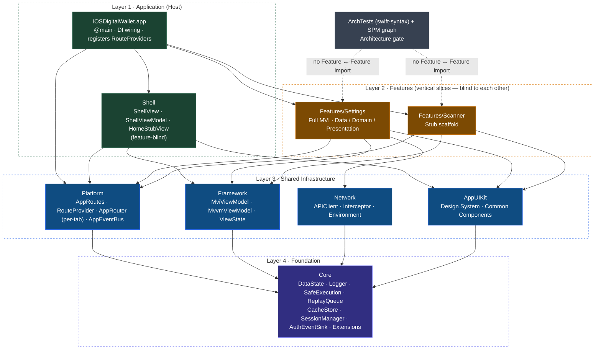
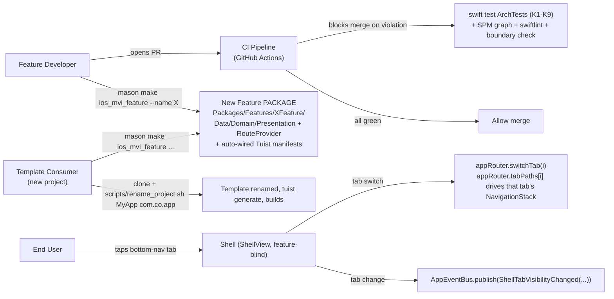
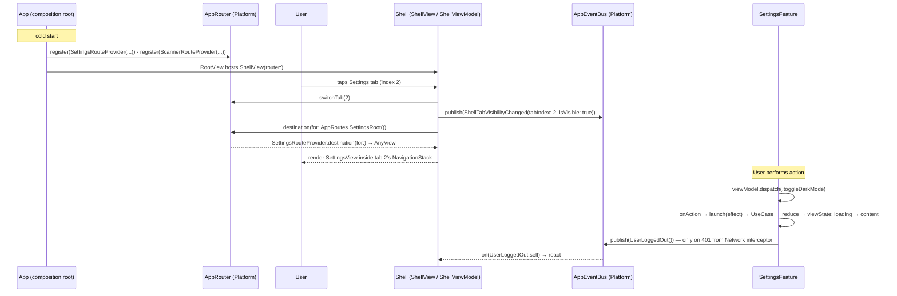

# Epic: iOS Super App Template

## Table of Contents
1. [Meta Data](#1-meta-data)
2. [Background](#2-background)
3. [Goals & Non-Goals](#3-goals--non-goals)
4. [Architecture & Technical Design](#4-architecture--technical-design)
   1. [High-Level Architecture](#41-high-level-architecture)
   2. [Use Cases](#42-use-cases)
   3. [Sequence Diagram — Primary Flow (Feature Navigation)](#43-sequence-diagram--primary-flow-feature-navigation)
   4. [Cross-Feature Communication Channels](#44-cross-feature-communication-channels)
5. [Rollout Strategy & Mitigation](#5-rollout-strategy--mitigation)
6. [Kanban Tasks Breakdown](#6-kanban-tasks-breakdown)

## 1. Meta Data
- **Epic Name**: `ios_super_app_template`
- **Status**: Phased rollout — Phase 0 tasks (1–3) are `todo`; Phases 1–3 tasks (4–15) stay `backlog` and are promoted to `todo` one phase at a time as the preceding phase completes.
- **Revised**: 2026-09-03 (v2 — see Source Spec changelog). v2 makes every Feature and Shell its own SPM package, adopts Tuist, replaces regex governance with a swift-syntax `ArchTests` package, unifies the deployment target at iOS 16, and adds a BDD+TDD Testing & Acceptance Standard.
- **Target Release**: Branch `epic/ios-super-app-template` (git worktree of this repo); merge to `develop` per-phase decision.
- **Source Spec**: [2026-09-02-ios-super-app-template-design.md](2026-09-02-ios-super-app-template-design.md)
- **Related Epics**: `flutter_super_app_template` (Flutter, in `bloc_digital_wallet` — architecture source), `android_super_app_template` (Android native — completed; the built reference this epic ports to iOS).

## 2. Background

`iOSDigitalWallet` is a brand-new Xcode project — only `iOSDigitalWalletApp.swift` + `ContentView.swift` (Hello World). There is no architecture, no module structure, no quality tooling.

The `flutter_super_app_template` epic (already designed) established the iOS native foundation: Combine/`ObservableObject`, SPM-only, SwiftLint/SwiftFormat, `MviViewModel` mapping 1:1 from Kotlin. The `android_super_app_template` epic (in progress) defines the module map (5 infra modules), governance framework (4 pillars / 8 criteria), and incremental migration strategy.

This epic ports that proven governance framework to **iOS Native** — building a clean-architecture, MVI-based, Clone-and-Rename template for iOS super apps, at parity with the Flutter and Android templates.

The three structural problems this epic solves (analogous to Android's):
1. **No architecture** — single flat app target with no layers.
2. **No module boundaries** — nothing prevents import spaghetti between features.
3. **No enforcement** — no tooling, no CI, no governance.

## 3. Goals & Non-Goals

### Goals
- **G1 — Preserve Architecture**: Clean Architecture + MVI + Feature-First, per `ARCHITECTURE.md` Flutter: `Presentation → Domain ← Data`, pure-Swift Domain (no `import UIKit/SwiftUI/Combine`), Unidirectional Data Flow, single entry `dispatch()` → `onAction()`, naming `*Action/*State/*Event/*ViewModel/*UseCase/*View/*Repository`.
- **G2 — Package-per-module**: 5 infra SPM packages (`Core`, `Framework`, `Network`, `AppUIKit`, `Platform`) + a `Shell` package + **one SPM package per Feature** (`SettingsFeature`, `ScannerFeature`). A Feature package can only import what its `Package.swift` declares — the compiler blocks any cross-Feature import.
- **G3 — Pure Container Host**: the `App` target only does `@main`, DI wiring, `RouteProvider` registration, and lifecycle-event publishing. The `Shell` package builds the tab layout with a per-tab `NavigationStack` and is **feature-blind**. `HomeStubView` lives inside `Shell` (not a Feature).
- **G4 — Centralized Cross-Feature Communication**: `Platform` holds `AppRouter` (per-tab route registry) + `AppEventBus` (`PassthroughSubject<any AppEvent, Never>`). `App` is the **only** aggregator of Features. Features never `import` each other.
- **G5 — State Isolation**: Each Feature owns its `MviViewModel` (from `Framework`) with the async-effect cancel-on-new-action pattern. Manual Constructor Injection. Types in a Feature's `Sources/*Feature/Data/` must be `internal`.
- **G6 — Structure-Enforced Governance**: (a) the SPM dependency graph — a Feature that doesn't declare a package can't import it; (b) an `ArchTests` SPM package (swift-syntax / AST) enforcing layer + naming + route-location + host-privilege rules (K1–K9); (c) `check_module_boundaries.sh` as a defensive second net; (d) GitHub Actions CI running all of it.
- **G7 — New Feature = 1 Mason Command**: `mason make ios_mvi_feature --name X` generates a full Feature **package** (`Data/Domain/Presentation` + `RouteProvider`) and safely auto-wires the Tuist manifests inside marked regions, then `tuist generate`. No touching other Features.
- **G8 — Extractable Template**: 5 infra packages + `Shell` + 3 features (home stub in Shell / scanner stub package / settings real package). `scripts/rename_project.sh` is the only entry point after clone.
- **G9 — Sandbox Development**: every package runs `swift build` / `swift test` in isolation, no app target needed.

### Non-Goals
- DI framework (Swinject, Needle, Factory) — manual Constructor Injection only.
- `@Observable` / Observation framework — Combine + `ObservableObject`. Reconsider only if the deployment target rises to iOS 17+.
- App Extension (Widget, Share, Watch) — out of scope; architecture is ready but not built.
- Dynamic on-demand loading — iOS has no DFM equivalent; template is monolithic install-time only. Known gap.
- CocoaPods — SPM-only. Hand-edited `.pbxproj` — Tuist generates `.xcodeproj`/`.xcworkspace`, which are not committed.
- KMP / Flutter integration — pure iOS Native app.
- Worktree-per-task during implementation — one worktree for the whole epic (per `epic-implementation`).

## 4. Architecture & Technical Design

### 4.1 High-Level Architecture

**Invariants (enforced):** Every solid arrow flows toward `Core`; no Feature points to another Feature; only `App` aggregates multiple Features (`Shell` is feature-blind — it reaches features only via `AppRouter` / `RouteProvider`); `AppUIKit` does not depend on `Framework`; each layer points only to lower layers (one-way DAG).

### 4.2 Use Cases

### 4.3 Sequence Diagram — Primary Flow (Feature Navigation)

The flow reduces to: `Shell → appRouter.destination(for: route) → RouteProvider resolves → renders Feature view inside that tab's NavigationStack`. No `SplitInstallManager`/`ServiceLoader` (iOS has no DFM equivalent). Deep push/pop is per-tab via `appRouter.navigate(to:inTab:)` / `pop(inTab:)`.

### 4.4 Cross-Feature Communication Channels

| Channel | Where | Shape | Enforce |
|---|---|---|---|
| **`AppRoutes`** (route registry) | `Platform` | `struct XxxRoot: AppRoute`; navigate: `appRouter.navigate(to: AppRoutes.SettingsRoot(), inTab:)` | not needed — route doesn't expose implementation |
| **`AppEventBus`** | `Platform` | `PassthroughSubject<any AppEvent, Never>` broadcast (replay 0); `publish(_:)` / `on(_:)` | not needed |
| **`RouteProvider`** protocol | mechanism in `Platform`, each Feature implements | Feature: `class SettingsRouteProvider: RouteProvider`; **`App`** calls `appRouter.register(...)` at startup | `Shell` never imports a Feature; `ArchTests` HostRules — only `App` may depend on >1 Feature |
| **Direct composition** | `App` only | DI wiring root + `RouteProvider` registration + lifecycle wiring | `ArchTests` HostRules + `check_module_boundaries.sh` |

No request/response channel between two Features. For typed results from another Feature's business logic → Dependency Inversion: protocol in `Core`, other Feature implements.

**Minimum lifecycle event vocabulary** (mirrors Android/Flutter): `ShellTabVisibilityChanged` (`Shell` publishes on tab change), `AppLifecycleChanged` (`App`'s `LifecycleObserver` publishes from `ScenePhase`), `UserLoggedOut` (`Network` 401 interceptor → `AuthEventSink` in `Core` → `App` publishes).

## 5. Rollout Strategy & Mitigation

**Greenfield construction — 4 phases, branch `epic/ios-super-app-template`.** App builds and runs at every phase boundary. The boundary whitelist mechanism is kept but stays empty (no legacy spaghetti to unwind). Every task carries a Testing tier (A behavioral / B tooling-script-config / C integration-acceptance) per Source Spec §9A.

| Phase | Deliverable | Reversibility |
|---|---|---|
| **Phase 0 — Toolchain & skeleton** (Tasks 1–3) | Tuist (`Project.swift`/`Workspace.swift`/`Tuist/Package.swift`/helpers, pinned version), `.gitignore` for generated `.xcodeproj`/`.xcworkspace`; `quality/` SwiftLint + SwiftFormat; `ArchTests` SPM package skeleton (swift-syntax pinned, one trivial green rule) + `check_module_boundaries.sh` + empty whitelist; `.github/workflows/ci.yml`; root docs (`AGENTS.md`, `PROJECT_RULES.md`, `README.md`, `.editorconfig`). Placeholder app; CI green. | Delete new files. |
| **Phase 1 — 5 infra packages + ARCHITECTURE.md** (Tasks 4–9) | `Core`, `Framework` (+ async-effect), `Network`, `AppUIKit`, `Platform` SPM packages build with tests; wired into the app via Tuist. `ArchTests` K2/K3/K4/K5/K7 enabled. `docs/architecture/ARCHITECTURE.md` + thin root pointer. | Each package a separate PR; revert PR. |
| **Phase 2 — Shell + Features + navigation** (Tasks 10–12) | `Shell` package (3× per-tab `NavigationStack`, `ShellViewModel : MviViewModel`, `HomeStubView`); `SettingsFeature` package (real); `ScannerFeature` package (stub); `App` composition root registers `RouteProvider`s, publishes lifecycle events, wires 401→bus. `ArchTests` K1/K6/K9 enabled. 3-tab app runs. | Whitelist lever; each package is its own PR. |
| **Phase 3 — Template-isation & acceptance** (Tasks 13–15) | 4 Mason bricks (`ios_mvi_feature`, `ios_mvi_subfeature`, `ios_remove_feature`, `ios_remove_subfeature`) with safe Tuist-manifest auto-wire; `scripts/rename_project.sh`; docs/assets genericized; acceptance E2E on a worktree. | Template work on a separate worktree; `develop` unaffected until intentional merge. |

**Risk mitigation levers:** the SPM dependency graph makes cross-Feature imports a compile error, not a lint finding. `ArchTests` starts with a baseline and tightens phase by phase. Mason bricks edit Tuist manifests **inside marked regions** (`// tuist:packages:begin/end`), validated immediately by `tuist generate`, and `ios_remove_feature` reverses the wiring. `.xcodeproj`/`.xcworkspace` are generated, never committed — so `rename_project.sh` only touches manifests.

## 6. Kanban Tasks Breakdown

Phase 0 tasks are `todo`; Phases 1–3 tasks are `backlog`, promoted to `todo` one phase at a time.

### Phase 0 — Toolchain & skeleton
- [Task 1: Tuist bootstrap + generated-project gitignore](../../features/task_1_ios_tuist_bootstrap.md) — *Tier B*
- [Task 2: SwiftLint + SwiftFormat quality tooling](../../features/task_2_ios_quality_tooling.md) — *Tier B*
- [Task 3: ArchTests skeleton + boundary script + GitHub Actions CI + root docs](../../features/task_3_ios_archtests_ci_docs.md) — *Tier B*

### Phase 1 — 5 infra packages + ARCHITECTURE.md
- [Task 4: Create `Core` SPM package](../../features/task_4_ios_core_package.md) — *Tier A*
- [Task 5: Create `Framework` SPM package (MviViewModel + async-effect)](../../features/task_5_ios_framework_package.md) — *Tier A*
- [Task 6: Create `Network` SPM package](../../features/task_6_ios_network_package.md) — *Tier A*
- [Task 7: Create `AppUIKit` SPM package](../../features/task_7_ios_appuikit_package.md) — *Tier A*
- [Task 8: Create `Platform` SPM package (per-tab AppRouter + AppEventBus)](../../features/task_8_ios_platform_package.md) — *Tier A*
- [Task 9: Rewire app + `ARCHITECTURE.md` + enable ArchTests layer rules](../../features/task_9_ios_rewire_arch_doc.md) — *Tier C*

### Phase 2 — Shell + Features + navigation
- [Task 10: `Shell` package — ShellView + ShellViewModel + HomeStubView](../../features/task_10_ios_shell.md) — *Tier A*
- [Task 11: `SettingsFeature` package (real, full MVI + Clean)](../../features/task_11_ios_settings_feature.md) — *Tier A*
- [Task 12: `ScannerFeature` stub + App composition root + enable ArchTests K1/K6/K9](../../features/task_12_ios_scanner_and_composition.md) — *Tier A + C*

### Phase 3 — Template-isation & acceptance
- [Task 13: 4 Mason bricks with Tuist-manifest auto-wire](../../features/task_13_ios_mason_bricks.md) — *Tier B*
- [Task 14: `rename_project.sh` + genericize docs / assets / README](../../features/task_14_ios_rename_and_genericize.md) — *Tier B*
- [Task 15: Acceptance test end-to-end](../../features/task_15_ios_acceptance_e2e.md) — *Tier C*
