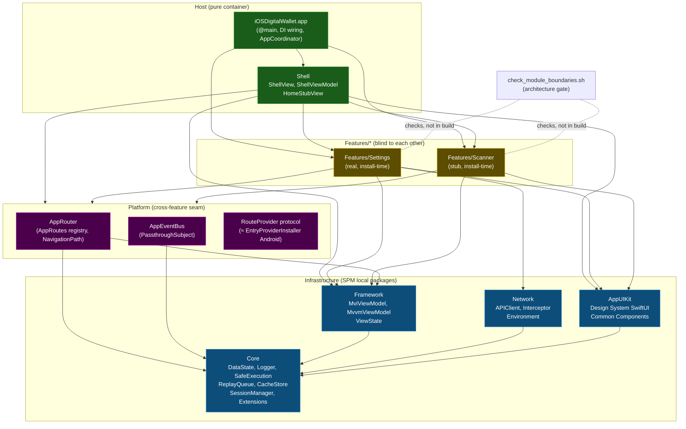
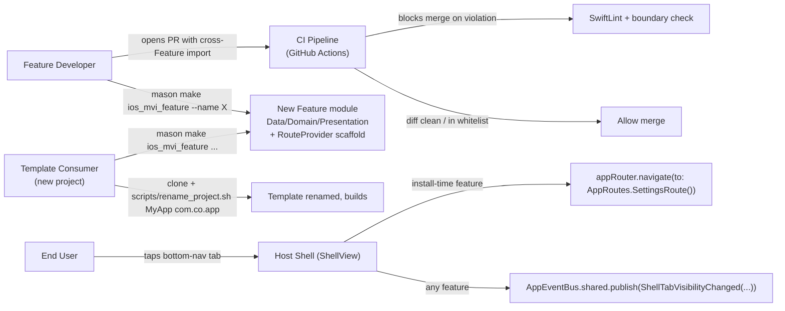
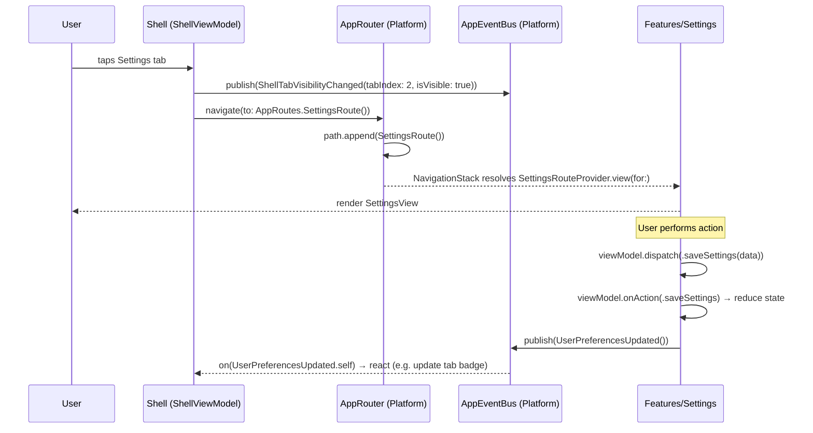

# Epic: iOS Super App Template

## Table of Contents
1. [Meta Data](#1-meta-data)
2. [Background](#2-background)
3. [Goals & Non-Goals](#3-goals--non-goals)
4. [Architecture & Technical Design](#4-architecture--technical-design)
   1. [High-Level Architecture](#41-high-level-architecture)
   2. [Use Cases](#42-use-cases)
   3. [Sequence Diagram — Primary Flow (Feature Navigation)](#43-sequence-diagram--primary-flow-feature-navigation)
   4. [Cross-Feature Communication Channels](#44-cross-feature-communication-channels)
5. [Rollout Strategy & Mitigation](#5-rollout-strategy--mitigation)
6. [Kanban Tasks Breakdown](#6-kanban-tasks-breakdown)

## 1. Meta Data
- **Epic Name**: `ios_super_app_template`
- **Status**: Queued (backlog) — behind `android_super_app_template` (has active tasks in `.devtool/features/`). Move tasks `backlog → todo` once `android_super_app_template` tasks all reach `done`, or at the project owner's discretion.
- **Target Release**: Branch `epic/ios-super-app-template` (git worktree of this repo); merge to `develop` per-phase decision.
- **Source Spec**: [2026-09-02-ios-super-app-template-design.md](2026-09-02-ios-super-app-template-design.md)
- **Related Epics**: `flutter_super_app_template` (Flutter, in `bloc_digital_wallet` — architecture source), `android_super_app_template` (Android native — structural mirror this epic ports to iOS).

## 2. Background

`iOSDigitalWallet` is a brand-new Xcode project — only `iOSDigitalWalletApp.swift` + `ContentView.swift` (Hello World). There is no architecture, no module structure, no quality tooling.

The `flutter_super_app_template` epic (already designed) established the iOS native foundation: Combine/`ObservableObject`, SPM-only, SwiftLint/SwiftFormat, `MviViewModel` mapping 1:1 from Kotlin. The `android_super_app_template` epic (in progress) defines the module map (5 infra modules), governance framework (4 pillars / 8 criteria), and incremental migration strategy.

This epic ports that proven governance framework to **iOS Native** — building a clean-architecture, MVI-based, Clone-and-Rename template for iOS super apps, at parity with the Flutter and Android templates.

The three structural problems this epic solves (analogous to Android's):
1. **No architecture** — single flat app target with no layers.
2. **No module boundaries** — nothing prevents import spaghetti between features.
3. **No enforcement** — no tooling, no CI, no governance.

## 3. Goals & Non-Goals

### Goals
- **G1 — Preserve Architecture**: Clean Architecture + MVI + Feature-First, per `ARCHITECTURE.md` Flutter: `Presentation → Domain ← Data`, pure-Swift Domain (no `import UIKit/SwiftUI/Combine`), Unidirectional Data Flow, single entry `dispatch()` → `onAction()`, naming `*Action/*State/*Event/*ViewModel/*UseCase/*View/*Repository`.
- **G2 — 5 SPM Infra Packages**: `Core`, `Framework`, `Network`, `AppUIKit`, `Platform` — 1:1 with Flutter `packages/` and Android `:*`. All Features depend only on these, never on each other.
- **G3 — Pure Container Host**: App + Shell only wires DI, builds `AppRouter` + `ShellView` + tab layout. No Feature business logic in host. `HomeStubView` lives inside Shell (not a separate Feature).
- **G4 — Centralized Cross-Feature Communication**: `Platform` holds `AppRouter` (route registry) + `AppEventBus` (`PassthroughSubject<any AppEvent, Never>`). Features register routes via `RouteProvider` protocol. No cross-Feature `import`.
- **G5 — State Isolation**: Each Feature owns its `MviViewModel` (from `Framework`). Manual Constructor Injection. Types in `Features/*/Data/` must be `internal`.
- **G6 — Structure-Enforced Governance**: SwiftLint custom rules (layer + boundary + naming); `check_module_boundaries.sh`; GitHub Actions CI. `module_boundary_whitelist.txt` shrinks each phase.
- **G7 — New Feature = 1 Mason Command**: `mason make ios_mvi_feature --name X` generates full `Data/Domain/Presentation` + `RouteProvider` scaffold. No touching other Features.
- **G8 — Extractable Template**: 5 infra packages + Shell + 3 features (home stub / scanner / settings). `scripts/rename_project.sh` is the only entry point after clone.
- **G9 — Sandbox Development**: Each Feature builds/tests independently (Unit Test target without app target).

### Non-Goals
- DI framework (Swinject, Needle) — manual Constructor Injection only.
- `@Observable` / swift-perception — Combine + `ObservableObject`, min iOS 13.
- App Extension (Widget, Share, Watch) — out of scope; architecture is ready but not built.
- Dynamic on-demand loading — iOS has no DFM equivalent; template is monolithic install-time only. Known gap.
- CocoaPods — SPM-only.
- KMP / Flutter integration — pure iOS Native app.

## 4. Architecture & Technical Design

### 4.1 High-Level Architecture

**Invariants (enforced):** Every solid arrow flows toward `Core`; no Feature points to another Feature; only App/Shell aggregate multiple Features; `AppUIKit` does not depend on `Framework`.

### 4.2 Use Cases

### 4.3 Sequence Diagram — Primary Flow (Feature Navigation)

For **install-time Features**, the flow reduces to: `Shell → appRouter.navigate(to: route) → NavigationStack resolves RouteProvider → renders Feature view`. No `SplitInstallManager`/`ServiceLoader` (iOS has no DFM equivalent).

### 4.4 Cross-Feature Communication Channels

| Channel | Where | Shape | Enforce |
|---|---|---|---|
| **`AppRoutes`** (route registry) | `Platform` | `struct XxxRoute: AppRoute`; navigate: `appRouter.navigate(to: AppRoutes.SettingsRoute())` | not needed — route doesn't expose implementation |
| **`AppEventBus`** | `Platform` | `PassthroughSubject<any AppEvent, Never>` broadcast; `publish(event)` / `on(type:)` | not needed |
| **`RouteProvider`** protocol | mechanism in `Platform`, each Feature implements | Feature: `class SettingsRouteProvider: RouteProvider`; Shell: `appRouter.register(...)` at startup | Shell never imports Feature directly |
| **Direct composition** | App, Shell | DI wiring root + `ShellView` + tab layout | `check_module_boundaries.sh` — Host privilege only |

No request/response channel between two Features. For typed results from another Feature's business logic → Dependency Inversion: protocol in `Core`, other Feature implements.

**Minimum lifecycle event vocabulary** (mirrors Android/Flutter): `ShellTabVisibilityChanged` (Shell publishes on tab change), `AppLifecycleChanged` (AppDelegate publishes), `UserLoggedOut` (Network 401 interceptor publishes).

## 5. Rollout Strategy & Mitigation

**Incremental migration — 4 phases, branch `epic/ios-super-app-template`.** App must build and run at every phase boundary.

| Phase | Deliverable | Reversibility |
|---|---|---|
| **Phase 0 — Foundation** (Tasks 1–3) | `quality/` tooling (SwiftLint + SwiftFormat config), `scripts/check_module_boundaries.sh` + empty whitelist, `.github/workflows/ci.yml`, Mason brick scaffold (no `post_gen`). **No behavior change.** CI green on Hello World. | Delete new files; nothing else touched. |
| **Phase 1 — 5 SPM Infra Packages + ARCHITECTURE.md** (Tasks 4–9) | `Sources/Core`, `Framework`, `Network`, `AppUIKit`, `Platform` SPM packages build. Unit tests green. SwiftLint layer rules (K2/K3 equivalent) enabled. `docs/architecture/ARCHITECTURE.md` iOS variant. `xcodebuild` green. | Each package is a separate PR; revert PR. |
| **Phase 2 — Shell + Features + Governance** (Tasks 10–12) | `iOSDigitalWallet/` reorganized into `App/` + `Shell/` + `Features/`. `ShellView` + `ShellViewModel`, `HomeStubView`. `Settings` (real), `Scanner` (stub). `RouteProvider` wiring. SwiftLint K4/K5 rules. App 3-tab runs. Boundary check clean. | Whitelist is the rollback lever. Shell reorganization is one PR. |
| **Phase 3 — Template Extraction + Mason brick + rename + acceptance** (Tasks 13–16) | `ios_mvi_feature` brick complete with checklist `post_gen`. `rename_project.sh`. Docs/agents genericized. Acceptance test: clone → rename → `mason make ios_mvi_feature --name Payments` → `xcodebuild test` green. | Template work on a separate worktree; `develop` unaffected until intentional merge. |

**Risk mitigation levers:** whitelist is a per-phase rollback (re-add an entry, gate stays green). SwiftLint starts at baseline, rules tighten phase by phase. `post_gen.dart` outputs a manual checklist instead of auto-mutating `.pbxproj` — avoids corrupt project files.

## 6. Kanban Tasks Breakdown

### Phase 0 — Foundation
- [Task 1: SwiftLint + SwiftFormat quality tooling setup](../../features/task_1_ios_quality_tooling.md)
- [Task 2: Module boundary check script + GitHub Actions CI](../../features/task_2_ios_boundary_ci.md)
- [Task 3: Mason brick scaffold `ios_mvi_feature`](../../features/task_3_ios_mason_brick_scaffold.md)

### Phase 1 — 5 SPM Infra Packages
- [Task 4: Create `Core` SPM local package](../../features/task_4_ios_core_package.md)
- [Task 5: Create `Framework` SPM local package (MviViewModel)](../../features/task_5_ios_framework_package.md)
- [Task 6: Create `Network` SPM local package](../../features/task_6_ios_network_package.md)
- [Task 7: Create `AppUIKit` SPM local package](../../features/task_7_ios_appuikit_package.md)
- [Task 8: Create `Platform` SPM local package (AppRouter + AppEventBus)](../../features/task_8_ios_platform_package.md)
- [Task 9: Rewire app target + enable layer rules + ARCHITECTURE.md](../../features/task_9_ios_rewire_arch_doc.md)

### Phase 2 — Shell + Features + Governance
- [Task 10: Reorganize app target into App/ + Shell/ + Features/](../../features/task_10_ios_app_structure.md)
- [Task 11: Implement ShellView + ShellViewModel + HomeStubView](../../features/task_11_ios_shell.md)
- [Task 12: Implement Settings (real) + Scanner (stub) + RouteProvider wiring](../../features/task_12_ios_features_and_routing.md)

### Phase 3 — Template Extraction
- [Task 13: Complete `ios_mvi_feature` brick with post_gen checklist](../../features/task_13_ios_mason_brick_complete.md)
- [Task 14: Implement `rename_project.sh`](../../features/task_14_ios_rename_script.md)
- [Task 15: Genericize docs / agents / template cleanup](../../features/task_15_ios_template_cleanup.md)
- [Task 16: Acceptance test end-to-end](../../features/task_16_ios_acceptance_test.md)
