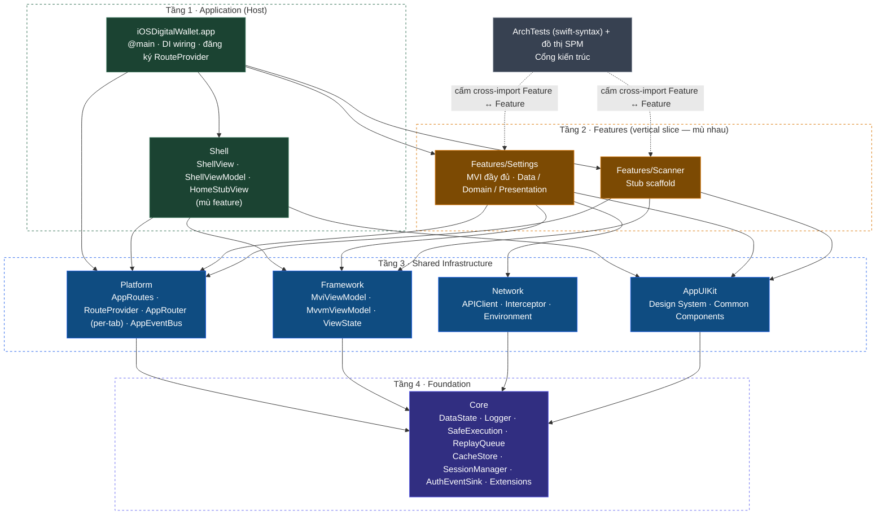
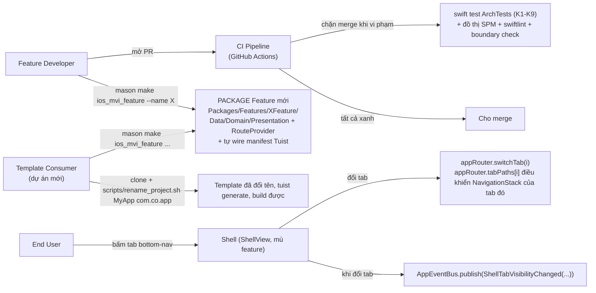
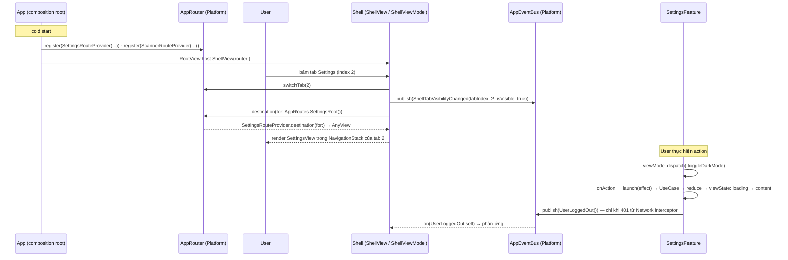

# Epic: iOS Super App Template

## Mục lục
1. [Meta Data](#1-meta-data)
2. [Bối cảnh](#2-bối-cảnh)
3. [Mục tiêu & Không làm gì](#3-mục-tiêu--không-làm-gì)
4. [Kiến trúc & Thiết kế kỹ thuật](#4-kiến-trúc--thiết-kế-kỹ-thuật)
   1. [Kiến trúc tổng thể](#41-kiến-trúc-tổng-thể)
   2. [Use Cases](#42-use-cases)
   3. [Sequence Diagram — Luồng chính (Feature Navigation)](#43-sequence-diagram--luồng-chính-feature-navigation)
   4. [Các kênh giao tiếp cross-feature](#44-các-kênh-giao-tiếp-cross-feature)
5. [Chiến lược triển khai & Giảm thiểu rủi ro](#5-chiến-lược-triển-khai--giảm-thiểu-rủi-ro)
6. [Phân rã task Kanban](#6-phân-rã-task-kanban)

## 1. Meta Data
- **Epic Name**: `ios_super_app_template`
- **Trạng thái**: Rollout theo phase — task Phase 0 (1–3) là `todo`; task Phase 1–3 (4–15) giữ `backlog`, nâng lên `todo` từng phase một khi phase trước hoàn tất.
- **Cập nhật**: 2026-09-03 (v2 — xem changelog trong Spec gốc). v2: mỗi Feature và Shell là 1 SPM package, dùng Tuist, thay governance regex bằng package `ArchTests` (swift-syntax), thống nhất deployment target iOS 16, thêm Chuẩn Testing & Acceptance BDD+TDD.
- **Target Release**: Branch `epic/ios-super-app-template` (git worktree của repo này); merge vào `develop` quyết định theo từng phase.
- **Spec gốc**: [2026-09-02-ios-super-app-template-design.md](2026-09-02-ios-super-app-template-design.md)
- **Epic liên quan**: `flutter_super_app_template` (Flutter, trong `bloc_digital_wallet` — nguồn kiến trúc), `android_super_app_template` (Android native — đã hoàn tất; bản mẫu đã build mà epic này port sang iOS).

## 2. Bối cảnh

`iOSDigitalWallet` là Xcode project mới toanh — chỉ có `iOSDigitalWalletApp.swift` + `ContentView.swift` (Hello World). Không có kiến trúc, không có module, không có tooling chất lượng.

Epic `flutter_super_app_template` (đã thiết kế) đã thiết lập nền tảng iOS native: Combine/`ObservableObject`, SPM-only, SwiftLint/SwiftFormat, `MviViewModel` mapping 1:1 từ Kotlin. Epic `android_super_app_template` (đang triển khai) định nghĩa bản đồ module (5 module hạ tầng), khung governance (4 trụ / 8 tiêu chí), và chiến lược migration incremental.

Epic này port khung governance đã được chứng minh đó sang **iOS Native** — xây dựng template super app iOS clone-và-đổi-tên theo Clean Architecture + MVI, ngang bằng với template Flutter và Android.

3 vấn đề cấu trúc epic này giải quyết (tương tự Android):
1. **Không có kiến trúc** — một app target phẳng, không có layer.
2. **Không có ranh giới module** — không gì chặn import chéo giữa các feature.
3. **Không có enforcement** — không tooling, không CI, không governance.

## 3. Mục tiêu & Không làm gì

### Mục tiêu
- **G1 — Giữ nguyên kiến trúc**: Clean Architecture + MVI + Feature-First đúng như `ARCHITECTURE.md` Flutter: `Presentation → Domain ← Data`, Domain thuần Swift (cấm `import UIKit/SwiftUI/Combine`), Unidirectional Data Flow, single entry `dispatch()` → `onAction()`, naming `*Action/*State/*Event/*ViewModel/*UseCase/*View/*Repository`.
- **G2 — Package cho mỗi module**: 5 infra SPM package (`Core`, `Framework`, `Network`, `AppUIKit`, `Platform`) + package `Shell` + **mỗi Feature là 1 SPM package** (`SettingsFeature`, `ScannerFeature`). Feature chỉ import được cái khai trong `Package.swift` — compiler chặn mọi import chéo Feature.
- **G3 — Host là container thuần**: `App` target chỉ `@main`, DI wiring, đăng ký `RouteProvider`, publish lifecycle event. Package `Shell` dựng tab layout + per-tab `NavigationStack`, **mù feature**. `HomeStubView` nằm trong `Shell` (không phải Feature).
- **G4 — Giao tiếp cross-feature tập trung**: `Platform` chứa `AppRouter` (per-tab route registry) + `AppEventBus`. `App` là **nơi duy nhất** gom Feature. Feature không bao giờ `import` nhau.
- **G5 — State isolation**: mỗi Feature giữ `MviViewModel` riêng (từ `Framework`) + pattern async-effect cancel-on-new-action. Constructor Injection thủ công. Type trong `Sources/*Feature/Data/` phải `internal`.
- **G6 — Governance ép bằng cấu trúc**: (a) đồ thị SPM — Feature không khai package thì không import được; (b) package `ArchTests` (swift-syntax/AST) ép layer + naming + route-location + host-privilege (K1–K9); (c) `check_module_boundaries.sh` là lưới phòng thủ thứ 2; (d) GitHub Actions CI chạy cả bộ.
- **G7 — Feature mới = 1 lệnh Mason**: `mason make ios_mvi_feature --name X` sinh **package Feature đầy đủ** + tự sửa manifest Tuist trong vùng đánh dấu, rồi `tuist generate`. Không đụng Feature khác.
- **G8 — Template**: 5 infra package + `Shell` + 3 feature (home stub trong Shell / scanner stub package / settings real package). `scripts/rename_project.sh` là cửa vào duy nhất sau clone.
- **G9 — Sandbox development**: mỗi package `swift build` / `swift test` độc lập, không cần app target.

### Không làm gì
- DI framework (Swinject, Needle, Factory) — Constructor Injection thủ công.
- `@Observable` / Observation framework — Combine + `ObservableObject`. Chỉ xét lại nếu sàn nâng ≥ iOS 17.
- App Extension — ngoài phạm vi.
- Dynamic on-demand loading — iOS không có DFM tương đương. Gap đã biết.
- CocoaPods — SPM-only. Sửa `.pbxproj` tay — Tuist sinh `.xcodeproj`/`.xcworkspace`, không commit.
- KMP / Flutter integration — iOS Native App đơn thuần.
- Worktree-per-task khi thực thi — 1 worktree cho cả epic (theo `epic-implementation`).

## 4. Kiến trúc & Thiết kế kỹ thuật

### 4.1 Kiến trúc tổng thể

**Bất biến (ArchTests + đồ thị SPM kiểm):** mọi mũi tên đặc đổ về `Core`; không Feature nào trỏ sang Feature khác; chỉ `App` gom nhiều Feature (`Shell` mù feature — chỉ qua `AppRouter` / `RouteProvider`); `AppUIKit` không phụ thuộc `Framework`; mỗi tầng chỉ trỏ xuống tầng thấp hơn (DAG một chiều).

### 4.2 Use Cases

### 4.3 Sequence Diagram — Luồng chính (Feature Navigation)

Luồng rút gọn: `Shell → appRouter.destination(for: route) → RouteProvider resolve → render Feature view trong NavigationStack của tab đó`. Không có `SplitInstallManager`/`ServiceLoader` (iOS không có DFM). Push/pop sâu là per-tab qua `appRouter.navigate(to:inTab:)` / `pop(inTab:)`.

### 4.4 Các kênh giao tiếp cross-feature

| Kênh | Ở đâu | Hình dạng | Enforce |
|---|---|---|---|
| **`AppRoutes`** (registry route) | `Platform` | `struct XxxRoot: AppRoute`; điều hướng: `appRouter.navigate(to: AppRoutes.SettingsRoot(), inTab:)` | không cần — route không lộ implementation |
| **`AppEventBus`** | `Platform` | `PassthroughSubject<any AppEvent, Never>` broadcast (replay 0); `publish(_:)` / `on(_:)` | không cần |
| **`RouteProvider`** protocol | cơ chế ở `Platform`, mỗi Feature implement | Feature: `class SettingsRouteProvider: RouteProvider`; **`App`** gọi `appRouter.register(...)` lúc khởi động | `Shell` không bao giờ import Feature; `ArchTests` HostRules — chỉ `App` được phụ thuộc > 1 Feature |
| **Direct composition** | chỉ `App` | DI wiring root + đăng ký `RouteProvider` + wire lifecycle | `ArchTests` HostRules + `check_module_boundaries.sh` |

Không có kênh request/response giữa 2 Feature. Cần kết quả typed → Dependency Inversion: protocol ở `Core`, Feature kia implement.

**Từ vựng lifecycle event tối thiểu** (mirror bộ Android/Flutter): `ShellTabVisibilityChanged` (`Shell` publish khi đổi tab), `AppLifecycleChanged` (`LifecycleObserver` của `App` publish từ `ScenePhase`), `UserLoggedOut` (`Network` interceptor 401 → `AuthEventSink` ở `Core` → `App` publish).

## 5. Chiến lược triển khai & Giảm thiểu rủi ro

**Greenfield construction — 4 phase, branch `epic/ios-super-app-template`.** App build & chạy được ở mọi ranh giới phase. Cơ chế whitelist giữ nhưng rỗng suốt (không có spaghetti để gỡ). Mỗi task gắn Tier test (A behavioral / B tooling-script-config / C integration-acceptance) theo Spec gốc §9A.

| Phase | Kết quả | Khả năng đảo ngược |
|---|---|---|
| **Phase 0 — Toolchain & skeleton** (Task 1–3) | Tuist (`Project.swift`/`Workspace.swift`/`Tuist/Package.swift`/helpers, pin version), `.gitignore` cho `.xcodeproj`/`.xcworkspace` sinh ra; `quality/` SwiftLint + SwiftFormat; skeleton package `ArchTests` (swift-syntax pin, 1 rule trivial xanh) + `check_module_boundaries.sh` + whitelist rỗng; `.github/workflows/ci.yml`; root docs (`AGENTS.md`, `PROJECT_RULES.md`, `README.md`, `.editorconfig`). App placeholder; CI xanh. | Xoá files mới. |
| **Phase 1 — 5 infra package + ARCHITECTURE.md** (Task 4–9) | `Core`, `Framework` (+ async-effect), `Network`, `AppUIKit`, `Platform` build có test; wire vào app qua Tuist. `ArchTests` K2/K3/K4/K5/K7 bật. `docs/architecture/ARCHITECTURE.md` + root pointer mỏng. | Mỗi package 1 PR; revert PR. |
| **Phase 2 — Shell + Features + navigation** (Task 10–12) | Package `Shell` (3× per-tab `NavigationStack`, `ShellViewModel : MviViewModel`, `HomeStubView`); package `SettingsFeature` (thật); package `ScannerFeature` (stub); `App` composition root đăng ký `RouteProvider`, publish lifecycle event, wire 401→bus. `ArchTests` K1/K6/K9 bật. App 3 tab chạy. | Whitelist là đòn bẩy; mỗi package 1 PR. |
| **Phase 3 — Template-hoá & nghiệm thu** (Task 13–15) | 4 Mason brick (`ios_mvi_feature`, `ios_mvi_subfeature`, `ios_remove_feature`, `ios_remove_subfeature`) auto-wire manifest Tuist an toàn; `scripts/rename_project.sh`; generic hoá docs/asset; acceptance E2E trên worktree. | Template trên worktree riêng; `develop` không bị ảnh hưởng tới khi merge chủ ý. |

**Đòn bẩy giảm rủi ro:** đồ thị SPM khiến import chéo Feature là compile error, không phải lint finding. `ArchTests` bắt đầu ở baseline, siết từng phase. Mason brick sửa manifest Tuist **trong vùng đánh dấu** (`// tuist:packages:begin/end`), `tuist generate` validate ngay, `ios_remove_feature` đảo ngược. `.xcodeproj`/`.xcworkspace` là artifact sinh ra, không commit — `rename_project.sh` chỉ đụng manifest.

## 6. Phân rã task Kanban

Task Phase 0 là `todo`; task Phase 1–3 là `backlog`, nâng lên `todo` từng phase một.

### Phase 0 — Toolchain & skeleton
- [Task 1: Tuist bootstrap + gitignore project sinh ra](../../features/task_1_ios_tuist_bootstrap.md) — *Tier B*
- [Task 2: SwiftLint + SwiftFormat quality tooling](../../features/task_2_ios_quality_tooling.md) — *Tier B*
- [Task 3: ArchTests skeleton + boundary script + GitHub Actions CI + root docs](../../features/task_3_ios_archtests_ci_docs.md) — *Tier B*

### Phase 1 — 5 infra package + ARCHITECTURE.md
- [Task 4: Tạo SPM package `Core`](../../features/task_4_ios_core_package.md) — *Tier A*
- [Task 5: Tạo SPM package `Framework` (MviViewModel + async-effect)](../../features/task_5_ios_framework_package.md) — *Tier A*
- [Task 6: Tạo SPM package `Network`](../../features/task_6_ios_network_package.md) — *Tier A*
- [Task 7: Tạo SPM package `AppUIKit`](../../features/task_7_ios_appuikit_package.md) — *Tier A*
- [Task 8: Tạo SPM package `Platform` (per-tab AppRouter + AppEventBus)](../../features/task_8_ios_platform_package.md) — *Tier A*
- [Task 9: Rewire app + `ARCHITECTURE.md` + bật ArchTests layer rules](../../features/task_9_ios_rewire_arch_doc.md) — *Tier C*

### Phase 2 — Shell + Features + navigation
- [Task 10: Package `Shell` — ShellView + ShellViewModel + HomeStubView](../../features/task_10_ios_shell.md) — *Tier A*
- [Task 11: Package `SettingsFeature` (thật, full MVI + Clean)](../../features/task_11_ios_settings_feature.md) — *Tier A*
- [Task 12: `ScannerFeature` stub + App composition root + bật ArchTests K1/K6/K9](../../features/task_12_ios_scanner_and_composition.md) — *Tier A + C*

### Phase 3 — Template-hoá & nghiệm thu
- [Task 13: 4 Mason brick auto-wire manifest Tuist](../../features/task_13_ios_mason_bricks.md) — *Tier B*
- [Task 14: `rename_project.sh` + generic hoá docs / asset / README](../../features/task_14_ios_rename_and_genericize.md) — *Tier B*
- [Task 15: Kiểm thử nghiệm thu end-to-end](../../features/task_15_ios_acceptance_e2e.md) — *Tier C*
