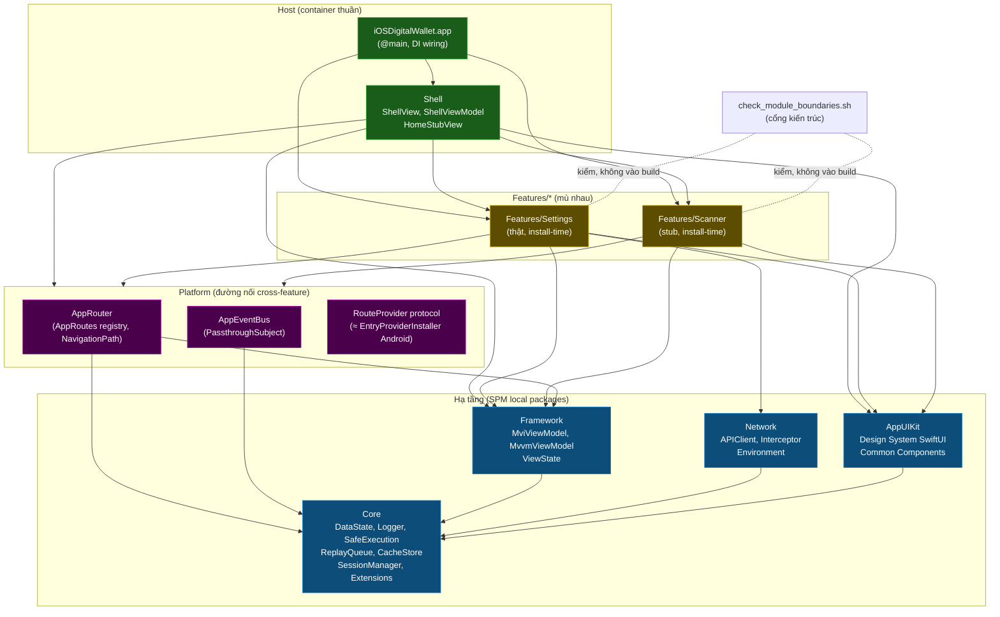
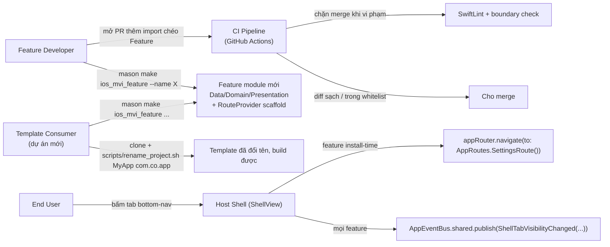
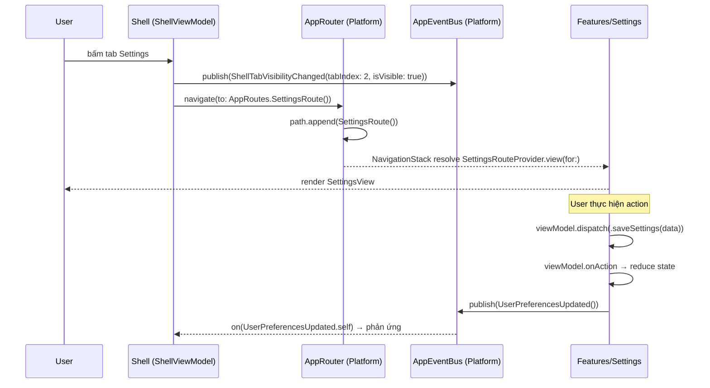

# Epic: iOS Super App Template

## Mục lục
1. [Meta Data](#1-meta-data)
2. [Bối cảnh](#2-bối-cảnh)
3. [Mục tiêu & Không làm gì](#3-mục-tiêu--không-làm-gì)
4. [Kiến trúc & Thiết kế kỹ thuật](#4-kiến-trúc--thiết-kế-kỹ-thuật)
   1. [Kiến trúc tổng thể](#41-kiến-trúc-tổng-thể)
   2. [Use Cases](#42-use-cases)
   3. [Sequence Diagram — Luồng chính (Feature Navigation)](#43-sequence-diagram--luồng-chính-feature-navigation)
   4. [Các kênh giao tiếp cross-feature](#44-các-kênh-giao-tiếp-cross-feature)
5. [Chiến lược triển khai & Giảm thiểu rủi ro](#5-chiến-lược-triển-khai--giảm-thiểu-rủi-ro)
6. [Phân rã task Kanban](#6-phân-rã-task-kanban)

## 1. Meta Data
- **Epic Name**: `ios_super_app_template`
- **Trạng thái**: Queued (backlog) — xếp sau `android_super_app_template` (đang có task active trong `.devtool/features/`). Chuyển task `backlog → todo` khi `android_super_app_template` hoàn tất, hoặc theo quyết định người phụ trách.
- **Target Release**: Branch `epic/ios-super-app-template` (git worktree của repo này); merge vào `develop` quyết định theo từng phase.
- **Spec gốc**: [2026-09-02-ios-super-app-template-design.md](2026-09-02-ios-super-app-template-design.md)
- **Epic liên quan**: `flutter_super_app_template` (Flutter, trong `bloc_digital_wallet` — nguồn kiến trúc), `android_super_app_template` (Android native — gương module mà epic này port sang iOS).

## 2. Bối cảnh

`iOSDigitalWallet` là Xcode project mới toanh — chỉ có `iOSDigitalWalletApp.swift` + `ContentView.swift` (Hello World). Không có kiến trúc, không có module, không có tooling chất lượng.

Epic `flutter_super_app_template` (đã thiết kế) đã thiết lập nền tảng iOS native: Combine/`ObservableObject`, SPM-only, SwiftLint/SwiftFormat, `MviViewModel` mapping 1:1 từ Kotlin. Epic `android_super_app_template` (đang triển khai) định nghĩa bản đồ module (5 module hạ tầng), khung governance (4 trụ / 8 tiêu chí), và chiến lược migration incremental.

Epic này port khung governance đã được chứng minh đó sang **iOS Native** — xây dựng template super app iOS clone-và-đổi-tên theo Clean Architecture + MVI, ngang bằng với template Flutter và Android.

3 vấn đề cấu trúc epic này giải quyết (tương tự Android):
1. **Không có kiến trúc** — một app target phẳng, không có layer.
2. **Không có ranh giới module** — không gì chặn import chéo giữa các feature.
3. **Không có enforcement** — không tooling, không CI, không governance.

## 3. Mục tiêu & Không làm gì

### Mục tiêu
- **G1 — Giữ nguyên kiến trúc**: Clean Architecture + MVI + Feature-First đúng như `ARCHITECTURE.md` Flutter: `Presentation → Domain ← Data`, Domain thuần Swift (cấm `import UIKit/SwiftUI/Combine`), Unidirectional Data Flow, single entry `dispatch()` → `onAction()`, naming `*Action/*State/*Event/*ViewModel/*UseCase/*View/*Repository`.
- **G2 — 5 SPM local packages hạ tầng**: `Core`, `Framework`, `Network`, `AppUIKit`, `Platform` — 1:1 với Flutter `packages/` và Android `:*`. Mọi Feature chỉ phụ thuộc các package này, không phụ thuộc Feature khác.
- **G3 — Host là container thuần**: App + Shell chỉ wire DI, dựng `AppRouter` + `ShellView` + tab layout. `HomeStubView` nằm trong Shell (không phải Feature module riêng).
- **G4 — Giao tiếp cross-feature tập trung**: `Platform` chứa `AppRouter` (route registry) + `AppEventBus`. Feature đăng ký route qua `RouteProvider` protocol. Cấm `import` chéo giữa `Features/*`.
- **G5 — State isolation**: mỗi Feature giữ `MviViewModel` riêng (từ `Framework`). Constructor Injection thủ công. Type trong `Features/*/Data/` phải `internal`.
- **G6 — Governance ép bằng cấu trúc**: SwiftLint custom rules; `check_module_boundaries.sh`; GitHub Actions CI.
- **G7 — Feature mới = 1 lệnh Mason**: `mason make ios_mvi_feature --name X` sinh đủ scaffold. Không đụng Feature khác.
- **G8 — Template**: 5 infra packages + Shell + 3 feature. `scripts/rename_project.sh` là cửa vào duy nhất sau clone.
- **G9 — Sandbox development**: mỗi Feature build/test độc lập.

### Không làm gì
- DI framework (Swinject, Needle) — Constructor Injection thủ công.
- `@Observable` / swift-perception — Combine + `ObservableObject`, min iOS 13.
- App Extension — ngoài phạm vi.
- Dynamic on-demand loading — iOS không có DFM tương đương. Gap đã biết.
- CocoaPods — SPM-only.
- KMP / Flutter integration — iOS Native App đơn thuần.

## 4. Kiến trúc & Thiết kế kỹ thuật

### 4.1 Kiến trúc tổng thể

**Bất biến (script kiểm):** mọi mũi tên đặc đổ về `Core`; không Feature nào trỏ sang Feature khác; chỉ App/Shell gom nhiều Feature; `AppUIKit` không phụ thuộc `Framework`.

### 4.2 Use Cases

### 4.3 Sequence Diagram — Luồng chính (Feature Navigation)

### 4.4 Các kênh giao tiếp cross-feature

| Kênh | Ở đâu | Hình dạng | Enforce |
|---|---|---|---|
| **`AppRoutes`** (registry route) | `Platform` | `struct XxxRoute: AppRoute`; điều hướng: `appRouter.navigate(to: AppRoutes.SettingsRoute())` | không cần — route không lộ implementation |
| **`AppEventBus`** | `Platform` | `PassthroughSubject<any AppEvent, Never>` broadcast | không cần |
| **`RouteProvider`** protocol | cơ chế ở `Platform`, mỗi Feature implement | Feature: `class SettingsRouteProvider: RouteProvider`; Shell đăng ký lúc khởi động | Shell không bao giờ import Feature trực tiếp |
| **Direct composition** | App, Shell | DI wiring root + tab layout | `check_module_boundaries.sh` — đặc quyền chỉ Host |

Không có kênh request/response giữa 2 Feature. Cần kết quả typed → Dependency Inversion: protocol ở `Core`, Feature kia implement.

**Từ vựng lifecycle event tối thiểu** (mirror bộ Android/Flutter): `ShellTabVisibilityChanged` (Shell publish khi đổi tab), `AppLifecycleChanged` (AppDelegate publish), `UserLoggedOut` (Network interceptor 401 publish).

## 5. Chiến lược triển khai & Giảm thiểu rủi ro

**Hướng incremental, 4 phase, branch `epic/ios-super-app-template`.** App phải build & chạy được ở mọi ranh giới phase.

| Phase | Kết quả | Khả năng đảo ngược |
|---|---|---|
| **Phase 0 — Nền móng** (Task 1–3) | `quality/` tooling, `check_module_boundaries.sh`, `.github/workflows/ci.yml`, Mason brick scaffold (chưa `post_gen`). **Không đổi hành vi app.** CI xanh trên Hello World. | Xoá files mới; không đụng gì khác. |
| **Phase 1 — 5 SPM Infra Packages + ARCHITECTURE.md** (Task 4–9) | `Sources/Core`, `Framework`, `Network`, `AppUIKit`, `Platform` build. Unit tests xanh. SwiftLint layer rules bật. `docs/architecture/ARCHITECTURE.md` bản iOS. `xcodebuild` xanh. | Mỗi package là 1 PR; revert PR. |
| **Phase 2 — Shell + Features + Governance** (Task 10–12) | Tổ chức lại `App/` + `Shell/` + `Features/`. `ShellView` + `ShellViewModel`, `HomeStubView`. `Settings` thật, `Scanner` stub. `RouteProvider` wire. App 3 tab chạy. Boundary check sạch. | Whitelist là đòn bẩy rollback. |
| **Phase 3 — Trích template + Mason brick + rename + nghiệm thu** (Task 13–16) | `ios_mvi_feature` brick hoàn chỉnh (checklist `post_gen`). `rename_project.sh`. Generic hoá docs/agents. Test nghiệm thu: clone → rename → `mason make ios_mvi_feature` → `xcodebuild test` xanh. | Template trên worktree riêng; `develop` không bị ảnh hưởng. |

**Đòn bẩy giảm rủi ro:** whitelist Konsist là cơ chế rollback theo từng phase. SwiftLint bắt đầu ở baseline, siết từng phase. `post_gen.dart` xuất checklist thủ công thay vì tự sửa `.pbxproj` — tránh corrupt project file.

## 6. Phân rã task Kanban

### Phase 0 — Nền móng
- [Task 1: SwiftLint + SwiftFormat setup](../../features/task_1_ios_quality_tooling.md)
- [Task 2: Module boundary check script + GitHub Actions CI](../../features/task_2_ios_boundary_ci.md)
- [Task 3: Mason brick scaffold `ios_mvi_feature`](../../features/task_3_ios_mason_brick_scaffold.md)

### Phase 1 — 5 SPM Infra Packages
- [Task 4: Tạo SPM package `Core`](../../features/task_4_ios_core_package.md)
- [Task 5: Tạo SPM package `Framework` (MviViewModel)](../../features/task_5_ios_framework_package.md)
- [Task 6: Tạo SPM package `Network`](../../features/task_6_ios_network_package.md)
- [Task 7: Tạo SPM package `AppUIKit`](../../features/task_7_ios_appuikit_package.md)
- [Task 8: Tạo SPM package `Platform` (AppRouter + AppEventBus)](../../features/task_8_ios_platform_package.md)
- [Task 9: Rewire app target + bật layer rules + ARCHITECTURE.md iOS](../../features/task_9_ios_rewire_arch_doc.md)

### Phase 2 — Shell + Features + Governance
- [Task 10: Tổ chức lại app target thành App/ + Shell/ + Features/](../../features/task_10_ios_app_structure.md)
- [Task 11: Implement ShellView + ShellViewModel + HomeStubView](../../features/task_11_ios_shell.md)
- [Task 12: Implement Settings (thật) + Scanner (stub) + RouteProvider wiring](../../features/task_12_ios_features_and_routing.md)

### Phase 3 — Trích template
- [Task 13: Hoàn thiện brick `ios_mvi_feature` với post_gen checklist](../../features/task_13_ios_mason_brick_complete.md)
- [Task 14: Implement `rename_project.sh`](../../features/task_14_ios_rename_script.md)
- [Task 15: Generic hoá docs / agents / template cleanup](../../features/task_15_ios_template_cleanup.md)
- [Task 16: Kiểm thử nghiệm thu end-to-end](../../features/task_16_ios_acceptance_test.md)
