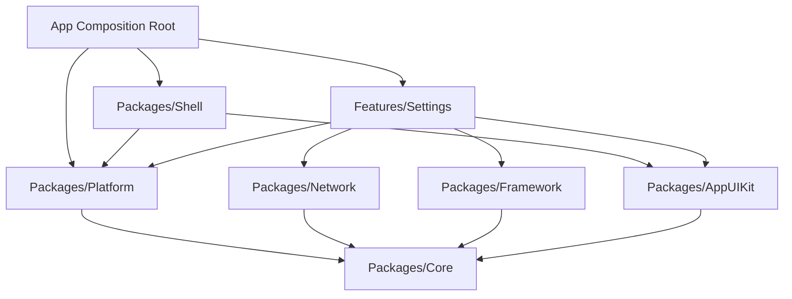

# Design Spec: Language Change & Dark Mode with Dynamic Sync

**Date**: 2026-09-05  
**Status**: Approved (Brainstorming Phase)  
**Authors**: Antigravity & DanhDue ExOICTIF  
**Target Architecture**: Clean Architecture + MVI + Multi-package SPM (Tuist)  

---

## 1. Context & Motivation

In the reference repository (`/Users/danhdue/AllProjects/digital_wallet/bloc_digital_wallet/.worktrees/flutter_super_app_template`), the application implements:
1. **Dark Mode Toggle**: Persistent local storage of `ThemeMode` (`.system`, `.light`, `.dark`) broadcast across the application, with server preference synchronization via `PUT /api/v1/users/me/preferences`.
2. **Dynamic OTA Localization**:
   - Bundled default translations (`en`, `vi`).
   - Server synchronization: `GET /api/v1/translations` for available languages, `GET /api/v1/translations/{code}` for full or delta JSON translation overrides with `If-None-Match` (ETag 304 handling).
   - User preference synchronization via `PUT /api/v1/users/me/preferences`.
3. **Bugfixes from PR #34 (`epic/settings-bugfixes`)**:
   - **Race Condition Guard**: Prevents out-of-order responses from overwriting the active locale when users switch languages rapidly.
   - **State-aware Optimistic UI**: 
     - If language is **cached/bundled**: Switch locale immediately (optimistic UI), then fetch updates and sync preference in background.
     - If language is **not cached**: Display loading state, fetch remote translations first, and only apply locale on success. If fetch fails, keep previous language and display a soft error message.
   - **Same-Language Skip**: Skips redundant preference mutations and static locale switches when tapping the already selected language.

This document designs the equivalent native iOS implementation adhering to the Clean Architecture and AST governance gates (`ArchTests`) of this repository.

---

## 2. System Architecture & Module Boundaries

The implementation respects strict dependency rules (K1–K9):



### 2.1 `Packages/Platform` (Cross-Feature Seam)
`Packages/Platform` owns application-wide state managers and broadcast events:

1. **`AppThemeMode`**:
   ```swift
   public enum AppThemeMode: String, CaseIterable, Codable, Sendable {
       case system
       case light
       case dark
   }
   ```
2. **`AppThemeManager`**:
   - `@MainActor public final class AppThemeManager: ObservableObject`
   - Backed by `Core.CacheStore` (e.g. `UserDefaultsCacheStore`).
   - Property `@Published public private(set) var mode: AppThemeMode`.
   - Computed property: `public var colorScheme: ColorScheme?` (returns `nil` for `.system`, `.light` for `.light`, `.dark` for `.dark`).
   - Method `public func setMode(_ mode: AppThemeMode)`.
   - Publishes `ThemeModeChanged(mode:)` to `AppEventBus`.
3. **`AppLocalizationManager`**:
   - `@MainActor public final class AppLocalizationManager: ObservableObject`
   - Tracks `@Published public private(set) var currentLanguageCode: String`.
   - In-memory dictionary: `private var dynamicOverrides: [String: String] = [:]`.
   - Property `@Published public private(set) var availableLanguages: [AvailableLanguage]`.
   - Method `public func setLocale(code: String)`: updates `currentLanguageCode` and notifies subscribers.
   - Method `public func applyDynamicTranslations(_ translations: [String: Any], languageCode: String)`: merges overrides for the given language.
   - Method `public func translate(_ key: String, default defaultString: String? = nil) -> String`:
     1. Checks `dynamicOverrides[key]`.
     2. If missing, falls back to `Bundle.main.localizedString(forKey:value:table:)` or `.xcstrings`.
     3. If missing, falls back to `defaultString ?? key`.
   - Publishes `AppLanguageChanged(languageCode:)` to `AppEventBus`.
4. **Events on `AppEventBus`**:
   - `ThemeModeChanged(mode: AppThemeMode): AppEvent`
   - `AppLanguageChanged(languageCode: String): AppEvent`

### 2.2 `Packages/AppUIKit`
- Provides view modifiers and localization helpers:
  - `Text(l10n: "settings.title", default: "Settings")` or View extensions interacting with `AppLocalizationManager`.
  - Seamless color switching with `Color.dynamic` based on current `ColorScheme`.

### 2.3 `Features/Settings` (MVI Feature)
Contains the Presentation, Domain, and Data layers for user preferences:

#### Domain Layer (`Sources/Settings/Domain/`)
- **Entities**:
  - `SettingsEntity`: Contains `isDarkMode: Bool`, `language: String`, `notificationsEnabled: Bool`, `availableLanguages: [AvailableLanguage]`.
  - `AvailableLanguage`: `(languageCode: String, languageName: String, isDefault: Bool, isActive: Bool)`.
  - `TranslationOverride`: `(version: String, translations: [String: Any])`.
- **Repository Protocol**:
  ```swift
  @MainActor
  public protocol SettingsRepository {
      func load() async -> DataState<SettingsEntity>
      func save(_ entity: SettingsEntity) async -> DataState<Void>
      func getAvailableLanguages() async -> DataState<[AvailableLanguage]>
      func isLanguageCached(_ code: String) async -> Bool
      func getLocalizationOverrides(code: String, sinceVersion: String?, eTag: String?) async -> DataState<TranslationOverride?>
      func saveCachedTranslations(code: String, version: String, eTag: String?, json: [String: Any]) async -> DataState<Void>
      func updateUserPreferences(language: String?, isDarkMode: Bool?) async -> DataState<Void>
  }
  ```
- **Use Cases**:
  - `GetSettingsUseCase`: Loads stored settings and cached available languages.
  - `SaveSettingsUseCase`: Writes local settings entity to cache.
  - `GetAvailableLanguagesUseCase`: Retrieves languages from API or local cache fallback.
  - `CheckLanguageCachedUseCase`: Checks if translations for `code` exist locally in cache.
  - `GetDynamicLocalizationUseCase`: Queries remote API with `sinceVersion` and `If-None-Match`. Handles 304 Not Modified.
  - `UpdateUserPreferencesUseCase`: Calls `PUT /api/v1/users/me/preferences`.
  - `ChangeLanguageUseCase`: The orchestration use case implementing the PR #34 state machine.

#### Data Layer (`Sources/Settings/Data/`)
- **`SettingsRemoteDataSource`**: Uses `Network.APIClient` to call:
  - `GET /api/v1/translations` -> `BaseResponseObject<[AvailableLanguageDTO]>`
  - `GET /api/v1/translations/{code}` -> `BaseResponseObject<TranslationOverrideDTO>`
  - `PUT /api/v1/users/me/preferences` -> `BaseResponseObject<UserPreferencesDTO>`
- **`SettingsLocalDataSource`**:
  - Persists translation JSONs, versions, and checksum ETags in `CacheStore`.
- **`SettingsRepositoryImpl`**:
  - Implements `SettingsRepository`, bridging remote and local data sources.

#### Presentation Layer (`Sources/Settings/Presentation/`)
- **`SettingsAction`**:
  - `.onAppear`
  - `.toggleDarkMode(Bool)`
  - `.selectLanguage(String)`
  - `.toggleNotifications(Bool)`
  - `.toggleDeveloperMode(Bool)`
  - `.showLanguagePicker(Bool)`
- **`SettingsState`**:
  - `settings: SettingsEntity`
  - `isSaving: Bool`
  - `isLoadingLanguage: Bool`
  - `isLanguagePickerPresented: Bool`
  - `appVersion: String`
  - `buildNumber: String`
- **`SettingsViewModel` (`MviViewModel`)**:
  - Handles optimistic UI updates, theme switching via `AppThemeManager`, and language orchestration via `ChangeLanguageUseCase`.
- **`SettingsView` & UI Components**:
  - Matches 100% the visual design in the reference screenshots:
    - **Page Layout**: Scrollable list with grouped card sections on `Color.appBackground`.
    - **Section Headers**: Small uppercase gray caption (`TÀI KHOẢN`, `TÙY CHỌN`, `NHÀ PHÁT TRIỂN`, `THÔNG TIN ỨNG DỤNG`).
    - **Section 1 (Tài khoản / Account)**:
      - `Chỉnh sửa hồ sơ` (Person icon in blue circular badge, chevron).
      - `Đổi mật khẩu` (Lock icon in purple circular badge, chevron).
      - `Xác thực 2 yếu tố (2FA)` (Shield icon in lavender badge, green trailing label "Bật" + chevron).
    - **Section 2 (Tùy chọn / Preferences)**:
      - `Tiền tệ / Đơn vị` (Dollar icon in orange badge, trailing "USD ($)" + chevron).
      - `Ngôn ngữ` (Globe icon in blue badge, trailing current language name e.g. "Tiếng Việt" + chevron, tap opens bottom sheet).
      - `Chế độ tối` (Moon icon in gray badge, trailing toggle switch bound to `isDarkMode`).
    - **Section 3 (Nhà phát triển / Developer)**:
      - `Chế độ gỡ lỗi` (Bug icon in green badge, trailing toggle switch).
    - **Section 4 (Thông tin ứng dụng / App Info)**:
      - `Liên hệ hỗ trợ` (Headset icon in blue badge, chevron).
      - `Về ứng dụng` (Info icon in gray badge, trailing version string e.g. "1.0.0").
    - **Logout Button**:
      - Rounded card button at the bottom with red text and red logout icon: `[-> Đăng xuất`.
- **Language Picker Bottom Sheet (`LanguagePickerBottomSheet.swift`)**:
  - Presented via `.sheet(isPresented:)` with `.presentationDetents([.medium, .large])` and drag indicator.
  - Centered bold header: "Ngôn ngữ".
  - List of languages (`AvailableLanguage` list: English (US), Tiếng Việt, 日本語, 한국어, etc.).
  - Shows blue checkmark `✓` for the currently selected language.
  - Tapping a row dispatches `.selectLanguage(code)` and dismisses the bottom sheet.

### 2.4 `App/` Root Composition
- `AppComposition`:
  - Initializes `AppThemeManager(cache: cache, eventBus: eventBus)`.
  - Initializes `AppLocalizationManager(cache: cache, eventBus: eventBus)`.
  - Injects both managers into `SettingsModule` and `RootView`.
- `RootView`:
  - Observes `AppThemeManager` and `AppLocalizationManager`.
  - Applies `.preferredColorScheme(themeManager.colorScheme)`.
  - Sets `.environmentObject(themeManager)` and `.environmentObject(localizationManager)`.

---

## 3. Detailed Data Flow & PR #34 Race Condition Mitigation

```mermaid
sequenceDiagram
    actor User
    participant View as SettingsView
    participant VM as SettingsViewModel
    participant UC as ChangeLanguageUseCase
    participant Repo as SettingsRepository
    participant LM as AppLocalizationManager
    participant API as Backend API

    User->>View: Selects Language (e.g. "ja")
    View->>VM: dispatch(.selectLanguage("ja"))
    VM->>VM: launch("changeLanguage") [Cancels prior Task]
    
    VM->>UC: execute("ja")
    alt Same as current language
        UC-->>VM: .success (noop)
    else Language is Cached
        UC->>LM: setLocale(code: "ja")
        UC->>Repo: getLocalizationOverrides("ja")
        Repo->>API: GET /api/v1/translations/ja
        API-->>Repo: 200 OK / 304 Not Modified
        Repo->>LM: applyDynamicTranslations(...)
        UC->>Repo: updateUserPreferences(language: "ja")
        Repo->>API: PUT /api/v1/users/me/preferences
    else Language NOT Cached
        VM->>VM: reduce { $0.isLoadingLanguage = true }
        UC->>Repo: getLocalizationOverrides("ja")
        Repo->>API: GET /api/v1/translations/ja
        alt Download Succeeded
            API-->>Repo: 200 OK (Translations JSON)
            Repo->>Repo: Save to Local CacheStore
            Repo->>LM: applyDynamicTranslations(...)
            UC->>LM: setLocale(code: "ja")
            VM->>VM: reduce { $0.isLoadingLanguage = false }
            UC->>Repo: updateUserPreferences(language: "ja")
        alt Download Failed
            API-->>Repo: Error
            VM->>VM: reduce { $0.isLoadingLanguage = false }
            VM->>VM: emit(.showError("Failed to download language"))
        end
    end
```

---

## 4. Verification & Testing Strategy

1. **Unit Tests (`Features/Settings/Tests/SettingsTests`)**:
   - `ChangeLanguageUseCaseTests`:
     - Test rapid language switching (race condition cancellation).
     - Test cached language triggers immediate optimistic locale switch.
     - Test uncached language triggers loading, downloads translations, and switches upon success.
     - Test uncached language failure keeps previous locale and emits error.
     - Test same-language selection does not perform redundant remote calls.
   - `SettingsViewModelTests`:
     - Test `.toggleDarkMode` updates `AppThemeManager` and syncs preference.
     - Test `.selectLanguage` transitions `isLoadingLanguage` appropriately.
   - `SettingsRepositoryImplTests`:
     - Test ETag 304 handling (returns cached translations).
     - Test 200 OK saves translations and updates version.
2. **Platform Tests (`Packages/Platform/Tests/PlatformTests`)**:
   - `AppThemeManagerTests`: Verifies mode persistence and `ThemeModeChanged` event emission.
   - `AppLocalizationManagerTests`: Verifies dynamic translation lookup fallback hierarchy.
3. **Architecture Gate (`ArchTests`)**:
   - `swift test --package-path ArchTests` must pass with 0 warnings/failures.

---

## 5. Next Steps
Upon user approval of this spec:
- Route to `writing-plans` to create an incremental task-by-task execution plan.
