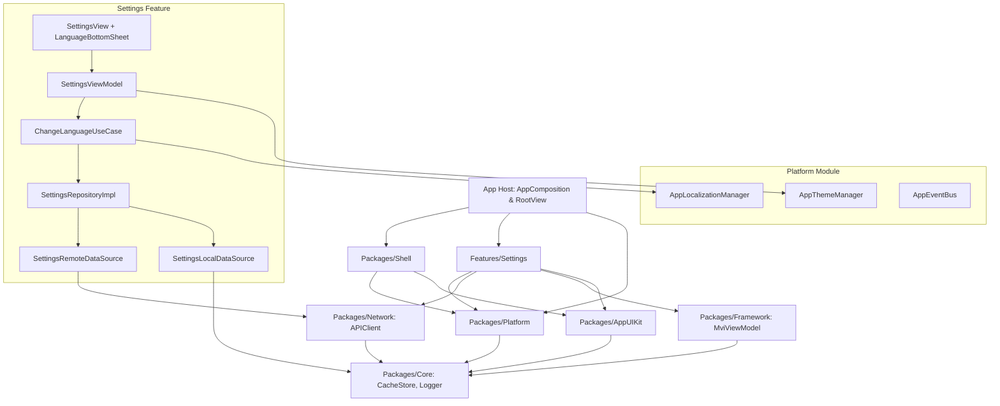
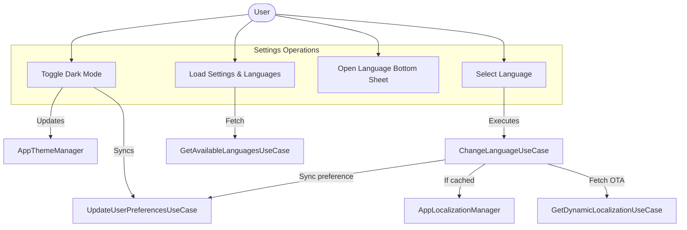
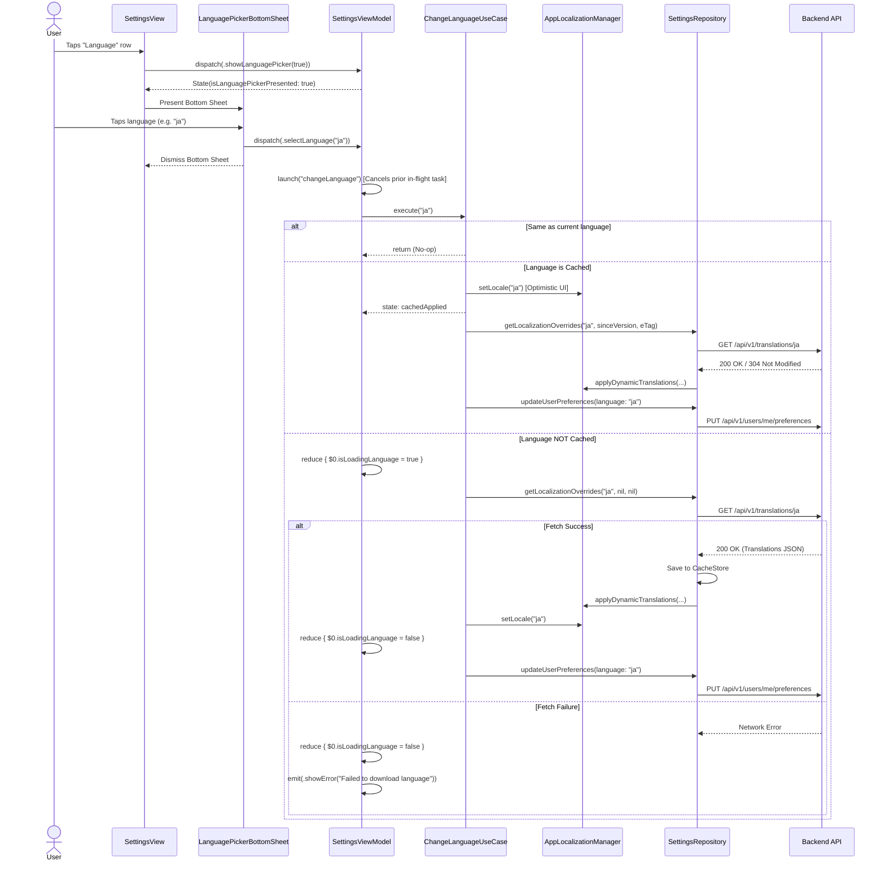

# Settings: Language Change & Dark Mode with Dynamic Sync

## 1. Meta Data
- **Status**: In Progress
- **Target Release**: v1.1.0
- **Source Spec**: [2026-09-05-settings-language-darkmode-design.md](2026-09-05-settings-language-darkmode-design.md)

## 2. Background
In the reference repository (`bloc_digital_wallet/.worktrees/flutter_super_app_template`), the application implements theme mode toggling and dynamic over-the-air (OTA) localization with remote synchronization (`GET /translations`, `GET /translations/{code}` with ETag 304, `PUT /users/me/preferences`). PR #34 resolved critical bugs including race conditions on rapid switching and un-cached language display failures.
This Epic brings complete feature parity to the iOS Super App template using Clean Architecture + MVI, conforming to the AST-based architecture gate (`ArchTests` K1–K9), and implementing a card-based Settings UI with a modal Language Bottom Sheet.

## 3. Goals & Non-Goals

### Goals
- **Dark Mode**: Provide `AppThemeManager` in `Packages/Platform` supporting `.system`, `.light`, and `.dark`, persisted to `CacheStore`, broadcast via `AppEventBus`, bound to `.preferredColorScheme` in `RootView`, and synced to backend via `PUT /api/v1/users/me/preferences`.
- **Dynamic Localization**: Provide `AppLocalizationManager` in `Packages/Platform` with two-tier lookup (dynamic JSON cache overrides $\to$ local `.xcstrings` $\to$ fallback key).
- **Remote Synchronization**: Integrate `GET /api/v1/translations`, `GET /api/v1/translations/{code}` (with ETag & 304 Not Modified), and `PUT /api/v1/users/me/preferences`.
- **PR #34 Parity**: Implement `ChangeLanguageUseCase` state machine with race condition protection via Task cancellation, state-aware optimistic UI (immediate for cached, loading for un-cached), and same-language redundant call elimination.
- **Card-based UI & Bottom Sheet**: Rebuild `SettingsView` to match the exact design in the reference screenshots (grouped cards, circular colored icon badges, section headers, standalone logout button, modal `LanguagePickerBottomSheet`).
- **Strict Quality**: 100% test coverage on new use cases, ViewModels, and repositories; 0 ArchTests violations.

### Non-Goals
- Full server-driven CMS theme engine (palette styling customization beyond Dark/Light/System).
- Non-settings screens localization (only Settings module and Shell/Platform infrastructure in this epic).

## 4. Architecture & Technical Design

### High-Level Architecture

### Use Cases

### Sequence Diagram: Language Selection (PR #34 Parity)

## 5. Rollout Strategy & Mitigation
- **Fallback Integrity**: In offline scenarios or if API calls fail, the application relies seamlessly on bundled local string catalogs (`.xcstrings`) and local cache.
- **Backwards Compatibility**: Existing `SettingsEntity` fields remain intact; new fields have robust defaults (`default_light` theme, `en` fallback).
- **Concurrency Safety**: Strict Structured Concurrency ensures no race conditions when requests are in flight.
- **Rollback Plan**: In case of regression, local cache can be invalidated or bypassed without impacting core wallet features.

## 6. Kanban Tasks Breakdown
- [Task 1: Platform Theme & Localization Infrastructure](../../features/task_1_platform_theme_localization_infrastructure.md)
- [Task 2: Settings Data Layer & API Client Integration](../../features/task_2_settings_data_layer_api_integration.md)
- [Task 3: Settings Domain Layer & PR #34 Orchestration Use Cases](../../features/task_3_settings_domain_orchestration_usecases.md)
- [Task 4: Settings Presentation Layer & MVI ViewModel](../../features/task_4_settings_presentation_mvi_viewmodel.md)
- [Task 5: Settings Card UI & Language Bottom Sheet](../../features/task_5_settings_card_ui_language_bottom_sheet.md)
- [Task 6: Root Composition & App-Wide Wiring Verification](../../features/task_6_root_composition_app_wiring.md)
