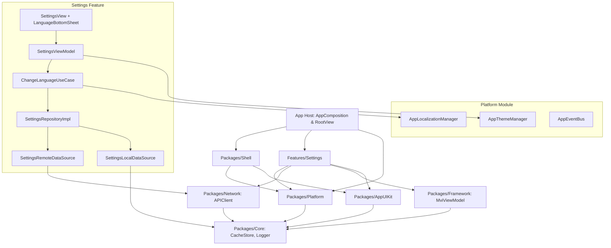
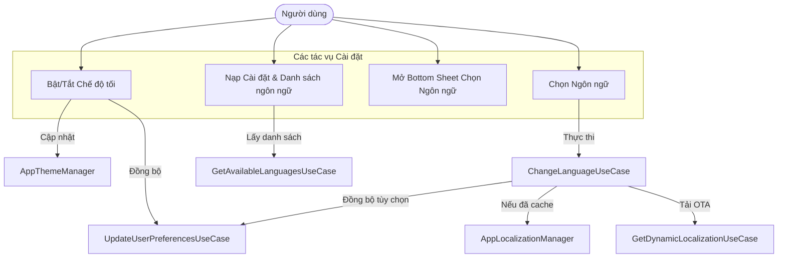
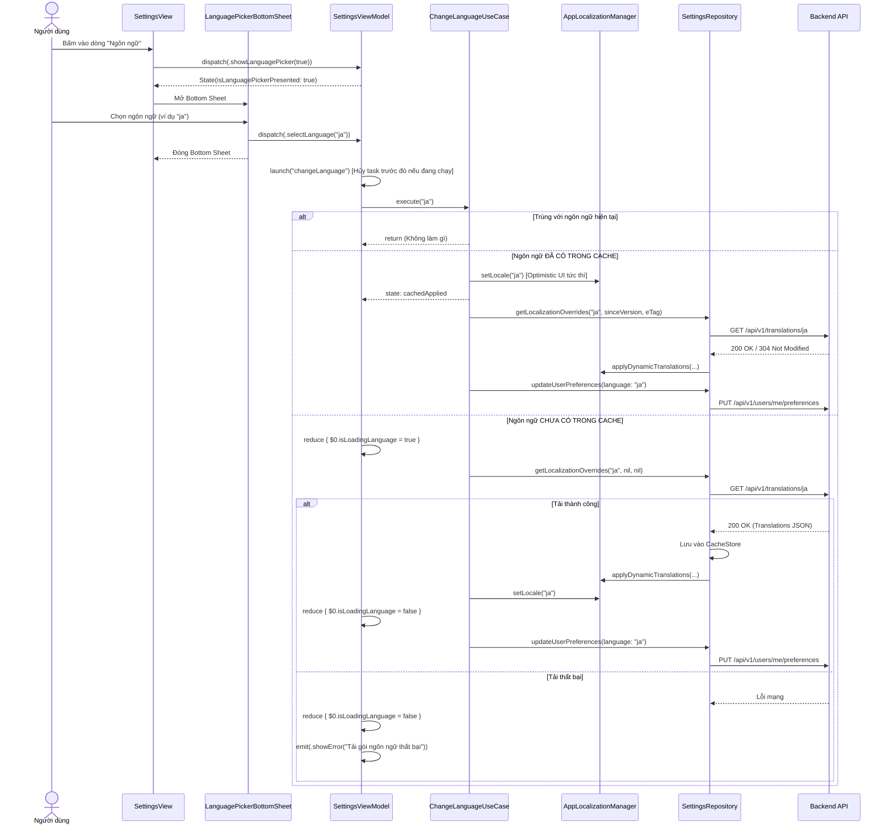

# Cài đặt: Đổi ngôn ngữ & Chế độ tối kèm đồng bộ Server

## 1. Meta Data
- **Trạng thái**: In Progress
- **Phiên bản mục tiêu**: v1.1.0
- **Source Spec**: [2026-09-05-settings-language-darkmode-design.md](2026-09-05-settings-language-darkmode-design.md)

## 2. Bối cảnh (Background)
Trong repository tham chiếu (`bloc_digital_wallet/.worktrees/flutter_super_app_template`), ứng dụng hỗ trợ tính năng bật/tắt chế độ tối và đa ngôn ngữ động qua mạng (OTA Localization) kèm đồng bộ hóa từ xa (`GET /translations`, `GET /translations/{code}` hỗ trợ ETag 304, `PUT /users/me/preferences`). Bản sửa lỗi PR #34 đã xử lý triệt để race condition khi chuyển đổi ngôn ngữ liên tục và lỗi hiển thị khi ngôn ngữ chưa được nạp vào bộ nhớ đệm cache.
Epic này xây dựng tính năng tương đương 100% cho dự án iOS Native Super App theo kiến trúc Clean Architecture + MVI, tuân thủ nghiêm ngặt bộ kiểm tra kiến trúc AST (`ArchTests` K1–K9), đồng thời hiện thực hóa giao diện Cài đặt dạng card cùng Modal Bottom Sheet chọn ngôn ngữ.

## 3. Mục tiêu & Giới hạn (Goals & Non-Goals)

### Mục tiêu (Goals)
- **Chế độ tối (Dark Mode)**: Xây dựng `AppThemeManager` trong `Packages/Platform` hỗ trợ `.system`, `.light`, `.dark`, lưu vào `CacheStore`, phát sự kiện qua `AppEventBus`, gắn trực tiếp vào `.preferredColorScheme` ở `RootView`, và đồng bộ tùy chọn lên server qua `PUT /api/v1/users/me/preferences`.
- **Đa ngôn ngữ động (Dynamic Localization)**: Xây dựng `AppLocalizationManager` trong `Packages/Platform` với cơ chế tra cứu hai lớp (từ điển dynamic JSON cache $\to$ local `.xcstrings` $\to$ key dự phòng).
- **Đồng bộ hóa API (Remote Synchronization)**: Tích hợp `GET /api/v1/translations`, `GET /api/v1/translations/{code}` (xử lý ETag & 304 Not Modified), và `PUT /api/v1/users/me/preferences`.
- **Kế thừa PR #34 (PR #34 Parity)**: Triển khai state machine trong `ChangeLanguageUseCase` chặn race condition qua Task cancellation, Optimistic UI theo trạng thái cache, và bỏ qua các lệnh gọi trùng lặp khi chọn lại ngôn ngữ hiện hành.
- **Giao diện Card & Bottom Sheet**: Xây dựng lại `SettingsView` chuẩn xác theo ảnh thiết kế thực tế (danh sách card bo góc, icon badge tròn có màu, tiêu đề nhóm in hoa, nút đăng xuất độc lập, modal `LanguagePickerBottomSheet`).
- **Chất lượng kiểm thử**: Đạt độ phủ test 100% cho Use Cases, ViewModels, Repositories mới; 0 lỗi vi phạm `ArchTests`.

### Ngoài phạm vi (Non-Goals)
- Hệ thống đổi màu theme động toàn diện từ CMS (chỉ tập trung vào Dark/Light/System).
- Bản dịch cho các màn hình khác ngoài Cài đặt và khung Shell/Platform trong phạm vi Epic này.

## 4. Kiến trúc & Thiết kế kỹ thuật (Architecture & Technical Design)

### Kiến trúc tổng thể (High-Level Architecture)

### Trường hợp sử dụng (Use Cases)

### Sơ đồ tuần tự: Đổi ngôn ngữ (Sequence Diagram)

## 5. Chiến lược triển khai & Giảm thiểu rủi ro (Rollout Strategy & Mitigation)
- **Cơ chế Fallback an toàn**: Khi ngoại tuyến hoặc mất kết nối API, ứng dụng sử dụng mượt mà từ điển cục bộ `.xcstrings` và cache có sẵn.
- **Tính tương thích ngược**: Giữ nguyên vẹn cấu trúc `SettingsEntity` hiện tại; các thuộc tính mới đều có giá trị mặc định an toàn.
- **An toàn luồng (Concurrency Safety)**: Sử dụng Swift Structured Concurrency để loại bỏ triệt để race condition khi có nhiều request đồng thời.
- **Kế hoạch Rollback**: Trong trường hợp có lỗi phát sinh, bộ nhớ đệm cache có thể được xóa hoặc bỏ qua mà không làm ảnh hưởng đến các tính năng khác của ví điện tử.

## 6. Danh sách Kanban Tasks
- [Task 1: Platform Theme & Localization Infrastructure](../../features/task_1_platform_theme_localization_infrastructure.md)
- [Task 2: Settings Data Layer & API Client Integration](../../features/task_2_settings_data_layer_api_integration.md)
- [Task 3: Settings Domain Layer & PR #34 Orchestration Use Cases](../../features/task_3_settings_domain_orchestration_usecases.md)
- [Task 4: Settings Presentation Layer & MVI ViewModel](../../features/task_4_settings_presentation_mvi_viewmodel.md)
- [Task 5: Settings Card UI & Language Bottom Sheet](../../features/task_5_settings_card_ui_language_bottom_sheet.md)
- [Task 6: Root Composition & App-Wide Wiring Verification](../../features/task_6_root_composition_app_wiring.md)
