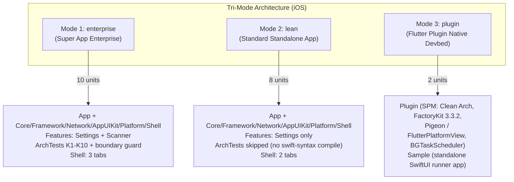

# Tri-Mode iOS Native Template & Flutter Plugin Native Devbed — Design Spec

## 1. Metadata

- **Epic / Feature**: `tri_mode_and_flutter_plugin_devbed`
- **Date**: 2026-09-14
- **Status**: Draft — In Spec Review (Gate 1)
- **Target Repository**: `ios_digital_wallet` (`/Users/danhdueexoictif/AllProjects/digital_wallet/ios_digital_wallet`)
- **Supersedes**: the `template_modes` epic (dual-mode only), archived at
  `.devtool/epic/archived/template_modes/`. Its Gate 1 spec explicitly listed the
  plugin devbed as a Non-Goal; this spec brings it back in scope.
- **Reference Android Epic** (implemented, 7 tasks):
  `/Users/danhdueexoictif/AllProjects/digital_wallet/android_digital_wallet/.devtool/epic/tri_mode_and_flutter_plugin_devbed`
- **Reference Flutter Template** (defines the shipping shape of a plugin's `ios/` directory):
  `/Users/danhdueexoictif/AllProjects/digital_wallet/bloc_digital_wallet`
  — bricks `pac_native_plugin`, `pac_add_native_ui`.

---

## 2. Context & Problem Statement

### 2.1 Current state of the iOS Super App template

`ios_digital_wallet` ships at the highest governance tier — an enterprise Super App template:

- One local SPM package per module, composed by **Tuist 4** (`Tuist/Package.swift`,
  `Project.swift`, `Workspace.swift`, `Tuist/ProjectDescriptionHelpers/Module.swift`).
- Infrastructure packages: `Packages/Core`, `Packages/Framework`, `Packages/Network`,
  `Packages/AppUIKit`, `Packages/Platform`, `Packages/Shell`.
- Features: `Features/Settings` (a real Clean Architecture + MVI reference feature) and
  `Features/Scanner` (a stub proving multi-feature governance, cross-feature routing and
  deep-link reachability).
- An AST architecture gate: `ArchTests`, swift-syntax `602.0.0`, rules K1–K10.
- A feature-blind 3-tab `ShellView` in `Packages/Shell`.
- DI: **Factory 2.4.3** — `import Factory`, global `Container.shared`, registered in
  `App/Sources/Composition/AppComposition.swift`.

### 2.2 Pain points

1. **Over-engineered for a standalone app or MVP.** A small team cloning this template pays
   the full cost of compiling `swift-syntax` for `ArchTests` on every verification loop, plus
   the `Scanner` stub they must unwire by hand across five files.
2. **No Native Devbed for Flutter plugin work.** The Flutter Super App template's bricks
   (`pac_native_plugin`, `pac_add_native_ui`) emit a plugin whose `ios/` directory is a
   four-layer Clean Architecture SPM package — `Platform` / `Domain` / `Data` / `Presentation`,
   headless via Pigeon or with SwiftUI UI via `FlutterPlatformView`. Today a developer writing
   that native code has no way to compile, run or unit-test it without booting a full Flutter
   app.
3. **No automated mode configuration.** The Android template switches modes in one command;
   the iOS template only supports identity renaming (`scripts/rename_project.sh`).

### 2.3 Two constraints that do NOT transfer from Android

This is the core of the analysis. The Android epic is the reference, but two of its load-bearing
decisions have no iOS equivalent and must be re-derived.

**(a) The reason Mode 3 exists is different — but a real constraint still justifies it.**

Android needs Mode 3 because **Hilt cannot work inside a Flutter plugin**: it rewrites `Activity`
bytecode and requires `@HiltAndroidApp` on the host `Application`, which a plugin distributed via
pub.dev cannot impose. That forces Pure Dagger 2, which in turn forces a separate module graph.

iOS has no such compiler constraint — Factory is a plain Swift library. **But an equivalent
constraint does exist, at the version level:**

| | Host template (`enterprise` / `lean`) | Flutter plugin (`pac_native_plugin` output) |
|---|---|---|
| Library | Factory **2.4.3** | Factory **3.3.2** |
| Module | `import Factory` | `import FactoryKit` |
| Container | global `Container.shared` | a per-plugin `SharedContainer` subclass |

These two APIs are incompatible and cannot coexist in one SPM graph. Because the three modes are
mutually exclusive, pinning Factory 3.3.2 in Mode 3 costs nothing and touches no host code.
**Decision: mode-scoped Factory versions.** Unifying the host on 3.3.2 is a worthwhile but
separate epic.

**(b) Binding the Flutter engine — the hardest link, with no Android analogue.**

Android writes `compileOnly(Deps.Flutter.embedding)` against
`io.flutter:flutter_embedding_debug`, a Maven artifact that resolves like any other dependency.

iOS has nothing equivalent. The `FlutterFramework` package that `pac_native_plugin`'s
`Package.swift` depends on is an **ephemeral, generated, empty SPM shim** — Flutter's tool writes
it to `ios/Flutter/ephemeral/Packages/.packages/FlutterFramework/`, and its only source file
contains nothing but `// Generated file. Do not edit.`. `import Flutter` resolves only because the
Xcode target links the real `Flutter.xcframework` at app-build time. Consequently a plugin package
**cannot be built standalone** — `swift build` fails on `import Flutter`.

**Decision: the devbed binds the real engine.** `Flutter.xcframework` is verified present in the
local Flutter SDK at `$FLUTTER_ROOT/bin/cache/artifacts/engine/ios/Flutter.xcframework`. A
bootstrap script resolves `FLUTTER_ROOT` (fvm-aware), symlinks the xcframework into
`Plugin/Vendor/`, and `Plugin/Package.swift` declares it as a `.binaryTarget`. The entire
`Platform/` layer — the part that is hardest to get right — then compiles for real.

---

## 3. Tri-Mode Architecture



### 3.1 Comparison matrix

| Criteria | Mode 1: `enterprise` | Mode 2: `lean` | Mode 3: `plugin` |
|---|---|---|---|
| **Purpose** | Large-scale super app, multiple teams, mini-app ecosystem | Standalone app, MVP, startup, small team (fastest builds) | Writing native code for a Flutter plugin (`pac_native_plugin`) |
| **Primary output** | `.app` from the full package graph | `.app` from a slim graph | SPM package that drops into a Flutter plugin's `ios/`, plus a Sample runner app |
| **Active units** | `App`, 6 `Packages/*`, `Features/Settings`, `Features/Scanner`, `ArchTests` (**10**) | `App`, 6 `Packages/*`, `Features/Settings` (**8**) | `Plugin`, `Sample` (**2**) |
| **DI** | Factory 2.4.3, global `Container.shared` | Factory 2.4.3, global `Container.shared` | **FactoryKit 3.3.2**, per-plugin `SharedContainer` subclass — no host composition root |
| **Governance gates** | `swift test --package-path ArchTests` (K1–K10) + `scripts/check_module_boundaries.sh` | **Both skipped** in the fast loop | Skipped; SwiftLint + SwiftFormat still enforced |
| **UI** | SwiftUI, feature-blind 3-tab `ShellView` | SwiftUI, 2-tab `ShellView` | **SwiftUI screen wrapped in `FlutterPlatformView`** via `UIHostingController` |
| **Background execution** | n/a | n/a | **`BGTaskScheduler`, runs with zero Flutter engine** |
| **Flutter dependency** | none | none | `Flutter.xcframework` as a `.binaryTarget` |
| **Maps onto a Flutter plugin** | no | no | **1-to-1 with the plugin's `ios/` directory** |

Android's shape is 12 / 9 / 2 modules; iOS is 10 / 8 / 2. Same structure, adjusted for the fact
that iOS has no Dynamic Feature Modules and no Binary Compatibility Validator.

---

## 4. Mode 3 — Detailed Design

### 4.1 Directory layout (1-to-1 with the Android devbed)

```
Plugin/                                         # ≈ Android :plugin
├── Package.swift                               # FactoryKit 3.3.2 + Flutter binaryTarget
├── Vendor/
│   └── Flutter.xcframework -> $FLUTTER_ROOT/…  # symlink, git-ignored, bootstrap-generated
├── Sources/Plugin/
│   ├── PluginContainer.swift                   # ≈ PluginComponent.kt + PluginComponentProvider.kt
│   ├── Platform/                               # FLUTTER-FACING LAYER
│   │   ├── MyPlugin.swift                      # ≈ MyPlugin.kt — FlutterPlugin.register(with:)
│   │   ├── Messages.g.swift                    # ≈ Messages.g.kt — Pigeon contracts
│   │   ├── MyPluginHostApiImpl.swift           # ≈ MyPluginHostApiImpl.kt — headless path
│   │   └── MyPlatformViewFactory.swift         # ≈ MyPlatformViewFactory.kt — UI path
│   ├── Domain/                                 # PURE SWIFT — no Flutter, no UIKit, no SwiftUI
│   │   ├── Model/PluginData.swift
│   │   ├── Repository/PluginRepository.swift
│   │   └── UseCase/GetDataUseCase.swift, SyncDataUseCase.swift
│   ├── Data/
│   │   ├── Repository/PluginRepositoryImpl.swift
│   │   └── Background/DataSyncTask.swift       # ≈ DataSyncWorker.kt — BGTaskScheduler
│   └── Presentation/                           # ONLY WHEN has_ui
│       ├── Base/MviViewModel.swift, ViewContract.swift
│       ├── MyPluginViewModel.swift / State / Action / Event
│       ├── MyPluginView.swift                  # SwiftUI screen
│       └── MyPlatformView.swift                # UIHostingController → FlutterPlatformView
└── Tests/PluginTests/                          # mirrors Android's 5 test classes
    ├── PluginContainerTests.swift
    ├── MyPluginHostApiImplTests.swift
    ├── MyPluginViewModelTests.swift
    ├── MyPlatformViewTests.swift
    └── DataSyncTaskTests.swift

Sample/                                         # ≈ Android :sample
└── Sources/
    ├── SampleApp.swift                         # @main, registers the BGTask identifier
    └── ContentView.swift                       # mounts MyPluginView() or drives the UseCases
```

The layer names match `pac_native_plugin`'s output exactly, so code written in the devbed can be
copied into a generated plugin without restructuring.

### 4.2 DI: FactoryKit 3.3.2, per-plugin container

Mirrors the brick's `{{name.pascalCase()}}Container.swift`: a dedicated `SharedContainer`
subclass rather than the global `Container.shared`, so the plugin is self-contained and two
plugins in one Flutter app cannot collide on factory names.

```swift
public final class PluginContainer: SharedContainer {
    public static let shared = PluginContainer()
    public let manager = ContainerManager()
}

public extension PluginContainer {
    var repository: Factory<PluginRepository> { self { PluginRepositoryImpl() } }
}
```

Production overrides that need the `FlutterPluginRegistrar` are registered in
`MyPlugin.register(with:)` — the only place holding the registrar. Tests override with
`PluginContainer.shared.repository.register { MockRepository() }` and `reset()` in teardown.
This is the direct analogue of Android's thread-safe `PluginComponentProvider`, and FactoryKit
provides the thread safety, so no hand-written double-checked singleton is needed.

### 4.3 Background execution with zero Flutter engine

Android's proof is a `CoroutineWorker` resolving dependencies from `PluginComponentProvider`.
The iOS analogue is `BGTaskScheduler`:

```swift
public enum DataSyncTask {
    public static let identifier = "com.danhdue.plugin.sync"

    public static func register() {
        BGTaskScheduler.shared.register(forTaskWithIdentifier: identifier, using: nil) { task in
            handle(task as! BGProcessingTask)
        }
    }

    static func handle(_ task: BGProcessingTask) {
        let useCase = PluginContainer.shared.syncDataUseCase()
        let work = Task { task.setTaskCompleted(success: await useCase.execute()) }
        task.expirationHandler = { work.cancel() }
    }
}
```

The same benefit as Android: when iOS wakes the app for background work, none of this needs a
`FlutterEngine`, avoiding both the memory cost and the jetsam risk of a headless engine.

One iOS-specific constraint to honour: `BGTaskScheduler.register` must be called before
`application(_:didFinishLaunchingWithOptions:)` returns. A Flutter plugin's `register(with:)`
runs inside that window, so `MyPlugin.register(with:)` is a valid call site — and `Sample`'s
`SampleApp.init` is the devbed equivalent. `DataSyncTaskTests` calls the handler directly,
so the suite needs neither a scheduler nor an engine.

### 4.4 Binding the Flutter engine

`Plugin/Package.swift`:

```swift
let package = Package(
    name: "Plugin",
    platforms: [.iOS("15.0")],
    products: [.library(name: "Plugin", targets: ["Plugin"])],
    dependencies: [.package(url: "https://github.com/hmlongco/Factory.git", exact: "3.3.2")],
    targets: [
        .binaryTarget(name: "Flutter", path: "Vendor/Flutter.xcframework"),
        .target(name: "Plugin", dependencies: ["Flutter", .product(name: "FactoryKit", package: "Factory")]),
        .testTarget(name: "PluginTests", dependencies: ["Plugin"]),
    ]
)
```

`platforms: [.iOS("15.0")]` deliberately sits below the template's iOS 16 floor, because this
package's consumer is a Flutter app, not this template — it matches what `pac_native_plugin`
emits. This is the one place `Module.swift` is not the deployment-target authority, and the
reason is recorded here and in the package header.

`scripts/bootstrap_devbed.sh` resolves the SDK in this order: `$FLUTTER_ROOT`, then
`fvm` (`.fvmrc` / `fvm/versions/<v>`), then `which flutter` resolved through symlinks. It
verifies the xcframework exists, creates `Plugin/Vendor/Flutter.xcframework` as a symlink, and
fails with an actionable message otherwise. `Plugin/Vendor/` is git-ignored: the path is
machine-specific and the binary must never enter the repository.

**Known sharp edge, addressed in Task 5's acceptance criteria.** A package with an
`.xcframework` binary target cannot be built by plain `swift build`; it requires
`xcodebuild -scheme Plugin -destination 'generic/platform=iOS Simulator'`. Every verification
command in this spec is written accordingly, and Task 5 must establish and document the exact
invocation before Tasks 6–8 depend on it.

**Accepted risk — engine version drift.** The xcframework comes from whichever Flutter SDK is
installed locally, which may differ from the host app's engine. Acceptable: the devbed exists to
compile and unit-test, never to ship a binary. `bootstrap_devbed.sh` prints the resolved Flutter
version so the drift is visible.

---

## 5. Mode Switching Mechanism

### 5.1 Two seams, chosen per file type

Android patches `settings.gradle.kts` with regex because Gradle leaves no alternative. iOS
manifests are real Swift, so the mechanism is split — each half using the safest tool for its
file type, while the external UX stays identical to Android.

**(a) Tuist manifests → a generated mode constant.**
`configure_mode.sh` writes `Tuist/ProjectDescriptionHelpers/ActiveMode.swift`:

```swift
public enum TemplateMode: String { case enterprise, lean, plugin }
public let activeMode: TemplateMode = .enterprise   // rewritten by configure_mode.sh
```

`Tuist/Package.swift`, `Project.swift` and `Workspace.swift` branch on `activeMode`. This is
idempotent by construction and **cannot produce a syntax error** — which matters most in Mode 3,
where the whole target list changes (the App target is replaced by the Sample target), not just
a dependency list. Regex-commenting an entire `Target(...)` literal is exactly the operation
most likely to corrupt a manifest.

**(b) App and Shell Swift sources → marker regions, as on Android.**
These files compile into the binary, so they must not carry dead branches. `configure_mode.sh`
comments and uncomments between markers:

| File | Marker region | Status |
|---|---|---|
| `App/Sources/Composition/AppComposition.swift` | `app:feature-imports:begin/end` | exists |
| `App/Sources/Composition/AppComposition.swift` | `app:route-providers:begin/end` | exists |
| `Packages/Shell/Sources/Shell/ShellConfig.swift` | `shell:config-defaults:begin/end` | **to add** |
| `App/Sources/Composition/DeepLinkComposition.swift` | `app:tab-resolver-scanner:begin/end` | **to add** |
| `Packages/Shell/Sources/Shell/ShellView.swift` | `shell:scanner-tab:begin/end` | **to add** |
| `Packages/Shell/Sources/Shell/ShellView.swift` | `shell:settings-tab:begin/end` | **to add** |

`Tuist/Package.swift`'s `tuist:packages:begin/end` and `Project.swift`'s
`tuist:app-deps:begin/end` markers stay verbatim — the Mason bricks edit them, and the
`activeMode` branch wraps them rather than replacing them.

A note on `ShellView`: it does **not** import the `Scanner` package — it only names
`AppRoutes.ScannerRoot()` from `Platform` — so it still compiles in lean mode. The tab must
nonetheless be commented out, or lean mode renders a third tab that resolves to nothing. A
runtime `ShellConfig` flag cannot replace the marker region for this reason.

### 5.3 Test-suite mode awareness

A gap with no Android counterpart, found while auditing the existing suite. Android's lean mode
removes a Dynamic Feature Module that owns its own tests, so nothing else breaks. On iOS the
tab-structure tests live in the **shared** `Shell` package and in `App/Tests`, and they hard-code
the enterprise shape: **51 references across 10 files** assert `Scanner` or `tabCount: 3`.
`App/Tests/AppTests/AppCompositionTests.swift:26` asserts *"exactly one provider handles
ScannerRoot"* — it fails outright in lean mode.

Left unaddressed, `configure_mode.sh lean` produces a project that builds but has a red test
suite, which is worse than no mode switch at all.

**Approach.** Extract every Scanner-coupled or 3-tab-coupled assertion into dedicated files —
`ShellTests/ScannerTabTests.swift`, `AppTests/ScannerCompositionTests.swift`,
`AppTests/ScannerDeepLinkTests.swift` — leaving the mode-agnostic tests behind, parameterised on
`ShellConfig` rather than on the literal `3`. `configure_mode.sh` then toggles a single
`exclude:` entry inside a marker region in each test target's `Package.swift`, and `--prune`
deletes the files. Affected files:

| File | Coupling |
|---|---|
| `Packages/Shell/Tests/ShellTests/FeatureBlindRenderTests.swift` | `tabCount: 3`, `ScannerRoot` |
| `Packages/Shell/Tests/ShellTests/ReTapTests.swift` | `tabCount: 3` |
| `Packages/Shell/Tests/ShellTests/TeardownTests.swift` | `tabCount: 3` |
| `Packages/Shell/Tests/ShellTests/TestSupport.swift` | shared `Scanner` fixtures |
| `Packages/Shell/Tests/ShellTests/PackageManifestTests.swift` | asserts the `Scanner` package edge |
| `App/Tests/AppTests/AppCompositionTests.swift` | provider count, tab-1 routing |
| `App/Tests/AppTests/ShellTabResolverTests.swift` | `ScannerRoot` placement |
| `App/Tests/AppTests/DeepLinkCompositionTests.swift` | `ScannerRoot` resolution |
| `App/Tests/AppTests/DeepLinkFlowTests.swift` | end-to-end Scanner deep link |
| `App/Tests/AppTests/NavigationFlowTests.swift` | cross-tab navigation via Scanner |
| `App/UITests/DeepLinkOpenURLUITests.swift` | 3-tab cold-start assertion |

This is Task 3, and Task 2's round trip is not considered green until the suite passes in **both**
enterprise and lean.

### 5.2 Tab index handling

- `enterprise`: Home `tag(0)`, Scanner `tag(1)`, Settings `tag(2)`; `ShellConfig(tabCount: 3, initialTab: 2)`.
- `lean`: Home `tag(0)`, Settings `tag(1)`; `ShellConfig(tabCount: 2, initialTab: 1)`.
- `ShellTabResolver` maps `AppRoutes.SettingsRoot` to the active Settings index and returns `nil`
  for `AppRoutes.ScannerRoot` in lean mode, so no deep link resolves to a missing tab.

ArchTests rule **K10.2** requires every route in `Platform.AppRoutes` to be reachable by at least
one `DeepLinkRoute`. Lean mode removes the `Scanner` route provider, so K10.2 must not fail on
the now-unreachable `ScannerRoot`. Lean mode skips `ArchTests` entirely, so the fast loop is
unaffected; but `configure_mode.sh enterprise` must fully restore the provider, and Task 2's
round-trip test asserts that `ArchTests` passes again after returning to enterprise.

---

## 6. Scripts

### 6.1 `scripts/configure_mode.sh`

```bash
scripts/configure_mode.sh <enterprise|lean|plugin> [--prune] [--force] [--root-dir=<path>]
```

Same contract as Android's. Per mode:

- **`enterprise`** — `activeMode = .enterprise`; uncomment every marker region; restore the
  3-tab layout and `ShellConfig(tabCount: 3, initialTab: 2)`; `tuist install && tuist generate --no-open`.
- **`lean`** — `activeMode = .lean`; comment the Scanner imports, route provider, tab and tab
  resolver; set the 2-tab layout; regenerate. `--prune` deletes `Features/Scanner/`.
- **`plugin`** — `activeMode = .plugin`; the manifests emit only the `Plugin` package and the
  `Sample` app target; call `bootstrap_devbed.sh`; regenerate. `--prune` deletes `App/`,
  `Packages/`, `Features/` and `ArchTests/`.

`--prune` aborts on a dirty `git status --porcelain` unless `--force` is given.

### 6.2 `scripts/bootstrap_devbed.sh`

```bash
scripts/bootstrap_devbed.sh [--flutter-root=<path>]
```

Resolves the Flutter SDK, verifies `Flutter.xcframework`, creates the `Plugin/Vendor/` symlink,
prints the resolved Flutter and engine versions. Idempotent; safe to re-run.

### 6.3 `scripts/rename_project.sh` — `--mode` integration

```bash
scripts/rename_project.sh <NewAppName> <new.bundle.id> [--mode <enterprise|lean|plugin>] [--force] [--dry-run]
```

Defaults to `--mode enterprise`, preserving today's behaviour exactly. Renames first, then
delegates to `configure_mode.sh <mode>`. Self-verification is mode-differentiated:

- `enterprise` — `xcodebuild build` + `swift test --package-path ArchTests` + `check_module_boundaries.sh`
- `lean` — `xcodebuild build` only
- `plugin` — `xcodebuild -scheme Plugin` + `xcodebuild -scheme Sample` (host renaming is a no-op)

Under `--dry-run` it prints `WOULD CONFIGURE MODE: …` and changes nothing.

### 6.4 Test and acceptance scripts (mirroring Android)

`scripts/test_configure_mode.sh`, `scripts/test_rename_project_mode.sh`,
`scripts/test_mason_bricks.sh`, `scripts/acceptance_check.sh`.

---

## 7. Mason Bricks

Following the repo's existing `ios_`-prefixed brick convention:

| Brick | Output | Purpose | Modes |
|---|---|---|---|
| `ios_mvi_feature` | `Features/{{name}}/` | Full feature module (Data/Domain/Presentation + RouteProvider) | `enterprise`, `lean` |
| `ios_mvi_subfeature` | `Features/{{feature}}/Sources/.../Presentation/` | Add an MVI screen to an existing feature | `enterprise`, `lean` |
| **`ios_native_plugin`** | `Plugin/` or `Packages/{{name}}/` | Four-layer Clean Arch SPM package + FactoryKit 3.3.2 + Pigeon or `FlutterPlatformView` (`has_ui: true/false`) | `plugin` |
| **`ios_add_native_ui`** | target plugin package | One-shot upgrade No-UI → With-UI (SwiftUI screen, ViewModel, `PlatformView`) | `plugin` |

The two new bricks mirror Android's `native_plugin` / `add_native_ui`, and their output must stay
byte-compatible with what `pac_native_plugin` emits in `bloc_digital_wallet`.

---

## 8. Verification Matrix

| ID | Scenario | Command | Pass criteria |
|:---:|---|---|---|
| **V1** | Enterprise mode (default) | `./scripts/configure_mode.sh enterprise` | 10 units active; `tuist generate`, `xcodebuild build`, `swift test --package-path ArchTests`, `check_module_boundaries.sh` all pass |
| **V2** | Switch to lean | `./scripts/configure_mode.sh lean` | Scanner unwired from manifests, `AppComposition`, `ShellView`, `ShellTabResolver`; 2 tabs render; build passes measurably faster; **test suite green** |
| **V3** | Switch to plugin | `./scripts/configure_mode.sh plugin` | Manifests emit only `Plugin` + `Sample`; host units fully inactive |
| **V4** | Build and test `Plugin` standalone | `xcodebuild -scheme Plugin -destination 'generic/platform=iOS Simulator'` + `xcodebuild test -scheme Plugin` | Compiles against the real `Flutter.xcframework`; all 5 test classes pass |
| **V5** | Background task, zero Flutter engine | `xcodebuild test -scheme Plugin -only-testing:PluginTests/DataSyncTaskTests` | Handler resolves dependencies through `PluginContainer` with no `FlutterEngine` instantiated |
| **V6** | Build the `Sample` runner | `xcodebuild -scheme Sample` | App builds and renders `MyPluginView` in the simulator |
| **V7** | Idempotent round trip | `enterprise → lean → plugin → enterprise` | No code lost, no syntax error in any manifest or Swift source, build green at each state, ArchTests pass again at the end |
| **V8** | `rename_project.sh --mode` | `./scripts/rename_project.sh AcmeApp com.acme.app --mode lean --dry-run` then for real | Flag parsed, rename applied, lean mode configured, build succeeds without the ArchTests delay |
| **V9** | Mason bricks | `mason make ios_native_plugin --name biometric_auth --has_ui true` | Emits the four-layer structure + FactoryKit + SwiftUI `PlatformView`, matching `pac_native_plugin` output |
| **V11** | Suite green in both host modes | `configure_mode.sh enterprise && xcodebuild test` then `lean && xcodebuild test` | No failing test in either mode; no Scanner assertion runs in lean |
| **V10** | Prune guard | modify a file, then `./scripts/configure_mode.sh lean --prune` | Aborts with a clear error, deletes nothing |

---

## 9. Risks & Mitigations

| Risk | Mitigation |
|---|---|
| `Flutter.xcframework` path is machine-specific | `bootstrap_devbed.sh` resolves it; symlink is git-ignored; failure message names the exact fix |
| Engine version drift vs. the host Flutter app | Accepted — the devbed compiles and tests, never ships. Resolved version is printed on every bootstrap |
| `swift build` cannot link an xcframework binary target | Every verification uses `xcodebuild`; Task 5 establishes and documents the invocation before Tasks 6–8 build on it |
| Mode switch corrupts a manifest | Manifests branch on `activeMode` instead of being regex-patched, so corruption is structurally impossible |
| K10.2 deep-link reachability fails in lean mode | Lean mode skips ArchTests; the enterprise round trip in V7 asserts the rule passes again after restore |
| Brick output drifts from `pac_native_plugin` | `test_mason_bricks.sh` diffs the emitted layout against the Flutter brick's structure |
| Lean mode leaves a red test suite (51 enterprise-shaped assertions) | Task 3 extracts them into dedicated, excludable files; V2 and V11 gate on a green suite in both modes |
| CI needs a Flutter SDK for Mode 3 | Mode 3 verification runs in its own CI job that installs Flutter; the existing `quality` and `packages` jobs stay unchanged |

---

## 10. Rollout

1. Add the marker regions and the `ActiveMode.swift` seam with `enterprise` as the default — no
   behaviour change, everything still builds.
2. Land `configure_mode.sh` and prove the `enterprise ↔ lean` round trip.
3. Make the test suite mode-aware, so lean mode is green rather than merely buildable.
4. Integrate `--mode` into `rename_project.sh`.
5. Bootstrap the Flutter engine binding, then scaffold `Plugin`, its `Platform` layer, and `Sample`.
6. Ship the two Mason bricks.
7. Run the full verification matrix and write the docs.

Rollback at any point is `git checkout -- .`, because every script refuses to prune on a dirty
tree and every edit is idempotent.

---

## 11. Next Step Routing

This spec defines epic-scale work: three operational modes, four new or modified shell scripts,
a new SPM package plus a runner app, two Mason bricks, and a ten-row verification matrix.

→ **Route to Stage 2 (`epic-designer`)** of the `epic-lifecycle` for the HLD
(`.en.md` + `.vi.md`), `bdd_scenarios.md`, and the Kanban task breakdown.

**Proposed task breakdown (10 tasks).** Tasks 1, 3 and 5 have no Android counterpart: iOS has
roughly three times the patch surface, keeps its tab-structure tests in a shared package, and must
solve the Flutter engine binding that Gradle got for free.

| # | Task | Android counterpart |
|---|---|---|
| 1 | Marker regions + `ActiveMode.swift` mode seam | — (iOS-specific) |
| 2 | `scripts/configure_mode.sh` (3 modes) + `test_configure_mode.sh` | task 1 |
| 3 | Make the test suite mode-aware (extract 51 enterprise-shaped assertions) | — (iOS-specific) |
| 4 | `rename_project.sh --mode` + `test_rename_project_mode.sh` | task 2 |
| 5 | `scripts/bootstrap_devbed.sh` — Flutter engine binding | — (iOS-specific) |
| 6 | Scaffold `Plugin/`: Clean Arch + FactoryKit 3.3.2 + `BGTaskScheduler` | task 3 |
| 7 | `Platform/` layer: `FlutterPlugin` + Pigeon HostApi + SwiftUI `PlatformView` | task 4 |
| 8 | Scaffold `Sample/` runner app | task 5 |
| 9 | Bricks `ios_native_plugin` + `ios_add_native_ui` + `test_mason_bricks.sh` | task 6 |
| 10 | Verification matrix + docs + `acceptance_check.sh` | task 7 |
