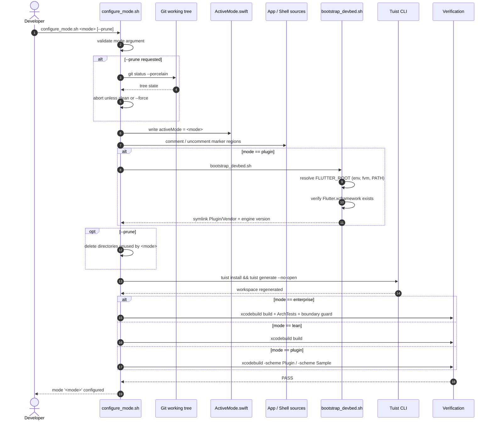

# Epic: Tri-Mode iOS Native Template & Flutter Plugin Native Devbed

## 1. Meta Data

- **Epic**: `tri_mode_and_flutter_plugin_devbed`
- **Status**: Planning (Ready for Task Confirmation — Gate 2)
- **Target Release**: v1.1.0
- **Platform**: `iOS Native`
- **Source Spec**: [2026-09-14-tri-mode-template-and-flutter-plugin-devbed-design.md](2026-09-14-tri-mode-template-and-flutter-plugin-devbed-design.md)
- **Supersedes**: `template_modes` (dual-mode only), archived at `.devtool/epic/archived/template_modes/`
- **Reference Android Epic** (implemented, 7 tasks): `android_digital_wallet/.devtool/epic/tri_mode_and_flutter_plugin_devbed`
- **Reference Flutter Template**: `bloc_digital_wallet` — bricks `pac_native_plugin`, `pac_add_native_ui`

---

## 2. Background

`ios_digital_wallet` ships at a single governance tier: enterprise Super App. Every clone pays
for `ArchTests` (swift-syntax `602.0.0`) compilation, the `Features/Scanner` stub, and a 3-tab
shell — regardless of whether the team is building a mini-app ecosystem or a two-screen MVP.

Two distinct audiences are currently unserved:

1. **Standalone app / MVP teams** need the Clean Architecture skeleton without the governance
   overhead. Removing `Scanner` today means hand-editing five files across Tuist manifests, the
   composition root, and the shell.
2. **Flutter plugin authors** need a native workbench. The Flutter Super App template's bricks
   (`pac_native_plugin`, `pac_add_native_ui`) emit a plugin whose `ios/` directory is a
   four-layer Clean Architecture SPM package. Writing that Swift code today requires booting a
   full Flutter app on every iteration — there is no way to compile, run, or unit-test it in
   isolation.

The Android template solved the same problem with a tri-mode architecture and a `:plugin` +
`:sample` devbed. This epic brings the equivalent capability to iOS, re-deriving the two
decisions that do not transfer across platforms (see §4.5).

---

## 3. Goals & Non-Goals

### Goals

- Ship `scripts/configure_mode.sh <enterprise|lean|plugin>` — idempotent, round-trip safe, with
  `--prune` guarded by a clean-git-tree check.
- Add `--mode <enterprise|lean|plugin>` to `scripts/rename_project.sh`, defaulting to
  `enterprise` so current behaviour is bit-for-bit preserved.
- Differentiate self-verification per mode: `enterprise` runs the full governance gate,
  `lean` skips `ArchTests`, `plugin` verifies the devbed schemes.
- Build the Mode 3 devbed: a `Plugin/` SPM package (Clean Architecture, FactoryKit 3.3.2,
  Pigeon / `FlutterPlatformView`, `BGTaskScheduler`) plus a `Sample/` runner app.
- Bind the real `Flutter.xcframework` so the `Platform/` layer compiles for real.
- Ship Mason bricks `ios_native_plugin` and `ios_add_native_ui`, byte-compatible with
  `pac_native_plugin` output.
- Keep the test suite green in **both** host modes.

### Non-Goals

- Collapsing the infrastructure packages (`Core`, `Framework`, `Network`, `AppUIKit`,
  `Platform`) into a monolith. Clean Architecture boundaries stay intact in every mode.
- Migrating the host template from Factory 2.4.3 to FactoryKit 3.3.2. Modes are mutually
  exclusive, so the versions coexist safely; unification is a separate epic.
- Shipping a production plugin. The devbed compiles and tests native plugin code; it never
  publishes a binary artifact.
- Changing `ios_mvi_feature` / `ios_mvi_subfeature` internals beyond marker-region compatibility.

---

## 4. Architecture & Technical Design

### 4.1 High-Level Architecture

```mermaid
graph TD
    subgraph Tooling["Configuration & Automation"]
        CFG["scripts/configure_mode.sh<br/>(enterprise | lean | plugin)"]
        REN["scripts/rename_project.sh<br/>(--mode)"]
        BOOT["scripts/bootstrap_devbed.sh<br/>(resolve FLUTTER_ROOT)"]
        REN -->|delegates to| CFG
        CFG -->|plugin mode only| BOOT
    end

    subgraph Seam["Mode Seam"]
        AM["Tuist/ProjectDescriptionHelpers/ActiveMode.swift<br/>let activeMode: TemplateMode"]
        MARK["Marker regions in App &amp; Shell sources"]
    end

    subgraph Manifests["Tuist Manifests (branch on activeMode)"]
        PKG["Tuist/Package.swift"]
        PRJ["Project.swift"]
        WSP["Workspace.swift"]
    end

    subgraph Host["Host Composition &amp; Shell (marker regions)"]
        APP["App/Sources/Composition/AppComposition.swift"]
        DEEP["App/Sources/Composition/DeepLinkComposition.swift"]
        SHELL["Packages/Shell/Sources/Shell/ShellView.swift"]
        SCFG["Packages/Shell/Sources/Shell/ShellConfig.swift"]
    end

    subgraph Devbed["Mode 3 — Flutter Plugin Native Devbed"]
        PLUG["Plugin/ (SPM)<br/>Platform · Domain · Data · Presentation<br/>FactoryKit 3.3.2 · BGTaskScheduler"]
        VEND["Plugin/Vendor/Flutter.xcframework<br/>(symlink, git-ignored)"]
        SAMP["Sample/ (SwiftUI runner app)"]
        PLUG --> VEND
        SAMP --> PLUG
    end

    subgraph Gates["Governance"]
        ARCH["ArchTests K1-K10"]
        BOUND["scripts/check_module_boundaries.sh"]
        LINT["SwiftLint --strict + SwiftFormat --lint"]
    end

    CFG -->|writes| AM
    CFG -->|patches| MARK
    AM --> PKG
    AM --> PRJ
    AM --> WSP
    MARK --> APP
    MARK --> DEEP
    MARK --> SHELL
    MARK --> SCFG
    BOOT --> VEND

    CFG -->|tuist install &amp;&amp; tuist generate| GEN["Xcode workspace"]

    MODE{"activeMode?"}
    CFG --> MODE
    MODE -->|enterprise| ARCH
    MODE -->|enterprise| BOUND
    MODE -->|lean| FAST["xcodebuild build only"]
    MODE -->|plugin| DEV["xcodebuild -scheme Plugin / Sample"]
    MODE --> LINT
```



### 4.2 Use Cases

```mermaid
flowchart TD
    Dev([Developer / DevOps])
    PA([Flutter Plugin Author])

    UC1["UC1: Initialise a fresh project in Enterprise mode"]
    UC2["UC2: Initialise a fresh project in Lean mode"]
    UC3["UC3: Toggle an existing project Enterprise to Lean"]
    UC4["UC4: Toggle back Lean to Enterprise, governance restored"]
    UC5["UC5: Prune unused feature files, guarded by clean git tree"]
    UC6["UC6: Switch into Plugin devbed mode"]
    UC7["UC7: Write and unit-test plugin native code with no Flutter app"]
    UC8["UC8: Run a background task with zero Flutter engine"]
    UC9["UC9: Preview the plugin SwiftUI screen in the Sample runner"]
    UC10["UC10: Scaffold a new native plugin from a Mason brick"]

    Dev --> UC1
    Dev --> UC2
    Dev --> UC3
    Dev --> UC4
    Dev --> UC5
    PA --> UC6
    PA --> UC7
    PA --> UC8
    PA --> UC9
    PA --> UC10
```



### 4.3 Sequence Diagram — Mode Configuration



### 4.4 Mode Matrix

| Criteria | `enterprise` | `lean` | `plugin` |
|---|---|---|---|
| Purpose | Large super app, multiple teams | Standalone app, MVP, startup | Native code for a Flutter plugin |
| Primary output | `.app`, full graph | `.app`, slim graph | SPM package for a plugin's `ios/` + Sample runner |
| Active units | App, 6 `Packages/*`, Settings, Scanner, ArchTests (**10**) | App, 6 `Packages/*`, Settings (**8**) | Plugin, Sample (**2**) |
| DI | Factory 2.4.3, global `Container.shared` | Factory 2.4.3 | **FactoryKit 3.3.2**, per-plugin `SharedContainer` |
| Governance | ArchTests K1–K10 + boundary guard | both skipped | skipped; SwiftLint/SwiftFormat kept |
| UI | SwiftUI, 3-tab shell | SwiftUI, 2-tab shell | SwiftUI in `FlutterPlatformView` |
| Background | n/a | n/a | `BGTaskScheduler`, zero Flutter engine |
| Flutter dep | none | none | `Flutter.xcframework` binary target |

Android's shape is 12 / 9 / 2 modules; iOS is 10 / 8 / 2 — same structure, adjusted for the
absence of Dynamic Feature Modules and Binary Compatibility Validator on iOS.

### 4.5 Two decisions re-derived for iOS

These are the only places where the Android epic could not be followed directly. Both were
settled in the source spec and are restated here because every task depends on them.

**(a) Why Mode 3 is still justified.** Android needs it because Hilt cannot run inside a Flutter
plugin. iOS has no such compiler constraint — but a version-level one: the host uses Factory
2.4.3 (`import Factory`, global `Container.shared`), while `pac_native_plugin` emits FactoryKit
3.3.2 (`import FactoryKit`, a per-plugin `SharedContainer` subclass). The two APIs cannot share
a graph. Since modes are mutually exclusive, each pins its own version.

**(b) Binding the Flutter engine.** Android gets `compileOnly("io.flutter:flutter_embedding_debug")`
from Maven. iOS has no equivalent: the `FlutterFramework` package that `pac_native_plugin`
depends on is an ephemeral, generated, **empty** shim — its only source file contains
`// Generated file. Do not edit.` — and `import Flutter` resolves solely because Xcode links the
real framework at app-build time. A plugin package therefore cannot be built standalone.

The devbed binds the real engine: `bootstrap_devbed.sh` resolves `FLUTTER_ROOT`, symlinks
`$FLUTTER_ROOT/bin/cache/artifacts/engine/ios/Flutter.xcframework` into `Plugin/Vendor/`, and
`Plugin/Package.swift` declares it as a `.binaryTarget`. The consequence, which Task 5 must pin
down before Tasks 6–8 build on it: **a package with an xcframework binary target cannot be built
by plain `swift build`** — every verification uses `xcodebuild -destination`.

### 4.6 Mode seam — two mechanisms, chosen per file type

- **Tuist manifests** branch on a generated `Tuist/ProjectDescriptionHelpers/ActiveMode.swift`.
  Idempotent by construction and structurally incapable of producing a syntax error — which
  matters most in Mode 3, where the entire target list changes, not just a dependency list.
- **App and Shell Swift sources** use marker regions, exactly as Android does, because these
  files compile into the binary and must not carry dead branches.

| File | Marker region | Status |
|---|---|---|
| `Tuist/Package.swift` | `tuist:packages:begin/end` | exists |
| `Project.swift` | `tuist:app-deps:begin/end` | exists |
| `App/Sources/Composition/AppComposition.swift` | `app:feature-imports:begin/end` | exists |
| `App/Sources/Composition/AppComposition.swift` | `app:route-providers:begin/end` | exists |
| `App/Sources/Composition/DeepLinkComposition.swift` | `app:tab-resolver-scanner:begin/end` | to add |
| `Packages/Shell/Sources/Shell/ShellView.swift` | `shell:scanner-tab:begin/end` | to add |
| `Packages/Shell/Sources/Shell/ShellView.swift` | `shell:settings-tab:begin/end` | to add |
| `Packages/Shell/Sources/Shell/ShellConfig.swift` | `shell:config-defaults:begin/end` | to add |

`ShellView` does **not** import the `Scanner` package — it names only `AppRoutes.ScannerRoot()`
from `Platform` — so it still compiles in lean mode. The tab must nonetheless be commented out,
or lean mode renders a third tab resolving to nothing. A runtime `ShellConfig` flag cannot
replace the marker region for this reason.

### 4.7 Test-suite mode awareness

A gap with no Android counterpart. Android's lean mode drops a Dynamic Feature Module that owns
its own tests. On iOS the tab-structure tests live in the **shared** `Shell` package and in
`App/Tests`, and they hard-code the enterprise shape: **51 references across 10 files** assert
`Scanner` or `tabCount: 3`. `App/Tests/AppTests/AppCompositionTests.swift:26` asserts
*"exactly one provider handles ScannerRoot"* — it fails outright in lean mode.

Left unaddressed, `configure_mode.sh lean` yields a project that builds but has a red suite,
which is worse than no mode switch at all. Task 3 extracts the enterprise-shaped assertions into
dedicated, excludable files and parameterises the rest on `ShellConfig` rather than the literal
`3`.

### 4.8 Mode 3 layout (1-to-1 with the Android devbed)

```
Plugin/                                  # ≈ Android :plugin
├── Package.swift                        # FactoryKit 3.3.2 + Flutter binaryTarget
├── Vendor/Flutter.xcframework -> …      # symlink, git-ignored
├── Sources/Plugin/
│   ├── PluginContainer.swift            # ≈ PluginComponent.kt + Provider
│   ├── Platform/                        # MyPlugin · Messages.g · HostApiImpl · PlatformViewFactory
│   ├── Domain/                          # Model · Repository · UseCase (pure Swift)
│   ├── Data/                            # RepositoryImpl · Background/DataSyncTask (BGTaskScheduler)
│   └── Presentation/                    # Base MVI · ViewModel · SwiftUI View · MyPlatformView
└── Tests/PluginTests/                   # 5 classes mirroring Android's 5
Sample/                                  # ≈ Android :sample
└── Sources/SampleApp.swift, ContentView.swift
```

---

## 5. Comprehensive BDD Test Scenarios

The canonical Gherkin suite lives in [bdd_scenarios.md](bdd_scenarios.md). Summary:

- **S1–S4** — Enterprise/Lean switching: manifests, composition root, shell tabs, tab resolver.
- **S5–S6** — Round-trip idempotency and governance restoration after returning to enterprise.
- **S7–S8** — `--prune` behaviour and the dirty-tree guard.
- **S9–S11** — Plugin mode activation, Flutter engine resolution, and bootstrap failure modes.
- **S12–S14** — Plugin package: DI container, Pigeon host API, SwiftUI `PlatformView`.
- **S15** — Background task executing with zero Flutter engine.
- **S16** — Sample runner app mounting the plugin screen.
- **S17–S19** — `rename_project.sh --mode`, including `--dry-run` and the unchanged default.
- **S20** — Mason brick output matching `pac_native_plugin`.
- **S21** — Test suite green in both host modes.
- **S22** — Lint and format clean in every mode.

---

## 6. Rollout Strategy & Mitigation

1. **Seam first, behaviour unchanged.** Add marker regions and `ActiveMode.swift` defaulting to
   `enterprise`. Nothing about the current build changes; the full gate still passes.
2. **Host modes.** Land `configure_mode.sh`, prove the `enterprise ↔ lean` round trip, then make
   the test suite mode-aware so lean is *green*, not merely buildable.
3. **Identity integration.** Wire `--mode` into `rename_project.sh`, default `enterprise`.
4. **Devbed.** Bind the Flutter engine, then scaffold `Plugin`, its `Platform` layer, and `Sample`.
5. **Scaffolding.** Ship the two Mason bricks.
6. **Acceptance.** Run the full verification matrix, write the docs.

**Mitigation.** Every script edit is idempotent; every destructive operation refuses to run on a
dirty tree without `--force`. Rollback at any point is `git checkout -- .`. The manifests branch
on a constant rather than being regex-patched, so a failed switch cannot leave unparseable Swift.

**CI.** Mode 3 verification runs in its own job that installs the Flutter SDK. The existing
`quality` and `packages` jobs in `.github/workflows/ci.yml` are unchanged.

---

## 7. Kanban Tasks Breakdown

- [Task 1: Marker Regions & ActiveMode Seam](task_1_marker_regions_and_mode_seam.md)
- [Task 2: Implement scripts/configure_mode.sh](task_2_configure_mode_script.md)
- [Task 3: Make the Test Suite Mode-Aware](task_3_mode_aware_test_suite.md)
- [Task 4: Integrate --mode into scripts/rename_project.sh](task_4_rename_project_mode_integration.md)
- [Task 5: Bootstrap the Flutter Engine Binding](task_5_bootstrap_devbed_flutter_binding.md)
- [Task 6: Scaffold the Plugin Clean Architecture Package](task_6_scaffold_plugin_clean_architecture.md)
- [Task 7: Flutter Platform Layer & SwiftUI PlatformView](task_7_flutter_platform_layer.md)
- [Task 8: Scaffold the Sample Runner App](task_8_scaffold_sample_runner_app.md)
- [Task 9: Mason Bricks ios_native_plugin & ios_add_native_ui](task_9_native_plugin_mason_bricks.md)
- [Task 10: Acceptance Verification & Documentation (Tier C)](task_10_acceptance_verification_and_docs.md)
