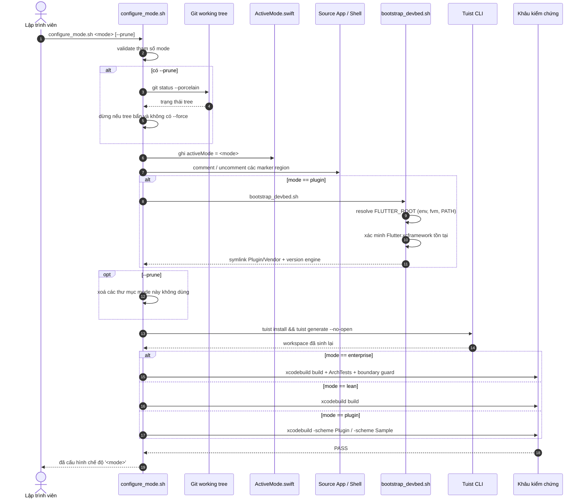

# Epic: Template iOS Native 3 Chế độ & Devbed Native cho Flutter Plugin

## 1. Thông tin Meta

- **Epic**: `tri_mode_and_flutter_plugin_devbed`
- **Trạng thái**: Planning (Sẵn sàng xác nhận Task — Gate 2)
- **Bản phát hành mục tiêu**: v1.1.0
- **Nền tảng**: `iOS Native`
- **Spec nguồn**: [2026-09-14-tri-mode-template-and-flutter-plugin-devbed-design.md](2026-09-14-tri-mode-template-and-flutter-plugin-devbed-design.md)
- **Thay thế cho**: `template_modes` (chỉ có dual-mode), đã archive tại `.devtool/epic/archived/template_modes/`
- **Epic Android tham chiếu** (đã triển khai xong, 7 task): `android_digital_wallet/.devtool/epic/tri_mode_and_flutter_plugin_devbed`
- **Template Flutter tham chiếu**: `bloc_digital_wallet` — bricks `pac_native_plugin`, `pac_add_native_ui`

---

## 2. Bối cảnh

`ios_digital_wallet` hiện chỉ có một mức quản trị duy nhất: Super App cấp doanh nghiệp. Mọi bản
clone đều phải gánh chi phí biên dịch `ArchTests` (swift-syntax `602.0.0`), feature stub
`Features/Scanner`, và shell 3 tab — bất kể team đang xây hệ sinh thái mini-app hay một MVP hai
màn hình.

Hai nhóm đối tượng hiện chưa được phục vụ:

1. **Team làm app độc lập / MVP** cần bộ khung Clean Architecture mà không phải gánh chi phí
   governance. Hôm nay muốn bỏ `Scanner` thì phải sửa tay 5 file trải khắp Tuist manifest,
   composition root và shell.
2. **Người viết Flutter plugin** cần một bàn làm việc native. Bricks của Flutter Super App
   template (`pac_native_plugin`, `pac_add_native_ui`) sinh ra plugin mà thư mục `ios/` là một
   SPM package Clean Architecture 4 tầng. Hiện muốn viết phần Swift đó thì mỗi vòng lặp đều phải
   khởi chạy nguyên một app Flutter — không có cách nào biên dịch, chạy hay unit-test độc lập.

Template Android đã giải đúng bài toán này bằng kiến trúc 3 chế độ cùng devbed `:plugin` +
`:sample`. Epic này mang năng lực tương đương sang iOS, đồng thời suy dẫn lại hai quyết định
không chuyển thẳng được giữa hai nền tảng (xem §4.5).

---

## 3. Mục tiêu & Ngoài phạm vi

### Mục tiêu

- Cung cấp `scripts/configure_mode.sh <enterprise|lean|plugin>` — idempotent, an toàn khi chuyển
  đổi vòng quanh, có `--prune` được bảo vệ bằng kiểm tra git tree sạch.
- Bổ sung `--mode <enterprise|lean|plugin>` vào `scripts/rename_project.sh`, mặc định
  `enterprise` để giữ nguyên 100% hành vi hiện tại.
- Phân hoá self-verification theo từng chế độ: `enterprise` chạy đủ cổng governance, `lean` bỏ
  qua `ArchTests`, `plugin` verify các scheme của devbed.
- Xây devbed Mode 3: package SPM `Plugin/` (Clean Architecture, FactoryKit 3.3.2, Pigeon /
  `FlutterPlatformView`, `BGTaskScheduler`) cùng app runner `Sample/`.
- Nối `Flutter.xcframework` thật để tầng `Platform/` được biên dịch thực sự.
- Cung cấp Mason bricks `ios_native_plugin` và `ios_add_native_ui`, tương thích byte-to-byte với
  output của `pac_native_plugin`.
- Giữ test suite xanh ở **cả hai** chế độ host.

### Ngoài phạm vi

- Gộp các package hạ tầng (`Core`, `Framework`, `Network`, `AppUIKit`, `Platform`) thành một
  monolith. Ranh giới Clean Architecture được giữ nguyên ở mọi chế độ.
- Migrate template host từ Factory 2.4.3 sang FactoryKit 3.3.2. Các chế độ loại trừ lẫn nhau nên
  hai phiên bản cùng tồn tại an toàn; việc thống nhất là một epic riêng.
- Phát hành plugin production. Devbed chỉ biên dịch và test code native của plugin, không bao giờ
  xuất bản artifact nhị phân.
- Thay đổi nội bộ `ios_mvi_feature` / `ios_mvi_subfeature` ngoài phạm vi tương thích marker region.

---

## 4. Kiến trúc & Thiết kế Kỹ thuật

### 4.1 Kiến trúc Tổng thể

```mermaid
graph TD
    subgraph Tooling["Cấu hình &amp; Tự động hoá"]
        CFG["scripts/configure_mode.sh<br/>(enterprise | lean | plugin)"]
        REN["scripts/rename_project.sh<br/>(--mode)"]
        BOOT["scripts/bootstrap_devbed.sh<br/>(resolve FLUTTER_ROOT)"]
        REN -->|uỷ quyền cho| CFG
        CFG -->|chỉ ở plugin mode| BOOT
    end

    subgraph Seam["Điểm nối Chế độ"]
        AM["Tuist/ProjectDescriptionHelpers/ActiveMode.swift<br/>let activeMode: TemplateMode"]
        MARK["Marker regions trong source App &amp; Shell"]
    end

    subgraph Manifests["Tuist Manifests (rẽ nhánh theo activeMode)"]
        PKG["Tuist/Package.swift"]
        PRJ["Project.swift"]
        WSP["Workspace.swift"]
    end

    subgraph Host["Composition &amp; Shell (marker regions)"]
        APP["App/Sources/Composition/AppComposition.swift"]
        DEEP["App/Sources/Composition/DeepLinkComposition.swift"]
        SHELL["Packages/Shell/Sources/Shell/ShellView.swift"]
        SCFG["Packages/Shell/Sources/Shell/ShellConfig.swift"]
    end

    subgraph Devbed["Mode 3 — Devbed Native cho Flutter Plugin"]
        PLUG["Plugin/ (SPM)<br/>Platform · Domain · Data · Presentation<br/>FactoryKit 3.3.2 · BGTaskScheduler"]
        VEND["Plugin/Vendor/Flutter.xcframework<br/>(symlink, git-ignored)"]
        SAMP["Sample/ (app runner SwiftUI)"]
        PLUG --> VEND
        SAMP --> PLUG
    end

    subgraph Gates["Governance"]
        ARCH["ArchTests K1-K10"]
        BOUND["scripts/check_module_boundaries.sh"]
        LINT["SwiftLint --strict + SwiftFormat --lint"]
    end

    CFG -->|ghi| AM
    CFG -->|patch| MARK
    AM --> PKG
    AM --> PRJ
    AM --> WSP
    MARK --> APP
    MARK --> DEEP
    MARK --> SHELL
    MARK --> SCFG
    BOOT --> VEND

    CFG -->|tuist install &amp;&amp; tuist generate| GEN["Xcode workspace"]

    MODE{"activeMode?"}
    CFG --> MODE
    MODE -->|enterprise| ARCH
    MODE -->|enterprise| BOUND
    MODE -->|lean| FAST["chỉ xcodebuild build"]
    MODE -->|plugin| DEV["xcodebuild -scheme Plugin / Sample"]
    MODE --> LINT
```



### 4.2 Use Cases

```mermaid
flowchart TD
    Dev([Lập trình viên / DevOps])
    PA([Người viết Flutter Plugin])

    UC1["UC1: Khởi tạo dự án mới ở chế độ Enterprise"]
    UC2["UC2: Khởi tạo dự án mới ở chế độ Lean"]
    UC3["UC3: Chuyển dự án đang có từ Enterprise sang Lean"]
    UC4["UC4: Chuyển ngược Lean về Enterprise, khôi phục governance"]
    UC5["UC5: Xoá hẳn file feature không dùng, có chốt chặn git tree sạch"]
    UC6["UC6: Chuyển sang chế độ Plugin devbed"]
    UC7["UC7: Viết và unit-test code native của plugin, không cần app Flutter"]
    UC8["UC8: Chạy tác vụ nền với zero Flutter engine"]
    UC9["UC9: Xem trước màn hình SwiftUI của plugin trong Sample runner"]
    UC10["UC10: Sinh plugin native mới từ Mason brick"]

    Dev --> UC1
    Dev --> UC2
    Dev --> UC3
    Dev --> UC4
    Dev --> UC5
    PA --> UC6
    PA --> UC7
    PA --> UC8
    PA --> UC9
    PA --> UC10
```



### 4.3 Sequence Diagram — Luồng Cấu hình Chế độ



### 4.4 Ma trận Chế độ

| Tiêu chí | `enterprise` | `lean` | `plugin` |
|---|---|---|---|
| Mục đích | Super app lớn, nhiều team | App độc lập, MVP, startup | Viết code native cho Flutter plugin |
| Output chính | `.app`, đồ thị đầy đủ | `.app`, đồ thị tinh gọn | SPM package cho `ios/` của plugin + Sample runner |
| Units kích hoạt | App, 6 `Packages/*`, Settings, Scanner, ArchTests (**10**) | App, 6 `Packages/*`, Settings (**8**) | Plugin, Sample (**2**) |
| DI | Factory 2.4.3, `Container.shared` toàn cục | Factory 2.4.3 | **FactoryKit 3.3.2**, `SharedContainer` riêng cho từng plugin |
| Governance | ArchTests K1–K10 + boundary guard | tắt cả hai | tắt; vẫn giữ SwiftLint/SwiftFormat |
| Giao diện | SwiftUI, shell 3 tab | SwiftUI, shell 2 tab | SwiftUI trong `FlutterPlatformView` |
| Chạy nền | n/a | n/a | `BGTaskScheduler`, zero Flutter engine |
| Phụ thuộc Flutter | không | không | binary target `Flutter.xcframework` |

Android có hình dạng 12 / 9 / 2 module; iOS là 10 / 8 / 2 — cùng cấu trúc, điều chỉnh theo việc
iOS không có Dynamic Feature Module và không có Binary Compatibility Validator.

### 4.5 Hai quyết định phải suy dẫn lại cho iOS

Đây là hai chỗ duy nhất không thể bám theo epic Android một cách trực tiếp. Cả hai đã được chốt ở
spec nguồn và nhắc lại ở đây vì mọi task đều phụ thuộc vào chúng.

**(a) Vì sao Mode 3 vẫn chính đáng.** Android cần nó vì Hilt không thể chạy trong một Flutter
plugin. iOS không có ràng buộc compiler đó — nhưng có ràng buộc ở mức phiên bản: host dùng
Factory 2.4.3 (`import Factory`, `Container.shared` toàn cục), trong khi `pac_native_plugin` sinh
ra FactoryKit 3.3.2 (`import FactoryKit`, subclass `SharedContainer` riêng cho từng plugin). Hai
API này không thể dùng chung một graph. Vì các chế độ loại trừ lẫn nhau, mỗi chế độ pin phiên bản
riêng của mình.

**(b) Nối Flutter engine.** Android có sẵn `compileOnly("io.flutter:flutter_embedding_debug")` từ
Maven. iOS không có thứ tương đương: package `FlutterFramework` mà `pac_native_plugin` phụ thuộc
là một shim ephemeral, được sinh tự động và **rỗng** — file nguồn duy nhất chỉ chứa
`// Generated file. Do not edit.` — và `import Flutter` resolve được chỉ vì Xcode link framework
thật lúc build app. Do đó một package plugin không thể build độc lập.

Devbed nối engine thật: `bootstrap_devbed.sh` resolve `FLUTTER_ROOT`, symlink
`$FLUTTER_ROOT/bin/cache/artifacts/engine/ios/Flutter.xcframework` vào `Plugin/Vendor/`, và
`Plugin/Package.swift` khai báo nó thành `.binaryTarget`. Hệ quả mà Task 5 phải chốt trước khi
Task 6–8 dựa vào: **package có binary target xcframework không build được bằng `swift build`
thuần** — mọi khâu kiểm chứng đều dùng `xcodebuild -destination`.

### 4.6 Điểm nối chế độ — hai cơ chế, chọn theo loại file

- **Tuist manifests** rẽ nhánh theo `Tuist/ProjectDescriptionHelpers/ActiveMode.swift` được sinh
  tự động. Idempotent tự thân và về mặt cấu trúc không thể sinh lỗi cú pháp — điều quan trọng nhất
  ở Mode 3, nơi toàn bộ danh sách target thay đổi chứ không chỉ danh sách dependency.
- **Source Swift của App và Shell** dùng marker region, đúng như Android, vì các file này biên
  dịch vào binary và không được mang nhánh chết.

| File | Marker region | Trạng thái |
|---|---|---|
| `Tuist/Package.swift` | `tuist:packages:begin/end` | đã có |
| `Project.swift` | `tuist:app-deps:begin/end` | đã có |
| `App/Sources/Composition/AppComposition.swift` | `app:feature-imports:begin/end` | đã có |
| `App/Sources/Composition/AppComposition.swift` | `app:route-providers:begin/end` | đã có |
| `App/Sources/Composition/DeepLinkComposition.swift` | `app:tab-resolver-scanner:begin/end` | cần thêm |
| `Packages/Shell/Sources/Shell/ShellView.swift` | `shell:scanner-tab:begin/end` | cần thêm |
| `Packages/Shell/Sources/Shell/ShellView.swift` | `shell:settings-tab:begin/end` | cần thêm |
| `Packages/Shell/Sources/Shell/ShellConfig.swift` | `shell:config-defaults:begin/end` | cần thêm |

`ShellView` **không** import package `Scanner` — nó chỉ gọi tên `AppRoutes.ScannerRoot()` từ
`Platform` — nên vẫn biên dịch được ở lean mode. Dù vậy vẫn phải comment tab đó lại, nếu không
lean mode sẽ hiển thị tab thứ ba không resolve ra gì. Đây chính là lý do một cờ `ShellConfig` ở
runtime không thể thay thế marker region.

### 4.7 Test suite phải nhận biết chế độ

Một lỗ hổng không có đối ứng bên Android. Lean mode của Android gỡ một Dynamic Feature Module tự
sở hữu test của nó. Trên iOS, test về cấu trúc tab nằm trong package `Shell` **dùng chung** và
trong `App/Tests`, và chúng hard-code hình dạng enterprise: **51 tham chiếu trên 10 file** assert
`Scanner` hoặc `tabCount: 3`. `App/Tests/AppTests/AppCompositionTests.swift:26` assert
*"exactly one provider handles ScannerRoot"* — fail thẳng ở lean mode.

Nếu bỏ qua, `configure_mode.sh lean` sẽ cho ra dự án build được nhưng test đỏ, còn tệ hơn là
không có mode switch. Task 3 tách các assertion mang hình dạng enterprise sang những file riêng
có thể exclude, và tham số hoá phần còn lại theo `ShellConfig` thay vì số `3` cứng.

### 4.8 Bố cục Mode 3 (ánh xạ 1-1 với devbed Android)

```
Plugin/                                  # ≈ Android :plugin
├── Package.swift                        # FactoryKit 3.3.2 + Flutter binaryTarget
├── Vendor/Flutter.xcframework -> …      # symlink, git-ignored
├── Sources/Plugin/
│   ├── PluginContainer.swift            # ≈ PluginComponent.kt + Provider
│   ├── Platform/                        # MyPlugin · Messages.g · HostApiImpl · PlatformViewFactory
│   ├── Domain/                          # Model · Repository · UseCase (Swift thuần)
│   ├── Data/                            # RepositoryImpl · Background/DataSyncTask (BGTaskScheduler)
│   └── Presentation/                    # Base MVI · ViewModel · SwiftUI View · MyPlatformView
└── Tests/PluginTests/                   # 5 class, ánh xạ đúng 5 test của Android
Sample/                                  # ≈ Android :sample
└── Sources/SampleApp.swift, ContentView.swift
```

---

## 5. Bộ Kịch bản BDD Đầy đủ

Bộ Gherkin chuẩn nằm ở [bdd_scenarios.md](bdd_scenarios.md). Tóm tắt:

- **S1–S4** — Chuyển đổi Enterprise/Lean: manifests, composition root, shell tabs, tab resolver.
- **S5–S6** — Tính idempotent khi chuyển vòng quanh và khôi phục governance khi về enterprise.
- **S7–S8** — Hành vi `--prune` và chốt chặn git tree bẩn.
- **S9–S11** — Kích hoạt plugin mode, resolve Flutter engine, và các chế độ lỗi của bootstrap.
- **S12–S14** — Package plugin: DI container, Pigeon host API, SwiftUI `PlatformView`.
- **S15** — Tác vụ nền chạy với zero Flutter engine.
- **S16** — Sample runner mount màn hình plugin.
- **S17–S19** — `rename_project.sh --mode`, gồm cả `--dry-run` và mặc định giữ nguyên hành vi cũ.
- **S20** — Output Mason brick khớp `pac_native_plugin`.
- **S21** — Test suite xanh ở cả hai chế độ host.
- **S22** — Lint và format sạch ở mọi chế độ.

---

## 6. Chiến lược Triển khai & Giảm thiểu Rủi ro

1. **Điểm nối trước, hành vi không đổi.** Thêm marker region và `ActiveMode.swift` mặc định
   `enterprise`. Không có gì trong build hiện tại thay đổi; cổng governance vẫn pass đầy đủ.
2. **Các chế độ host.** Đưa `configure_mode.sh` vào, chứng minh vòng `enterprise ↔ lean`, rồi làm
   test suite nhận biết chế độ để lean *xanh* chứ không chỉ build được.
3. **Tích hợp định danh.** Nối `--mode` vào `rename_project.sh`, mặc định `enterprise`.
4. **Devbed.** Nối Flutter engine, rồi dựng `Plugin`, tầng `Platform` của nó, và `Sample`.
5. **Scaffolding.** Phát hành hai Mason brick.
6. **Nghiệm thu.** Chạy đủ ma trận kiểm chứng, viết tài liệu.

**Giảm thiểu rủi ro.** Mọi thao tác sửa file của script đều idempotent; mọi thao tác phá huỷ đều
từ chối chạy trên tree bẩn nếu không có `--force`. Rollback ở bất kỳ thời điểm nào là
`git checkout -- .`. Manifest rẽ nhánh theo một hằng số thay vì bị patch bằng regex, nên một lần
chuyển đổi lỗi không thể để lại Swift không parse được.

**CI.** Khâu kiểm chứng Mode 3 chạy trong job riêng có cài Flutter SDK. Hai job `quality` và
`packages` hiện có trong `.github/workflows/ci.yml` giữ nguyên.

---

## 7. Phân rã Task Kanban

- [Task 1: Marker Regions & ActiveMode Seam](task_1_marker_regions_and_mode_seam.md)
- [Task 2: Implement scripts/configure_mode.sh](task_2_configure_mode_script.md)
- [Task 3: Make the Test Suite Mode-Aware](task_3_mode_aware_test_suite.md)
- [Task 4: Integrate --mode into scripts/rename_project.sh](task_4_rename_project_mode_integration.md)
- [Task 5: Bootstrap the Flutter Engine Binding](task_5_bootstrap_devbed_flutter_binding.md)
- [Task 6: Scaffold the Plugin Clean Architecture Package](task_6_scaffold_plugin_clean_architecture.md)
- [Task 7: Flutter Platform Layer & SwiftUI PlatformView](task_7_flutter_platform_layer.md)
- [Task 8: Scaffold the Sample Runner App](task_8_scaffold_sample_runner_app.md)
- [Task 9: Mason Bricks ios_native_plugin & ios_add_native_ui](task_9_native_plugin_mason_bricks.md)
- [Task 10: Acceptance Verification & Documentation (Tier C)](task_10_acceptance_verification_and_docs.md)
