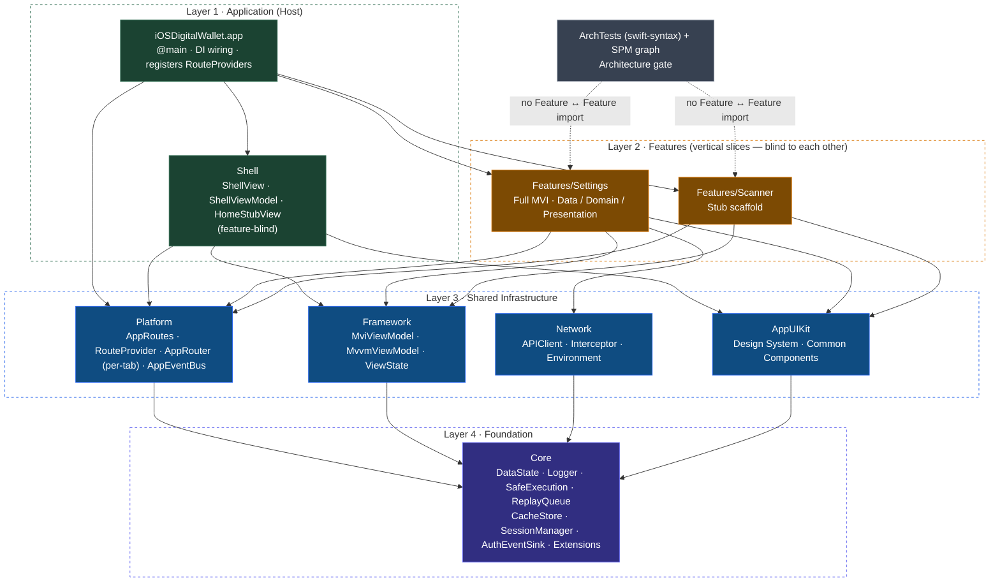

# Architecture: Clean Architecture + MVI + Feature-First

*(iOS Native edition)*

This document is the **authoritative architecture guide** for this template and
for every project generated from it.

> **Canonical cross-platform source.** The layer rules and the MVI contract are
> defined once, for the whole product family, in the Flutter template's
> `docs/architecture/ARCHITECTURE.md` (`bloc_digital_wallet`), and ported to
> Android in `android_digital_wallet`. This iOS edition follows those documents
> section-for-section and only remaps platform terms:
>
> | Flutter | Android | iOS |
> |---|---|---|
> | Widget | `@Composable` | SwiftUI `View` |
> | BLoC | `MviViewModel` | `MviViewModel` (`ObservableObject`) |
> | `Either<Failure, T>` | `DataState<T>` | `DataState<T>` / `AppError` |
> | `context.t` | `stringResource(...)` | `String(localized:)` |
> | `context.appThemes` | `MaterialTheme` | `AppTheme` / `AppColor` (`AppUIKit`) |
> | `get_it` / `injectable` | Hilt `@Inject` / `@IntoSet` | manual constructor injection in `App` |
> | `mason make pac_mvi_feature` | `mason make mvi_feature` | `mason make ios_mvi_feature` |
> | `melos` scripts | `./gradlew` tasks | `tuist generate` + `swift test` + `xcodebuild` |
> | pure Dart domain | pure Kotlin domain | pure Swift domain (no `SwiftUI` / `UIKit` / `Combine`) |

---

## Table of Contents

- [I. Clean Architecture + MVI](#i-clean-architecture--mvi)
  - [1. Core concepts](#1-core-concepts)
  - [2. Data-flow diagram](#2-data-flow-diagram)
  - [3. Layer dependency rules](#3-layer-dependency-rules)
- [II. MVI mechanism](#ii-mvi-mechanism)
  - [1. Action / State / Event](#1-action--state--event)
  - [2. `MviViewModel` base](#2-mviviewmodel-base)
  - [3. `dispatch()` → `onAction()` → `reduce()`](#3-dispatch--onaction--reduce)
  - [4. `ViewState` render envelope](#4-viewstate-render-envelope)
  - [5. The `launch(key:)` async-effect (cancel-on-new-action)](#5-the-launchkey-async-effect-cancel-on-new-action)
- [III. Feature-First organization](#iii-feature-first-organization)
  - [1. Directory layout of a feature package](#1-directory-layout-of-a-feature-package)
  - [2. Module map](#2-module-map)
  - [3. The 4-tier dependency graph](#3-the-4-tier-dependency-graph)
  - [4. Cross-feature communication](#4-cross-feature-communication)
  - [5. Usage with Mason](#5-usage-with-mason)
- [IV. iOS stack](#iv-ios-stack)
- [V. Code examples](#v-code-examples)
  - [1. Contract + `MviViewModel` subclass](#1-contract--mviviewmodel-subclass)
  - [2. `RouteProvider` contribution](#2-routeprovider-contribution)
- [VI. Governance](#vi-governance)
  - [1. `ArchTests` rules K1–K9](#1-archtests-rules-k1k9)
  - [2. `check_module_boundaries.sh`](#2-check_module_boundariessh)
  - [3. CI](#3-ci)
- [VII. Known gaps](#vii-known-gaps)
- [VIII. References](#viii-references)

---

## I. Clean Architecture + MVI

### 1. Core concepts

| Principle | Description |
|---|---|
| **Dependency Rule** | `Presentation → Domain ← Data`. `Domain` knows nothing about the outer layers. |
| **Separation of Concerns** | UI, business logic, and data access are strictly separated — one folder per layer inside every feature. |
| **Testability** | Every layer is tested independently; every package runs `swift build` / `swift test` without the app target. |
| **Pure Domain** | The domain layer is pure Swift — no `import SwiftUI`, `import UIKit`, or `import Combine`. |
| **Unidirectional Data Flow** | Data moves in one loop: `View → MviViewModel → Domain → Data → Domain → MviViewModel → View`. |

### 2. Data-flow diagram

```mermaid
graph LR
    subgraph Presentation_Layer ["Presentation"]
        View["Screen (SwiftUI View)"]
        ViewModel["MviViewModel"]
    end

    subgraph Domain_Layer ["Domain (pure Swift)"]
        UseCase["Use Case"]
        RepoInterface(["Repository protocol"])
    end

    subgraph Data_Layer ["Data (internal)"]
        RepoImpl["RepositoryImpl"]
        DataSource["Remote / Local DataSource"]
    end

    View -- "1. dispatch(Action)" --> ViewModel
    ViewModel -- "2. call UseCase" --> UseCase
    UseCase -- "2a. call Repository protocol" --> RepoInterface
    RepoInterface -. "implemented by" .-> RepoImpl
    RepoImpl -- "2b. call DataSource" --> DataSource

    DataSource -- "3a. return DTO" --> RepoImpl
    RepoImpl -- "3b. map DTO → entity" --> UseCase
    UseCase -- "3. return DataState / Result" --> ViewModel

    ViewModel -- "4. reduce { State }" --> View
    ViewModel -. "5. emit(Event)" .-> View

    classDef interface fill:#fffde7,stroke:#fbc02d,stroke-width:1px,stroke-dasharray: 5 5;
    class RepoInterface interface;
    style Presentation_Layer fill:#C7FDCB,stroke:#02CC0C,stroke-width:2px;
    style Data_Layer fill:#A7DAF2,stroke:#088DF3,stroke-width:2px;
    style Domain_Layer fill:#F4F0C0,stroke:#fbc02d,stroke-width:2px;
```



### 3. Layer dependency rules

> **Important**
>
> 1. **Dependency Rule** — `Presentation → Domain ← Data`. `Presentation` must
>    never touch `Data` directly; `Domain` must import nothing from
>    `Presentation` or `Data`.
> 2. **No UI framework in Domain** — the domain layer is pure Swift. An
>    `import SwiftUI` / `import UIKit` / `import Combine` on a `/Domain/` path is
>    an architecture violation.
> 3. **`Data` is `internal`** — no `public` / `open` declaration on a `/Data/`
>    path. The outside world sees a feature's data layer only through a `Domain`
>    protocol.

```text
Allowed:                          Forbidden:
  Presentation → Domain             Domain → Presentation
  Data         → Domain             Domain → Data
  Domain       → (nothing)          Domain → SwiftUI / UIKit / Combine
                                    Presentation → Data (must pass through Domain)
```

Enforced by `ArchTests` rules **K2** (layer imports / references), **K3**
(pure-Swift domain), and **K4** (`internal` data layer) — see
[§VI](#vi-governance).

---

## II. MVI mechanism

### 1. Action / State / Event

Three components with fixed naming and one responsibility each. The base type is
`Framework.MviViewModel<STATE, ACTION, EVENT>`.

| Component | Type | Direction | Meaning |
|---|---|---|---|
| **Action** | INPUT | View → ViewModel | User intent (`toggleDarkMode`, `reload`). The **only** thing a View sends, through `dispatch(_:)`. |
| **State** | DATA | ViewModel → View | Persistent screen state. An immutable value type, published as `@Published private(set) var uiState`. Mutated with `reduce { $0.x = … }`. |
| **Event** | OUTPUT | ViewModel → View | One-shot side effect (navigate, toast, haptic). Delivered once through `eventSubject` (one consumer) or `sharedEventSubject` (multi-consumer). |

- **Action** — `enum {Screen}Action`; cases named `{verb}{Noun}`. Sent with
  `viewModel.dispatch(.reload)`.
- **State** — `struct {Screen}State` with defaulted fields. Updated only inside
  the ViewModel via `reduce { … }`.
- **Event** — `enum {Screen}Event`; cases named `navigateTo{X}` / `show{X}`.
  Emitted with `emit(_:)` / `emitShared(_:)`.

Alongside `uiState`, `MviViewModel` publishes a `viewState:
ViewState<STATE>` envelope (`loading` / `error` / `content`) for screens that
want a loading or error scaffold without losing the underlying `uiState` data.

### 2. `MviViewModel` base

`MvvmViewModel` is the supertype — an `@MainActor` `ObservableObject` that owns a
`Set<AnyCancellable>` and an `onClear()` teardown hook. `MviViewModel` adds the
MVI contract on top:

```swift
@MainActor
open class MviViewModel<STATE, ACTION, EVENT>: MvvmViewModel {
    @Published public private(set) var uiState: STATE
    @Published public private(set) var viewState: ViewState<STATE> = .loading

    public let eventSubject = PassthroughSubject<EVENT, Never>()        // one consumer
    public let sharedEventSubject = PassthroughSubject<EVENT, Never>()  // multi consumer

    public init(initialState: STATE) { uiState = initialState; super.init() }

    public final func dispatch(_ action: ACTION) { onAction(action) }   // single entry point
    open func onAction(_ action: ACTION) {}                             // the only override point

    public func reduce(_ transform: (inout STATE) -> Void) { transform(&uiState) }
    public func startLoading() { viewState = .loading }
    public func handleError(_ error: Error) { viewState = .error(error) }
    public func showContent() { viewState = .content(uiState) }
    public func emit(_ event: EVENT) { eventSubject.send(event) }
    public func emitShared(_ event: EVENT) { sharedEventSubject.send(event) }

    override open func onClear() { cancelEffects(); super.onClear() }
}
```

### 3. `dispatch()` → `onAction()` → `reduce()`

```text
User interaction (tap, type, …)
    ↓
View calls viewModel.dispatch(Action)          — dispatch is `final`; the contract cannot be bypassed
    ↓
MviViewModel.onAction(action)                   — the ONLY method a subclass overrides
    ↓
onAction reduces synchronously  and / or  starts an async effect via launch(key:)
    ↓
effect calls a UseCase (Domain) → Repository protocol → RepositoryImpl (Data) → DataSource
    ↓
DataSource returns a DTO; RepositoryImpl maps DTO → entity; UseCase returns DataState<Entity>
    ↓
ViewModel reduce { … }        → new uiState (published)
ViewModel startLoading/showContent/handleError → new viewState (published)
ViewModel emit(Event)         → optional one-shot effect
    ↓
View re-renders from uiState / viewState;  reacts to Event in .onReceive
```

### 4. `ViewState` render envelope

```swift
public enum ViewState<STATE> {
    case loading
    case error(Error)
    case content(STATE)
}
```

Not `Equatable` — the `error` case carries an arbitrary `Error`; tests compare
via a discriminator helper. A screen typically `switch`es on `viewState` for the
scaffold and reads `uiState` for the data.

### 5. The `launch(key:)` async-effect (cancel-on-new-action)

`onAction` may start async work (a use-case call). Each **effect key** keeps at
most one `Task`; a new `launch` with the same key **cancels the in-flight
`Task`** before starting the next — the Swift analogue of
`viewModelScope.launch` + `switchMap`. So "rapid same-key dispatch → only the
last effect reaches `reduce`" is structural, not luck.

```swift
public extension MviViewModel {
    /// Runs `operation` as a cancellable effect bound to `key`. Any running
    /// effect for `key` is cancelled first. The slot is cleared when *this*
    /// effect finishes — unless a newer `launch(key:)` has already replaced it
    /// (a per-key generation token guards against a superseded effect's
    /// completion tail wiping the new effect's entry).
    func launch(
        _ key: AnyHashable = "default",
        _ operation: @escaping @MainActor () async -> Void
    ) {
        effectTasks[key]?.cancel()
        let token = UUID()
        effectTokens[key] = token
        effectTasks[key] = Task { [weak self] in
            await operation()
            guard let self, effectTokens[key] == token else { return }
            effectTasks[key] = nil
            effectTokens[key] = nil
        }
    }

    /// Cancels and forgets every effect. Called by `onClear()`.
    func cancelEffects() { … }
}
```

The `operation` closure is `@MainActor`-isolated so it can drive ViewModel state
(`reduce`, `handleError`, `emit`) directly under the Swift 6 language mode —
this is a deliberate deviation from the design sketch's bare
`() async -> Void`, and the only spelling that type-checks without routing every
call site through `MainActor.run`. `onClear()` (with an isolated `deinit` as a
backstop) calls `cancelEffects()`, so no emission survives teardown.

---

## III. Feature-First organization

### 1. Directory layout of a feature package

A feature is its **own local SPM package** at `Packages/Features/{Name}Feature/`.
`mason make ios_mvi_feature --name {Name}` scaffolds it (Phase 3).

```text
Packages/Features/{Name}Feature/
├── Package.swift              name "{Name}Feature"; deps: Platform, Framework, (Network), AppUIKit
├── Sources/{Name}Feature/
│   ├── Data/                  🔵 internal — RepositoryImpl, DataSource, DTO, Mapper
│   │   ├── Remote/            {Name}APIService.swift, {Name}DTO.swift
│   │   ├── Local/             {Name}LocalDataSource.swift
│   │   ├── Mapper/            {Name}Mapper.swift
│   │   └── Repository/        {Name}RepositoryImpl.swift   (implements Domain/{Name}Repository)
│   ├── Domain/                🟡 public — pure Swift; NO SwiftUI / UIKit / Combine
│   │   ├── Entity/            {Name}Entity.swift            (value type)
│   │   ├── Repository/        {Name}Repository.swift        (protocol)
│   │   └── UseCase/           {Verb}{Noun}UseCase.swift
│   └── Presentation/          🟢 public — SwiftUI View + MviViewModel
│       ├── {Screen}/          {Screen}Action.swift · {Screen}State.swift · {Screen}Event.swift
│       │                      {Screen}ViewModel.swift · {Screen}View.swift
│       └── {Name}RouteProvider.swift   (implements Platform.RouteProvider)
└── Tests/{Name}FeatureTests/  BDD scenario → TDD test (Testing Standard Tier A)
```

Rules `ArchTests` checks per feature: `Data/` has no `public`/`open` (**K4**);
`Domain/` imports no UI framework (**K3**); `Presentation/` does not reach into
`Data/`, `Domain/` reaches into neither (**K2**); a feature never imports another
feature (**K1**, Phase 2); a cross-feature `AppRoute` lives in `Platform`
(**K9**, Phase 2).

### 2. Module map

Eight packages plus the `App` target. Every arrow points down toward `Core`; no
package on a tier has an edge to a sibling on the same tier.

| Module | Package | Role | Depends on |
|---|---|---|---|
| `App` | — (app target) | Thin host: `@main`, manual DI wiring, `RouteProvider` registration, lifecycle events, 401 → bus. | `Shell` + every feature + `Platform` |
| `Shell` | `Packages/Shell` | Tab layout + per-tab `NavigationStack` (one path each). **Feature-blind.** `HomeStubView` lives here. | `Platform`, `Framework`, `AppUIKit` |
| `Core` | `Packages/Core` | Dependency floor: `DataState`, `AppError`, `Logger`, `SafeExecution`, `ReplayQueue`, `CacheStore` / `SecureCacheStore`, `SessionManager`, `AuthEventSink`. stdlib + Foundation + Security only. | *none* |
| `Framework` | `Packages/Framework` | `MvvmViewModel` / `MviViewModel` / `ViewState` + the `launch(key:)` async-effect. | `Core` |
| `Network` | `Packages/Network` | `APIClient` / `URLSessionAPIClient`, interceptors, `Environment` / `AppEnvironment`, `NetworkError`, `MockAPIClient`. A 401 is surfaced via `Core.AuthEventSink`. | `Core` |
| `AppUIKit` | `Packages/AppUIKit` | SwiftUI design system: `AppColor` / `AppFont` / `AppSpacing` / `AppTheme` tokens, `AppButton` / `AppTextField` / `AppLoadingView` / `AppErrorView` / `AppEmptyStateView`. Purely presentational. | `Core` — **not** `Framework` |
| `Platform` | `Packages/Platform` | Cross-feature seam: `AppRoute` / `AppRoutes`, `RouteProvider`, per-tab `AppRouter`, `AppEvent` / `AppEventBus`. | `Core` |
| `Features/*` | `Packages/Features/*` | One product feature each (`Data` / `Domain` / `Presentation` + `RouteProvider`). Ships `SettingsFeature` (real) + `ScannerFeature` (stub). **Blind to every other feature.** | `Platform`, `Framework`, `AppUIKit` (+ `Network` when it does IO) |
| `ArchTests` | `ArchTests/` | Standalone swift-syntax architecture gate (K1–K9). Never linked into the app. | `swift-syntax` |

### 3. The 4-tier dependency graph

*(Copied verbatim from the epic HLD, `ios_super_app_template.en.md` §4.1.)*



**Invariants (enforced by `ArchTests` + the SPM graph):** every solid arrow
flows toward `Core`; no feature points to another feature; only `App` aggregates
multiple features; `Shell` is feature-blind (it reaches features only via
`AppRouter` / `RouteProvider`); `AppUIKit` does not depend on `Framework`; each
tier points only to lower tiers (a one-way DAG).

### 4. Cross-feature communication

Features never `import` one another — the SPM graph makes it a compile error.
All cross-feature traffic goes through `Platform`, and `App` is the **only**
aggregator.

| Channel | Location | Shape | Who aggregates |
|---|---|---|---|
| **`AppRoutes`** (route registry) | `Platform` | `struct XxxRoot: AppRoute`; navigate with `appRouter.navigate(to: AppRoutes.SettingsRoot(), inTab:)` | — (a route leaks no implementation) |
| **`AppEventBus`** | `Platform` | `PassthroughSubject<any AppEvent, Never>` broadcast, replay 0; `publish(_:)` / `on(_:)` | — |
| **`RouteProvider`** | protocol in `Platform`, one impl per feature | `struct SettingsRouteProvider: RouteProvider`; `App` calls `appRouter.register(_:)` at startup | **`App`** (`ArchTests` HostRules: only `App` may depend on > 1 feature) |
| **Direct composition** | `App` only | manual constructor injection + `RouteProvider` registration + lifecycle wiring | **`App`** |

There is no request/response channel between two features. When a feature needs a
typed result from another feature's business logic, invert the dependency: put
the protocol in `Core` and let the other feature implement it.

**Lifecycle event vocabulary** (`Platform.AppEvent`): `ShellTabVisibilityChanged`
(published by `Shell` on tab change), `AppLifecycleChanged` (published by `App`'s
lifecycle observer from `ScenePhase`), `UserLoggedOut` (published by `App` after
`Network`'s 401 interceptor calls `Core.AuthEventSink`).

### 5. Usage with Mason

Feature scaffolding arrives in **Phase 3** as four bricks.

| Command | Effect |
|---|---|
| `mason make ios_mvi_feature --name X [--has_network]` | Create `Packages/Features/XFeature/` (Package.swift + `Data`/`Domain`/`Presentation` + `XRouteProvider` + tests); append `.package(path:)` to `Tuist/Package.swift` and `"XFeature"` to the app deps in `Project.swift` — both inside `// tuist:*:begin/end` marker regions; run `tuist generate`. |
| `mason make ios_mvi_subfeature --feature X --name Y` | Add `Presentation/Y/{YAction,YState,YEvent,YViewModel,YView}.swift` + test to an existing feature. |
| `mason make ios_remove_feature --name X` | Unwind the three wire points and delete the package. |
| `mason make ios_remove_subfeature --feature X --name Y` | Delete `Presentation/Y/`. |

The brick never touches another feature. After it runs, the one manual step is
registering `XRouteProvider` in `App`'s composition root (inside its
`// app:route-providers:begin/end` region) and adding an `AppRoutes.XRoot` if the
feature is entered cross-feature.

---

## IV. iOS stack

| Choice | Value | Rationale |
|---|---|---|
| **Minimum deployment target** | iOS 16, uniform across the whole repo | `NavigationStack` / `NavigationPath` need iOS 16; a single floor removes the iOS 13/16 split the v1 design carried. |
| **UI** | SwiftUI | Declarative, `#Preview`-friendly; every `AppUIKit` component renders with no ViewModel. |
| **State** | `MviViewModel` on `ObservableObject` + Combine (`@Published`, `PassthroughSubject`) | Keeps the iOS-16 floor **and** a 1:1 mapping to Kotlin `StateFlow` / `Channel` / `SharedFlow`, so the Android and iOS templates stay legible side by side. |
| **Not `@Observable`** | deliberately excluded | `@Observable` / the Observation framework would raise the floor toward iOS 17 and break the 1:1 Kotlin-Flow mapping. Reconsider only if the floor rises to iOS 17+. |
| **Navigation** | per-tab `NavigationStack`, one `NavigationPath` per tab in `Platform.AppRouter` | Mirrors Android's `NestedNavigator`; re-tapping the active tab pops to root. |
| **DI** | manual constructor injection, wired in `App` | No Swinject / Needle / Factory — the composition root is small and explicit. |
| **Packages & project** | local SPM packages; **Tuist** declares the project | `Project.swift` / `Workspace.swift` / `Tuist/Package.swift` are the source of truth. `.xcodeproj` / `.xcworkspace` are generated by `tuist generate` and **not committed** (`.gitignore`). |
| **Networking** | `URLSession` + `APIClient` protocol + interceptors | No Alamofire; `MockAPIClient` ships in-package for tests. |
| **Persistence** | `CacheStore` / `SecureCacheStore` (Keychain-backed) in `Core` | The template's `SettingsFeature` is local-only. |
| **Architecture gate** | `ArchTests` — a standalone SPM package using **swift-syntax** (pinned `602.0.0`, matched to the Swift 6.3 toolchain) | AST inspection, not regex. Never linked into the app. |
| **Style** | SwiftLint (`--strict`) + SwiftFormat, one config in `quality/` | Style + a thin regex safety net; real enforcement is `ArchTests`. |

---

## V. Code examples

Illustrative — the first real feature lands in Phase 2. The base types
(`MviViewModel`, `ViewState`, `RouteProvider`, `AppRoutes`) are real and shipped.

### 1. Contract + `MviViewModel` subclass

```swift
// Presentation/Settings/SettingsAction.swift
enum SettingsAction {
    case reload
    case toggleDarkMode(Bool)
}

// Presentation/Settings/SettingsState.swift
struct SettingsState: Equatable {
    var isDarkMode = false
    var displayName = ""
}

// Presentation/Settings/SettingsEvent.swift
enum SettingsEvent {
    case navigateToProfile
}

// Presentation/Settings/SettingsViewModel.swift
@MainActor
final class SettingsViewModel: MviViewModel<SettingsState, SettingsAction, SettingsEvent> {
    private let loadSettings: LoadSettingsUseCase
    private let setDarkMode: SetDarkModeUseCase

    init(loadSettings: LoadSettingsUseCase, setDarkMode: SetDarkModeUseCase) {
        self.loadSettings = loadSettings
        self.setDarkMode = setDarkMode
        super.init(initialState: SettingsState())
    }

    override func onAction(_ action: SettingsAction) {
        switch action {
        case .reload:
            launch("load") { [weak self] in
                guard let self else { return }
                startLoading()
                switch await loadSettings() {
                case let .success(settings):
                    reduce { $0.displayName = settings.displayName; $0.isDarkMode = settings.isDarkMode }
                    showContent()
                case let .error(error):
                    handleError(error)
                case .loading:
                    break
                }
            }

        case let .toggleDarkMode(on):
            reduce { $0.isDarkMode = on }                 // optimistic, synchronous
            launch("darkMode") { [weak self] in
                await self?.setDarkMode(on)
            }
        }
    }
}
```

The stateless View reads `uiState` / `viewState` and sends only actions:

```swift
struct SettingsView: View {
    @StateObject var viewModel: SettingsViewModel

    var body: some View {
        Form {
            Toggle("Dark mode", isOn: Binding(
                get: { viewModel.uiState.isDarkMode },
                set: { viewModel.dispatch(.toggleDarkMode($0)) }
            ))
        }
        .task { viewModel.dispatch(.reload) }
        .onReceive(viewModel.eventSubject) { event in
            // route one-shot events to the navigation layer
        }
    }
}
```

### 2. `RouteProvider` contribution

```swift
// Presentation/SettingsRouteProvider.swift
import Platform
import SwiftUI

public struct SettingsRouteProvider: RouteProvider {
    private let makeViewModel: () -> SettingsViewModel

    public init(makeViewModel: @escaping () -> SettingsViewModel) {
        self.makeViewModel = makeViewModel
    }

    public func canHandle(_ route: any AppRoute) -> Bool {
        route is AppRoutes.SettingsRoot
    }

    public func destination(for route: any AppRoute) -> AnyView {
        AnyView(SettingsView(viewModel: makeViewModel()))
    }
}
```

`App`'s composition root builds the use cases, constructs the provider, and
registers it:

```swift
let settingsProvider = SettingsRouteProvider(
    makeViewModel: { SettingsViewModel(loadSettings: loadSettings, setDarkMode: setDarkMode) }
)
appRouter.register(settingsProvider)
```

`App` is the only place that imports `SettingsFeature`; `Shell` renders
`appRouter.destination(for:)` and never sees a feature type.

---

## VI. Governance

### 1. `ArchTests` rules K1–K9

`swift test --package-path ArchTests`. A standalone swift-syntax package,
**never linked into the app**. `ArchTests/baseline.txt` (tolerated pre-existing
violations) and `scripts/module_boundary_whitelist.txt` (temporarily-allowed
cross-feature edges) are both **empty** and stay empty — this repo is
greenfield.

| Rule | Checks | Mechanism | Status |
|---|---|---|---|
| **K1** | a feature package declares no dependency on another feature package | manifest assertion + SPM graph + `check_module_boundaries.sh` | Phase 2 (Task 12) |
| **K2** | `Presentation/**` does not reach into `Data/**`; `Domain/**` reaches into neither | swift-syntax: bucket feature files by `/Data/` `/Domain/` `/Presentation/` path segment, then flag cross-layer module imports and cross-layer type-name references | **enabled** (empty tree → passes; armed for Phase 2) |
| **K3** | no `import SwiftUI` / `UIKit` / `Combine` on a `/Domain/` path | swift-syntax import scan | **enabled** |
| **K4** | no `public` / `open` top-level type / func / typealias / extension on a `/Data/` path | swift-syntax modifier check on top-level declarations | **enabled** |
| **K5** | naming: `*ViewModel` inherits `MviViewModel` / `MvvmViewModel`; `*RouteProvider` conforms to `RouteProvider`; `*View` conforms to `View`; `*Repository` in `Domain/` is a `protocol`; `*RepositoryImpl` in `Data/` is a `struct` / `class`; an `*Action` / `*State` / `*Event` triad co-exists per presentation folder (soft) | swift-syntax name + inheritance-clause check, scoped to `Packages/Features/**` | **enabled** (armed for Phase 2) |
| **K6** | only `App` depends on more than one feature; `Shell` depends on zero | manifest assertion (`Project.swift` + `Packages/*/Package.swift`) | Phase 2 (Task 12) |
| **K7** | `Core` declares no sibling infra dependency and imports none of `Framework` / `Network` / `AppUIKit` / `Platform` | manifest string check + swift-syntax import scan | **enabled** |
| **K8** | *(no iOS analogue — Android's DFM inverted-dependency exemption; iOS has no Dynamic Feature Modules)* | — | n/a |
| **K9** | an `AppRoute` used by more than one feature is declared in `Platform/AppRoutes`, not in a feature | swift-syntax cross-package usage scan | Phase 2 (Task 12) |
| **AppUIKit ∌ Framework** | `AppUIKit`'s manifest declares no `Framework` dependency; no `AppUIKit` source imports `Framework` | manifest string check + import scan | **enabled** |

**K2 / K5 limitation.** Without a full type-resolution pass, K2's "reference"
check is identifier-substring matching (it can miss a reference hidden behind a
`typealias` and can false-positive on a name collision), and K5 is name- and
inheritance-clause based. The real guards are **K4** (AST-checked `internal` in
`Data/`) plus the SPM dependency graph, which makes a forbidden cross-package
import a compile error rather than a lint finding. K2/K5 are the early-warning
layer, armed now so the first feature package is born under enforcement.

**RED → GREEN inside `ArchTests`.** Each rule was proven to fire before being
trusted: injecting `import Platform` into a `Core` source makes K7 fail, naming
`Packages/Core/Sources/Core/AppError.swift`; injecting `import Framework` into an
`AppUIKit` source makes the AppUIKit check fail, naming the file; reverting
restores green.

### 2. `check_module_boundaries.sh`

`bash scripts/check_module_boundaries.sh` — a defence-in-depth `grep` for
`^\s*import <OtherFeatureModule>` under each `Packages/Features/*/Sources/`. Any
edge not in `scripts/module_boundary_whitelist.txt` exits 1. This is the second
net behind the SPM graph and `ArchTests` K1, not the primary mechanism. With no
feature packages it is a no-op that exits 0.

### 3. CI

`.github/workflows/ci.yml` (GitHub Actions, `macos-15`), three jobs:

- **quality** — `swiftlint --strict`, `swiftformat --lint`,
  `check_module_boundaries.sh`, `swift test --package-path ArchTests`.
- **packages** — `swift test` for every `Packages/*` and `Packages/Features/*`.
- **app** — `tuist install` → `tuist generate` → `xcodebuild test` (falls back
  to `xcodebuild build` until test targets exist), `CODE_SIGNING_ALLOWED=NO`.

The pinned toolchain (`tuist`, `swiftlint`, `swiftformat`) is installed via
`mise` from `.mise.toml` / `.tuist-version`.

---

## VII. Known gaps

| Gap | State | Note |
|---|---|---|
| **Deep-link / state restoration** | architecture ready, not built | `AppRouter` holds one `NavigationPath` per tab, which is `Codable`-friendly, but the template only pushes / pops per tab. Serializing and rehydrating the paths across launches is left to the consuming project. |
| **No Dynamic Feature Module equivalent** | out of scope (Non-Goal) | iOS has no on-demand install-time delivery like Android DFM. The template is a single monolithic app; every feature package is linked at build time. `ArchTests` K8 has no iOS analogue. |
| **App Extensions** (Widget, Share, Watch) | out of scope | The layering supports it — an extension target would depend on `Core` / a feature's `Domain` — but none is built. |
| **`epic-implementation` skill is Flutter-flavoured** | verification is remapped | That skill assumes `melos` / `.dart_tool`. For this repo, bootstrap and verification use `tuist generate` + `xcodebuild` + `swift test --package-path <pkg>`; the Testing Standard's Tier A/B/C and BDD → TDD → RED → GREEN discipline still apply, targeting Swift / XCTest. |
| **`@Observable`** | Non-Goal | See [§IV](#iv-ios-stack) — kept on `ObservableObject` + Combine for the iOS-16 floor and the 1:1 Kotlin-Flow mapping. |

---

## VIII. References

### In-repo
- [`../../ARCHITECTURE.md`](../../ARCHITECTURE.md) — the thin root pointer to this document.
- [`../../PROJECT_RULES.md`](../../PROJECT_RULES.md) — coding standards.
- [`../../AGENTS.md`](../../AGENTS.md) — project context for tooling.
- `ArchTests/Tests/ArchTests/` — the K1–K9 rule bodies (`LayerRulesTests`, `DeclRulesTests`, `HostRulesTests`).
- `quality/.swiftlint.yml`, `quality/.swiftformat` — style configuration.

### Epic design
- [`../../.devtool/epic/ios_super_app_template/2026-09-02-ios-super-app-template-design.md`](../../.devtool/epic/ios_super_app_template/2026-09-02-ios-super-app-template-design.md) — the Source Spec: §3 principles, §4 target architecture, §5 `MviViewModel`, §6 `Platform`, §9.2 the K1–K9 rule table.
- [`../../.devtool/epic/ios_super_app_template/ios_super_app_template.en.md`](../../.devtool/epic/ios_super_app_template/ios_super_app_template.en.md) — the HLD: §4.1 high-level architecture (the diagram in [§III.3](#3-the-4-tier-dependency-graph)), §4.3 the navigation sequence, §4.4 cross-feature channels.

### Cross-platform siblings
- `bloc_digital_wallet` — `docs/architecture/ARCHITECTURE.md` — the canonical layer & MVI rules for the whole product family.
- `android_digital_wallet` — `docs/architecture/ARCHITECTURE.md` — the Android port this iOS edition mirrors section-for-section.

### External
- [Clean Architecture — Robert C. Martin](https://blog.cleancoder.com/uncle-bob/2012/08/13/the-clean-architecture.html)
- [Tuist](https://docs.tuist.dev/) · [swift-syntax](https://github.com/swiftlang/swift-syntax) · [Mason](https://docs.brickhub.dev/)

---

**This architecture ensures: Scalability • Testability • Maintainability • Consistency.**
