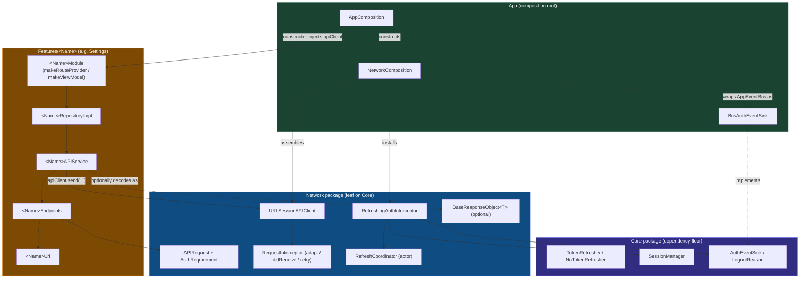

# Networking Architecture

*(iOS Native edition)*

This document describes the networking architecture for this template. It
mirrors the Flutter template's `docs/architecture/NETWORKING.md` section-for-
section, remapped to Swift Package Manager and this repo's manual-DI
composition root. For the refresh-token subsystem specifically — race
conditions, force-logout cases, the `TokenRefresher` seam — see
[`REFRESH_TOKEN.md`](REFRESH_TOKEN.md).

---

## Table of Contents

- [1. Core Philosophy](#1-core-philosophy)
- [2. Networking Architecture Diagram](#2-networking-architecture-diagram)
- [3. Core Components](#3-core-components)
- [4. Decentralised `<Name>Uri` + `<Name>Endpoints`](#4-decentralised-nameuri--nameendpoints)
- [5. The Composition Point: `<Name>Module.swift`](#5-the-composition-point-namemoduleswift)
- [6. Why There Is No Global `AppUri`](#6-why-there-is-no-global-appuri)
- [7. `BaseResponseObject<T>` — the Optional Envelope](#7-baseresponseobjectt--the-optional-envelope)

---

## 1. Core Philosophy

The networking layer is split into two distinct areas, exactly as in the
Flutter template:

1. **Infrastructure (the `Network` package, `Packages/Network`)** — the
   transport, interceptor chain, auth/refresh machinery, and error mapping.
   It is entirely agnostic to product features: nothing under
   `Packages/Network/Sources/Network/` knows the name `Settings`, `Scanner`,
   or any endpoint path.
2. **Implementation (feature packages, `Features/*`)** — each feature owns its
   own endpoints, DTOs, and the mapping from `Network`'s generic `APIClient`
   into its domain types.

> [!CRITICAL]
> **The Dependency Rule:** `Network` MUST NEVER import `Platform` or a
> feature package. A `401` is surfaced through the `Core.AuthEventSink`
> protocol (dependency inversion), never by `Network` reaching up into
> `Platform`'s `AppEventBus` directly. Feature packages depend on `Network`
> for the shared `APIClient`; `Network` depends on nothing above `Core`.

`Network`'s `Package.swift` declares exactly one dependency — `Core` — so a
forbidden `import Platform` or `import Settings` inside `Network` is not a
lint finding, it is a **compile error**: the module simply isn't linked. This
is stronger than the `ArchTests` gate that governs `Core`'s own boundary
(rule **K7** — see `ARCHITECTURE.md` §VI.1); `Network` has no separate
`ArchTests` rule because the SPM graph already makes the violation
unbuildable. `scripts/check_module_boundaries.sh` is a second net, but it only
greps `Features/*/Sources/` for cross-feature imports today — it does not
scan `Packages/Network`. The manifest + compiler are the real enforcement for
`Network`'s boundary.

---

## 2. Networking Architecture Diagram



`App` is the only package that names both a feature and `Network` in the same
composition step: `AppComposition` builds the `URLSessionAPIClient` via
`NetworkComposition.makeAPIClient(...)` and constructor-injects it into
`<Name>Module.makeRouteProvider(...)` / `makeViewModel(...)`. Neither
`Network` nor a feature package ever imports the other feature; the seam is
always the shared `APIClient` protocol.

---

## 3. Core Components

### 3.1 The `Network` Package

Located at `Packages/Network/Sources/Network/`:

- **`APIClient` / `URLSessionAPIClient`** (`APIClient.swift`) — the seam every
  feature depends on. `URLSessionAPIClient.send<T: Decodable>(_:)` runs the
  interceptor chain (`adapt` in registration order), performs the request,
  and on a failed-`validate` `401` asks each interceptor's `retry(_:dueTo:)`
  whether to resend. The resend is capped at exactly one
  (`maxAttempts = 2`: the original plus at most one retry) — see
  [`REFRESH_TOKEN.md`](REFRESH_TOKEN.md) for the exact sequencing.
- **`MockAPIClient`** (`Mocks/MockAPIClient.swift`) — an in-package,
  FIFO-queue `APIClient` test double (`enqueueSuccess` / `enqueueError`,
  `artificialDelay` for race tests). Feature packages depend on it in their
  test targets; it never ships in the app target.
- **Interceptors** (`Interceptor/`):
  - `RequestInterceptor` — the protocol: `adapt(_:)` (before send),
    `didReceive(_:)` (after headers), `retry(_:dueTo:)` (after a failed
    `validate`, defaulted to `.doNotRetry`).
  - `AuthTokenInterceptor` — header-only: attaches `Bearer` from
    `SessionManaging`, honours the `.none` whitelist, and (with no refresher
    installed) notifies an optional `AuthEventSink` once on a bare `401`.
  - `RefreshingAuthInterceptor` — the refresh-capable interceptor. See
    [`REFRESH_TOKEN.md`](REFRESH_TOKEN.md).
  - `LoggingInterceptor` — request/response logging via `Core.Logger`.
- **`APIRequest`** (`APIRequest.swift`) — a transport-agnostic request
  description (`method`, `path`, `query`, `headers`, `body`,
  `authRequirement`). `urlRequest(for:)` resolves it against an
  `Environment` into a `URLRequest`.
- **`Environment` / `AppEnvironment`** (`Environment/`) — base URL + default
  headers per build configuration.
- **`NetworkError`** (`Error/NetworkError.swift`) — the typed failure surface
  (`.unauthorized`, `.client`, `.server`, `.timeout`, `.transport`,
  `.decoding`, `.invalidResponse`).
- **`BaseResponseObject<T>`** (`Response/BaseResponseObject.swift`) — see
  [§7](#7-baseresponseobjectt--the-optional-envelope).

### 3.2 Feature Package Remote Layer

Located at `Features/<Name>/Sources/<Name>/Data/Remote/` when the feature was
scaffolded with `--has_network true`:

- `<Name>APIService` calls `apiClient.send(<Name>Endpoints.fetch())` and maps
  the result to `DataState<<Name>DTO>` / `AppError`, so `<Name>RepositoryImpl`
  never touches `Network` types directly.
- `<Name>Endpoints` / `<Name>Uri` — see [§4](#4-decentralised-nameuri--nameendpoints).

---

## 4. Decentralised `<Name>Uri` + `<Name>Endpoints`

To keep `Network` a bottleneck-free leaf, path constants and endpoint
factories are **decentralised into each feature package** — the same rule as
Flutter's `{Feature}Uri`, adapted from Retrofit clients to `APIRequest`
factories.

### The rule

Each feature **owns its own paths**. `Network` declares no path string for
any feature endpoint.

### The generated pattern

`mason make ios_mvi_feature --name <Name> --has_network true` scaffolds two
files under `Features/<Name>/Sources/<Name>/Data/Remote/`:

```swift
// <Name>Uri.swift — decentralised path constants; no global AppUri.
enum <Name>Uri {
    static let resource = "<name-param-case>"
}
```

```swift
// <Name>Endpoints.swift — APIRequest factories, built from <Name>Uri.
import Network

enum <Name>Endpoints {
    static func fetch() -> APIRequest {
        APIRequest(method: .get, path: <Name>Uri.resource)
    }
}
```

Add one static `func` to `<Name>Endpoints` per new endpoint as the feature
grows, and one constant to `<Name>Uri` per new path — the same shape Flutter
uses for `{Feature}Uri` / the Retrofit client, minus the code generation step
(`APIRequest` is a plain Swift value, not a generated protocol conformance).

---

## 5. The Composition Point: `<Name>Module.swift`

Flutter wires a Retrofit client through a per-feature `{Feature}NetworkModule`
DI class registered with `injectable`. **This template has no equivalent
file.** The brick's pre-existing, top-level feature composition root —
`<Name>Module.swift` (`Presentation/` or the feature root, generated by every
`ios_mvi_feature` invocation, not only `--has_network` ones) — already fills
that role:

```swift
// Features/<Name>/Sources/<Name>/<Name>Module.swift (illustrative shape)
public enum <Name>Module {
    public static func makeRouteProvider(apiClient: any APIClient, ...) -> <Name>RouteProvider {
        let repository = <Name>RepositoryImpl(apiService: <Name>APIService(apiClient: apiClient))
        ...
    }

    public static func makeViewModel(apiClient: any APIClient, ...) -> <Name>ViewModel {
        ...
    }
}
```

`makeRouteProvider` / `makeViewModel` take `apiClient: any APIClient` and
constructor-inject it into `<Name>APIService` → `<Name>RepositoryImpl`. This
*is* the DI wiring point Flutter's `{Feature}NetworkModule` provides — there
is deliberately no separate `NetworkModule.swift`, because creating one would
duplicate `<Name>Module.swift` for no benefit. The template's stated DI
philosophy (`ARCHITECTURE.md` §IV) is manual constructor injection at the
composition root — **"a DI framework is a Non-Goal"** — and a second
per-feature module registering the same `apiClient` would be exactly that
kind of unnecessary indirection.

`App`'s `AppComposition` is the only place that calls `<Name>Module`: it
builds `apiClient` once via `NetworkComposition.makeAPIClient(...)` and passes
it down. No shipped feature (`Settings`, `Scanner`) currently performs IO —
`apiClient` and `sessionManager` are exposed on `AppComposition`, ready for
the first `--has_network` feature to consume.

---

## 6. Why There Is No Global `AppUri`

Mirroring Flutter's explicit rule: **do not** add feature path strings to
`Network`. There is no `Network.AppUri` type and none should be added.

- ❌ **Incorrect** — adding `static let widgets = "widgets"` to a type inside
  `Packages/Network/Sources/Network/`.
- ❌ **Incorrect** — a shared `UriPathParameters` enum in `Network` that every
  feature reaches into.
- ✅ **Correct** — each feature's own `<Name>Uri.swift`, per [§4](#4-decentralised-nameuri--nameendpoints).

The reasoning is the same as Flutter's: a global URI registry turns `Network`
into a God object that every feature must edit, defeating the point of
"feature-blind infrastructure" and inviting merge conflicts across unrelated
features. Decentralising path ownership keeps `Network`'s public surface
frozen while feature packages grow independently.

---

## 7. `BaseResponseObject<T>` — the Optional Envelope

Some backends wrap every payload in a common shape — `{ "data": ..., "message":
..., "status": ... }`. `Network` ships an optional decode target for exactly
that shape:

```swift
// Response/BaseResponseObject.swift
public struct BaseResponseObject<T: Decodable & Sendable>: Decodable, Sendable {
    public let data: T?
    public let message: String?
    public let status: Int?
}
```

`URLSessionAPIClient.send()` does **not** use this automatically — the
template imposes no backend response shape by default. A feature opts in by
decoding the envelope type explicitly and reading `.data`:

```swift
// inside <Name>APIService
let envelope: BaseResponseObject<<Name>DTO> = try await apiClient.send(
    <Name>Endpoints.fetch()
)
guard let dto = envelope.data else { throw NetworkError.invalidResponse }
```

A feature whose backend returns bare JSON (no envelope) simply decodes
`<Name>DTO` directly, as the brick's generated `<Name>APIService` does by
default.

---

## References

- [`REFRESH_TOKEN.md`](REFRESH_TOKEN.md) — the refresh-token subsystem in
  detail: single-flight coordination, force-logout cases, `TokenRefresher`
  DIP wiring.
- [`ARCHITECTURE.md`](ARCHITECTURE.md) — the module map (`Network` row), the
  4-tier dependency graph, and `ArchTests` K1–K9 (K7 governs `Core`'s
  boundary).
- Flutter `docs/architecture/NETWORKING.md` — the cross-platform sibling this
  document mirrors.
