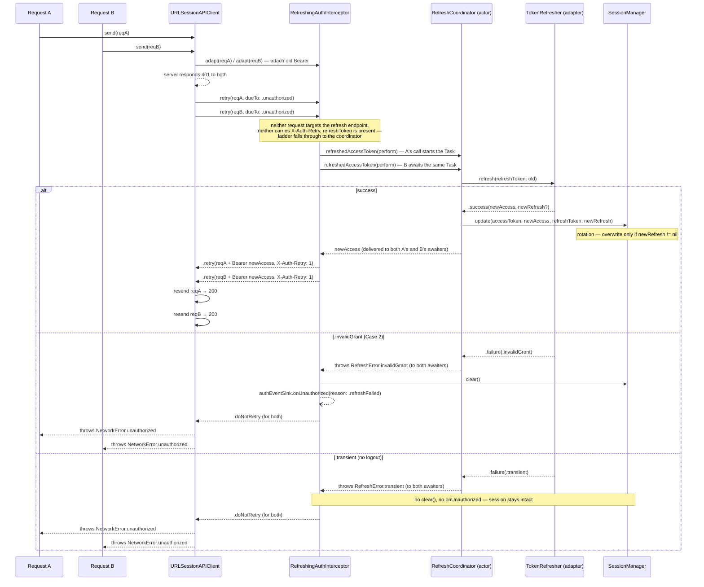

# Mobile System Design: Refresh Token

*(iOS Native edition)*

How this template solves the four classic mobile refresh-token problems —
race condition, infinite loop, token rotation, secure storage — and the exact
force-logout ladder `RefreshingAuthInterceptor` runs on every `401`. Mirrors
the Flutter template's `docs/system-design/refresh_token.md`; see
[`NETWORKING.md`](NETWORKING.md) for the surrounding `Network` package
architecture.

---

## Table of Contents

- [1. The Four Problems and the Solutions As Built](#1-the-four-problems-and-the-solutions-as-built)
- [2. Strategy Table](#2-strategy-table)
- [3. Mobile vs Backend Responsibility](#3-mobile-vs-backend-responsibility)
- [4. The Force-Logout Ladder](#4-the-force-logout-ladder)
- [5. Public-Endpoint Whitelist](#5-public-endpoint-whitelist)
- [6. DIP Wiring: `TokenRefresher`](#6-dip-wiring-tokenrefresher)
- [7. Adapter Sketch](#7-adapter-sketch)
- [8. Single-Flight Sequence Diagram](#8-single-flight-sequence-diagram)

---

## 1. The Four Problems and the Solutions As Built

### Problem 1: Race Condition (Concurrency)

When the access token expires, several requests can hit `401` at nearly the
same moment. Naively, each would trigger its own refresh call — the first
refresh rotates the token server-side, so the second refresh's stale token is
rejected, causing a spurious logout.

**Solution — `RefreshCoordinator`, an `actor` single-flight.**
`Packages/Network/Sources/Network/Interceptor/RefreshCoordinator.swift`:

```swift
public actor RefreshCoordinator {
    private var inFlight: Task<String, Error>?

    public func refreshedAccessToken(
        perform: @Sendable @escaping () async throws -> String
    ) async throws -> String {
        if let inFlight { return try await inFlight.value }
        let task = Task { try await perform() }
        inFlight = task
        defer { inFlight = nil }
        return try await task.value
    }
}
```

`actor` isolation makes "check if a refresh is in flight, else start one" an
atomic step with no lock. The first `401` starts `perform`; every concurrent
`401` awaits the *same* `Task` and receives its result — success or failure —
without ever calling `TokenRefresher.refresh` a second time. Once the task
resolves, `inFlight` is cleared so the *next* wave of `401`s starts a fresh
refresh.

### Problem 2: Infinite Loop

If the refresh call itself returns `401`/`403`, a naive interceptor treats it
like any other failed request and tries to refresh again — forever.

**Solution — `RefreshTokenEndpoint` match + the `X-Auth-Retry` marker.**
`RefreshingAuthInterceptor.retry` checks, in order, before ever calling the
refresher:

1. Does the failing request *target the refresh endpoint itself*
   (`RefreshTokenEndpoint.matches(url)`)? If so, the refresh token is dead —
   never loop a refresh through the refresh endpoint. Force logout.
2. Does the failing request already carry `X-Auth-Retry: 1`? That header is
   stamped only on the one resend a refresh is allowed to produce
   (`AuthHeader.retry` in `RetryDecision.swift`) — if it is already set and
   the server still said `401`, refreshing again cannot help. Force logout.

Only past both guards does the interceptor call `coordinator.refreshedAccessToken`.

### Problem 3: Token Rotation

A server that rotates the refresh token on every use is more secure, but the
client must persist the *new* refresh token immediately — if it keeps using
the old one, the next refresh is rejected.

**Solution — `SessionManager.update(accessToken:refreshToken:)`, write-through
only when non-nil.**
`Packages/Core/Sources/Core/Session/SessionManager.swift`:

```swift
public func update(accessToken: String?, refreshToken: String?) {
    lock.lock(); defer { lock.unlock() }
    token = accessToken
    // ...
    // Rotation guard: only a non-nil refresh token replaces the stored one.
    // A routine access-only update (refreshToken: nil) leaves it intact.
    if let refreshToken {
        refresh = refreshToken
        store?.set(refreshToken, key: Self.refreshKey)
    }
}
```

`TokenRefreshResult.success(accessToken:refreshToken:)` models a `nil`
`refreshToken` as "server did not rotate — keep the current one"; the write
happens exactly once, right after a successful `refresh(refreshToken:)` call,
inside the `RefreshCoordinator`'s `perform` closure.

### Problem 4: Secure Storage

Tokens sitting in `UserDefaults` are readable by anything with filesystem
access to the app sandbox.

**Solution — optional `SecureCacheStore` / `KeychainCacheStore`.**
`SessionManager(accessToken:secureCacheStore:)` accepts an optional
`Core.SecureCacheStore`; when present, both tokens are mirrored to it under
the keys `"core.session.access"` / `"core.session.refresh"`. The shipped
production adapter, `KeychainCacheStore`, JSON-encodes values into Keychain
generic-password items scoped to a `service` string —
`AppComposition` wires `KeychainCacheStore(service: "com.iosdigitalwallet.session")`
by default. With no store, `SessionManager` is a pure in-memory holder —
tests inject none and get today's in-memory behaviour unchanged.

---

## 2. Strategy Table

| Problem | Core Solution | Where |
|---|---|---|
| Concurrent requests all 401 at once | Single-flight via an `actor` | `RefreshCoordinator` |
| Refresh call itself fails | Endpoint match + retry marker, never loop | `RefreshingAuthInterceptor.retry` + `RefreshTokenEndpoint` |
| Token stolen / replayed | Rotation: overwrite refresh token only when the server issues a new one | `SessionManager.update(accessToken:refreshToken:)` |
| Token exposed on disk | Keychain-backed storage, optional | `SecureCacheStore` / `KeychainCacheStore` |

---

## 3. Mobile vs Backend Responsibility

This template is domain-neutral — it assumes no specific backend framework —
so the split below is stated generically; adapt the backend column to your
actual auth service.

### Backend (server)

- **Owns the rules.** Issues access + refresh token pairs; decides token
  lifetimes; decides whether to rotate the refresh token on every use.
- **Detects abuse.** A replayed, already-rotated refresh token is a strong
  signal of token theft — the backend should revoke the whole token family
  when it sees one.

### Mobile app (client)

- **Coordinates concurrency.** Exactly one refresh call in flight at a time —
  `RefreshCoordinator`.
- **Persists the rotation immediately.** The moment a refresh response
  arrives, the new refresh token (when the server issued one) must overwrite
  the old one before any other code path can read a stale value —
  `SessionManager.update` does this synchronously under its lock, inside the
  same `perform` closure that made the call.
- **Never re-attaches a stale token to the refresh call itself** — that is
  exactly Problem 2. `RefreshingAuthInterceptor.adapt` skips bearer injection
  for a request that targets the refresh endpoint.

---

## 4. The Force-Logout Ladder

`RefreshingAuthInterceptor.retry(_:dueTo:)` runs this ladder on every `401`.
The first three rows are checked **in order, before any refresh is
attempted**; only if none of them fire does the interceptor call the
coordinator, and the last two rows are the two possible *outcomes* of that
refresh attempt. Exactly one row fires per `401`; each ends the session by
calling `session.clear()` and `authEventSink?.onUnauthorized(reason:)`,
except the transient path, which does neither. Case names below are the
exact `Core.LogoutReason` cases; tests are the exact methods in
`Packages/Network/Tests/NetworkTests/RefreshingAuthInterceptorTests.swift`.

| # | Condition | `LogoutReason` | Session | Test |
|---|---|---|---|---|
| Misconfiguration guard | The failing request *is* the refresh endpoint itself (`RefreshTokenEndpoint.matches`) | `.refreshFailed` | cleared | `testA401FromTheRefreshEndpointIsTreatedAsADeadSessionAndNeverCallsRefresher` |
| Case 1 — persistent failure | The failing request already carries `X-Auth-Retry: 1` (it was already resent once with a fresh bearer) | `.retryStillUnauthorized` | cleared | `testRetriedRequestStill401FiresRetryStillUnauthorizedAndClearsWithoutAskingRefreshAgain` |
| Case 3 — missing refresh token | `session.refreshToken == nil` when the `401` arrives — nothing to refresh with | `.missingRefreshToken` | cleared | `testA401WithNoRefreshTokenFiresMissingRefreshTokenAndNeverCallsRefresher` |
| Case 2 — dead session | Past all three guards above, `TokenRefresher.refresh` returns `.failure(.invalidGrant)` (or, on a rare mid-flight race, the token vanished between the Case 3 guard and the refresh call) | `.refreshFailed` | cleared | `testRefresherInvalidGrantForcesRefreshFailedLogoutAndClearsSession` |
| Transient — no logout | Past all three guards above, `TokenRefresher.refresh` returns `.failure(.transient)` (a network / `5xx` blip during the refresh call itself) | — (no sink call) | **left intact** | `testRefresherTransientDoesNotLogOutAndLeavesTheSessionIntact`, `testATransientRefreshDoesNotPoisonALaterSuccessfulRefresh` |

The misconfiguration guard, Case 1, **and Case 3** are all checked **before**
the coordinator is ever touched — three cheap guards, no wasted refresh call.
Case 2 and the transient path are both reached only *through* the
`RefreshCoordinator.refreshedAccessToken` closure, after the Case 3 guard has
already confirmed a refresh token exists; `.invalidGrant` and a mid-flight
`.missingRefreshToken` (the token vanishing in the narrow window between the
Case 3 check and the refresh call actually running) both surface as
`.refreshFailed` to the sink — the caller doesn't need to distinguish "the
grant is dead" from "the token disappeared while we were about to use it",
both mean force logout. `.transient` is the one outcome that must **not**
touch the session: a flaky network during the refresh call should not evict a
user who might succeed on the very next request.

> [!WARNING]
> **All four terminal cases throw `NetworkError.unauthorized` back to the
> original caller**, even after clearing the session and notifying
> `AuthEventSink`. A screen that calls the API directly still needs its own
> error handling — the sink notification is for the composition root to
> redirect to a login screen, not a substitute for surfacing the failure to
> the calling code.

---

## 5. Public-Endpoint Whitelist

Some endpoints — login, register, forgot-password — must never carry a stale
(or any) bearer token: sending one risks the server rejecting the call for an
unrelated reason, and a public endpoint should always start a clean session.

**Opt out per-request** with `APIRequest(authRequirement: .none)`:

```swift
APIRequest(method: .post, path: "auth/login", body: body, authRequirement: .none)
```

`AuthRequirement.none` makes `APIRequest.urlRequest(for:)` stamp an in-process
marker header, `X-Auth-Requirement: none`. Both auth interceptors —
`AuthTokenInterceptor.adapt` and `RefreshingAuthInterceptor.adapt` — check for
it first, before touching `SessionManaging`: when present, they attach **no**
bearer and strip the marker before the request leaves the process (it never
travels on the wire). A `.none` request also can never trigger a refresh: the
interceptor didn't add a bearer to it, so a `401` response from a
correctly-implemented public endpoint would be a genuine backend rejection,
not a token-expiry signal.

---

## 6. DIP Wiring: `TokenRefresher`

`Network` cannot import the feature that owns "login" — that would violate
the dependency rule ([`NETWORKING.md`](NETWORKING.md) §1). The refresh call
itself, though, has to go *somewhere*. The seam is Dependency Inversion:

- **`TokenRefresher`** — the protocol — lives in `Core`:
  `Packages/Core/Sources/Core/Auth/TokenRefresher.swift`.

  ```swift
  public protocol TokenRefresher: Sendable {
      func refresh(refreshToken: String) async -> TokenRefreshResult
  }

  public enum TokenRefreshResult: Sendable {
      case success(accessToken: String, refreshToken: String?)
      case failure(TokenRefreshFailure)
  }

  public enum TokenRefreshFailure: Sendable, Equatable {
      case invalidGrant
      case transient
  }
  ```

- **The concrete adapter is the consumer's job**, wired at the composition
  root — not shipped as a real implementation, because the template is
  domain-neutral and doesn't know the consumer's auth endpoint shape. What
  *is* shipped is the honest default:

  ```swift
  public struct NoTokenRefresher: TokenRefresher {
      public func refresh(refreshToken _: String) async -> TokenRefreshResult {
          .failure(.invalidGrant)
      }
  }
  ```

  `AppComposition` wires `NoTokenRefresher()` today — a real `401` force-logs
  a template-generated app out immediately instead of silently spinning. This
  is deliberate: a template cannot guess a real backend's refresh contract,
  and a loud, correct force-logout beats a plausible-looking no-op.

> [!WARNING]
> **The adapter's own refresh call MUST go through `NetworkComposition.makeBareAPIClient()`, never `makeAPIClient()`.**
>
> `makeBareAPIClient()` installs only `LoggingInterceptor` — no
> `RefreshingAuthInterceptor`, no `AuthTokenInterceptor`, no `eventBus` /
> `authEventSink` / `tokenRefresher` parameter at all, so it is *structurally*
> incapable of notifying a sink or attempting a refresh. If a `TokenRefresher`
> adapter instead called the refresh endpoint through the **authed** client
> (`makeAPIClient()`'s `RefreshingAuthInterceptor`), a `401` from the refresh
> call itself would re-enter `RefreshingAuthInterceptor.retry`, which would
> try to refresh *again* — infinite recursion, the exact failure mode
> [Problem 2](#problem-2-infinite-loop) exists to prevent. The misconfiguration
> guard in [§4](#4-the-force-logout-ladder) is a backstop for this mistake,
> not a substitute for wiring the adapter correctly in the first place.

---

## 7. Adapter Sketch

A hypothetical `MyAuthTokenRefresher`, wired by an app that has a real
`AuthClient`:

```swift
import Core
import Network

/// Adapter: implements Core's TokenRefresher by calling the auth feature's
/// own refresh endpoint through the BARE client (see the warning in §6).
struct MyAuthTokenRefresher: TokenRefresher {
    private let authClient: AuthClient

    init(authClient: AuthClient) {
        self.authClient = authClient
    }

    func refresh(refreshToken: String) async -> TokenRefreshResult {
        do {
            let response: MyRefreshResponseDTO = try await authClient.refresh(refreshToken: refreshToken)
            return .success(accessToken: response.accessToken, refreshToken: response.refreshToken)
        } catch NetworkError.unauthorized, NetworkError.client {
            return .failure(.invalidGrant)
        } catch {
            return .failure(.transient)
        }
    }
}

// AuthClient itself is built on the BARE client — never the authed one:
struct AuthClient {
    private let apiClient: any APIClient

    init(apiClient: any APIClient) {
        self.apiClient = apiClient
    }

    func refresh(refreshToken: String) async throws -> MyRefreshResponseDTO {
        try await apiClient.send(
            APIRequest(
                method: .post,
                path: "auth/refresh",
                body: AnyEncodable(RefreshRequestBody(refreshToken: refreshToken)),
                authRequirement: .none
            )
        )
    }
}

// Composition root:
let bareClient = NetworkComposition.makeBareAPIClient(logger: logger)
let authClient = AuthClient(apiClient: bareClient)
let tokenRefresher = MyAuthTokenRefresher(authClient: authClient)

let apiClient = NetworkComposition.makeAPIClient(
    eventBus: eventBus,
    logger: logger,
    sessionManager: sessionManager,
    tokenRefresher: tokenRefresher,
    refreshEndpoint: RefreshTokenEndpoint(pathSuffix: "auth/refresh")
)
```

---

## 8. Single-Flight Sequence Diagram

Two requests (`A`, `B`) both hit `401` on an expired access token. This
diagram traces `RefreshingAuthInterceptor.retry` exactly as implemented,
including both the success path and the two failure branches every caller in
the wave observes identically.



`RefreshCoordinator.inFlight` is cleared (via `defer`, inside actor isolation)
once the `Task` resolves — success or throw — so the *next* `401` wave, on
either branch, starts a brand-new refresh rather than replaying a stale
result.

---

## References

- [`NETWORKING.md`](NETWORKING.md) — the surrounding `Network` package
  architecture, `<Name>Uri` / `<Name>Endpoints`, `BaseResponseObject<T>`.
- [`ARCHITECTURE.md`](ARCHITECTURE.md) — module map, dependency graph,
  `ArchTests` governance.
- `Packages/Network/Tests/NetworkTests/RefreshingAuthInterceptorTests.swift` —
  the tests this document's [§4](#4-the-force-logout-ladder) table is
  cross-checked against.
- Flutter `docs/system-design/refresh_token.md` — the cross-platform sibling
  this document mirrors.
